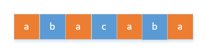
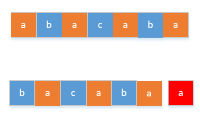
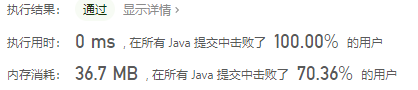

> 原文链接: https://leetcode-cn.com/problems/reorganize-string


## 英文原文
<div><p>Given a string <code>s</code>, rearrange the characters of <code>s</code> so that any two adjacent characters are not the same.</p>

<p>Return <em>any possible rearrangement of</em> <code>s</code> <em>or return</em> <code>&quot;&quot;</code> <em>if not possible</em>.</p>

<p>&nbsp;</p>
<p><strong>Example 1:</strong></p>
<pre><strong>Input:</strong> s = "aab"
<strong>Output:</strong> "aba"
</pre><p><strong>Example 2:</strong></p>
<pre><strong>Input:</strong> s = "aaab"
<strong>Output:</strong> ""
</pre>
<p>&nbsp;</p>
<p><strong>Constraints:</strong></p>

<ul>
	<li><code>1 &lt;= s.length &lt;= 500</code></li>
	<li><code>s</code> consists of lowercase English letters.</li>
</ul>
</div>

## 中文题目
<div><p>给定一个字符串<code>S</code>，检查是否能重新排布其中的字母，使得两相邻的字符不同。</p>

<p>若可行，输出任意可行的结果。若不可行，返回空字符串。</p>

<p><strong>示例&nbsp;1:</strong></p>

<pre>
<strong>输入:</strong> S = &quot;aab&quot;
<strong>输出:</strong> &quot;aba&quot;
</pre>

<p><strong>示例 2:</strong></p>

<pre>
<strong>输入:</strong> S = &quot;aaab&quot;
<strong>输出:</strong> &quot;&quot;
</pre>

<p><strong>注意:</strong></p>

<ul>
	<li><code>S</code> 只包含小写字母并且长度在<code>[1, 500]</code>区间内。</li>
</ul>
</div>

## 通过代码
<RecoDemo>
</RecoDemo>


## 高赞题解


这题可以参照 [169. 多数元素](https://leetcode-cn.com/problems/majority-element/) 和 [229. 求众数 II](https://leetcode-cn.com/problems/majority-element-ii/) 的解题思路，先求出出现次数最多的字符，然后再判断是否可以使得两相邻的字符不同。但这题和上面两题不同的是如果不能使得两相邻的字符不同，还要返回结果。


<br>


如果要使得两相邻的字符不同，那么出现次数最多的那个数的数量必须满足下面条件，如下图所示，比如下面的a是出现次数最多的



这个时候a的数量已经达到了临界值，如果再多一个 `a` ，那么至少有两个 `a` 是相邻的。所以这里出现次数最多的那个字符数量的临界值是```threshold = (length + 1) >> 1```（其中 length 是字符串的长度）

<br>


如果能使得两相邻的字符不同，我们可以先把出现次数最多的那个字符放到新字符串下标为偶数的位置上，放完之后在用其他的字符填充字符串剩下的位置。


注意这里能不能先把出现次数最多的字符放到字符串下标为奇数的位置呢，当然是不可以的。比如我们上面举的例子```abacaba```本来是可以满足的，如果放到下标为奇数的位置，最后一个 `a` 就没法放了，除非放到最前面，那又变成了放到下标为偶数的位置了。





<br>


**代码如下**


```

    public String reorganizeString(String S) {

        //把字符串S转化为字符数组

        char[] alphabetArr = S.toCharArray();

        //记录每个字符出现的次数

        int[] alphabetCount = new int[26];

        //字符串的长度

        int length = S.length();

        //统计每个字符出现的次数

        for (int i = 0; i < length; i++) {

            alphabetCount[alphabetArr[i] - 'a']++;

        }

        int max = 0, alphabet = 0, threshold = (length + 1) >> 1;

        //找出出现次数最多的那个字符

        for (int i = 0; i < alphabetCount.length; i++) {

            if (alphabetCount[i] > max) {

                max = alphabetCount[i];

                alphabet = i;

                //如果出现次数最多的那个字符的数量大于阈值，说明他不能使得

                // 两相邻的字符不同，直接返回空字符串即可

                if (max > threshold)

                    return "";

            }

        }

        //到这一步说明他可以使得两相邻的字符不同，我们随便返回一个结果，res就是返回

        //结果的数组形式，最后会再转化为字符串的

        char[] res = new char[length];

        int index = 0;

        //先把出现次数最多的字符存储在数组下标为偶数的位置上

        while (alphabetCount[alphabet]-- > 0) {

            res[index] = (char) (alphabet + 'a');

            index += 2;

        }

        //然后再把剩下的字符存储在其他位置上

        for (int i = 0; i < alphabetCount.length; i++) {

            while (alphabetCount[i]-- > 0) {

                if (index >= res.length) {

                    index = 1;

                }

                res[index] = (char) (i + 'a');

                index += 2;

            }

        }

        return new String(res);

    }

```


看一下运行结果




<br>


**如果觉得有用就给个赞吧，你的赞是给我最大的鼓励，也是我写作的最大动力**


## 统计信息
| 通过次数 | 提交次数 | AC比率 |
| :------: | :------: | :------: |
|    41133    |    86096    |   47.8%   |

## 提交历史
| 提交时间 | 提交结果 | 执行时间 |  内存消耗  | 语言 |
| :------: | :------: | :------: | :--------: | :--------: |


## 相似题目
|                             题目                             | 难度 |
| :----------------------------------------------------------: | :---------: |
| [K 距离间隔重排字符串](https://leetcode-cn.com/problems/rearrange-string-k-distance-apart/) | 困难|
| [任务调度器](https://leetcode-cn.com/problems/task-scheduler/) | 中等|
