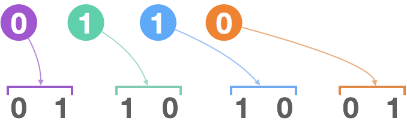

> 原文链接: https://leetcode-cn.com/problems/k-th-symbol-in-grammar


## 英文原文
<div><p>We build a table of <code>n</code> rows (<strong>1-indexed</strong>). We start by writing <code>0</code> in the <code>1<sup>st</sup></code> row. Now in every subsequent row, we look at the previous row and replace each occurrence of <code>0</code> with <code>01</code>, and each occurrence of <code>1</code> with <code>10</code>.</p>

<ul>
	<li>For example, for <code>n = 3</code>, the <code>1<sup>st</sup></code> row is <code>0</code>, the <code>2<sup>nd</sup></code> row is <code>01</code>, and the <code>3<sup>rd</sup></code> row is <code>0110</code>.</li>
</ul>

<p>Given two integer <code>n</code> and <code>k</code>, return the <code>k<sup>th</sup></code> (<strong>1-indexed</strong>) symbol in the <code>n<sup>th</sup></code> row of a table of <code>n</code> rows.</p>

<p>&nbsp;</p>
<p><strong>Example 1:</strong></p>

<pre>
<strong>Input:</strong> n = 1, k = 1
<strong>Output:</strong> 0
<strong>Explanation:</strong> row 1: <u>0</u>
</pre>

<p><strong>Example 2:</strong></p>

<pre>
<strong>Input:</strong> n = 2, k = 1
<strong>Output:</strong> 0
<strong>Explanation:</strong>
row 1: 0
row 2: <u>0</u>1
</pre>

<p><strong>Example 3:</strong></p>

<pre>
<strong>Input:</strong> n = 2, k = 2
<strong>Output:</strong> 1
<strong>Explanation:</strong>
row 1: 0
row 2: 0<u>1</u>
</pre>

<p><strong>Example 4:</strong></p>

<pre>
<strong>Input:</strong> n = 3, k = 1
<strong>Output:</strong> 0
<strong>Explanation:</strong>
row 1: 0
row 2: 01
row 3: <u>0</u>110
</pre>

<p>&nbsp;</p>
<p><strong>Constraints:</strong></p>

<ul>
	<li><code>1 &lt;= n &lt;= 30</code></li>
	<li><code>1 &lt;= k &lt;= 2<sup>n - 1</sup></code></li>
</ul>
</div>

## 中文题目
<div><p>在第一行我们写上一个 <code>0</code>。接下来的每一行，将前一行中的<code>0</code>替换为<code>01</code>，<code>1</code>替换为<code>10</code>。</p>

<p>给定行数&nbsp;<code>N</code>&nbsp;和序数 <code>K</code>，返回第 <code>N</code> 行中第 <code>K</code>个字符。（<code>K</code>从1开始）</p>

<p><br>
<strong>例子:</strong></p>

<pre><strong>输入:</strong> N = 1, K = 1
<strong>输出:</strong> 0

<strong>输入:</strong> N = 2, K = 1
<strong>输出:</strong> 0

<strong>输入:</strong> N = 2, K = 2
<strong>输出:</strong> 1

<strong>输入:</strong> N = 4, K = 5
<strong>输出:</strong> 1

<strong>解释:</strong>
第一行: 0
第二行: 01
第三行: 0110
第四行: 01101001
</pre>

<p><br>
<strong>注意：</strong></p>

<ol>
	<li><code>N</code>&nbsp;的范围&nbsp;<code>[1, 30]</code>.</li>
	<li><code>K</code>&nbsp;的范围&nbsp;<code>[1, 2^(N-1)]</code>.</li>
</ol>
</div>

## 通过代码
<RecoDemo>
</RecoDemo>


## 官方题解
#### 方法一： 暴力法

**思路和算法**

像题目描述中的那样，生成每一行字符串，每次只需要保存最后一行就可以了。但不幸的是，字符串的长度可能超过 10 亿，因为字符串的长度是每行翻倍的，所以这个方法不是很高效。

```java [solution1-Java]
class Solution {
    public int kthGrammar(int N, int K) {
        int[] lastrow = new int[1 << N];
        for (int i = 1; i < N; ++i) {
            for (int j = (1 << (i-1)) - 1; j >= 0; --j) {
                lastrow[2*j] = lastrow[j];
                lastrow[2*j+1] = 1 - lastrow[j];
            }
        }
        return lastrow[K-1];
    }
}
```

```python [solution1-Python]
class Solution(object):
    def kthGrammar(self, N, K):
        lastrow = '0'
        while len(rows) < N:
            lastrow = "".join('01' if x == '0' else '10'
                              for x in lastrow)
        return int(rows[-1][K-1])
```


**复杂度分析**

* 时间复杂度： $O(2^N)$，其为生成字符串的总长度 $2^0 + 2^1 + \cdots + 2^{N-1}$。

* 空间复杂度： $O(2^N)$，其为最后一行字符串的长度。

#### 方法二： 递归 (父子递推)

**思路和算法**

既然每一行都是根据上一行来生成的，把这样的上下两行写成比特形式找一下规律。

{:width=350}

如果当前行为 `"0110"`，由此生成的下一行为 `"01101001"`。

{:width=350}

据此可以总结出规律，第 `K` 个数字是上一行第 `(K+1) / 2` 个数字生成的。如果上一行的数字为 `0`，被生成的数字为 `1 - (K%2)`，如果上一行的数字为 `1`，被生成的数字为 `K%2`。

```java [solution2-Java]
class Solution {
    public int kthGrammar(int N, int K) {
        if (N == 1) return 0;
        return (~K & 1) ^ kthGrammar(N-1, (K+1)/2);
    }
}
```

```python [solution2-Python]
class Solution(object):
    def kthGrammar(self, N, K):
        if N == 1: return 0
        return (1 - K%2) ^ self.kthGrammar(N-1, (K+1)/2)
```

**复杂度分析**

* 时间复杂度： $O(N)$。
* 空间复杂度： $O(1)$。

#### 方法三： 递归 (翻转递推)

**思路和算法**

同方法二一样，把上下两行写成比特形式找一下规律。

按照规律写出几行，可以注意到一个规律：每一行的后半部分正好是前半部分的 ”翻转“，前半部分是 `'0'`，后半部分变成 `'1'`，前半部分是 `'1'`，后半部分变成 `'0'`。  

可以通过归纳法证明以上规律，核心的思想在于，如果 $X$ 可以生成 $Y$，那么 $X'$ 就能生成 $Y'$。据此可以提出以下的算法： 如果 `K` 在第二部分，就找 `K -= (1 << N-2)` 在第一部分的答案，然后将答案翻转。

```java [solution3-Java]
class Solution {
    public int kthGrammar(int N, int K) {
        if (N == 1) return 0;
        if (K <= 1 << N-2)
            return kthGrammar(N-1, K);
        return kthGrammar(N-1, K - (1 << N-2)) ^ 1;
    }
}
```

```python [solution3-Python]
class Solution(object):
    def kthGrammar(self, N, K):
        if N == 1: return 0
        if K <= (2**(N-2)):
            return self.kthGrammar(N-1, K)
        return self.kthGrammar(N-1, K - 2**(N-2)) ^ 1
```


**复杂度分析**

* 时间复杂度： $O(N)$。

* 空间复杂度： $O(1)$。

#### 方法四： Binary Count

**思路和算法**

同方法三一样，每一行的后半部分都是前半部分的翻转。

把下标 `K` 写成二进制的形式，如果 `K` 在第二部分，那么二进制形式的第一个比特位一定是 `1`。据此可以将方法三继续简化，实际上翻转的次数等于 `K-1` 二进制表示形式中 `1` 出现的个数。

```java [solution4-Java]
class Solution {
    public int kthGrammar(int N, int K) {
        return Integer.bitCount(K - 1) % 2;
    }
}
```

```python [solution4-Python]
class Solution(object):
    def kthGrammar(self, N, K):
        return bin(K - 1).count('1') % 2
```

**复杂度分析**

* 时间复杂度：$O(\log N)$，其为 `N` 的二进制字符串表示形式的长度。

* 空间复杂度：$O(1)$。

## 统计信息
| 通过次数 | 提交次数 | AC比率 |
| :------: | :------: | :------: |
|    19343    |    44310    |   43.7%   |

## 提交历史
| 提交时间 | 提交结果 | 执行时间 |  内存消耗  | 语言 |
| :------: | :------: | :------: | :--------: | :--------: |
