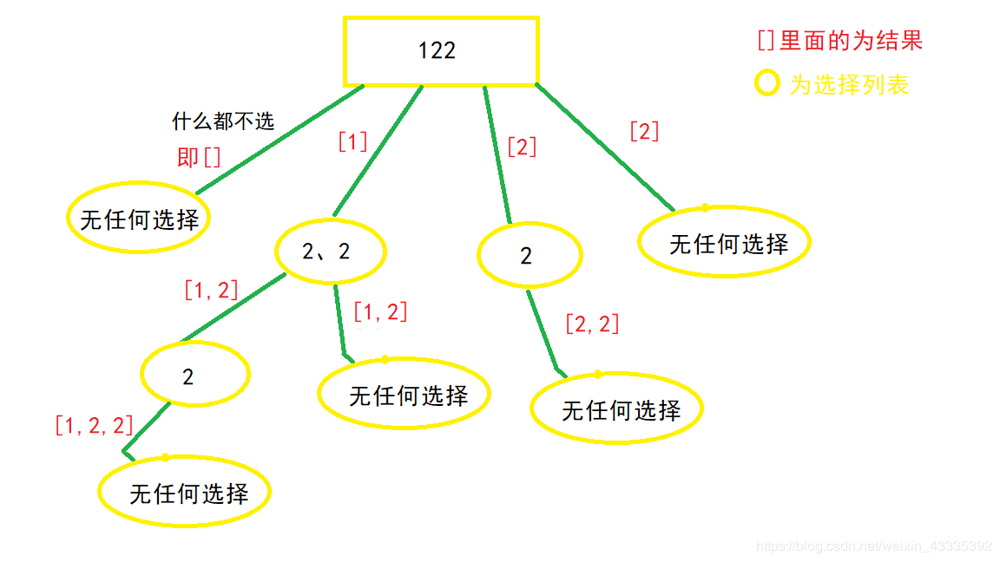
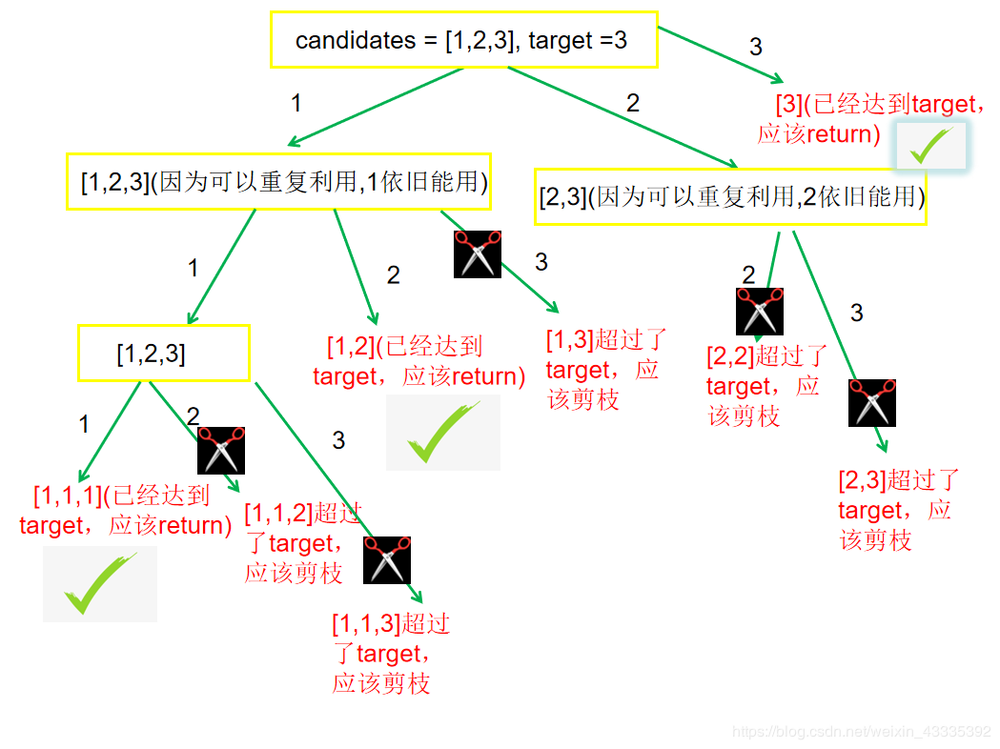

> 原文链接: https://leetcode-cn.com/problems/subsets


## 英文原文
<div><p>Given an integer array <code>nums</code> of <strong>unique</strong> elements, return <em>all possible subsets (the power set)</em>.</p>

<p>The solution set <strong>must not</strong> contain duplicate subsets. Return the solution in <strong>any order</strong>.</p>

<p>&nbsp;</p>
<p><strong>Example 1:</strong></p>

<pre>
<strong>Input:</strong> nums = [1,2,3]
<strong>Output:</strong> [[],[1],[2],[1,2],[3],[1,3],[2,3],[1,2,3]]
</pre>

<p><strong>Example 2:</strong></p>

<pre>
<strong>Input:</strong> nums = [0]
<strong>Output:</strong> [[],[0]]
</pre>

<p>&nbsp;</p>
<p><strong>Constraints:</strong></p>

<ul>
	<li><code>1 &lt;= nums.length &lt;= 10</code></li>
	<li><code>-10 &lt;= nums[i] &lt;= 10</code></li>
	<li>All the numbers of&nbsp;<code>nums</code> are <strong>unique</strong>.</li>
</ul>
</div>

## 中文题目
<div><p>给你一个整数数组 <code>nums</code> ，数组中的元素 <strong>互不相同</strong> 。返回该数组所有可能的子集（幂集）。</p>

<p>解集 <strong>不能</strong> 包含重复的子集。你可以按 <strong>任意顺序</strong> 返回解集。</p>

<p> </p>

<p><strong>示例 1：</strong></p>

<pre>
<strong>输入：</strong>nums = [1,2,3]
<strong>输出：</strong>[[],[1],[2],[1,2],[3],[1,3],[2,3],[1,2,3]]
</pre>

<p><strong>示例 2：</strong></p>

<pre>
<strong>输入：</strong>nums = [0]
<strong>输出：</strong>[[],[0]]
</pre>

<p> </p>

<p><strong>提示：</strong></p>

<ul>
	<li><code>1 <= nums.length <= 10</code></li>
	<li><code>-10 <= nums[i] <= 10</code></li>
	<li><code>nums</code> 中的所有元素 <strong>互不相同</strong></li>
</ul>
</div>

## 通过代码
<RecoDemo>
</RecoDemo>


## 高赞题解
### 解题思路：

#### 1.DFS 和回溯算法区别

DFS 是一个劲的往某一个方向搜索，而回溯算法建立在 DFS 基础之上的，但不同的是在搜索过程中，达到结束条件后，恢复状态，回溯上一层，再次搜索。因此回溯算法与 DFS 的区别就是有无状态重置

#### 2.何时使用回溯算法

**当问题需要 "回头"，以此来查找出所有的解的时候**，使用回溯算法。即满足结束条件或者发现不是正确路径的时候(走不通)，要撤销选择，回退到上一个状态，继续尝试，直到找出所有解为止


#### 3.怎么样写回溯算法(从上而下，※代表难点，根据题目而变化)

- **①画出递归树，找到状态变量(回溯函数的参数)，这一步非常重要**※

- **②根据题意，确立结束条件**

- **③找准选择列表(与函数参数相关),与第一步紧密关联**※

- **④判断是否需要剪枝**

- **⑤作出选择，递归调用，进入下一层**

- **⑥撤销选择**


#### 4.回溯问题的类型

这里先给出，我总结的回溯问题类型，并给出相应的 leetcode题目(一直更新)，然后再说如何去编写。**特别关注搜索类型的**，搜索类的搞懂，你就真的搞懂回溯算法了,，是前面两类是基础，帮助你培养思维

类型     | 题目链接

-------- | -----

子集、组合  | [子集](https://leetcode-cn.com/problems/subsets/)、[子集 II](https://leetcode-cn.com/problems/subsets-ii/)、[组合](https://leetcode-cn.com/problems/combinations/)、[组合总和](https://leetcode-cn.com/problems/combination-sum/)、[组合总和 II](https://leetcode-cn.com/problems/combination-sum-ii/)

全排列  | [全排列](https://leetcode-cn.com/problems/permutations/)、[全排列 II](https://leetcode-cn.com/problems/permutations-ii/)、[字符串的全排列](https://leetcode-cn.com/problems/zi-fu-chuan-de-pai-lie-lcof/)、[字母大小写全排列](https://leetcode-cn.com/problems/letter-case-permutation/)

**搜索** | [解数独](https://leetcode-cn.com/problems/sudoku-solver/)、[单词搜索](https://leetcode-cn.com/problems/word-search/)、[N皇后](https://leetcode-cn.com/problems/eight-queens-lcci/)、[分割回文串](https://leetcode-cn.com/problems/palindrome-partitioning/)、[二进制手表](https://leetcode-cn.com/problems/binary-watch/)

**注意：子集、组合与排列是不同性质的概念。子集、组合是无关顺序的，而排列是和元素顺序有关的，如 `[1，2]` 和 `[2，1]` 是同一个组合(子集)，但 `[1,2]` 和 `[2,1]` 是两种不一样的排列！！！！因此被分为两类问题**

####  5.回到子集、组合类型问题上来(ABC 三道例题)

##### A、 [子集](https://leetcode-cn.com/problems/subsets/) - 给定一组不含重复元素的整数数组 nums，返回该数组所有可能的子集（幂集）。

解题步骤如下

#### ①递归树


观察上图可得，**选择列表里的数，都是选择路径(红色框)后面的数**，比如[1]这条路径，他后面的选择列表只有"2、3"，[2]这条路径后面只有"3"这个选择，那么这个时候，就应该**使用一个参数start，来标识当前的选择列表的起始位置。也就是标识每一层的状态，因此被形象的称为"状态变量"**,最终函数签名如下


```C++ []

//nums为题目中的给的数组

//path为路径结果，要把每一条 path 加入结果集

void backtrack(vector<int>nums,vector<int>&path,int start)

```

#### ②找结束条件

此题非常特殊，所有路径都应该加入结果集，所以不存在结束条件。或者说当 start 参数越过数组边界的时候，程序就自己跳过下一层递归了，因此不需要手写结束条件,直接加入结果集


```C++ []

**res为结果集，是全局变量vector<vector<int>>res,到时候要返回的

res.push_back(path);//把每一条路径加入结果集

```


#### ③找选择列表

在①中已经提到过了，子集问题的选择列表，是上一条选择路径之后的数,即


```C++ []

for(int i=start;i<nums.size();i++)

```

#### ④判断是否需要剪枝

从递归树中看到，路径没有重复的，也没有不符合条件的，所以不需要剪枝


#### ⑤做出选择(即for 循环里面的)


```C++ []

void backtrack(vector<int>nums,vector<int>&path,int start)

{

    for(int i=start;i<nums.size();i++)

    {

        path.push_back(nums[i]);//做出选择

        backtrack(nums,path,i+1);//递归进入下一层，注意i+1，标识下一个选择列表的开始位置，最重要的一步

    }

}

```

#### ⑤撤销选择

整体的 backtrack 函数如下

```C++ []

void backtrack(vector<int>nums,vector<int>&path,int start)

{

    res.push_back(path);

    for(int i=start;i<nums.size();i++)

    {

        path.push_back(nums[i]);//做出选择

        backtrack(nums,path,i+1);//递归进入下一层，注意i+1，标识下一个选择列表的开始位置，最重要的一步

        path.pop_back();//撤销选择

    }

}

```

##### B、[子集 II](https://leetcode-cn.com/problems/subsets-ii/)(剪枝思想)--问题描述:

给定一个可能 **包含重复元素** 的整数数组 nums，返回该数组所有可能的子集（幂集）。

输入: [1,2,2]

输出:

[

  [2],

  [1],

  [1,2,2],

  [2,2],

  [1,2],

  []

]

#### 解题步骤

#### ①递归树



可以发现，树中出现了大量重复的集合，②和③和第一个问题一样，不再赘述，我们直接看第四步

#### ④判断是否需要剪枝，需要先对数组排序，使用排序函数 `sort(nums.begin(),nums.end())`

显然我们需要去除重复的集合，即需要剪枝，把递归树上的某些分支剪掉。那么应去除哪些分支呢？又该如何编码呢？

#### 观察上图不难发现，应该去除当前选择列表中，与上一个数重复的那个数，引出的分支，如 “2，2” 这个选择列表，第二个 “2” 是最后重复的，应该去除这个 “2” 引出的分支


(去除图中红色大框中的分支)


编码呢，刚刚说到是 “去除当前选择列表中，与上一个数重复的那个数，引出的分支”，说明当前列表最少有两个数，当i>start时，做选择的之前，比较一下当前数，与上一个数 `(i-1)` 是不是相同，相同则 continue,


```C++ []

void backtrack(vector<int>& nums,vector<int>&path,int start)

    {

        res.push_back(path);

        for(int i=start;i<nums.size();i++)

        {

            if(i>start&&nums[i]==nums[i-1])//剪枝去重

                continue;

        }

    }

```

#### ⑤做出选择

```C++ []

void backtrack(vector<int>& nums,vector<int>&path,int start)

    {

        res.push_back(path);

        for(int i=start;i<nums.size();i++)

        {

            if(i>start&&nums[i]==nums[i-1])//剪枝去重

                continue;

            temp.push_back(nums[i]);

            backtrack(nums,path,i+1);

        }

    }

```

#### ⑥撤销选择

整体的backtrack函数如下


```C++ []

** sort(nums.begin(),nums.end());

void backtrack(vector<int>& nums,vector<int>&path,int start)

    {

        res.push_back(path);

        for(int i=start;i<nums.size();i++)

        {

            if(i>start&&nums[i]==nums[i-1])//剪枝去重

                continue;

            temp.push_back(nums[i]);

            backtrack(nums,path,i+1);

            temp.pop_back();

        }

    }

```


---

##### C、[组合总和](https://leetcode-cn.com/problems/combination-sum/) - 问题描述

给定一个无重复元素的数组 candidates 和一个目标数 target ，找出 candidates 中所有可以使数字和为 target 的组合。

candidates 中的数字可以**无限制重复被选取**。

输入: candidates = [1,2,3], target = 3,

所求解集为:

[

  [1,1,1],

  [1,2],

  [3]

]

#### <font color=red>解题步骤</font>

#### ①递归树




(绿色箭头上面的是路径，红色框[]则为结果，黄色框为选择列表)

从上图看出，组合问题和子集问题一样，`1,2` 和 2,1 `是同一个组合，因此 **需要引入start参数标识，每个状态中选择列表的起始位置**。另外，**每个状态还需要一个 sum 变量，来记录当前路径的和**，函数签名如下


```C++ []

void backtrack(vector<int>& nums,vector<int>&path,int start,int sum,int target)

```


#### ②找结束条件

由题意可得，当路径总和等于 target 时候，就应该把路径加入结果集，并 return


```C++ []

 if(target==sum)

        {

            res.push_back(path);

            return;

        }

```

#### ③找选择列表

```C++ []

 for(int i=start;i<nums.size();i++)

```

#### ④判断是否需要剪枝

从①中的递归树中发现，当前状态的sum大于target的时候就应该剪枝，不用再递归下去了


```C++ []

   for(int i=start;i<nums.size();i++)

        {

            if(sum>target)//剪枝

                continue;

        }

```

#### ⑤做出选择

题中说数可以无限次被选择，那么 `i` 就不用 `+1` 。即下一层的选择列表，从自身开始。并且要更新当前状态的sum


```C++ []

   for(int i=start;i<nums.size();i++)

        {

            if(sum>target)

                continue;

            path.push_back(nums[i]);

            backtrack(nums,path,i,sum+nums[i],target);//i不用+1(重复利用)，并更新当前状态的sum

        }

```

#### ⑤撤销选择

整体的 backtrack 函数如下

```C++ []

void backtrack(vector<int>& nums,vector<int>&path,int start,int sum,int target)

{

   for(int i=start;i<nums.size();i++)

        {

            if(sum>target)

                continue;

            path.push_back(nums[i]);

            backtrack(nums,path,i,sum+nums[i],target);//更新i和当前状态的sum

            pacht.pop_back();

        }

}

```


### 总结：子集、组合类问题，关键是用一个 start 参数来控制选择列表！！最后回溯六步走：

- **①画出递归树，找到状态变量(回溯函数的参数)，这一步非常重要**※

- **②根据题意，确立结束条件**

- **③找准选择列表(与函数参数相关),与第一步紧密关联**※

- **④判断是否需要剪枝**

- **⑤作出选择，递归调用，进入下一层**

- **⑥撤销选择**


下一节，将讲解排列类的回溯问题：


请看： [C++ 总结了回溯问题类型 带你搞懂回溯算法(排列篇)](https://leetcode-cn.com/problems/zi-fu-chuan-de-pai-lie-lcof/solution/c-zong-jie-liao-hui-su-wen-ti-lei-xing-dai-ni-ga-4/)

## 统计信息
| 通过次数 | 提交次数 | AC比率 |
| :------: | :------: | :------: |
|    338476    |    422077    |   80.2%   |

## 提交历史
| 提交时间 | 提交结果 | 执行时间 |  内存消耗  | 语言 |
| :------: | :------: | :------: | :--------: | :--------: |


## 相似题目
|                             题目                             | 难度 |
| :----------------------------------------------------------: | :---------: |
| [子集 II](https://leetcode-cn.com/problems/subsets-ii/) | 中等|
| [列举单词的全部缩写](https://leetcode-cn.com/problems/generalized-abbreviation/) | 中等|
| [字母大小写全排列](https://leetcode-cn.com/problems/letter-case-permutation/) | 中等|
