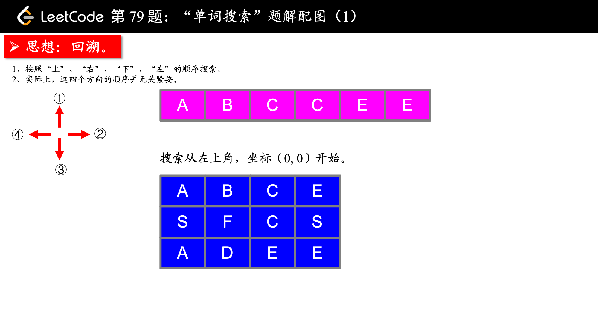
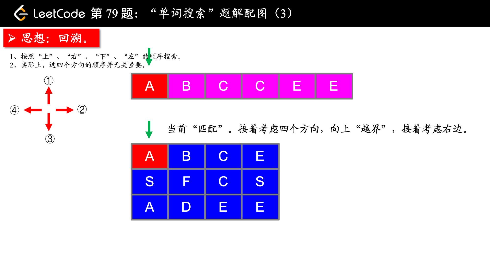
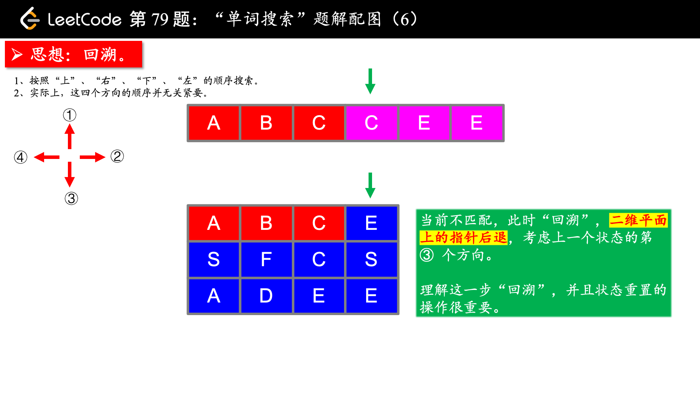
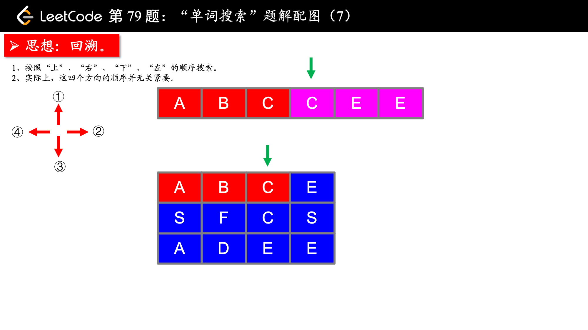
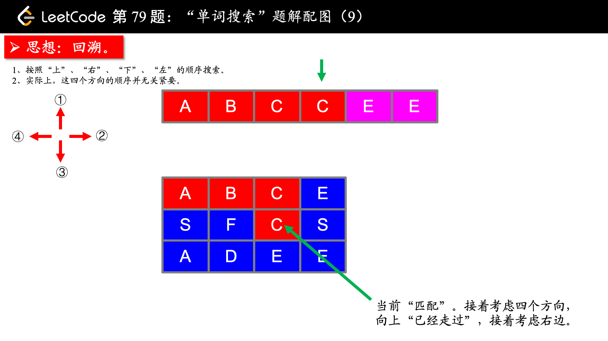
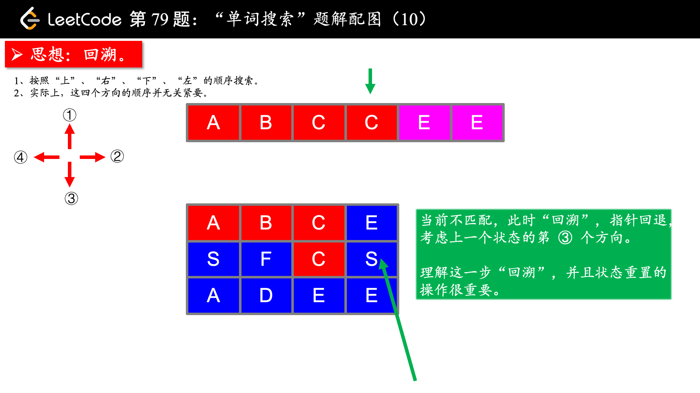
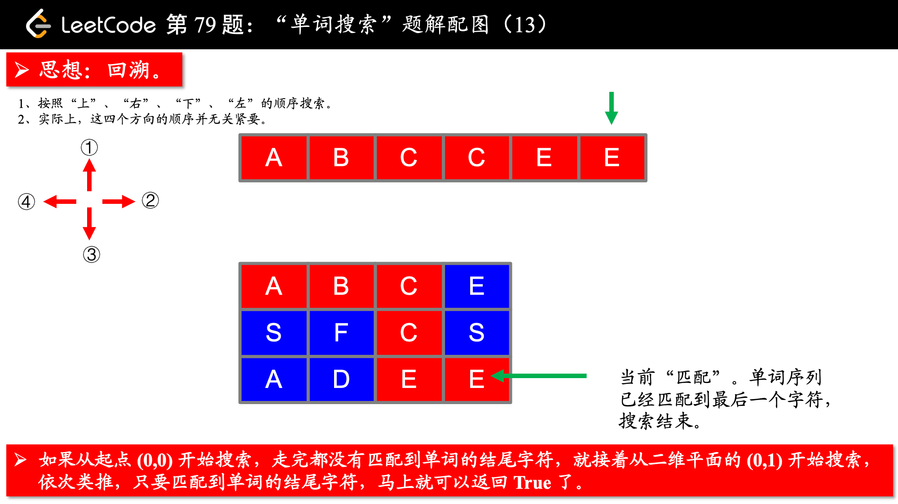

> 原文链接: https://leetcode-cn.com/problems/word-search


## 英文原文
<div><p>Given an <code>m x n</code> grid of characters <code>board</code> and a string <code>word</code>, return <code>true</code> <em>if</em> <code>word</code> <em>exists in the grid</em>.</p>

<p>The word can be constructed from letters of sequentially adjacent cells, where adjacent cells are horizontally or vertically neighboring. The same letter cell may not be used more than once.</p>

<p>&nbsp;</p>
<p><strong>Example 1:</strong></p>

<pre>
<strong>Input:</strong> board = [[&quot;A&quot;,&quot;B&quot;,&quot;C&quot;,&quot;E&quot;],[&quot;S&quot;,&quot;F&quot;,&quot;C&quot;,&quot;S&quot;],[&quot;A&quot;,&quot;D&quot;,&quot;E&quot;,&quot;E&quot;]], word = &quot;ABCCED&quot;
<strong>Output:</strong> true
</pre>

<p><strong>Example 2:</strong></p>

<pre>
<strong>Input:</strong> board = [[&quot;A&quot;,&quot;B&quot;,&quot;C&quot;,&quot;E&quot;],[&quot;S&quot;,&quot;F&quot;,&quot;C&quot;,&quot;S&quot;],[&quot;A&quot;,&quot;D&quot;,&quot;E&quot;,&quot;E&quot;]], word = &quot;SEE&quot;
<strong>Output:</strong> true
</pre>

<p><strong>Example 3:</strong></p>

<pre>
<strong>Input:</strong> board = [[&quot;A&quot;,&quot;B&quot;,&quot;C&quot;,&quot;E&quot;],[&quot;S&quot;,&quot;F&quot;,&quot;C&quot;,&quot;S&quot;],[&quot;A&quot;,&quot;D&quot;,&quot;E&quot;,&quot;E&quot;]], word = &quot;ABCB&quot;
<strong>Output:</strong> false
</pre>

<p>&nbsp;</p>
<p><strong>Constraints:</strong></p>

<ul>
	<li><code>m == board.length</code></li>
	<li><code>n = board[i].length</code></li>
	<li><code>1 &lt;= m, n &lt;= 6</code></li>
	<li><code>1 &lt;= word.length &lt;= 15</code></li>
	<li><code>board</code> and <code>word</code> consists of only lowercase and uppercase English letters.</li>
</ul>

<p>&nbsp;</p>
<p><strong>Follow up:</strong> Could you use search pruning to make your solution faster with a larger <code>board</code>?</p>
</div>

## 中文题目
<div><p>给定一个 <code>m x n</code> 二维字符网格 <code>board</code> 和一个字符串单词 <code>word</code> 。如果 <code>word</code> 存在于网格中，返回 <code>true</code> ；否则，返回 <code>false</code> 。</p>

<p>单词必须按照字母顺序，通过相邻的单元格内的字母构成，其中“相邻”单元格是那些水平相邻或垂直相邻的单元格。同一个单元格内的字母不允许被重复使用。</p>

<p> </p>

<p><strong>示例 1：</strong></p>

<pre>
<strong>输入：</strong>board = [["A","B","C","E"],["S","F","C","S"],["A","D","E","E"]], word = "ABCCED"
<strong>输出：</strong>true
</pre>

<p><strong>示例 2：</strong></p>

<pre>
<strong>输入：</strong>board = [["A","B","C","E"],["S","F","C","S"],["A","D","E","E"]], word = "SEE"
<strong>输出：</strong>true
</pre>

<p><strong>示例 3：</strong></p>

<pre>
<strong>输入：</strong>board = [["A","B","C","E"],["S","F","C","S"],["A","D","E","E"]], word = "ABCB"
<strong>输出：</strong>false
</pre>

<p> </p>

<p><strong>提示：</strong></p>

<ul>
	<li><code>m == board.length</code></li>
	<li><code>n = board[i].length</code></li>
	<li><code>1 <= m, n <= 6</code></li>
	<li><code>1 <= word.length <= 15</code></li>
	<li><code>board</code> 和 <code>word</code> 仅由大小写英文字母组成</li>
</ul>

<p> </p>

<p><strong>进阶：</strong>你可以使用搜索剪枝的技术来优化解决方案，使其在 <code>board</code> 更大的情况下可以更快解决问题？</p>
</div>

## 通过代码
<RecoDemo>
</RecoDemo>


## 高赞题解
这是一个使用回溯算法解决的问题，涉及的知识点有 **深度优先遍历** 和 **状态重置**。

<,,,,,,,,,,,,>


**参考代码**：

```Java []
public class Solution {

    private static final int[][] DIRECTIONS = {{-1, 0}, {0, -1}, {0, 1}, {1, 0}};
    private int rows;
    private int cols;
    private int len;
    private boolean[][] visited;
    private char[] charArray;
    private char[][] board;

    public boolean exist(char[][] board, String word) {
        rows = board.length;
        if (rows == 0) {
            return false;
        }
        cols = board[0].length;
        visited = new boolean[rows][cols];

        this.len = word.length();
        this.charArray = word.toCharArray();
        this.board = board;
        for (int i = 0; i < rows; i++) {
            for (int j = 0; j < cols; j++) {
                if (dfs(i, j, 0)) {
                    return true;
                }
            }
        }
        return false;
    }

    private boolean dfs(int x, int y, int begin) {
        if (begin == len - 1) {
            return board[x][y] == charArray[begin];
        }
        if (board[x][y] == charArray[begin]) {
            visited[x][y] = true;
            for (int[] direction : DIRECTIONS) {
                int newX = x + direction[0];
                int newY = y + direction[1];
                if (inArea(newX, newY) && !visited[newX][newY]) {
                    if (dfs(newX, newY, begin + 1)) {
                        return true;
                    }
                }
            }
            visited[x][y] = false;
        }
        return false;
    }

    private boolean inArea(int x, int y) {
        return x >= 0 && x < rows && y >= 0 && y < cols;
    }
}
```

**说明**：

1. 偏移量数组在二维平面内是经常使用的，可以把它的设置当做一个技巧，并且在这个问题中，偏移量数组内的 4 个偏移的顺序无关紧要；

说明：类似使用这个技巧的问题还有：[「力扣」第 130 题：被围绕的区域](https://leetcode-cn.com/problems/surrounded-regions/)、[「力扣」第 200 题：岛屿数量](https://leetcode-cn.com/problems/number-of-islands/)。

2. 对于这种搜索算法，我认为理解 DFS 和状态重置并不难，代码编写也相对固定，难在代码的编写和细节的处理，建议多次编写，自己多总结多思考，把自己遇到的坑记下。

我自己在写

```python
for i in range(m):
    for j in range(n):
        # 对每一个格子都从头开始搜索
        if self.__search_word(board, word, 0, i, j, marked, m, n):
            return True
```

这一段的时候，就写成了：

```python
# 这一段代码是错误的，不要模仿
for i in range(m):
    for j in range(n):
        # 对每一个格子都从头开始搜索
        return self.__search_word(board, word, 0, i, j, marked, m, n)
```

这样其实就变成只从坐标 `(0,0)` 开始搜索，搜索不到返回 `False`，但题目的意思是：只要你的搜索返回 `True` 才返回，如果全部的格子都搜索完了以后，都返回 `False` ，才返回 `False`。


## 统计信息
| 通过次数 | 提交次数 | AC比率 |
| :------: | :------: | :------: |
|    243076    |    529174    |   45.9%   |

## 提交历史
| 提交时间 | 提交结果 | 执行时间 |  内存消耗  | 语言 |
| :------: | :------: | :------: | :--------: | :--------: |


## 相似题目
|                             题目                             | 难度 |
| :----------------------------------------------------------: | :---------: |
| [单词搜索 II](https://leetcode-cn.com/problems/word-search-ii/) | 困难|
