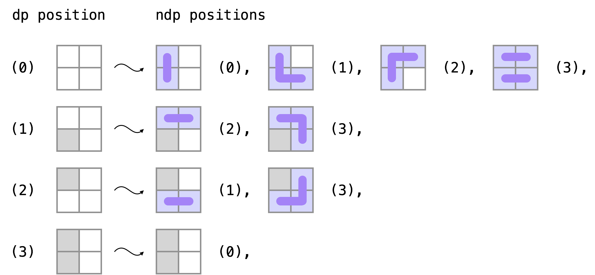

> 原文链接: https://leetcode-cn.com/problems/domino-and-tromino-tiling


## 英文原文
<div><p>You have two types of tiles: a <code>2 x 1</code> domino shape and a tromino shape. You may rotate these shapes.</p>

<p>Given an integer n, return <em>the number of ways to tile an</em> <code>2 x n</code> <em>board</em>. Since the answer may be very large, return it <strong>modulo</strong> <code>10<sup>9</sup> + 7</code>.</p>

<p>In a tiling, every square must be covered by a tile. Two tilings are different if and only if there are two 4-directionally adjacent cells on the board such that exactly one of the tilings has both squares occupied by a tile.</p>

<p>&nbsp;</p>
<p><strong>Example 1:</strong></p>

<pre>
<strong>Input:</strong> n = 3
<strong>Output:</strong> 5
<strong>Explanation:</strong> The five different ways are show above.
</pre>

<p><strong>Example 2:</strong></p>

<pre>
<strong>Input:</strong> n = 1
<strong>Output:</strong> 1
</pre>

<p>&nbsp;</p>
<p><strong>Constraints:</strong></p>

<ul>
	<li><code>1 &lt;= n &lt;= 1000</code></li>
</ul>
</div>

## 中文题目
<div><p>有两种形状的瓷砖：一种是&nbsp;2x1 的多米诺形，另一种是形如&nbsp;&quot;L&quot; 的托米诺形。两种形状都可以旋转。</p>

<pre>
XX  &lt;- 多米诺

XX  &lt;- &quot;L&quot; 托米诺
X
</pre>

<p>给定&nbsp;N 的值，有多少种方法可以平铺&nbsp;2 x N 的面板？<strong>返回值 mod 10^9 + 7</strong>。</p>

<p>（平铺指的是每个正方形都必须有瓷砖覆盖。两个平铺不同，当且仅当面板上有四个方向上的相邻单元中的两个，使得恰好有一个平铺有一个瓷砖占据两个正方形。）</p>

<pre>
<strong>示例:</strong>
<strong>输入:</strong> 3
<strong>输出:</strong> 5
<strong>解释:</strong> 
下面列出了五种不同的方法，不同字母代表不同瓷砖：
XYZ XXZ XYY XXY XYY
XYZ YYZ XZZ XYY XXY</pre>

<p><strong>提示：</strong></p>

<ul>
	<li>N&nbsp; 的范围是&nbsp;<code>[1, 1000]</code></li>
</ul>

<p>&nbsp;</p>
</div>

## 通过代码
<RecoDemo>
</RecoDemo>


## 官方题解
#### 方法一：动态规划【通过】

**思想**

`dp[state]` 表示当前列在不同状态下铺砖方式的数量。如果 `state` 的第 `i` 位是 1，表示当前列的第 `i` 行铺砖；如果 `state` 的第 `i` 位是 0，表示当前列的第 `i` 行不铺砖。

其中，`dp[0]` 表示当前列两行都不铺；`dp[1]` 表示当前列第一行不铺，第二行铺；`dp[2]` 表示当前列第一行铺，第二行不铺；`dp[3]` 表示当前列的两行都铺。

**算法**

每列都有四种不同的铺砖状态，且每种状态都可以在前一列和当前列已存在的不同铺砖状态下，通过再次铺砖转换得到。

分析四种不同的铺砖状态可在哪些状态下转换得到。

* 两行都不铺
  * 两列都未铺，然后在第一行垂直铺多米诺瓷砖
  * 第一列已铺，第二列未铺，且不铺砖

* 第一行不铺，第二行铺
  * 两列都未铺，然后铺多米诺瓷砖
  * 第一列第一行已铺，然后在第一列第二行水平铺多米诺瓷砖

* 第一行铺，第二行不铺 ---- 与第一行不铺，第二行铺的方法对称

* 两行都铺
  * 两列都未铺，然后水平铺两个多米诺瓷砖
  * 第一列有一行已铺，然后铺一个托米诺瓷砖（实际上是两种情况）

{:width=500}

```java [solution1-Java]
class Solution {
    public int numTilings(int N) {
        int MOD = 1_000_000_007;
        long[] dp = new long[]{1, 0, 0, 0};
        for (int i = 0; i < N; ++i) {
            long[] ndp = new long[4];
            ndp[0b00] = (dp[0b00] + dp[0b11]) % MOD;
            ndp[0b01] = (dp[0b00] + dp[0b10]) % MOD;
            ndp[0b10] = (dp[0b00] + dp[0b01]) % MOD;
            ndp[0b11] = (dp[0b00] + dp[0b01] + dp[0b10]) % MOD;
            dp = ndp;
        }
        return (int) dp[0];
    }
}
```

```python [solution1-Python]
class Solution(object):
    def numTilings(self, N):
        MOD = 10**9 + 7
        dp = [1, 0, 0, 0]
        for _ in xrange(N):
            ndp = [0, 0, 0, 0]
            ndp[0b00] = (dp[0b00] + dp[0b11]) % MOD
            ndp[0b01] = (dp[0b00] + dp[0b10]) % MOD
            ndp[0b10] = (dp[0b00] + dp[0b01]) % MOD
            ndp[0b11] = (dp[0b00] + dp[0b01] + dp[0b10]) % MOD
            dp = ndp

        return dp[0]
```

**复杂度分析**

* 时间复杂度：$O(N)$，`state` 被更新 `N` 次。 

* 空间复杂度：$O(1)$。

#### 方法二：矩阵求幂

**思路**

*方法一*中每种状态的转换可以看作是其他几种状态的线性组合。每次计算下一列四种状态的铺砖方式数量时，可以将这四种线性组合看做矩阵转换。那么这个矩阵的 $n$ 次幂可以看作是转换了 $n$ 次，因此我们可以把这个问题简化为矩阵求幂的问题。

**算法**

令 $T$ 为*方法一*中 `dp -> ndp` 的线性转换矩阵，那么 $T^n$ 表示连续 $n$ 次转换。

为了提高 $T^n$ 的计算效率，我们使用 $T^{2k} = T^k * T^k$ 和 $T^{2k + 1} = T * T^{2k}$ 公式将计算复杂度降低到 $O(\log n)$。

```java [solution2-Java]
class Solution {
    int MOD = 1_000_000_007;

    public int numTilings(int N) {
        int[][] T = new int[][]{{1,0,0,1},{1,0,1,0},{1,1,0,0},{1,1,1,0}};
        return matrixExpo(T, N)[0][0];
    }

    public int[][] matrixMult(int[][] A, int[][] B) {
        int[][] ans = new int[A.length][A.length];
        for (int i = 0; i < A.length; i++)
            for (int j = 0; j < B[0].length; j++) {
                long entry = 0;
                for (int k = 0; k < B.length; k++)
                    entry += (long) A[i][k] * (long) B[k][j] % MOD;
                ans[i][j] = (int) (entry % MOD);
            }

        return ans;
    }

    public int[][] matrixExpo(int[][] A, int pow) {
        int[][] ans = new int[A.length][A.length];
        for (int i = 0; i < A.length; i++) ans[i][i] = 1;
        if (pow == 0) return ans;
        if (pow == 1) return A;
        if (pow % 2 == 1) return matrixMult(matrixExpo(A, pow-1), A);
        int[][] B = matrixExpo(A, pow / 2);
        return matrixMult(B, B);
    }
}
```

```python [solution2-Python]
class Solution(object):
    def numTilings(self, N):
        MOD = 10**9 + 7

        def matrix_mult(A, B):
            ZB = zip(*B)
            return [[sum(a * b for a, b in zip(row, col)) % MOD
                     for col in ZB] for row in A]

        def matrix_expo(A, K):
            if K == 0:
                return [[+(i==j) for j in xrange(len(A))]
                        for i in xrange(len(A))]
            if K == 1:
                return A
            elif K % 2:
                return matrix_mult(matrix_expo(A, K-1), A)
            B = matrix_expo(A, K/2)
            return matrix_mult(B, B)

        T = [[1, 0, 0, 1],
             [1, 0, 1, 0],
             [1, 1, 0, 0],
             [1, 1, 1, 0]]

        return matrix_expo(T, N)[0][0]
```


**复杂度分析**

* 时间复杂度：$O(\log N)$，共 $O(\log N)$ 次乘法。

* 空间复杂度：$O(\log N)$，递归调用栈的大小。

## 统计信息
| 通过次数 | 提交次数 | AC比率 |
| :------: | :------: | :------: |
|    4095    |    9098    |   45.0%   |

## 提交历史
| 提交时间 | 提交结果 | 执行时间 |  内存消耗  | 语言 |
| :------: | :------: | :------: | :--------: | :--------: |
