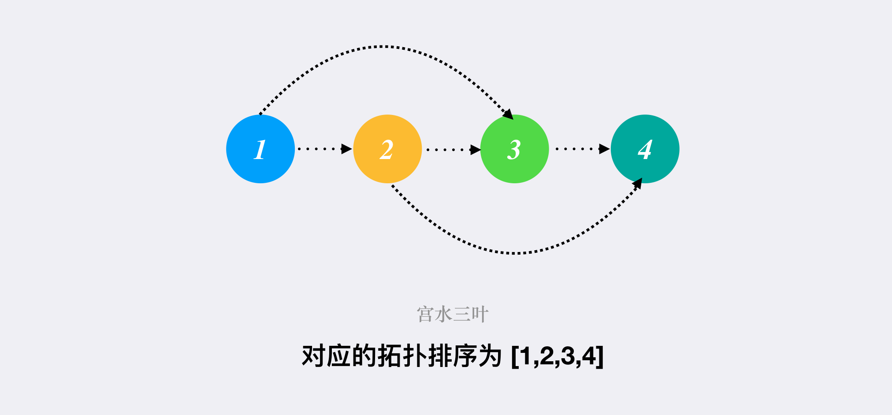

> 原文链接: https://leetcode-cn.com/problems/find-eventual-safe-states


## 英文原文
<div><p>There is a directed graph of <code>n</code> nodes with each node labeled from <code>0</code> to <code>n - 1</code>. The graph is represented by a <strong>0-indexed</strong> 2D integer array <code>graph</code> where <code>graph[i]</code> is an integer array of nodes adjacent to node <code>i</code>, meaning there is an edge from node <code>i</code> to each node in <code>graph[i]</code>.</p>

<p>A node is a <strong>terminal node</strong> if there are no outgoing edges. A node is a <strong>safe node</strong> if every possible path starting from that node leads to a <strong>terminal node</strong>.</p>

<p>Return <em>an array containing all the <strong>safe nodes</strong> of the graph</em>. The answer should be sorted in <strong>ascending</strong> order.</p>

<p>&nbsp;</p>
<p><strong>Example 1:</strong></p>

<pre>
<strong>Input:</strong> graph = [[1,2],[2,3],[5],[0],[5],[],[]]
<strong>Output:</strong> [2,4,5,6]
<strong>Explanation:</strong> The given graph is shown above.
Nodes 5 and 6 are terminal nodes as there are no outgoing edges from either of them.
Every path starting at nodes 2, 4, 5, and 6 all lead to either node 5 or 6.</pre>

<p><strong>Example 2:</strong></p>

<pre>
<strong>Input:</strong> graph = [[1,2,3,4],[1,2],[3,4],[0,4],[]]
<strong>Output:</strong> [4]
<strong>Explanation:</strong>
Only node 4 is a terminal node, and every path starting at node 4 leads to node 4.
</pre>

<p>&nbsp;</p>
<p><strong>Constraints:</strong></p>

<ul>
	<li><code>n == graph.length</code></li>
	<li><code>1 &lt;= n &lt;= 10<sup>4</sup></code></li>
	<li><code>0 &lt;= graph[i].length &lt;= n</code></li>
	<li><code>0 &lt;= graph[i][j] &lt;= n - 1</code></li>
	<li><code>graph[i]</code> is sorted in a strictly increasing order.</li>
	<li>The graph may contain self-loops.</li>
	<li>The number of edges in the graph will be in the range <code>[1, 4 * 10<sup>4</sup>]</code>.</li>
</ul>
</div>

## 中文题目
<div><p>在有向图中，以某个节点为起始节点，从该点出发，每一步沿着图中的一条有向边行走。如果到达的节点是终点（即它没有连出的有向边），则停止。</p>

<p>对于一个起始节点，如果从该节点出发，<strong>无论每一步选择沿哪条有向边行走</strong>，最后必然在有限步内到达终点，则将该起始节点称作是 <strong>安全</strong> 的。</p>

<p>返回一个由图中所有安全的起始节点组成的数组作为答案。答案数组中的元素应当按 <strong>升序</strong> 排列。</p>

<p>该有向图有 <code>n</code> 个节点，按 <code>0</code> 到 <code>n - 1</code> 编号，其中 <code>n</code> 是&nbsp;<code>graph</code>&nbsp;的节点数。图以下述形式给出：<code>graph[i]</code> 是编号 <code>j</code> 节点的一个列表，满足 <code>(i, j)</code> 是图的一条有向边。</p>

<p>&nbsp;</p>

<div class="original__bRMd">
<div>
<p><strong>示例 1：</strong></p>

<pre>
<strong>输入：</strong>graph = [[1,2],[2,3],[5],[0],[5],[],[]]
<strong>输出：</strong>[2,4,5,6]
<strong>解释：</strong>示意图如上。
</pre>

<p><strong>示例 2：</strong></p>

<pre>
<strong>输入：</strong>graph = [[1,2,3,4],[1,2],[3,4],[0,4],[]]
<strong>输出：</strong>[4]
</pre>

<p>&nbsp;</p>

<p><strong>提示：</strong></p>

<ul>
	<li><code>n == graph.length</code></li>
	<li><code>1 &lt;= n &lt;= 10<sup>4</sup></code></li>
	<li><code>0 &lt;= graph[i].length &lt;= n</code></li>
	<li><code>graph[i]</code> 按严格递增顺序排列。</li>
	<li>图中可能包含自环。</li>
	<li>图中边的数目在范围 <code>[1, 4 * 10<sup>4</sup>]</code> 内。</li>
</ul>
</div>
</div>
</div>

## 通过代码
<RecoDemo>
</RecoDemo>


## 高赞题解
> 欢迎关注我 ❤️ 提供写「证明」&「思路」的高质量专项题解
后台回复「刷题路线」有惊喜，更有「长期送实体书」活动等你来 🎉 🎉

## 基本分析 & 拓扑排序

为了方便，我们令点数为 $n$，边数为 $m$。

**在图论中，一个有向无环图必然存在至少一个拓扑序与之对应，反之亦然。**

如果对拓扑排序不熟悉的小伙伴，可以看看 [拓扑排序](https://baike.baidu.com/item/%E6%8B%93%E6%89%91%E6%8E%92%E5%BA%8F)。

**简单来说，就是将图中的所有节点展开成一维序列，对于序列中任意的节点 $(u, v)$，如果在序列中 $u$ 在 $v$ 的前面，则说明在图中存在从 $u$ 出发达到 $v$ 的通路，即 $u$ 排在 $v$ 的前面。反之亦然。**

同时，我们需要知晓「入度」和「出度」的概念：

* 入度：有多少条边直接指向该节点；
* 出度：由该节点指出边的有多少条。

因此，对于有向图的拓扑排序，我们可以使用如下思路输出拓扑序（`BFS` 方式）：

1. 起始时，将所有入度为 $0$ 的节点进行入队（入度为 $0$，说明没有边指向这些节点，将它们放到拓扑排序的首部，不会违反拓扑序定义）；
2. **从队列中进行节点出队操作，出队序列就是对应我们输出的拓扑序**。
    对于当前弹出的节点 $x$，遍历 $x$ 的所有出度，即遍历所有由 $x$ 直接指向的节点 $y$，对 $y$ 做入度减一操作（因为 $x$ 节点已经从队列中弹出，被添加到拓扑序中，等价于从 $x$ 节点从有向图中被移除，相应的由 $x$ 发出的边也应当被删除，带来的影响是与 $x$ 相连的节点 $y$ 的入度减一）；
3. 对 $y$ 进行入度减一之后，检查 $y$ 的入度是否为 $0$，如果为 $0$ 则将 $y$ 入队（当 $y$ 的入度为 $0$，说明有向图中在 $y$ 前面的所有的节点均被添加到拓扑序中，此时 $y$ 可以作为拓扑序的某个片段的首部被添加，而不是违反拓扑序的定义）；
3. 循环流程 $2$、$3$ 直到队列为空。



---

## 证明

上述 `BFS` 方法能够求得「某个有向无环图的拓扑序」的前提是：**我们必然能够找到（至少）一个「入度为 $0$ 的点」，在起始时将其入队。**

这可以使用反证法进行证明：假设有向无环图的拓扑序不存在入度为 $0$ 的点。

**那么从图中的任意节点 $x$ 进行出发，沿着边进行反向检索，由于不存在入度为 $0$ 的节点，因此每个点都能够找到上一个节点。**

**当我们找到一条长度为 $n + 1$ 的反向路径时，由于我们图中只有 $n$ 个节点，因此必然有至少一个节点在该路径中重复出现，即该反向路径中存在环，与我们「有向无环图」的起始条件冲突。**

得证「有向无环图的拓扑序」必然存在（至少）一个「入度为 $0$ 的点」。

即按照上述的 `BFS` 方法，我们能够按照流程迭代下去，直到将有向无环图的所有节点从队列中弹出。

反之，如果一个图不是「有向无环图」的话，我们是无法将所有节点入队的，因此能够通过入队节点数量是否为 $n$ 来判断是否为有向无环图。

---

## 反向图 + 拓扑排序

回到本题，根据题目对「安全节点」的定义，我们知道如果一个节点无法进入「环」的话则是安全的，否则是不安全的。

另外我们发现，**如果想要判断某个节点数 $x$ 是否安全，起始时将 $x$ 进行入队，并跑一遍拓扑排序是不足够的。**

因为我们无法事先确保 $x$ 满足入度为 $0$ 的要求，所以当我们处理到与 $x$ 相连的节点 $y$ 时，可能会存在 $y$ 节点入度无法减到 $0$ 的情况，即我们无法输出真实拓扑序中，从 $x$ 节点开始到结尾的完整部分。

但是根据我们「证明」部分的启发，我们可以将所有边进行反向，这时候「入度」和「出度」翻转了。

对于那些反向图中「入度」为 $0$ 的点集 $x$，其实就是原图中「出度」为 $0$ 的节点，它们「出度」为 $0$，根本没指向任何节点，必然无法进入环，是安全的；同时由它们在反向图中指向的节点（在原图中**只指向**它们的节点），必然也是无法进入环的，对应到反向图中，就是那些减去 $x$ 对应的入度之后，入度为 $0$ 的节点。

因此整个过程就是将图进行反向，再跑一遍拓扑排序，如果某个节点出现在拓扑序列，说明其进入过队列，说明其入度为 $0$，其是安全的，其余节点则是在环内非安全节点。

> 另外，这里的存图方式还是使用前几天一直使用的「链式前向星」，关于几个数组的定义以及其他的存图方式，如果还是有不熟悉的小伙伴可以在 [这里](https://zhuanlan.zhihu.com/p/396576813) 查阅，本次不再赘述。

代码：
```Java []
class Solution {
    int N = (int)1e4+10, M = 4 * N;
    int idx;
    int[] he = new int[N], e = new int[M], ne = new int[M];
    int[] cnts = new int[N];
    void add(int a, int b) {
        e[idx] = b;
        ne[idx] = he[a];
        he[a] = idx++;
    }
    public List<Integer> eventualSafeNodes(int[][] g) {
        int n = g.length;
        // 存反向图，并统计入度
        Arrays.fill(he, -1);
        for (int i = 0; i < n; i++) {
            for (int j : g[i]) {
                add(j, i);
                cnts[i]++;
            }
        }
        // BFS 求反向图拓扑排序
        Deque<Integer> d = new ArrayDeque<>();
        for (int i = 0; i < n; i++) {
            if (cnts[i] == 0) d.addLast(i);
        }
        while (!d.isEmpty()) {
            int poll = d.pollFirst();
            for (int i = he[poll]; i != -1; i = ne[i]) {
                int j = e[i];
                if (--cnts[j] == 0) d.addLast(j);
            }
        }
        // 遍历答案：如果某个节点出现在拓扑序列，说明其进入过队列，说明其入度为 0
        List<Integer> ans = new ArrayList<>();
        for (int i = 0; i < n; i++) {
            if (cnts[i] == 0) ans.add(i);
        }
        return ans;
    }
}
```
* 时间复杂度：$O(n + m)$
* 空间复杂度：$O(n + m)$

---

## 最后

**如果有帮助到你，请给题解点个赞和收藏，让更多的人看到 ~ ("▔□▔)/**

## 统计信息
| 通过次数 | 提交次数 | AC比率 |
| :------: | :------: | :------: |
|    32062    |    55558    |   57.7%   |

## 提交历史
| 提交时间 | 提交结果 | 执行时间 |  内存消耗  | 语言 |
| :------: | :------: | :------: | :--------: | :--------: |
