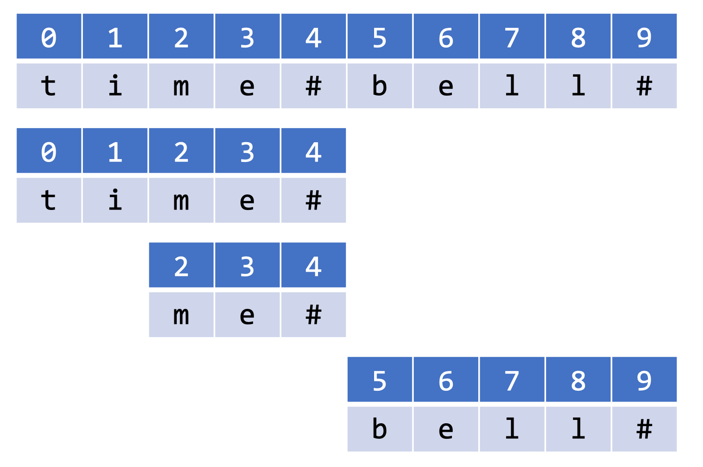
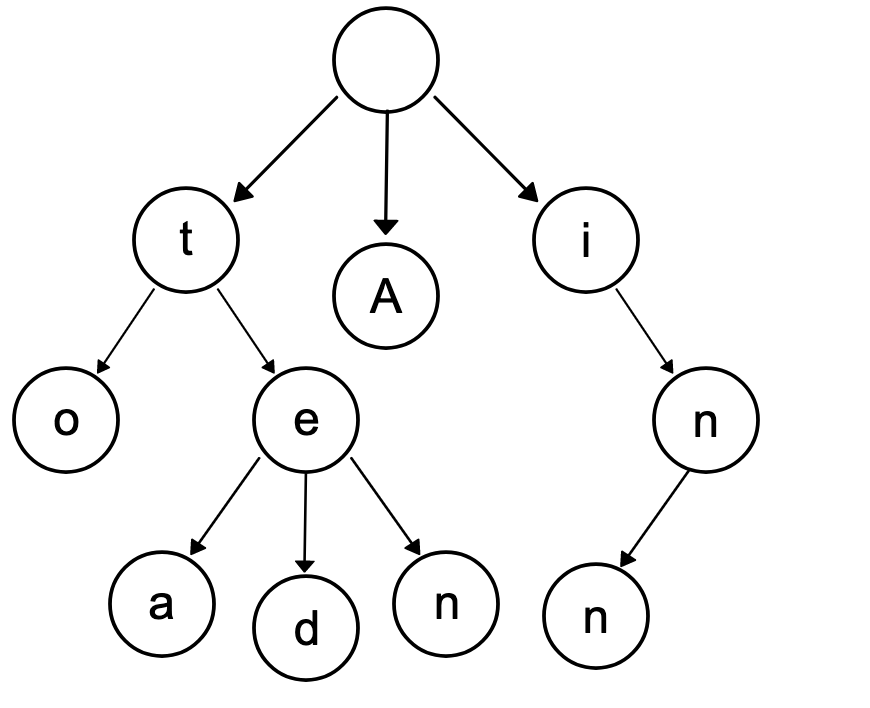

> 原文链接: https://leetcode-cn.com/problems/short-encoding-of-words


## 英文原文
<div><p>A <strong>valid encoding</strong> of an array of <code>words</code> is any reference string <code>s</code> and array of indices <code>indices</code> such that:</p>

<ul>
	<li><code>words.length == indices.length</code></li>
	<li>The reference string <code>s</code> ends with the <code>&#39;#&#39;</code> character.</li>
	<li>For each index <code>indices[i]</code>, the <strong>substring</strong> of <code>s</code> starting from <code>indices[i]</code> and up to (but not including) the next <code>&#39;#&#39;</code> character is equal to <code>words[i]</code>.</li>
</ul>

<p>Given an array of <code>words</code>, return <em>the <strong>length of the shortest reference string</strong> </em><code>s</code><em> possible of any <strong>valid encoding</strong> of </em><code>words</code><em>.</em></p>

<p>&nbsp;</p>
<p><strong>Example 1:</strong></p>

<pre>
<strong>Input:</strong> words = [&quot;time&quot;, &quot;me&quot;, &quot;bell&quot;]
<strong>Output:</strong> 10
<strong>Explanation:</strong> A valid encoding would be s = <code>&quot;time#bell#&quot; and indices = [0, 2, 5</code>].
words[0] = &quot;time&quot;, the substring of s starting from indices[0] = 0 to the next &#39;#&#39; is underlined in &quot;<u>time</u>#bell#&quot;
words[1] = &quot;me&quot;, the substring of s starting from indices[1] = 2 to the next &#39;#&#39; is underlined in &quot;ti<u>me</u>#bell#&quot;
words[2] = &quot;bell&quot;, the substring of s starting from indices[2] = 5 to the next &#39;#&#39; is underlined in &quot;time#<u>bell</u>#&quot;
</pre>

<p><strong>Example 2:</strong></p>

<pre>
<strong>Input:</strong> words = [&quot;t&quot;]
<strong>Output:</strong> 2
<strong>Explanation:</strong> A valid encoding would be s = &quot;t#&quot; and indices = [0].
</pre>

<p>&nbsp;</p>
<p><strong>Constraints:</strong></p>

<ul>
	<li><code>1 &lt;= words.length &lt;= 2000</code></li>
	<li><code>1 &lt;= words[i].length &lt;= 7</code></li>
	<li><code>words[i]</code> consists of only lowercase letters.</li>
</ul>
</div>

## 中文题目
<div><p>单词数组 <code>words</code> 的 <strong>有效编码</strong> 由任意助记字符串 <code>s</code> 和下标数组 <code>indices</code> 组成，且满足：</p>

<ul>
	<li><code>words.length == indices.length</code></li>
	<li>助记字符串 <code>s</code> 以 <code>'#'</code> 字符结尾</li>
	<li>对于每个下标 <code>indices[i]</code> ，<code>s</code> 的一个从 <code>indices[i]</code> 开始、到下一个 <code>'#'</code> 字符结束（但不包括 <code>'#'</code>）的 <strong>子字符串</strong> 恰好与 <code>words[i]</code> 相等</li>
</ul>

<p>给你一个单词数组 <code>words</code> ，返回成功对 <code>words</code> 进行编码的最小助记字符串 <code>s</code> 的长度 。</p>

<p> </p>

<p><strong>示例 1：</strong></p>

<pre>
<strong>输入：</strong>words = ["time", "me", "bell"]
<strong>输出：</strong>10
<strong>解释：</strong>一组有效编码为 s = <code>"time#bell#" 和 indices = [0, 2, 5</code>] 。
words[0] = "time" ，s 开始于 indices[0] = 0 到下一个 '#' 结束的子字符串，如加粗部分所示 "<strong>time</strong>#bell#"
words[1] = "me" ，s 开始于 indices[1] = 2 到下一个 '#' 结束的子字符串，如加粗部分所示 "ti<strong>me</strong>#bell#"
words[2] = "bell" ，s 开始于 indices[2] = 5 到下一个 '#' 结束的子字符串，如加粗部分所示 "time#<strong>bell</strong>#"
</pre>

<p><strong>示例 2：</strong></p>

<pre>
<strong>输入：</strong>words = ["t"]
<strong>输出：</strong>2
<strong>解释：</strong>一组有效编码为 s = "t#" 和 indices = [0] 。
</pre>

<p> </p>

<p><strong>提示：</strong></p>

<ul>
	<li><code>1 <= words.length <= 2000</code></li>
	<li><code>1 <= words[i].length <= 7</code></li>
	<li><code>words[i]</code> 仅由小写字母组成</li>
</ul>
</div>

## 通过代码
<RecoDemo>
</RecoDemo>


## 高赞题解


🙋🙋🙋 周五晚上不看歌手也得先来打卡 还不赞嘛！！

今天这道题是一道字符串的题目。题意有点不太好理解，我可以说一下背景吧。
`["time", "me", "bell"]`是待编码列表，`"time#bell#"`是编码结果，`indexes = [0, 2, 5]`对应的是三个单词在编码结果中的起始位置。

indexes的意义是什么呢？就是说从这个位置开始，到#结束位置所组成的单词是单词列表中的单词。可以看下图示：

{:height="60%" width="60%"}

可以想到最后的编码结果肯定是若干个单词之间用#分隔开来的。示例里的`"me"`由于是`"time"`的后缀，所以`me`这个单词不用出现在最后的编码结果里，所以我们只要找到单词列表里，哪些单词被别的单词的后缀给包含了就可以了。这题很明显是用**字典树**来做的。为什么很明显呢？后面我们来解释。


## 字典树/Trie树/前缀树
---

字典树又名前缀树，Trie树，是一种存储大量字符串的树形数据结构，相比于HashMap存储，在存储单词（和语种无关，任意语言都可以）的场景上，节省了大量的内存空间。

下图演示了一个保存了8个单词的字典树的结构，8个单词分别是："A", "to", "tea", "ted", "ten", "i", "in", "inn"。
{:height="60%" width="60%"}

怎么理解这颗树呢？你从根节点走到叶子节点，尝试走一下所有的路径。你会发现，**每条从根节点到叶子节点的路径都构成了单词（有的不需要走到叶子节点也是单词，比如 `"i"` 和 `"in"`）**。trie树里的每个节点只需要保存当前的字符就可以了（当然你也可以额外记录别的信息，比如记录一下如果以当前节点结束是否构成单词）。

你注意到了吗？从根节点出发的路径，都是给定单词列表里某个/某些单词的前缀。反之，如果某个字符串没有出现在这棵树的路径上，那就肯定不是某个单词的前缀。上面说很明显这题是用字典树来做，原因就是：**这类很明显是用字典树去做的题目，明显特征就是需要大量地判断某个字符串是否是给定单词列表中的前缀/后缀。** 为什么要说后缀也可以呢？因为把单词倒着插入，就可以搜后缀了~

trie的节点的定义就很好给出来了（trie的根节点定义成一个空节点）：
``` java
class TrieNode {
    char val;
    TrieNode[] children = new TrieNode[26];

    public TrieNode() {}

    public TrieNode(char val) {
        this.val = val;
    }
}
```

插入单词的操作如下：
```
public void insert(String word) {
    TrieNode cur = root;
    for (int i = 0; i < word.length(); i++) {
        char c = word.charAt(i);
        if (cur.children[c - 'a'] == null) {
            cur.children[c - 'a'] = new TrieNode(c);
        }
        cur = cur.children[c - 'a'];
    }
}
```

你可以用以下题目做练习：[实现 Trie (前缀树)](https://leetcode-cn.com/problems/implement-trie-prefix-tree/)


## 题解

那为什么这题我们要用字典树做呢？因为我们需要知道单词列表里，哪些单词是其它某个单词的后缀。既然要求的是后缀，我们只要把单词的倒序插入字典树，再用字典树判断某个单词的逆序是否出现在字典树里就可以了。

比如示例中的`["time", "me", "bell"]`的逆序就是`["emit", "em", "lleb"]`。我们可以发现`em`是`emit`的前缀。所以`"em"`就可以忽略了。我们必须要先插入单词长的数组，否则会有问题。比如如果我先插入了`"em"`，再插入`"emit"`,会发现两个都可以插入进去，很显然是不对的，所以在插入之前需要先根据单词的长度由长到短排序。


``` java
class Solution {
    public int minimumLengthEncoding(String[] words) {
        int len = 0;
        Trie trie = new Trie();
        // 先对单词列表根据单词长度由长到短排序
        Arrays.sort(words, (s1, s2) -> s2.length() - s1.length());
        // 单词插入trie，返回该单词增加的编码长度
        for (String word: words) {
            len += trie.insert(word);
        }
        return len;
    }
}

// 定义tire
class Trie {
    
    TrieNode root;
    
    public Trie() {
        root = new TrieNode();
    }

    public int insert(String word) {
        TrieNode cur = root;
        boolean isNew = false;
        // 倒着插入单词
        for (int i = word.length() - 1; i >= 0; i--) {
            int c = word.charAt(i) - 'a';
            if (cur.children[c] == null) {
                isNew = true; // 是新单词
                cur.children[c] = new TrieNode();
            }
            cur = cur.children[c];
        }
        // 如果是新单词的话编码长度增加新单词的长度+1，否则不变。
        return isNew? word.length() + 1: 0;
    }
}

class TrieNode {
    char val;
    TrieNode[] children = new TrieNode[26];

    public TrieNode() {}
}
```

## 其它

trie树除了刷题还出现在什么地方呢？

#### 搜索引擎
比如你在搜索引擎里输入”**甜**”🍬🍬，它会给你一系列以“甜”开头的搜索词供你选择。


#### 区块链
trie树的进阶版，[Merkle Patricia Tree](https://ethfans.org/toya/articles/588)，他能够高效、安全地验证大型数据结构中的数据，我从[别的地方](https://www.cnblogs.com/whyaza/p/10034128.html)摘抄了下摘要：
> 一种经过改良的、融合了默克尔树和前缀树两种树结构优点的数据结构，以太坊中，MPT是一个非常重要的数据结构，在以太坊中，帐户的交易信息、状态以及相应的状态变更，还有相关的交易信息等都使用MPT来进行管理，其是整个数据存储的重要一环。交易树，收据树，状态树都是采用的MPT结构。

#### IP路由，倒排索引

这个感兴趣的可以去了解下，我也不太了解，这是听说过可以🤣😂

#### 分词

常见的分词库，或多或少会用到字典树，或者其它类似的存储字符串的树形数据结构（比如"双数组trie树"）。原因就是因为它能提供良好的前缀查询（一些分词算法需要大量调用该方法）。

python有一个很著名的分词库叫做`jieba`，里面就用到了字典树（虽说由于jieba源码里字典树实现得不够优雅，后来被替代了🤣）。这个库有java版本叫做`jieba-analysis`，但是已经很久不更新了，而且分词结果和python版本的不一致！❤️❤️**我就以学习为目的，重写了 java 版本的 `jieba`~ 名叫[👉`jaba`👈](https://github.com/Sweetiee-yi/Jaba)。**得益于用了更高级的 `AhoCorasickDoubleArrayTrie`，分词速度比`jieba-analysis`要**快一倍**，而且保证了分词结果和 python 版 `jieba` 一致！，也解决了，**欢迎star~~~ 如果star够多的话，会继续更新，并且发到maven仓库滴~~ ▄█▔▉● 谢谢各位哥哥了。。**


以上谢谢大家，求赞求赞求赞！
大佬们随手关注下我的wx公众号【[甜姨的奇妙冒险](../images/short-encoding-of-words-3.jpeg)】和 知乎专栏【[甜姨的力扣题解](https://zhuanlan.zhihu.com/c_1224355183452614656)】 
❤️公众号&知专栏明天会更Trie最全攻略，包会～❤️

## 统计信息
| 通过次数 | 提交次数 | AC比率 |
| :------: | :------: | :------: |
|    56590    |    111157    |   50.9%   |

## 提交历史
| 提交时间 | 提交结果 | 执行时间 |  内存消耗  | 语言 |
| :------: | :------: | :------: | :--------: | :--------: |
