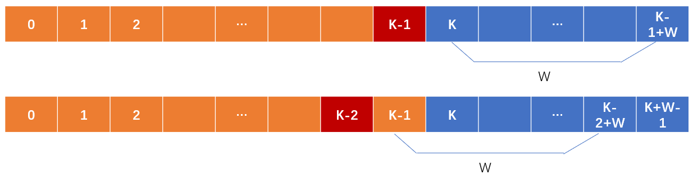

> 原文链接: https://leetcode-cn.com/problems/new-21-game


## 英文原文
<div><p>Alice plays the following game, loosely based on the card game <strong>&quot;21&quot;</strong>.</p>

<p>Alice starts with <code>0</code> points and draws numbers while she has less than <code>k</code> points. During each draw, she gains an integer number of points randomly from the range <code>[1, maxPts]</code>, where <code>maxPts</code> is an integer. Each draw is independent and the outcomes have equal probabilities.</p>

<p>Alice stops drawing numbers when she gets <code>k</code> <strong>or more points</strong>.</p>

<p>Return the probability that Alice has <code>n</code> or fewer points.</p>

<p>Answers within <code>10<sup>-5</sup></code> of the actual answer are considered accepted.</p>

<p>&nbsp;</p>
<p><strong>Example 1:</strong></p>

<pre>
<strong>Input:</strong> n = 10, k = 1, maxPts = 10
<strong>Output:</strong> 1.00000
<strong>Explanation:</strong> Alice gets a single card, then stops.
</pre>

<p><strong>Example 2:</strong></p>

<pre>
<strong>Input:</strong> n = 6, k = 1, maxPts = 10
<strong>Output:</strong> 0.60000
<strong>Explanation:</strong> Alice gets a single card, then stops.
In 6 out of 10 possibilities, she is at or below 6 points.
</pre>

<p><strong>Example 3:</strong></p>

<pre>
<strong>Input:</strong> n = 21, k = 17, maxPts = 10
<strong>Output:</strong> 0.73278
</pre>

<p>&nbsp;</p>
<p><strong>Constraints:</strong></p>

<ul>
	<li><code>0 &lt;= k &lt;= n &lt;= 10<sup>4</sup></code></li>
	<li><code>1 &lt;= maxPts &lt;= 10<sup>4</sup></code></li>
</ul>
</div>

## 中文题目
<div><p>爱丽丝参与一个大致基于纸牌游戏 <strong>“21点”</strong> 规则的游戏，描述如下：</p>

<p>爱丽丝以 <code>0</code> 分开始，并在她的得分少于 <code>k</code> 分时抽取数字。 抽取时，她从 <code>[1, maxPts]</code> 的范围中随机获得一个整数作为分数进行累计，其中 <code>maxPts</code> 是一个整数。 每次抽取都是独立的，其结果具有相同的概率。</p>

<p>当爱丽丝获得 <code>k</code> 分 <strong>或更多分</strong> 时，她就停止抽取数字。</p>

<p>爱丽丝的分数不超过 <code>n</code> 的概率是多少？</p>

<p>与实际答案误差不超过&nbsp;<code>10<sup>-5</sup></code> 的答案将被视为正确答案。</p>
&nbsp;

<p><strong>示例 1：</strong></p>

<pre>
<strong>输入：</strong>n = 10, k = 1, maxPts = 10
<strong>输出：</strong>1.00000
<strong>解释：</strong>爱丽丝得到一张牌，然后停止。
</pre>

<p><strong>示例 2：</strong></p>

<pre>
<strong>输入：</strong>n = 6, k = 1, maxPts = 10
<strong>输出：</strong>0.60000
<strong>解释：</strong>爱丽丝得到一张牌，然后停止。 在 10 种可能性中的 6 种情况下，她的得分不超过 6 分。
</pre>

<p><strong>示例 3：</strong></p>

<pre>
<strong>输入：</strong>n = 21, k = 17, maxPts = 10
<strong>输出：</strong>0.73278
</pre>

<p>&nbsp;</p>

<p><strong>提示：</strong></p>

<ul>
	<li><code>0 &lt;= k &lt;= n &lt;= 10<sup>4</sup></code></li>
	<li><code>1 &lt;= maxPts &lt;= 10<sup>4</sup></code></li>
</ul>
</div>

## 通过代码
<RecoDemo>
</RecoDemo>


## 高赞题解
#### 解题思路
老实说，一开始没懂题目意思，后面才知道是求爱丽丝的胜率。
规则是这样：
1. 她可以从牌面为 `[1,W]` 的牌中选择任意一张，这张牌是可以无限重复的，也就是说无论她取多少次，每次取到 2（假如 2 在 `[1,W]` 范围内）的概率都是 `1/W`;
2. 如果她手上牌的总额小于 `K`，她就会抽牌，大于等于 `K` 时，就停止抽牌;
3. 停止抽牌后，她的牌面小于等于 `N` 时，她就获胜了，求她获胜的概率。

假设 `dp[x]` 为她手上牌面为x时，能获胜的概率，那么这个概率应该是：
`dp[x]=1/w * (dp[x+1]+dp[x+2]+dp[x+3]...+dp[x+w])`
因为抽取的牌面机会都是均等的，她能抽取的面值在 `[1,W]` 之间，所以将概率之和平均一下就是 `dp[x]` 的概率。
> 强插一段解释：
> `x`代表爱丽丝手上的牌面值，`dp[x]`代表爱丽丝手上持有的牌面值为`x`时，她获胜的概率（游戏结束时她所持牌面值小于等于N的概率）。
> 这个概率是怎么来的？x分2种情况:
> 1. 当x>=K时，爱丽丝会停止抽牌，这个时候游戏已经结束了，她是赢是输也已经确定了，所以此时赢的概率要么1，要么0
> 2. 当x<K时，爱丽丝会继续抽牌，抽牌是有概率的，所以她是赢是输也有概率。
> 她能抽到的牌面值在 `[1,W]` 之间，所以抽完后她的牌面在`[x+1,x+w]`之间，因为每张牌机率均等，所以抽完后牌面在`[x+1,x+w]`之间的每个面值概率都是相等的，而假如我们已知当牌面是`[x+1,x+w]`的胜率(即`dp[x+1]...dp[x+w]`的值)，那么可以推导：
> `dp[x]=1/w * dp[x+1]+ 1/w * dp[x+2] + 1/w * dp[x+3]...+ 1/w * dp[x+w]`
> 这个实际上就是动态规划的状态转移方程，不过本例是反着来转移的。

`x` 最多能到 `K-1`，因为当大于等于 `K` 时，爱丽丝会停止抽牌，所以当游戏结束时，即爱丽丝停止抽牌时，她可能达到的最大牌面是 `K+W-1`，而一开始她的牌面是 `0`，所以我们用一个长度为 `K+W` 的 `dp` 数组来保存她在所有面值下的胜率。
最后 `dp[0]`，也就是最开始爱丽丝还没有抽牌，她的牌面为 `0` 时的胜率，这个就是我们的答案。

#### 填格子游戏开始


我将这个格子分成了 2 部分 `[0,K-1]` 和 `[K,K+W-1]`，区别就是 `[0,K-1]` 爱丽丝可以抽牌，`[K,K+W-1]` 时不能抽牌，那么不能抽牌时她获胜的概率是多少呢，此时已不能抽牌，要么赢要么输，很显然牌面小于等于N时，概率就是 1，大于 `N` 概率就是 0，所以先直接填满图中蓝色的格子。

接下来，从 `K-1` 开始填图中的橘色部分，这个值根据我们前面提到的计算方式，实际上就相当于它后面 `W` 个格子的总和除以 `W`，
这时聪明的你一定会想到不用每轮都累加的方法吧，用一个 `s` 变量来保存累加结果，而下一轮只是减去右边的格子，加上左边的格子即可。



所以这题你要做的就是，先初始化蓝色格子，然后从最右边的橘色格子开始，填到最左边的格子，就是这么简单，不仅简单，而且你连动态规划的思想都学会了。
相信这么厉害的你，看到这里给我点个赞一定不是件很困难的事吧。

#### 代码

```Python3 []
class Solution:
    def new21Game(self, N: int, K: int, W: int) -> float:
        dp=[None]*(K+W)
        s=0
        for i in range(K,K+W):          # 填蓝色的格子
            dp[i] = 1 if i<=N else 0
            s+=dp[i]
        for i in range(K-1,-1,-1):      # 填橘黄色格子
            dp[i]=s/W
            s=s-dp[i+W]+dp[i]
        return dp[0]
```

时间复杂度=格子长度 $O(K+W)$
空间复杂度=格子长度 $O(K+W)$

## 统计信息
| 通过次数 | 提交次数 | AC比率 |
| :------: | :------: | :------: |
|    19643    |    49576    |   39.6%   |

## 提交历史
| 提交时间 | 提交结果 | 执行时间 |  内存消耗  | 语言 |
| :------: | :------: | :------: | :--------: | :--------: |
