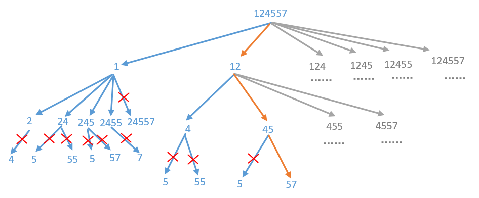

> 原文链接: https://leetcode-cn.com/problems/split-array-into-fibonacci-sequence


## 英文原文
<div><p>You are given a string of digits <code>num</code>, such as <code>&quot;123456579&quot;</code>. We can split it into a Fibonacci-like sequence <code>[123, 456, 579]</code>.</p>

<p>Formally, a <strong>Fibonacci-like</strong> sequence is a list <code>f</code> of non-negative integers such that:</p>

<ul>
	<li><code>0 &lt;= f[i] &lt; 2<sup>31</sup></code>, (that is, each integer fits in a <strong>32-bit</strong> signed integer type),</li>
	<li><code>f.length &gt;= 3</code>, and</li>
	<li><code>f[i] + f[i + 1] == f[i + 2]</code> for all <code>0 &lt;= i &lt; f.length - 2</code>.</li>
</ul>

<p>Note that when splitting the string into pieces, each piece must not have extra leading zeroes, except if the piece is the number <code>0</code> itself.</p>

<p>Return any Fibonacci-like sequence split from <code>num</code>, or return <code>[]</code> if it cannot be done.</p>

<p>&nbsp;</p>
<p><strong>Example 1:</strong></p>

<pre>
<strong>Input:</strong> num = &quot;123456579&quot;
<strong>Output:</strong> [123,456,579]
</pre>

<p><strong>Example 2:</strong></p>

<pre>
<strong>Input:</strong> num = &quot;11235813&quot;
<strong>Output:</strong> [1,1,2,3,5,8,13]
</pre>

<p><strong>Example 3:</strong></p>

<pre>
<strong>Input:</strong> num = &quot;112358130&quot;
<strong>Output:</strong> []
<strong>Explanation:</strong> The task is impossible.
</pre>

<p><strong>Example 4:</strong></p>

<pre>
<strong>Input:</strong> num = &quot;0123&quot;
<strong>Output:</strong> []
<strong>Explanation:</strong> Leading zeroes are not allowed, so &quot;01&quot;, &quot;2&quot;, &quot;3&quot; is not valid.
</pre>

<p><strong>Example 5:</strong></p>

<pre>
<strong>Input:</strong> num = &quot;1101111&quot;
<strong>Output:</strong> [11,0,11,11]
<strong>Explanation:</strong> The output [11, 0, 11, 11] would also be accepted.
</pre>

<p>&nbsp;</p>
<p><strong>Constraints:</strong></p>

<ul>
	<li><code>1 &lt;= num.length &lt;= 200</code></li>
	<li><code>num</code> contains only digits.</li>
</ul>
</div>

## 中文题目
<div><p>给定一个数字字符串 <code>S</code>，比如 <code>S = &quot;123456579&quot;</code>，我们可以将它分成斐波那契式的序列 <code>[123, 456, 579]</code>。</p>

<p>形式上，斐波那契式序列是一个非负整数列表 <code>F</code>，且满足：</p>

<ul>
	<li><code>0 &lt;= F[i] &lt;= 2^31 - 1</code>，（也就是说，每个整数都符合 32 位有符号整数类型）；</li>
	<li><code>F.length &gt;= 3</code>；</li>
	<li>对于所有的<code>0 &lt;= i &lt; F.length - 2</code>，都有 <code>F[i] + F[i+1] = F[i+2]</code> 成立。</li>
</ul>

<p>另外，请注意，将字符串拆分成小块时，每个块的数字一定不要以零开头，除非这个块是数字 0 本身。</p>

<p>返回从 <code>S</code> 拆分出来的任意一组斐波那契式的序列块，如果不能拆分则返回 <code>[]</code>。</p>

<p>&nbsp;</p>

<p><strong>示例 1：</strong></p>

<pre><strong>输入：</strong>&quot;123456579&quot;
<strong>输出：</strong>[123,456,579]
</pre>

<p><strong>示例 2：</strong></p>

<pre><strong>输入: </strong>&quot;11235813&quot;
<strong>输出: </strong>[1,1,2,3,5,8,13]
</pre>

<p><strong>示例 3：</strong></p>

<pre><strong>输入: </strong>&quot;112358130&quot;
<strong>输出: </strong>[]
<strong>解释: </strong>这项任务无法完成。
</pre>

<p><strong>示例 4：</strong></p>

<pre><strong>输入：</strong>&quot;0123&quot;
<strong>输出：</strong>[]
<strong>解释：</strong>每个块的数字不能以零开头，因此 &quot;01&quot;，&quot;2&quot;，&quot;3&quot; 不是有效答案。
</pre>

<p><strong>示例 5：</strong></p>

<pre><strong>输入: </strong>&quot;1101111&quot;
<strong>输出: </strong>[110, 1, 111]
<strong>解释: </strong>输出 [11,0,11,11] 也同样被接受。
</pre>

<p>&nbsp;</p>

<p><strong>提示：</strong></p>

<ol>
	<li><code>1 &lt;= S.length&nbsp;&lt;= 200</code></li>
	<li>字符串 <code>S</code> 中只含有数字。</li>
</ol>
</div>

## 通过代码
<RecoDemo>
</RecoDemo>


## 高赞题解


这题使用回溯算法是最容易解决的，回溯算法其实就是不断尝试的过程，一旦尝试成功了，就算成功了，如果尝试失败了还会回到上一步，注意回到上一步的时候还要把状态还原到上一步的状态。回溯算法这里就不在过多介绍，关于回溯算法的解题思路可以看下[450，什么叫回溯算法，一看就会，一写就废](https://mp.weixin.qq.com/s?__biz=MzU0ODMyNDk0Mw==&mid=2247488558&idx=1&sn=bb600c06c773960b3f4536c4c6c8d948&chksm=fb41870ecc360e18db1ca13783050d1a2efb19579407587baeea9b258a92e4c90c7ad12cbc1a&token=1584592952&lang=zh_CN#rd)。


回溯算法其实有一个经典的模板


```

private void backtrack("原始参数") {

    //终止条件(递归必须要有终止条件)

    if ("终止条件") {

        //一些逻辑操作（可有可无，视情况而定）

        return;

    }


    for (int i = "for循环开始的参数"; i < "for循环结束的参数"; i++) {

        //一些逻辑操作（可有可无，视情况而定）


        //做出选择


        //递归

        backtrack("新的参数");

        //一些逻辑操作（可有可无，视情况而定）


        //撤销选择

    }

}

```

对于这道题也一样，我们先把字符串不断的截取，看一下能不能构成斐波那契序列，如果不能就回到上一步，如果能就继续往下走，具体我们看下下面的图，这里是参照示例1为例画的一个图，只不过数字缩短了，只有```124557```，因为如果数字比较多的话，图太大，画不下。





搞懂了上面的原理，代码就简单多了，我们来看下代码


```

    public List<Integer> splitIntoFibonacci(String S) {

        List<Integer> res = new ArrayList<>();

        backtrack(S.toCharArray(), res, 0);

        return res;

    }


    public boolean backtrack(char[] digit, List<Integer> res, int index) {

        //边界条件判断，如果截取完了，并且res长度大于等于3，表示找到了一个组合。

        if (index == digit.length && res.size() >= 3) {

            return true;

        }

        for (int i = index; i < digit.length; i++) {

            //两位以上的数字不能以0开头

            if (digit[index] == '0' && i > index) {

                break;

            }

            //截取字符串转化为数字

            long num = subDigit(digit, index, i + 1);

            //如果截取的数字大于int的最大值，则终止截取

            if (num > Integer.MAX_VALUE) {

                break;

            }

            int size = res.size();

            //如果截取的数字大于res中前两个数字的和，说明这次截取的太大，直接终止，因为后面越截取越大

            if (size >= 2 && num > res.get(size - 1) + res.get(size - 2)) {

                break;

            }

            if (size <= 1 || num == res.get(size - 1) + res.get(size - 2)) {

                //把数字num添加到集合res中

                res.add((int) num);

                //如果找到了就直接返回

                if (backtrack(digit, res, i + 1))

                    return true;

                //如果没找到，就会走回溯这一步，然后把上一步添加到集合res中的数字给移除掉

                res.remove(res.size() - 1);

            }

        }

        return false;

    }


    //相当于截取字符串S中的子串然后转换为十进制数字

    private long subDigit(char[] digit, int start, int end) {

        long res = 0;

        for (int i = start; i < end; i++) {

            res = res * 10 + digit[i] - '0';

        }

        return res;

    }

```


看一下运行结果


<br>


我把部分算法题整理成了PDF文档，截止目前总共有**900多页**，大家可以下载阅读

**链接**：https://pan.baidu.com/s/1hjwK0ZeRxYGB8lIkbKuQgQ 

**提取码**：6666 


#### 如果觉得有用就给个赞吧，还可以关注我的[LeetCode主页](https://leetcode-cn.com/u/sdwwld/)查看更多的详细题解


## 统计信息
| 通过次数 | 提交次数 | AC比率 |
| :------: | :------: | :------: |
|    28836    |    59137    |   48.8%   |

## 提交历史
| 提交时间 | 提交结果 | 执行时间 |  内存消耗  | 语言 |
| :------: | :------: | :------: | :--------: | :--------: |


## 相似题目
|                             题目                             | 难度 |
| :----------------------------------------------------------: | :---------: |
| [累加数](https://leetcode-cn.com/problems/additive-number/) | 中等|
| [斐波那契数](https://leetcode-cn.com/problems/fibonacci-number/) | 简单|
