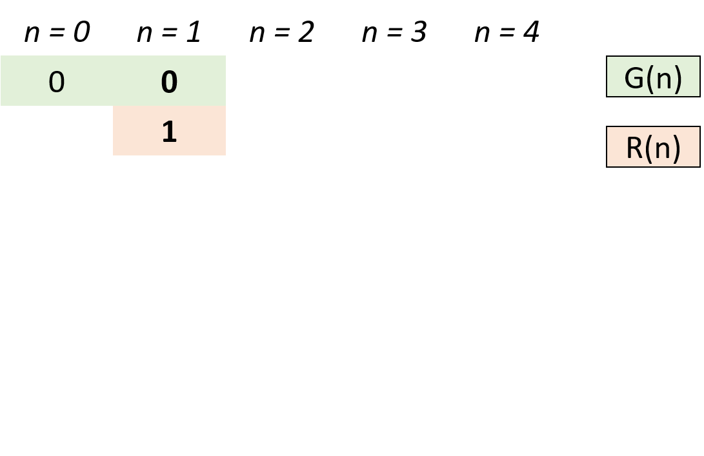
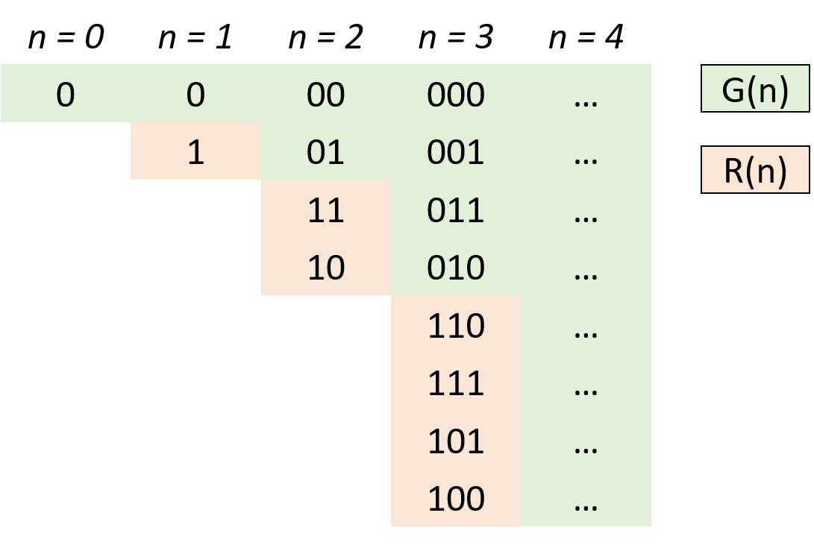

> 原文链接: https://leetcode-cn.com/problems/gray-code


## 英文原文
<div><p>An <strong>n-bit gray code sequence</strong> is a sequence of <code>2<sup>n</sup></code> integers where:</p>

<ul>
	<li>Every integer is in the <strong>inclusive</strong> range <code>[0, 2<sup>n</sup> - 1]</code>,</li>
	<li>The first integer is <code>0</code>,</li>
	<li>An integer appears <strong>no more than once</strong> in the sequence,</li>
	<li>The binary representation of every pair of <strong>adjacent</strong> integers differs by <strong>exactly one bit</strong>, and</li>
	<li>The binary representation of the <strong>first</strong> and <strong>last</strong> integers differs by <strong>exactly one bit</strong>.</li>
</ul>

<p>Given an integer <code>n</code>, return <em>any valid <strong>n-bit gray code sequence</strong></em>.</p>

<p>&nbsp;</p>
<p><strong>Example 1:</strong></p>

<pre>
<strong>Input:</strong> n = 2
<strong>Output:</strong> [0,1,3,2]
<strong>Explanation:</strong>
The binary representation of [0,1,3,2] is [00,01,11,10].
- 0<u>0</u> and 0<u>1</u> differ by one bit
- <u>0</u>1 and <u>1</u>1 differ by one bit
- 1<u>1</u> and 1<u>0</u> differ by one bit
- <u>1</u>0 and <u>0</u>0 differ by one bit
[0,2,3,1] is also a valid gray code sequence, whose binary representation is [00,10,11,01].
- <u>0</u>0 and <u>1</u>0 differ by one bit
- 1<u>0</u> and 1<u>1</u> differ by one bit
- <u>1</u>1 and <u>0</u>1 differ by one bit
- 0<u>1</u> and 0<u>0</u> differ by one bit
</pre>

<p><strong>Example 2:</strong></p>

<pre>
<strong>Input:</strong> n = 1
<strong>Output:</strong> [0,1]
</pre>

<p>&nbsp;</p>
<p><strong>Constraints:</strong></p>

<ul>
	<li><code>1 &lt;= n &lt;= 16</code></li>
</ul>
</div>

## 中文题目
<div><strong>n 位格雷码序列</strong> 是一个由 <code>2<sup>n</sup></code> 个整数组成的序列，其中：
<ul>
	<li>每个整数都在范围 <code>[0, 2<sup>n</sup> - 1]</code> 内（含 <code>0</code> 和 <code>2<sup>n</sup> - 1</code>）</li>
	<li>第一个整数是 <code>0</code></li>
	<li>一个整数在序列中出现 <strong>不超过一次</strong></li>
	<li>每对 <strong>相邻</strong> 整数的二进制表示 <strong>恰好一位不同</strong> ，且</li>
	<li><strong>第一个</strong> 和 <strong>最后一个</strong> 整数的二进制表示 <strong>恰好一位不同</strong></li>
</ul>

<p>给你一个整数 <code>n</code> ，返回任一有效的 <strong>n 位格雷码序列</strong> 。</p>

<p>&nbsp;</p>

<p><strong>示例 1：</strong></p>

<pre>
<strong>输入：</strong>n = 2
<strong>输出：</strong>[0,1,3,2]
<strong>解释：</strong>
[0,1,3,2] 的二进制表示是 [00,01,11,10] 。
- 0<strong><em>0</em></strong> 和 0<em><strong>1</strong></em> 有一位不同
- <em><strong>0</strong></em>1 和 <em><strong>1</strong></em>1 有一位不同
- 1<em><strong>1</strong></em> 和 1<em><strong>0</strong></em> 有一位不同
- <em><strong>1</strong></em>0 和 <em><strong>0</strong></em>0 有一位不同
[0,2,3,1] 也是一个有效的格雷码序列，其二进制表示是 [00,10,11,01] 。
- <em><strong>0</strong></em>0 和 <em><strong>1</strong></em>0 有一位不同
- 1<em><strong>0</strong></em> 和 1<em><strong>1</strong></em> 有一位不同
- <em><strong>1</strong></em>1 和 <em><strong>0</strong></em>1 有一位不同
- 0<em><strong>1</strong></em> 和 0<em><strong>0</strong></em> 有一位不同
</pre>

<p><strong>示例 2：</strong></p>

<pre>
<strong>输入：</strong>n = 1
<strong>输出：</strong>[0,1]
</pre>

<p>&nbsp;</p>

<p><strong>提示：</strong></p>

<ul>
	<li><code>1 &lt;= n &lt;= 16</code></li>
</ul>
</div>

## 通过代码
<RecoDemo>
</RecoDemo>


## 高赞题解
#### 思路：

- 设 $n$ 阶格雷码集合为 $G(n)$，则 $G(n+1)$ 阶格雷码为：

    - 给 $G(n)$ 阶格雷码每个元素二进制形式前面添加 $0$，得到 $G'(n)$；

    - 设 $G(n)$ 集合倒序（镜像）为 $R(n)$，给 $R(n)$ 每个元素二进制形式前面添加 $1$，得到 $R'(n)$；

    - $G(n+1) = G'(n) ∪ R'(n)$ 拼接两个集合即可得到下一阶格雷码。

- 根据以上规律，可从 $0$ 阶格雷码推导致任何阶格雷码。

- 代码解析：

    - 由于最高位前默认为 $0$，因此 $G'(n) = G(n)$，只需在 `res`(即 $G(n)$ )后添加 $R'(n)$ 即可；

    - 计算 $R'(n)$：执行 `head = 1 << i` 计算出对应位数，以给 $R(n)$ 前添加 $1$ 得到对应 $R'(n)$；

    - 倒序遍历 `res`(即 $G(n)$ )：依次求得 $R'(n)$ 各元素添加至 `res` 尾端，遍历完成后 `res`(即 $G(n+1)$)。


#### 图解：

<,,,>


#### 代码：

```Python []

class Solution:

    def grayCode(self, n: int) -> List[int]:

        res, head = [0], 1

        for i in range(n):

            for j in range(len(res) - 1, -1, -1):

                res.append(head + res[j])

            head <<= 1

        return res

```

```Java []

class Solution {

    public List<Integer> grayCode(int n) {

        List<Integer> res = new ArrayList<Integer>() {{ add(0); }};

        int head = 1;

        for (int i = 0; i < n; i++) {

            for (int j = res.size() - 1; j >= 0; j--)

                res.add(head + res.get(j));

            head <<= 1;

        }

        return res;

    }

}

```

## 统计信息
| 通过次数 | 提交次数 | AC比率 |
| :------: | :------: | :------: |
|    62899    |    88306    |   71.2%   |

## 提交历史
| 提交时间 | 提交结果 | 执行时间 |  内存消耗  | 语言 |
| :------: | :------: | :------: | :--------: | :--------: |


## 相似题目
|                             题目                             | 难度 |
| :----------------------------------------------------------: | :---------: |
| [1比特与2比特字符](https://leetcode-cn.com/problems/1-bit-and-2-bit-characters/) | 简单|
