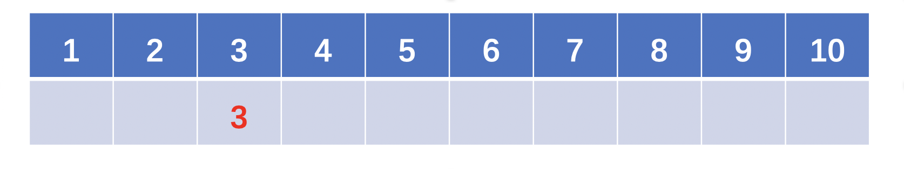
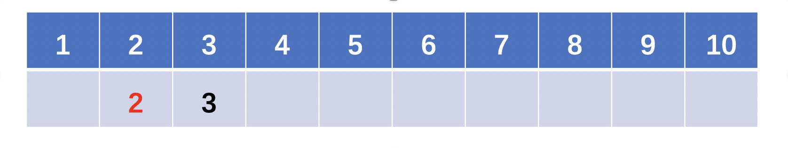
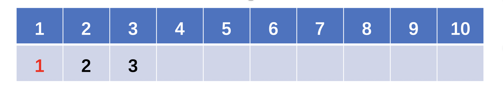
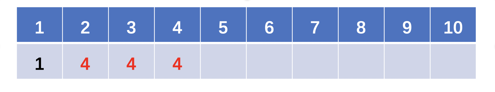
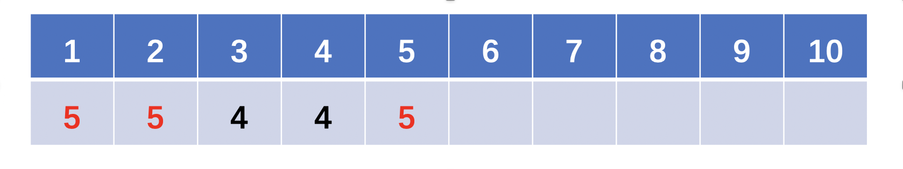
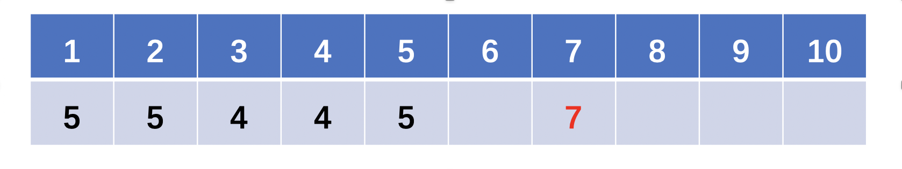

> 原文链接: https://leetcode-cn.com/problems/minimum-increment-to-make-array-unique


## 英文原文
<div><p>You are given an integer array <code>nums</code>. In one move, you can pick an index <code>i</code> where <code>0 &lt;= i &lt; nums.length</code> and increment <code>nums[i]</code> by <code>1</code>.</p>

<p>Return <em>the minimum number of moves to make every value in </em><code>nums</code><em> <strong>unique</strong></em>.</p>

<p>&nbsp;</p>
<p><strong>Example 1:</strong></p>

<pre>
<strong>Input:</strong> nums = [1,2,2]
<strong>Output:</strong> 1
<strong>Explanation:</strong> After 1 move, the array could be [1, 2, 3].
</pre>

<p><strong>Example 2:</strong></p>

<pre>
<strong>Input:</strong> nums = [3,2,1,2,1,7]
<strong>Output:</strong> 6
<strong>Explanation:</strong> After 6 moves, the array could be [3, 4, 1, 2, 5, 7].
It can be shown with 5 or less moves that it is impossible for the array to have all unique values.
</pre>

<p>&nbsp;</p>
<p><strong>Constraints:</strong></p>

<ul>
	<li><code>1 &lt;= nums.length &lt;= 10<sup>5</sup></code></li>
	<li><code>0 &lt;= nums[i] &lt;= 10<sup>5</sup></code></li>
</ul>
</div>

## 中文题目
<div><p>给你一个整数数组 <code>nums</code> 。每次 move 操作将会选择任意一个满足 <code>0 &lt;= i &lt; nums.length</code> 的下标 <code>i</code>，并将&nbsp;<code>nums[i]</code> 递增&nbsp;<code>1</code>。</p>

<p>返回使 <code>nums</code> 中的每个值都变成唯一的所需要的最少操作次数。</p>

<div class="original__bRMd">
<div>
<p>&nbsp;</p>

<p><strong>示例 1：</strong></p>

<pre>
<strong>输入：</strong>nums = [1,2,2]
<strong>输出：</strong>1
<strong>解释：</strong>经过一次 <em>move</em> 操作，数组将变为 [1, 2, 3]。
</pre>

<p><strong>示例 2：</strong></p>

<pre>
<strong>输入：</strong>nums = [3,2,1,2,1,7]
<strong>输出：</strong>6
<strong>解释：</strong>经过 6 次 <em>move</em> 操作，数组将变为 [3, 4, 1, 2, 5, 7]。
可以看出 5 次或 5 次以下的 <em>move</em> 操作是不能让数组的每个值唯一的。</pre>
</div>
</div>

<p>&nbsp;</p>
<strong>提示：</strong>

<ul>
	<li><code>1 &lt;= nums.length &lt;= 10<sup>5</sup></code></li>
	<li><code>0 &lt;= nums[i] &lt;= 10<sup>5</sup></code></li>
</ul>
</div>

## 通过代码
<RecoDemo>
</RecoDemo>


## 高赞题解

#### 方法一、排序 $O(nlogn)$
逻辑：先排序，再依次遍历数组元素，若当前元素小于等于它前一个元素，则将其变为前一个数 +1。
```Java []
class Solution {
    public int minIncrementForUnique(int[] A) {
        // 先排序
        Arrays.sort(A);
        int move = 0;
        // 遍历数组，若当前元素小于等于它的前一个元素，则将其变为前一个数+1
        for (int i = 1; i < A.length; i++) {
            if (A[i] <= A[i - 1]) {
                int pre = A[i];
                A[i] = A[i - 1] + 1;
                move += A[i] - pre;
            }
        }
        return move;
    }
}
```

#### 方法二、计数排序  $O(N)$
逻辑：请见注释👇
```Java []
class Solution {
    public int minIncrementForUnique(int[] A) {
        // counter数组统计每个数字的个数。
        //（这里为了防止下面遍历counter的时候每次都走到40000，所以设置了一个max，这个数据量不设也行，再额外设置min也行）
        int[] counter = new int[40001];
        int max = -1;
        for (int num: A) {
            counter[num]++;
            max = Math.max(max, num);
        }
        
        // 遍历counter数组，若当前数字的个数cnt大于1个，则只留下1个，其他的cnt-1个后移
        int move = 0;
        for (int num = 0; num <= max; num++) {
            if (counter[num] > 1) {
                int d = counter[num] - 1;
                move += d;
                counter[num + 1] += d;
            }
        }
        // 最后, counter[max+1]里可能会有从counter[max]后移过来的，counter[max+1]里只留下1个，其它的d个后移。
        // 设 max+1 = x，那么后面的d个数就是[x+1,x+2,x+3,...,x+d],
        // 因此操作次数是[1,2,3,...,d],用求和公式求和。
        int d = counter[max + 1] - 1;
        move += (1 + d) * d / 2;
        return move;
    }
}
```

#### 方法三、线性探测法 $O(N)$ （含路径压缩）

这道题换句话说，就是需要把原数组映射到一个地址不冲突的区域，映射后的地址不小于原数组对应的元素。
比如 `[3, 2, 1, 2, 1, 7]` 就映射成了 `[3, 2, 1, 4, 5, 7]`。

我想了下，这道题目其实和**解决 hash 冲突的线性探测法**比较相似！
如果地址冲突了，会探测它的下一个位置，如果下一个位置还是冲突，继续向后看，直到第一个不冲突的位置为止。

**关键点：**因为直接线性探测可能会由于冲突导致反复探测耗时太长，因此我们可以考虑探测的过程中进行**路径压缩**。
**怎么路径压缩呢？就是经过某条路径最终探测到一个空位置 x 后，将这条路径上的值都变成空位置所在的下标 x，那么假如下次探测的点又是这条路径上的点，则可以直接跳转到这次探测到的空位置 x，从 x 开始继续探测**。

下面用样例2：`[3, 2, 1, 2, 1, 7]`，来模拟一遍线性探测的过程。

**step 1: 插入 3：**


因为 3 的位置是空的，所以直接放入 3 即可。（此时数组变成了上图，红色表示本次的更改）

**step 2: 插入 2：**


因为 2 的位置是空的，所以直接放入 2 即可。（此时数组变成了上图，红色表示本次的更改）

**step 3: 插入 1：**


因为 1 的位置是空的，所以直接放入 1 即可。（此时数组变成了上图，红色表示本次的更改）

**step 4: 插入 2：**

此时我们发现 2 的位置已经有值了，于是继续向后探测，直到找到空位 4，于是 2 映射到了 4。
并且！！我们要对刚刚走过的路径 2->3->4 进行压缩，即将他们的值都设置为本次探测到的空位 4(那么下次探测就可以直接从 4 往后找了)。
（此时数组变成了上图，红色表示本次的更改）

**step 5: 插入 1：**


此时我们发现1的位置已经有值了，于是向后探测，探测到了 2，发现 2 的位置也有值了，但是由于 2 在上次的过程中存了上次的空位 4，所以我们直接跳转到 4+1 即从 5 开始探测就行了（而不需要重复走一遍 2->3->4 这条路径喽！），此时我们发现 5 是个空位，因此将 1 映射到 5，并且对与刚刚走过的路径 1->2->5 进行路径压缩即使其都映射到 5！
（此时数组变成了上图，红色表示本次的更改）

**step 6: 插入 7：**


因为 7 的位置是空的，所以直接放入 7 即可。（此时数组变成了上图，红色表示本次的更改）


以下是代码实现，耗时只有 11ms
```Java []
class Solution {
    int[] pos = new int [80000];
    public int minIncrementForUnique(int[] A) {
        Arrays.fill(pos, -1); // -1表示空位
        int move = 0;
        // 遍历每个数字a对其寻地址得到位置b, b比a的增量就是操作数。
        for (int a: A) {
            int b = findPos(a); 
            move += b - a;
        }
        return move;
    }
    
    // 线性探测寻址（含路径压缩）
    private int findPos(int a) {
        int b = pos[a];
        // 如果a对应的位置pos[a]是空位，直接放入即可。
        if (b == -1) { 
            pos[a] = a;
            return a;
        }
        // 否则向后寻址
        // 因为pos[a]中标记了上次寻址得到的空位，因此从pos[a]+1开始寻址就行了（不需要从a+1开始）。
        b = findPos(b + 1); 
        pos[a] = b; // 寻址后的新空位要重新赋值给pos[a]哦，路径压缩就是体现在这里。
        return b;
    }
}

```


## 统计信息
| 通过次数 | 提交次数 | AC比率 |
| :------: | :------: | :------: |
|    36176    |    74594    |   48.5%   |

## 提交历史
| 提交时间 | 提交结果 | 执行时间 |  内存消耗  | 语言 |
| :------: | :------: | :------: | :--------: | :--------: |
