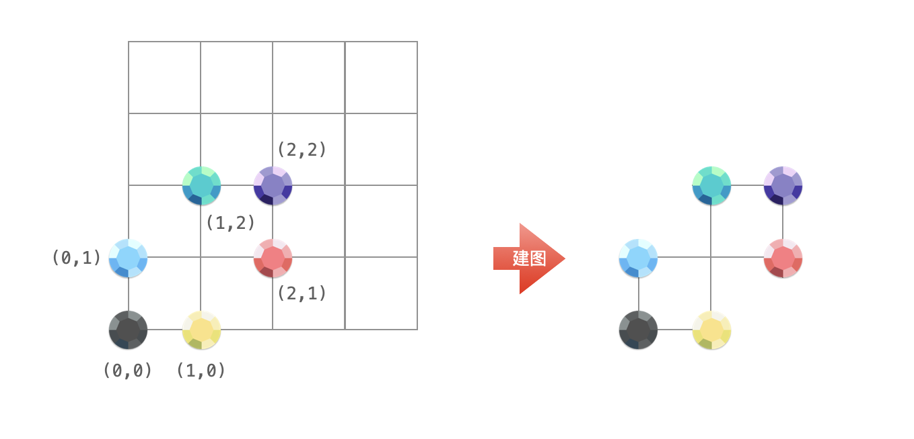

> 原文链接: https://leetcode-cn.com/problems/most-stones-removed-with-same-row-or-column


## 英文原文
<div><p>On a 2D plane, we place <code>n</code> stones at some integer coordinate points. Each coordinate point may have at most one stone.</p>

<p>A stone can be removed if it shares either <strong>the same row or the same column</strong> as another stone that has not been removed.</p>

<p>Given an array <code>stones</code> of length <code>n</code> where <code>stones[i] = [x<sub>i</sub>, y<sub>i</sub>]</code> represents the location of the <code>i<sup>th</sup></code> stone, return <em>the largest possible number of stones that can be removed</em>.</p>

<p>&nbsp;</p>
<p><strong>Example 1:</strong></p>

<pre>
<strong>Input:</strong> stones = [[0,0],[0,1],[1,0],[1,2],[2,1],[2,2]]
<strong>Output:</strong> 5
<strong>Explanation:</strong> One way to remove 5 stones is as follows:
1. Remove stone [2,2] because it shares the same row as [2,1].
2. Remove stone [2,1] because it shares the same column as [0,1].
3. Remove stone [1,2] because it shares the same row as [1,0].
4. Remove stone [1,0] because it shares the same column as [0,0].
5. Remove stone [0,1] because it shares the same row as [0,0].
Stone [0,0] cannot be removed since it does not share a row/column with another stone still on the plane.
</pre>

<p><strong>Example 2:</strong></p>

<pre>
<strong>Input:</strong> stones = [[0,0],[0,2],[1,1],[2,0],[2,2]]
<strong>Output:</strong> 3
<strong>Explanation:</strong> One way to make 3 moves is as follows:
1. Remove stone [2,2] because it shares the same row as [2,0].
2. Remove stone [2,0] because it shares the same column as [0,0].
3. Remove stone [0,2] because it shares the same row as [0,0].
Stones [0,0] and [1,1] cannot be removed since they do not share a row/column with another stone still on the plane.
</pre>

<p><strong>Example 3:</strong></p>

<pre>
<strong>Input:</strong> stones = [[0,0]]
<strong>Output:</strong> 0
<strong>Explanation:</strong> [0,0] is the only stone on the plane, so you cannot remove it.
</pre>

<p>&nbsp;</p>
<p><strong>Constraints:</strong></p>

<ul>
	<li><code>1 &lt;= stones.length &lt;= 1000</code></li>
	<li><code>0 &lt;= x<sub>i</sub>, y<sub>i</sub> &lt;= 10<sup>4</sup></code></li>
	<li>No two stones are at the same coordinate point.</li>
</ul>
</div>

## 中文题目
<div><p><code>n</code> 块石头放置在二维平面中的一些整数坐标点上。每个坐标点上最多只能有一块石头。</p>

<p>如果一块石头的 <strong>同行或者同列</strong> 上有其他石头存在，那么就可以移除这块石头。</p>

<p>给你一个长度为 <code>n</code> 的数组 <code>stones</code> ，其中 <code>stones[i] = [x<sub>i</sub>, y<sub>i</sub>]</code> 表示第 <code>i</code> 块石头的位置，返回 <strong>可以移除的石子</strong> 的最大数量。</p>

<p> </p>

<p><strong>示例 1：</strong></p>

<pre>
<strong>输入：</strong>stones = [[0,0],[0,1],[1,0],[1,2],[2,1],[2,2]]
<strong>输出：</strong>5
<strong>解释：</strong>一种移除 5 块石头的方法如下所示：
1. 移除石头 [2,2] ，因为它和 [2,1] 同行。
2. 移除石头 [2,1] ，因为它和 [0,1] 同列。
3. 移除石头 [1,2] ，因为它和 [1,0] 同行。
4. 移除石头 [1,0] ，因为它和 [0,0] 同列。
5. 移除石头 [0,1] ，因为它和 [0,0] 同行。
石头 [0,0] 不能移除，因为它没有与另一块石头同行/列。</pre>

<p><strong>示例 2：</strong></p>

<pre>
<strong>输入：</strong>stones = [[0,0],[0,2],[1,1],[2,0],[2,2]]
<strong>输出：</strong>3
<strong>解释：</strong>一种移除 3 块石头的方法如下所示：
1. 移除石头 [2,2] ，因为它和 [2,0] 同行。
2. 移除石头 [2,0] ，因为它和 [0,0] 同列。
3. 移除石头 [0,2] ，因为它和 [0,0] 同行。
石头 [0,0] 和 [1,1] 不能移除，因为它们没有与另一块石头同行/列。</pre>

<p><strong>示例 3：</strong></p>

<pre>
<strong>输入：</strong>stones = [[0,0]]
<strong>输出：</strong>0
<strong>解释：</strong>[0,0] 是平面上唯一一块石头，所以不可以移除它。</pre>

<p> </p>

<p><strong>提示：</strong></p>

<ul>
	<li><code>1 <= stones.length <= 1000</code></li>
	<li><code>0 <= x<sub>i</sub>, y<sub>i</sub> <= 10<sup>4</sup></code></li>
	<li>不会有两块石头放在同一个坐标点上</li>
</ul>
</div>

## 通过代码
<RecoDemo>
</RecoDemo>


## 官方题解
### 📺 视频讲解 

>力扣君温馨小贴士：觉得视频时间长的扣友，可以在视频右下角的「设置」按钮处选择 1.5 倍速或者 2 倍速观看。


### 📖 文字解析

把二维坐标平面上的石头想象成图的顶点，如果两个石头横坐标相同、或者纵坐标相同，在它们之间形成一条边。



根据可以移除石头的规则：如果一块石头的 **同行或者同列** 上有其他石头存在，那么就可以移除这块石头。可以发现：**一定可以把一个连通图里的所有顶点根据这个规则删到只剩下一个顶点**。

为什么这么说呢？既然这些顶点在一个连通图里，可以通过遍历的方式（深度优先遍历或者广度优先遍历）遍历到这个连通图的所有顶点。那么就可以按照遍历的方式 **逆向** 移除石头，最后只剩下一块石头。所以：**最多可以移除的石头的个数 = 所有石头的个数 - 连通分量的个数**。

题目没有让我们给出具体移除石头的方案，可以考虑使用并查集。

### 方法：并查集

删到最后，留在图中的顶点一定位于不同的行和不同的列。因此，并查集里的元素是 **描述「横坐标」和「纵坐标」的数值**。因此我们需要遍历数组 `stones`，将每个 `stone` 的横坐标和纵坐标在并查集中进行合并。理解合并的语义十分重要。

#### 「合并」的语义

「合并」的语义是：所有横坐标为 `x` 的石头和所有纵坐标为 `y` 的石头都属于同一个连通分量。

#### 并查集里如何区分横纵坐标

然而会遇到这样一个问题：石头的位置是「有序数对（二维）」，并查集的底层是「一维数组」，我们在并查集里应该如何区分横纵坐标呢？

例如：如果一块石头的坐标为 `[3, 3]` ，那么所有横坐标为 `3` 的石头和所有纵坐标为 `3` 的石头都在一个连通分量中，但是我们需要在并查集里区分「横坐标」和「纵坐标」，它们在并查集里不能相等，根据题目的提示 $0 <= x_i, y_i <= 10^4$，可以把其中一个坐标 **映射** 到另一个与 `[0, 10000]` 不重合的区间，可以的做法是把横坐标全部减去 $10001$ 或者全部加上 $10001$，或者按位取反（`[0, 10000]` 里的 $32$ 位整数，最高位变成 $1$ 以后，一定不在 `[0, 10000]` 里）。

在并查集里我们需要维护连通分量的个数，新创建顶点的时候连通分量加 $1$；合并不在同一个连通分量中的两个并查集的时候，连通分量减 $1$。

**参考代码**：


```Java []
import java.util.HashMap;
import java.util.Map;

public class Solution {

    public int removeStones(int[][] stones) {
        UnionFind unionFind = new UnionFind();

        for (int[] stone : stones) {
            // 下面这三种写法任选其一
            // unionFind.union(~stone[0], stone[1]);
            // unionFind.union(stone[0] - 10001, stone[1]);
            unionFind.union(stone[0] + 10001, stone[1]);
        }
        return stones.length - unionFind.getCount();
    }

    private class UnionFind {

        private Map<Integer, Integer> parent;
        private int count;

        public UnionFind() {
            this.parent = new HashMap<>();
            this.count = 0;
        }

        public int getCount() {
            return count;
        }

        public int find(int x) {
            if (!parent.containsKey(x)) {
                parent.put(x, x);
                // 并查集集中新加入一个结点，结点的父亲结点是它自己，所以连通分量的总数 +1
                count++;
            }

            if (x != parent.get(x)) {
                parent.put(x, find(parent.get(x)));
            }
            return parent.get(x);
        }

        public void union(int x, int y) {
            int rootX = find(x);
            int rootY = find(y);
            if (rootX == rootY) {
                return;
            }

            parent.put(rootX, rootY);
            // 两个连通分量合并成为一个，连通分量的总数 -1
            count--;
        }
    }
}
```


**复杂度分析**：


- 时间复杂度：$O(n \log(A))$，其中 $n$ 为石子的数量，$A$ 是数组 `stones` 里横纵坐标不同值的总数；
- 空间复杂度：$O(A)$，并查集的底层哈希表的长度为 $A$。


## 统计信息
| 通过次数 | 提交次数 | AC比率 |
| :------: | :------: | :------: |
|    26569    |    43390    |   61.2%   |

## 提交历史
| 提交时间 | 提交结果 | 执行时间 |  内存消耗  | 语言 |
| :------: | :------: | :------: | :--------: | :--------: |
