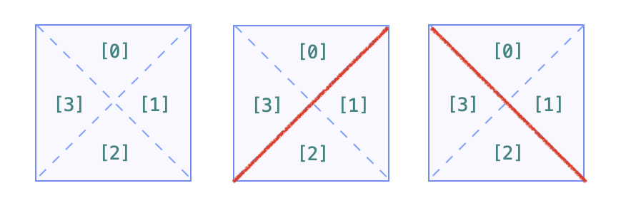

> 原文链接: https://leetcode-cn.com/problems/regions-cut-by-slashes


## 英文原文
<div><p>An <code>n x n</code> grid is composed of <code>1 x 1</code> squares where each <code>1 x 1</code> square consists of a <code>&#39;/&#39;</code>, <code>&#39;\&#39;</code>, or blank space <code>&#39; &#39;</code>. These characters divide the square into contiguous regions.</p>

<p>Given the grid <code>grid</code> represented as a string array, return <em>the number of regions</em>.</p>

<p>Note that backslash characters are escaped, so a <code>&#39;\&#39;</code> is represented as <code>&#39;\\&#39;</code>.</p>

<p>&nbsp;</p>
<p><strong>Example 1:</strong></p>

<pre>
<strong>Input:</strong> grid = [&quot; /&quot;,&quot;/ &quot;]
<strong>Output:</strong> 2
</pre>

<p><strong>Example 2:</strong></p>

<pre>
<strong>Input:</strong> grid = [&quot; /&quot;,&quot;  &quot;]
<strong>Output:</strong> 1
</pre>

<p><strong>Example 3:</strong></p>

<pre>
<strong>Input:</strong> grid = [&quot;\\/&quot;,&quot;/\\&quot;]
<strong>Output:</strong> 4
<strong>Explanation: </strong>(Recall that because \ characters are escaped, &quot;\\/&quot; refers to \/, and &quot;/\\&quot; refers to /\.)
</pre>

<p><strong>Example 4:</strong></p>

<pre>
<strong>Input:</strong> grid = [&quot;/\\&quot;,&quot;\\/&quot;]
<strong>Output:</strong> 5
<strong>Explanation: </strong>(Recall that because \ characters are escaped, &quot;\\/&quot; refers to \/, and &quot;/\\&quot; refers to /\.)
</pre>

<p><strong>Example 5:</strong></p>

<pre>
<strong>Input:</strong> grid = [&quot;//&quot;,&quot;/ &quot;]
<strong>Output:</strong> 3
</pre>

<p>&nbsp;</p>
<p><strong>Constraints:</strong></p>

<ul>
	<li><code>n == grid.length</code></li>
	<li><code>n == grid[i].length</code></li>
	<li><code>1 &lt;= n &lt;= 30</code></li>
	<li><code>grid[i][j]</code> is either <code>&#39;/&#39;</code>, <code>&#39;\&#39;</code>, or <code>&#39; &#39;</code>.</li>
</ul>
</div>

## 中文题目
<div><p>在由 1 x 1 方格组成的 N x N 网格&nbsp;<code>grid</code> 中，每个 1 x 1&nbsp;方块由 <code>/</code>、<code>\</code> 或空格构成。这些字符会将方块划分为一些共边的区域。</p>

<p>（请注意，反斜杠字符是转义的，因此 <code>\</code> 用 <code>&quot;\\&quot;</code>&nbsp;表示。）。</p>

<p>返回区域的数目。</p>

<p>&nbsp;</p>

<ol>
</ol>

<p><strong>示例 1：</strong></p>

<pre><strong>输入：
</strong>[
&nbsp; &quot; /&quot;,
&nbsp; &quot;/ &quot;
]
<strong>输出：</strong>2
<strong>解释：</strong>2x2 网格如下：
</pre>

<p><strong>示例 2：</strong></p>

<pre><strong>输入：
</strong>[
&nbsp; &quot; /&quot;,
&nbsp; &quot;  &quot;
]
<strong>输出：</strong>1
<strong>解释：</strong>2x2 网格如下：
</pre>

<p><strong>示例 3：</strong></p>

<pre><strong>输入：
</strong>[
&nbsp; &quot;\\/&quot;,
&nbsp; &quot;/\\&quot;
]
<strong>输出：</strong>4
<strong>解释：</strong>（回想一下，因为 \ 字符是转义的，所以 &quot;\\/&quot; 表示 \/，而 &quot;/\\&quot; 表示 /\。）
2x2 网格如下：
</pre>

<p><strong>示例 4：</strong></p>

<pre><strong>输入：
</strong>[
&nbsp; &quot;/\\&quot;,
&nbsp; &quot;\\/&quot;
]
<strong>输出：</strong>5
<strong>解释：</strong>（回想一下，因为 \ 字符是转义的，所以 &quot;/\\&quot; 表示 /\，而 &quot;\\/&quot; 表示 \/。）
2x2 网格如下：
</pre>

<p><strong>示例 5：</strong></p>

<pre><strong>输入：
</strong>[
&nbsp; &quot;//&quot;,
&nbsp; &quot;/ &quot;
]
<strong>输出：</strong>3
<strong>解释：</strong>2x2 网格如下：

</pre>

<p>&nbsp;</p>

<p><strong>提示：</strong></p>

<ol>
	<li><code>1 &lt;= grid.length == grid[0].length &lt;= 30</code></li>
	<li><code>grid[i][j]</code> 是&nbsp;<code>&#39;/&#39;</code>、<code>&#39;\&#39;</code>、或&nbsp;<code>&#39; &#39;</code>。</li>
</ol>
</div>

## 通过代码
<RecoDemo>
</RecoDemo>


## 官方题解
### 📺 视频讲解 

>力扣君温馨小贴士：觉得视频时间长的扣友，可以在视频右下角的「设置」按钮处选择 1.5 倍速或者 2 倍速观看。


### 📖 文字解析

这是一个关于连通性的问题，让我们求解连通分量的个数，解决这个问题没有特别的技巧，根据题意 **画图分析**、稍微细心一点就可以通过系统测评。

可以用深度优先遍历（Depth First Search）、广度优先遍历（Breadth First Search）和并查集（Disjoint Sets），由于只要求计算结果，不要求给出具体的连通信息，可以使用并查集。


### 方法：并查集

「斜杠」、「反斜杠」把单元格拆分成的 2 个三角形的形态，在做合并的时候需要分类讨论。**根据「斜杠」、「反斜杠」分割的特点**，我们把一个单元格分割成逻辑上的 4 个部分。如下图所示：

{:width=500}

我们须要遍历一次输入的二维网格 `grid`，在 **单元格内** 和 **单元格间** 进行合并。

**单元格内**：

+ 如果是空格：合并 0、1、2、3；
+ 如果是斜杠：合并 0、3，合并 1、2；
+ 如果是反斜杠：合并 0、1，合并 2、3。

**单元格间**：

**把每一个单元格拆分成 4 个小三角形以后，相邻的单元格须要合并，无须分类讨论**。我们选择在遍历 `grid` 的每一个单元格的时候，分别「向右、向下」尝试合并。

{:width=300}

+ 向右：合并 1 （当前单元格）和 3（当前单元格右边 1 列的单元格），上图中红色部分；
+ 向下：合并 2 （当前单元格）和 0（当前单元格下边 1 列的单元格），上图中蓝色部分。

事实上，大家选择在遍历 `grid` 的每一个单元格的时候，分别「向左、向上」、「向左、向下」、「向右、向上」、「向右、向下」中的任何一种都可以。

合并完成以后，并查集里连通分量的个数就是题目要求的区域的个数。

**参考代码**：

```Java []
public class Solution {

    public int regionsBySlashes(String[] grid) {
        int N = grid.length;
        int size = 4 * N * N;

        UnionFind unionFind = new UnionFind(size);
        for (int i = 0; i < N; i++) {
            char[] row = grid[i].toCharArray();
            for (int j = 0; j < N; j++) {
                // 二维网格转换为一维表格，index 表示将单元格拆分成 4 个小三角形以后，编号为 0 的小三角形的在并查集中的下标
                int index = 4 * (i * N + j);
                char c = row[j];
                // 单元格内合并
                if (c == '/') {
                    // 合并 0、3，合并 1、2
                    unionFind.union(index, index + 3);
                    unionFind.union(index + 1, index + 2);
                } else if (c == '\\') {
                    // 合并 0、1，合并 2、3
                    unionFind.union(index, index + 1);
                    unionFind.union(index + 2, index + 3);
                } else {
                    unionFind.union(index, index + 1);
                    unionFind.union(index + 1, index + 2);
                    unionFind.union(index + 2, index + 3);
                }

                // 单元格间合并
                // 向右合并：1（当前）、3（右一列）
                if (j + 1 < N) {
                    unionFind.union(index + 1, 4 * (i * N + j + 1) + 3);
                }
                // 向下合并：2（当前）、0（下一行）
                if (i + 1 < N) {
                    unionFind.union(index + 2, 4 * ((i + 1) * N + j));
                }
            }
        }
        return unionFind.getCount();
    }

    private class UnionFind {

        private int[] parent;

        private int count;

        public int getCount() {
            return count;
        }

        public UnionFind(int n) {
            this.count = n;
            this.parent = new int[n];
            for (int i = 0; i < n; i++) {
                parent[i] = i;
            }
        }

        public int find(int x) {
            while (x != parent[x]) {
                parent[x] = parent[parent[x]];
                x = parent[x];
            }
            return x;
        }

        public void union(int x, int y) {
            int rootX = find(x);
            int rootY = find(y);
            if (rootX == rootY) {
                return;
            }

            parent[rootX] = rootY;
            count--;
        }
    }
}
```

**复杂度分析**

* 时间复杂度：$O(N^2 \log N)$，其中 $N$ 是网格的长度，$O(N^2  \log N^2) = O(2N^2 \log N)$；
* 空间复杂度：$O(N^2)$。

---

本题采用了「先拆后合」的策略，避免了相对复杂的分类讨论。

## 统计信息
| 通过次数 | 提交次数 | AC比率 |
| :------: | :------: | :------: |
|    19956    |    26825    |   74.4%   |

## 提交历史
| 提交时间 | 提交结果 | 执行时间 |  内存消耗  | 语言 |
| :------: | :------: | :------: | :--------: | :--------: |
