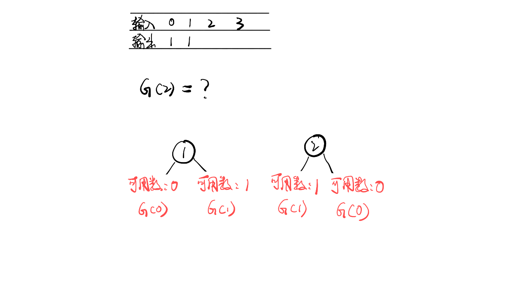
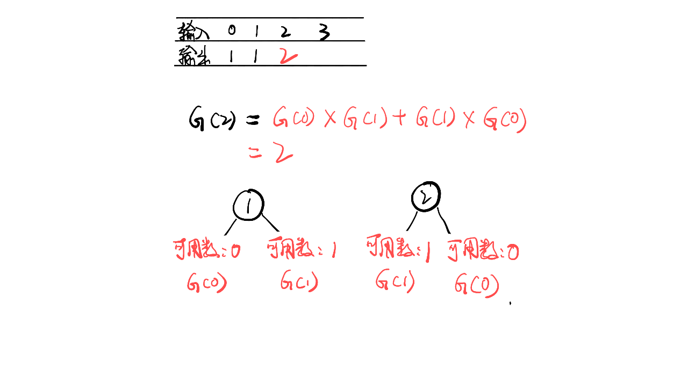
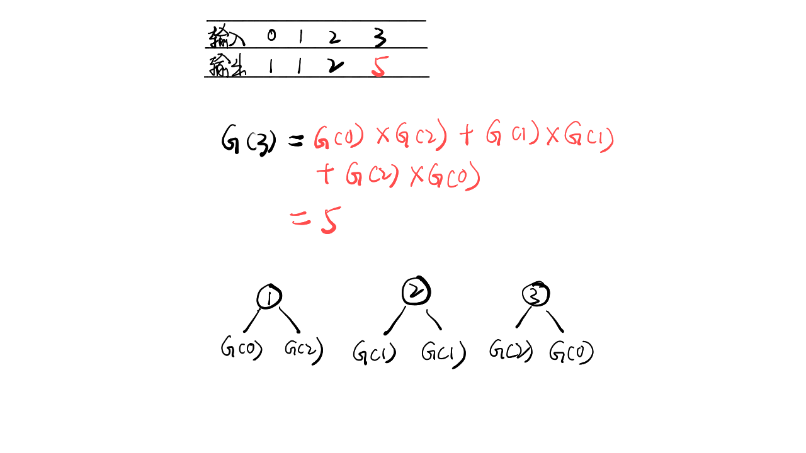

> 原文链接: https://leetcode-cn.com/problems/unique-binary-search-trees


## 英文原文
<div><p>Given an integer <code>n</code>, return <em>the number of structurally unique <strong>BST&#39;</strong>s (binary search trees) which has exactly </em><code>n</code><em> nodes of unique values from</em> <code>1</code> <em>to</em> <code>n</code>.</p>

<p>&nbsp;</p>
<p><strong>Example 1:</strong></p>

<pre>
<strong>Input:</strong> n = 3
<strong>Output:</strong> 5
</pre>

<p><strong>Example 2:</strong></p>

<pre>
<strong>Input:</strong> n = 1
<strong>Output:</strong> 1
</pre>

<p>&nbsp;</p>
<p><strong>Constraints:</strong></p>

<ul>
	<li><code>1 &lt;= n &lt;= 19</code></li>
</ul>
</div>

## 中文题目
<div><p>给你一个整数 <code>n</code> ，求恰由 <code>n</code> 个节点组成且节点值从 <code>1</code> 到 <code>n</code> 互不相同的 <strong>二叉搜索树</strong> 有多少种？返回满足题意的二叉搜索树的种数。</p>

<p> </p>

<p><strong>示例 1：</strong></p>

<pre>
<strong>输入：</strong>n = 3
<strong>输出：</strong>5
</pre>

<p><strong>示例 2：</strong></p>

<pre>
<strong>输入：</strong>n = 1
<strong>输出：</strong>1
</pre>

<p> </p>

<p><strong>提示：</strong></p>

<ul>
	<li><code>1 <= n <= 19</code></li>
</ul>
</div>

## 通过代码
<RecoDemo>
</RecoDemo>


## 高赞题解
### 解题思路

- 标签：动态规划
- 假设 n 个节点存在二叉排序树的个数是 G (n)，令 f(i) 为以 i 为根的二叉搜索树的个数，则

$G(n) = f(1) + f(2) + f(3) + f(4) + ... + f(n)$

- 当 i 为根节点时，其左子树节点个数为 i-1 个，右子树节点为 n-i，则

$f(i) = G(i-1)*G(n-i)$

- 综合两个公式可以得到 [卡特兰数](https://baike.baidu.com/item/%E5%8D%A1%E7%89%B9%E5%85%B0%E6%95%B0 "卡特兰数") 公式

$G(n) = G(0)*G(n-1)+G(1)*(n-2)+...+G(n-1)*G(0)$

### 代码

```Java []
class Solution {
    public int numTrees(int n) {
        int[] dp = new int[n+1];
        dp[0] = 1;
        dp[1] = 1;
        
        for(int i = 2; i < n + 1; i++)
            for(int j = 1; j < i + 1; j++) 
                dp[i] += dp[j-1] * dp[i-j];
        
        return dp[n];
    }
}
```

### 画解

<,,,,,,>


想看大鹏画解更多高频面试题，欢迎阅读大鹏的 LeetBook：[《画解剑指 Offer 》](https://leetcode-cn.com/leetbook/detail/illustrate-lcof/)，O(∩_∩)O

## 统计信息
| 通过次数 | 提交次数 | AC比率 |
| :------: | :------: | :------: |
|    179137    |    256186    |   69.9%   |

## 提交历史
| 提交时间 | 提交结果 | 执行时间 |  内存消耗  | 语言 |
| :------: | :------: | :------: | :--------: | :--------: |


## 相似题目
|                             题目                             | 难度 |
| :----------------------------------------------------------: | :---------: |
| [不同的二叉搜索树 II](https://leetcode-cn.com/problems/unique-binary-search-trees-ii/) | 中等|
