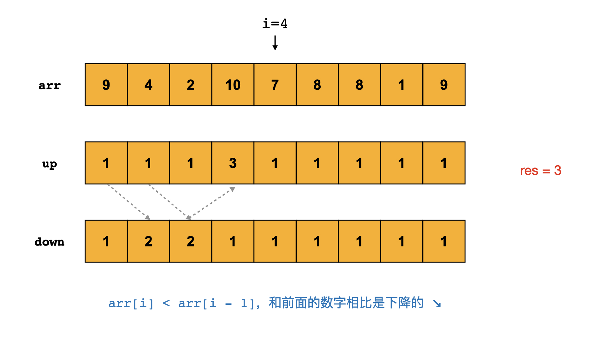

> 原文链接: https://leetcode-cn.com/problems/longest-turbulent-subarray


## 英文原文
<div><p>Given an integer array <code>arr</code>, return <em>the length of a maximum size turbulent subarray of</em> <code>arr</code>.</p>

<p>A subarray is <strong>turbulent</strong> if the comparison sign flips between each adjacent pair of elements in the subarray.</p>

<p>More formally, a subarray <code>[arr[i], arr[i + 1], ..., arr[j]]</code> of <code>arr</code> is said to be turbulent if and only if:</p>

<ul>
	<li>For <code>i &lt;= k &lt; j</code>:

	<ul>
		<li><code>arr[k] &gt; arr[k + 1]</code> when <code>k</code> is odd, and</li>
		<li><code>arr[k] &lt; arr[k + 1]</code> when <code>k</code> is even.</li>
	</ul>
	</li>
	<li>Or, for <code>i &lt;= k &lt; j</code>:
	<ul>
		<li><code>arr[k] &gt; arr[k + 1]</code> when <code>k</code> is even, and</li>
		<li><code>arr[k] &lt; arr[k + 1]</code> when <code>k</code> is odd.</li>
	</ul>
	</li>
</ul>

<p>&nbsp;</p>
<p><strong>Example 1:</strong></p>

<pre>
<strong>Input:</strong> arr = [9,4,2,10,7,8,8,1,9]
<strong>Output:</strong> 5
<strong>Explanation:</strong> arr[1] &gt; arr[2] &lt; arr[3] &gt; arr[4] &lt; arr[5]
</pre>

<p><strong>Example 2:</strong></p>

<pre>
<strong>Input:</strong> arr = [4,8,12,16]
<strong>Output:</strong> 2
</pre>

<p><strong>Example 3:</strong></p>

<pre>
<strong>Input:</strong> arr = [100]
<strong>Output:</strong> 1
</pre>

<p>&nbsp;</p>
<p><strong>Constraints:</strong></p>

<ul>
	<li><code>1 &lt;= arr.length &lt;= 4 * 10<sup>4</sup></code></li>
	<li><code>0 &lt;= arr[i] &lt;= 10<sup>9</sup></code></li>
</ul>
</div>

## 中文题目
<div><p>当 <code>A</code>&nbsp;的子数组&nbsp;<code>A[i], A[i+1], ..., A[j]</code>&nbsp;满足下列条件时，我们称其为<em>湍流子数组</em>：</p>

<ul>
	<li>若&nbsp;<code>i &lt;= k &lt; j</code>，当 <code>k</code>&nbsp;为奇数时，&nbsp;<code>A[k] &gt; A[k+1]</code>，且当 <code>k</code> 为偶数时，<code>A[k] &lt; A[k+1]</code>；</li>
	<li><strong>或 </strong>若&nbsp;<code>i &lt;= k &lt; j</code>，当 <code>k</code> 为偶数时，<code>A[k] &gt; A[k+1]</code>&nbsp;，且当 <code>k</code>&nbsp;为奇数时，&nbsp;<code>A[k] &lt; A[k+1]</code>。</li>
</ul>

<p>也就是说，如果比较符号在子数组中的每个相邻元素对之间翻转，则该子数组是湍流子数组。</p>

<p>返回 <code>A</code> 的最大湍流子数组的<strong>长度</strong>。</p>

<p>&nbsp;</p>

<p><strong>示例 1：</strong></p>

<pre><strong>输入：</strong>[9,4,2,10,7,8,8,1,9]
<strong>输出：</strong>5
<strong>解释：</strong>(A[1] &gt; A[2] &lt; A[3] &gt; A[4] &lt; A[5])
</pre>

<p><strong>示例 2：</strong></p>

<pre><strong>输入：</strong>[4,8,12,16]
<strong>输出：</strong>2
</pre>

<p><strong>示例 3：</strong></p>

<pre><strong>输入：</strong>[100]
<strong>输出：</strong>1
</pre>

<p>&nbsp;</p>

<p><strong>提示：</strong></p>

<ol>
	<li><code>1 &lt;= A.length &lt;= 40000</code></li>
	<li><code>0 &lt;= A[i] &lt;= 10^9</code></li>
</ol>
</div>

## 通过代码
<RecoDemo>
</RecoDemo>


## 高赞题解
各位题友大家好，今天是负雪明烛坚持日更的第 **15** 天。今天力扣上的每日一题是第 978 题「最长湍流子数组」。

# 解题思路
首先我们一定要读懂题意，本题中湍流子数组的意思是：一个增长和降低互相交替的子数组，如果在坐标轴上画出来就是个波浪状数组，`↗ ↘ ↗ ↘`，即这个形状。
比如，题目给的示例 1 中的最长湍流子数组为 `[4,2,10,7,8]`，他就是增长和降低相互交替的，形状是`↘ ↗ ↘ ↗`。

## 动态规划

今天这个题目最合适的做法是动态规划。下面的解释不难，相信你可以看懂；如果有疑问就在评论区提问，我会及时解答。

动态规划首先需要我们定义状态是什么，然后根据题意，写出状态转移方程。

对于**最长连续子数组**问题，使用动态规划求解时，我们经常定义状态 `dp[i]` 为：以 `i` 位置结尾的最长连续子数组的长度，因为这个状态可以反映 `i` 位置及其前面区间的情况。下一个位置 `i + 1` 可以根据 `dp[i]` 就知道了前面的情况，再根据 `arr[i + 1]` 和 `arr[i]` 的大小关系，能更新状态 `dp[i + 1]`。

对于本题，如果只定一个状态数组是不够的，因为我们只有区分了 `i` 位置是在增长还是在降低，才能判断 `i + 1` 位置是否能续上前面的波浪。所以，我们需要定义两个状态数组，分别表示以 `i` 结尾的在增长和降低的最长湍流子数组长度。

### 状态的定义：

- 定义 `up[i]` 表示以位置 `i` 结尾的，并且 `arr[i - 1] < arr[i]` 的最长湍流子数组长度。
- 定义 `down[i]` 表示以位置 `i` 结尾的，并且 `arr[i - 1] > arr[i]` 的最长湍流子数组长度。

`up[i]` 和 `down[i]` 初始化都是 1，因为每个数字本身都是一个最小的湍流子数组。

### 状态转移方程：

- `up[i] = down[i - 1] + 1`，当 `arr[i - 1] < arr[i]`；
- `down[i] = up[i - 1] + 1`，当 `arr[i - 1] > arr[i]`；

解释：湍流子数组的增长和降低是交替的。

文字的解释会显得苍白和啰嗦，大家直接看图吧。


根据评论区的大家反馈，特把每个操作过程放在这里，自己点击观看：

<,,,,,,,,,,,,,,,,,,,,,,>


除了动态规划之外，本题还可以用双指针求解。大家可以参考官方题解。

## 代码

使用 Python2 写的代码如下。


```python
class Solution(object):
    def maxTurbulenceSize(self, arr):
        """
        :type arr: List[int]
        :rtype: int
        """
        N = len(arr)
        up = [1] * N
        down = [1] * N
        res = 1
        for i in range(1, N):
            if arr[i - 1] < arr[i]:
                up[i] = down[i - 1] + 1
                down[i] = 1
            elif arr[i - 1] > arr[i]:
                up[i] = 1
                down[i] = up[i - 1] + 1
            else:
                up[i] = 1
                down[i] = 1
            res = max(res, max(up[i], down[i]))
        return res
```

上面的代码可以缩短成下面这样：

```python
class Solution(object):
    def maxTurbulenceSize(self, arr):
        """
        :type arr: List[int]
        :rtype: int
        """
        N = len(arr)
        up = [1] * N
        down = [1] * N
        res = 1
        for i in range(1, N):
            if arr[i - 1] < arr[i]:
                up[i] = down[i - 1] + 1
            elif arr[i - 1] > arr[i]:
                down[i] = up[i - 1] + 1
            res = max(res, max(up[i], down[i]))
        return res
```

# 刷题心得

1. 连续最长子数组问题可以用双指针和动态规划求解。
2. 本题的动态规划解法是个经典解法，学习之后可以运用到其他题目。


参考资料：
1. [最长湍流子数组](https://leetcode-cn.com/problems/longest-turbulent-subarray/solution/zui-chang-tuan-liu-zi-shu-zu-by-leetcode-t4d8/)
2. [🎦 最长湍流子数组](https://leetcode-cn.com/problems/longest-turbulent-subarray/solution/zui-chang-tuan-liu-zi-shu-zu-by-leetcode-zqoq/)
3. [花花酱](https://zxi.mytechroad.com/blog/dynamic-programming/leetcode-978-longest-turbulent-subarray/)


OK，以上就是 [@负雪明烛](/u/fuxuemingzhu/) 写的今天题解的全部内容了，如果你觉得有帮助的话，**求赞、求关注、求收藏**。我们明天再见！

## 统计信息
| 通过次数 | 提交次数 | AC比率 |
| :------: | :------: | :------: |
|    44011    |    92969    |   47.3%   |

## 提交历史
| 提交时间 | 提交结果 | 执行时间 |  内存消耗  | 语言 |
| :------: | :------: | :------: | :--------: | :--------: |


## 相似题目
|                             题目                             | 难度 |
| :----------------------------------------------------------: | :---------: |
| [最大子数组和](https://leetcode-cn.com/problems/maximum-subarray/) | 简单|
