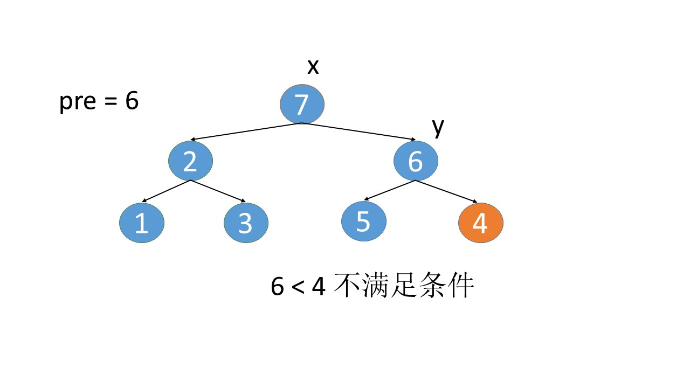
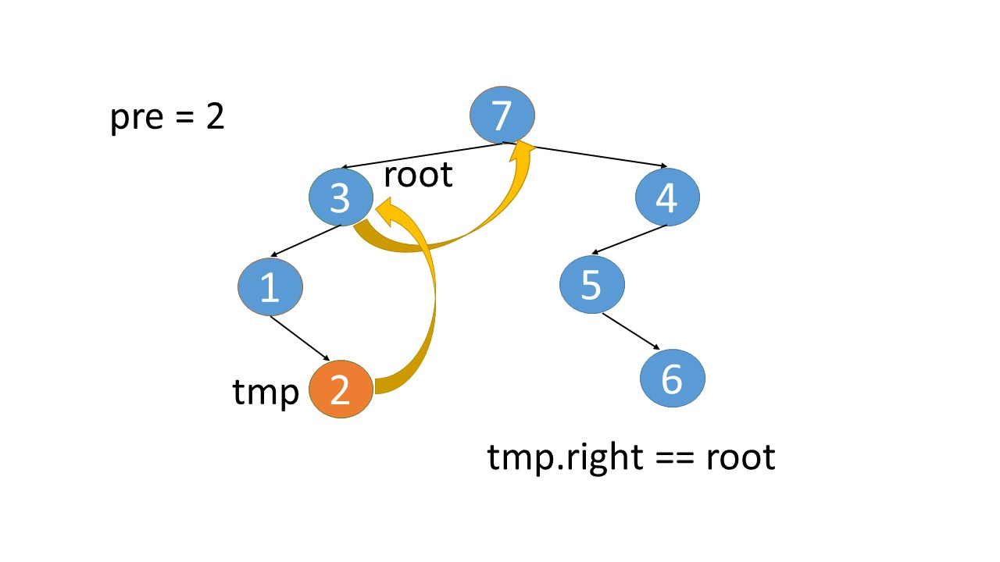

> 原文链接: https://leetcode-cn.com/problems/recover-binary-search-tree


## 英文原文
<div><p>You are given the <code>root</code> of a binary search tree (BST), where the values of <strong>exactly</strong> two nodes of the tree were swapped by mistake. <em>Recover the tree without changing its structure</em>.</p>

<p>&nbsp;</p>
<p><strong>Example 1:</strong></p>

<pre>
<strong>Input:</strong> root = [1,3,null,null,2]
<strong>Output:</strong> [3,1,null,null,2]
<strong>Explanation:</strong> 3 cannot be a left child of 1 because 3 &gt; 1. Swapping 1 and 3 makes the BST valid.
</pre>

<p><strong>Example 2:</strong></p>

<pre>
<strong>Input:</strong> root = [3,1,4,null,null,2]
<strong>Output:</strong> [2,1,4,null,null,3]
<strong>Explanation:</strong> 2 cannot be in the right subtree of 3 because 2 &lt; 3. Swapping 2 and 3 makes the BST valid.
</pre>

<p>&nbsp;</p>
<p><strong>Constraints:</strong></p>

<ul>
	<li>The number of nodes in the tree is in the range <code>[2, 1000]</code>.</li>
	<li><code>-2<sup>31</sup> &lt;= Node.val &lt;= 2<sup>31</sup> - 1</code></li>
</ul>

<p>&nbsp;</p>
<strong>Follow up:</strong> A solution using <code>O(n)</code> space is pretty straight-forward. Could you devise a constant <code>O(1)</code> space solution?</div>

## 中文题目
<div><p>给你二叉搜索树的根节点 <code>root</code> ，该树中的两个节点被错误地交换。请在不改变其结构的情况下，恢复这棵树。</p>

<p><strong>进阶：</strong>使用 O(<em>n</em>) 空间复杂度的解法很容易实现。你能想出一个只使用常数空间的解决方案吗？</p>

<p> </p>

<p><strong>示例 1：</strong></p>

<pre>
<strong>输入：</strong>root = [1,3,null,null,2]
<strong>输出：</strong>[3,1,null,null,2]
<strong>解释：</strong>3 不能是 1 左孩子，因为 3 > 1 。交换 1 和 3 使二叉搜索树有效。
</pre>

<p><strong>示例 2：</strong></p>

<pre>
<strong>输入：</strong>root = [3,1,4,null,null,2]
<strong>输出：</strong>[2,1,4,null,null,3]
<strong>解释：</strong>2 不能在 3 的右子树中，因为 2 < 3 。交换 2 和 3 使二叉搜索树有效。</pre>

<p> </p>

<p><strong>提示：</strong></p>

<ul>
	<li>树上节点的数目在范围 <code>[2, 1000]</code> 内</li>
	<li><code>-2<sup>31</sup> <= Node.val <= 2<sup>31</sup> - 1</code></li>
</ul>
</div>

## 通过代码
<RecoDemo>
</RecoDemo>


## 高赞题解
#### 解法一
注意题目给出的条件，是 **二叉搜索树**，这就是意味着节点之间是有顺序关系的。   
如果我们把整棵树都 **遍历** 一遍，将遍历的结果保存下来，比如放到一个数组中。   
那么这个数组应该是有序的。   
   
既然是有序的那就好办了，我们将这个有序的数组遍历一遍。   
如果数组是完全有序的，那么直接返回就可以了。   
否则，我们找到顺序不一致的两个下标```i```和```j```，将```arr[i].val```和```arr[j].val```的值互换一下即可。   

{:width=400}{:align=center}


代码实现:
```Java []
class Solution {
    public void recoverTree(TreeNode root) {
        List<TreeNode> list = new ArrayList<TreeNode>();
        dfs(root,list);
        TreeNode x = null;
        TreeNode y = null;
        //扫面遍历的结果，找出可能存在错误交换的节点x和y
        for(int i=0;i<list.size()-1;++i) {
            if(list.get(i).val>list.get(i+1).val) {
                y = list.get(i+1);
                if(x==null) {
                    x = list.get(i);
                }
            }
        }
        //如果x和y不为空，则交换这两个节点值，恢复二叉搜索树
        if(x!=null && y!=null) {
            int tmp = x.val;
            x.val = y.val;
            y.val = tmp;
        }
    }

    //中序遍历二叉树，并将遍历的结果保存到list中        
    private void dfs(TreeNode node,List<TreeNode> list) {
        if(node==null) {
            return;
        }
        dfs(node.left,list);
        list.add(node);
        dfs(node.right,list);
    }
}
```
```Python []
class Solution(object):
    def recoverTree(self, root):
        nodes = []
        # 中序遍历二叉树，并将遍历的结果保存到list中        
        def dfs(root):
            if not root:
                return
            dfs(root.left)
            nodes.append(root)
            dfs(root.right)
        dfs(root)
        x = None
        y = None
        pre = nodes[0]
        # 扫面遍历的结果，找出可能存在错误交换的节点x和y
        for i in xrange(1,len(nodes)):
            if pre.val>nodes[i].val:
                y=nodes[i]
                if not x:
                    x = pre
            pre = nodes[i]
        # 如果x和y不为空，则交换这两个节点值，恢复二叉搜索树 
        if x and y:
            x.val,y.val = y.val,x.val
```


#### 解法二
解法一种，我们利用了额外的数组保存了遍历的结果，如果后面一个数比前面一个数小，那就找到了要交换的节点。  

{:width=400}{:align=center}

按照同样的思路，用中序遍历的方式遍历这颗二叉搜索树，我们再增加一个辅助的```pre```指针，记录 **上一个** 节点的值。   
如果 **当前节点的值**，小于 **上一个节点的值**，这就找到了需要交换的节点。利用这种方式，就不需要额外的数组空间了。   
详细过程请点击查看下面的幻灯片:   
      
<,,,,,,,,,,,,,,,,>


注意，这种方式仍然使用了外部空间，虽然我们只用了常数个变量，但是递归调用仍然是需要额外空间的，其空间复杂度是 $O(h)$，`h` 为树的高度。   
所以用递归的方式遍历，或者手动模拟栈的方式遍历，都没有达到真正的常数空间。   

代码实现 :
```Java []
class Solution {
    //用两个变量x，y来记录需要交换的节点
    private TreeNode x = null;
    private TreeNode y = null;
    private TreeNode pre = null;
    public void recoverTree(TreeNode root) {
        dfs(root);
        //如果x和y都不为空，说明二叉搜索树出现错误的节点，将其交换
        if(x!=null && y!=null) {
            int tmp = x.val;
            x.val = y.val;
            y.val = tmp;
        }
    }
	
    //中序遍历二叉树，并比较上一个节点(pre)和当前节点的值，如果pre的值大于当前节点值，则记录下这两个节点
    private void dfs(TreeNode node) {
        if(node==null) {
            return;
        }
        dfs(node.left);
        if(pre==null) {
            pre = node;
        }
        else {
            if(pre.val>node.val) {
                y = node;
                if(x==null) {
                    x = pre;
                }
            }
            pre = node;
        }
        dfs(node.right);
    }
}
```
```Python []
class Solution(object):
    def recoverTree(self, root):
        # 用两个变量x，y来记录需要交换的节点
        self.x = None
        self.y = None
        self.pre = None
        # 中序遍历二叉树，并比较上一个节点(pre)和当前节点的值，如果pre的值大于当前节点值，则记录下这两个节点
        def dfs(root):
            if not root:
                return
            dfs(root.left)
            if not self.pre:
                self.pre = root
            else:
                if self.pre.val>root.val:
                    self.y = root
                    if not self.x:
                        self.x = self.pre
                self.pre = root
            dfs(root.right)
        dfs(root)
        # 如果x和y都不为空，说明二叉搜索树出现错误的节点，将其交换
        if self.x and self.y:
            self.x.val,self.y.val = self.y.val,self.x.val
```


#### 解法三
解法二还不是真正的常数空间复杂度，想要达到常数空间，我们可以用 **莫里斯遍历**，这种方式可以做到 $O(1)$ 的空间复杂度去遍历一棵树。   
我们先看看莫里斯遍历到底是咋回事

{:width=400}{:align=center}

回想一下中序遍历的递归版本是
```
dfs(root.left)
打印节点 root
dfs(root.right)
```
也就是一路往左走到底，左边走不通了，再往右边走。对于上图来说，就是```4```->```3```->```1```这个过程，一路往左，走不通了再往右，也就是遍历```2```。   
当然如果```2```的右边还有节点那么还会继续遍历下去。   
现在```2```的右边已经是空了，对于递归来说操作系统自动出栈，然后会访问```3```这个节点。    
既然```2```是叶子节点，左右子树都是空，我们可以利用这个空闲出来的信息，将```2```的右子树指向```3```，这样当```2```遍历完后，再往右走，就会自动走到```3```这个节点了。   
同理，将```3```的右子树指向```4```，将```6```的右子树指向```7```。   
这样的话，我们就可以省去额外的栈空间了。利用叶子节点的右子树这个特点，将其重新赋予指向关系 ，就是莫里斯遍历的核心了。   
   
不过光是这样还不行，再回看上面那张图，其实已经不是一棵树了，而是变成图了。因为出现了循环。  
所以，我们还需要将新加这个指向关系给去掉。 

{:width=400}{:align=center}

对于上图来说，假设我们已经遍历到```4``` 这个节点了，那就意味着```4```在左子树都遍历完了，对应的就是```1```，```2```，```3```都遍历完了。   
```3.right=4```这个是我们新加上的，既然现在已经遍历到```4```了，我们就可以将```3.right=null```，将这个指向关系还原即可。   
从上图中也可以看出，所谓新加的指向关系，就是找到根节点左子树的最右子树，然后将最右子树的```right```指向根节点。

完整执行过程请点击下面幻灯片查看:
   
<,,,,,,,,,,,,,,,,,,,,,,,,,,>
   
   
仔细看上图，```3```->```1```->```2```，这几个节点会走两遍。  
第一遍的时候，```3```的左子树的最右节点是```2```，于是将```2.right```指向```3```。
之后等```1```，```2```两个节点都遍历完后，当前节点走到了```3```这里，又会触发一遍 根节点的左子树的最右节点这个循环查找逻辑，此时可以判断出最右的节点```2.right```是等于root的，所以就将2.right重新设置为空，即还原回去。
   
   
代码实现:
```Java []
class Solution {
	public void recoverTree(TreeNode root) {
		if(root==null) {
			return;
		}
		TreeNode x = null;
		TreeNode y = null;
		TreeNode pre = null;
		TreeNode tmp = null;
		while(root!=null) {
			if(root.left!=null) {
				tmp = root.left;
				while(tmp.right!=null && tmp.right!=root) {
					tmp = tmp.right;
				}
				if(tmp.right==null) {
					tmp.right = root;
					root = root.left;
				}
				else {
					if(pre!=null && pre.val>root.val) {
						y = root;
						if(x==null) {
							x = pre;
						}
					}
					pre = root;
					tmp.right = null;
					root = root.right;
				}
			}
			else {
				if(pre!=null && pre.val>root.val) {
					y = root;
					if(x==null) {
						x = pre;
					}
				}
				pre = root;
				root = root.right;
			}
		}
		if(x!=null && y!=null) {
			int t = x.val;
			x.val = y.val;
			y.val = t;
		}
	}
}
```
```Python []
class Solution(object):
    def recoverTree(self, root):
        x = None
        y = None
        pre = None
        tmp = None
        while root:
            if root.left:
                tmp = root.left
                while tmp.right and tmp.right!=root:
                    tmp = tmp.right
                if tmp.right is None:
                    tmp.right = root
                    root = root.left
                else:
                    if pre and pre.val>root.val:
                        y = root
                        if not x:
                            x = pre
                    pre = root
                    tmp.right = None
                    root = root.right
            else:
                if pre and pre.val>root.val:
                    y = root
                    if not x:
                        x = pre
                pre = root
                root = root.right
        if x and y:
            x.val,y.val = y.val,x.val
```


## 统计信息
| 通过次数 | 提交次数 | AC比率 |
| :------: | :------: | :------: |
|    78273    |    128511    |   60.9%   |

## 提交历史
| 提交时间 | 提交结果 | 执行时间 |  内存消耗  | 语言 |
| :------: | :------: | :------: | :--------: | :--------: |
