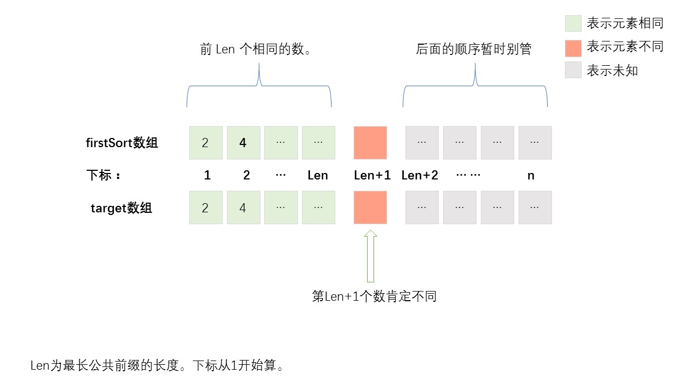
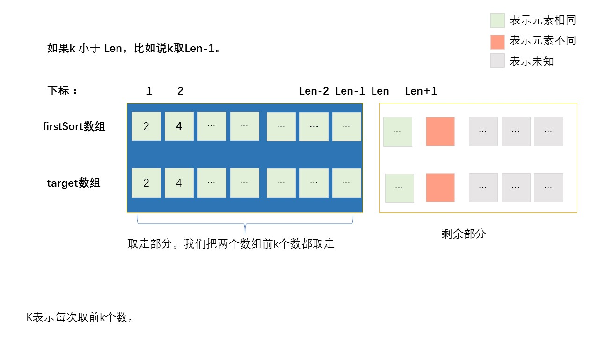
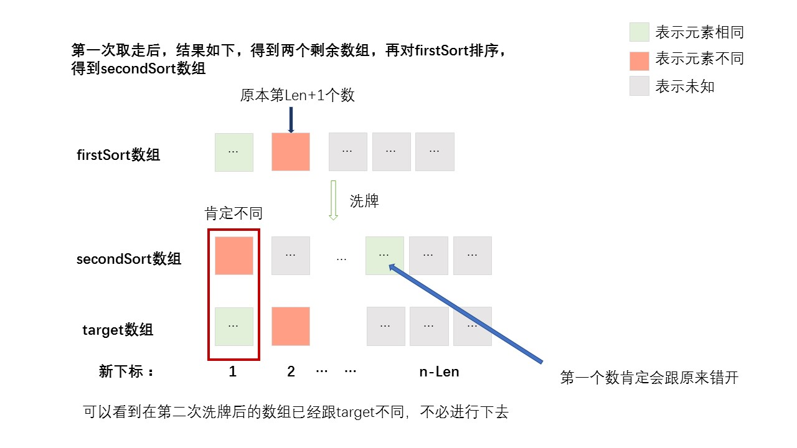
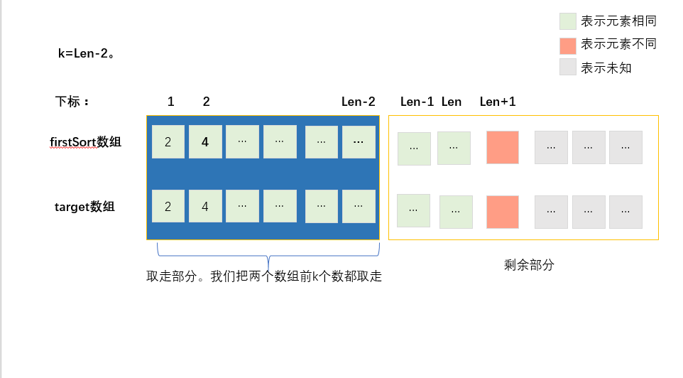
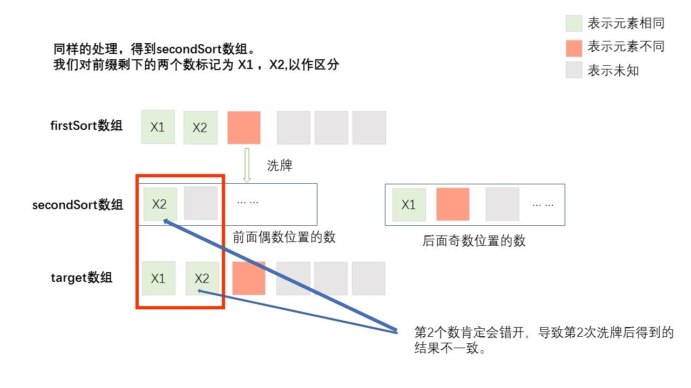

> 原文链接: https://leetcode-cn.com/problems/er94lq


## 英文原文
<div></div>

## 中文题目
<div>秋日市集上，魔术师邀请小扣与他互动。魔术师的道具为分别写有数字 `1~N` 的 `N` 张卡牌，然后请小扣思考一个 `N` 张卡牌的排列 `target`。

魔术师的目标是找到一个数字 k（k >= 1），使得初始排列顺序为 `1~N` 的卡牌经过特殊的洗牌方式最终变成小扣所想的排列 `target`，特殊的洗牌方式为：
- 第一步，魔术师将当前位于 **偶数位置** 的卡牌（下标自 1 开始），保持 **当前排列顺序** 放在位于 **奇数位置** 的卡牌之前。例如：将当前排列 [1,2,3,4,5] 位于偶数位置的 [2,4] 置于奇数位置的 [1,3,5] 前，排列变为 [2,4,1,3,5]；
- 第二步，若当前卡牌数量小于等于 `k`，则魔术师按排列顺序取走全部卡牌；若当前卡牌数量大于 `k`，则取走前 `k` 张卡牌，剩余卡牌继续重复这两个步骤，直至所有卡牌全部被取走；

卡牌按照魔术师取走顺序构成的新排列为「魔术取数排列」，请返回是否存在这个数字 k 使得「魔术取数排列」恰好就是 `target`，从而让小扣感到大吃一惊。

**示例 1：**
>输入：`target = [2,4,3,1,5]`
>
>输出：`true`
>
>解释：排列 target 长度为 5，初始排列为：1,2,3,4,5。我们选择 k = 2：
>第一次：将当前排列 [1,2,3,4,5] 位于偶数位置的 [2,4] 置于奇数位置的 [1,3,5] 前，排列变为 [2,4,1,3,5]。取走前 2 张卡牌 2,4，剩余 [1,3,5]；
>第二次：将当前排列 [1,3,5] 位于偶数位置的 [3] 置于奇数位置的 [1,5] 前，排列变为 [3,1,5]。取走前 2 张 3,1，剩余 [5]；
>第三次：当前排列为 [5]，全部取出。
>最后，数字按照取出顺序构成的「魔术取数排列」2,4,3,1,5 恰好为 target。

**示例 2：**
>输入：`target = [5,4,3,2,1]`
>
>输出：`false`
>
>解释：无法找到一个数字 k 可以使「魔术取数排列」恰好为 target。


**提示：**
- `1 <= target.length = N <= 5000`
- 题目保证 `target` 是 `1~N` 的一个排列。</div>

## 通过代码
<RecoDemo>
</RecoDemo>


## 高赞题解
比赛的时候思路出来了，可惜具体实现出了点问题，一直超时。

思路：
# 1、暴力法(超时)
题目给出了样例：
$$target = [2,4,3,1,5]$$
根据题目规则的第二步：
```
第一步，
魔术师将当前位于 偶数位置 的卡牌（下标自 1 开始），
保持 当前排列顺序 放在位于 奇数位置 的卡牌之前。
例如：将当前排列 [1,2,3,4,5] 位于偶数位置的 [2,4] 置于奇数位置的 [1,3,5] 前，
排列变为 [2,4,1,3,5]；

第二步，
若当前卡牌数量小于等于 k，则魔术师按排列顺序取走全部卡牌；
若当前卡牌数量大于 k，则取走前 k 张卡牌，剩余卡牌继续重复这两个步骤，直至所有卡牌全部被取走；
```

我们显然可以使用暴力法，**`k`的有效取值是从1到n**，当k大于n时，得到的效果其实和`k==n`是一样的。
所以我们直接把所有k的有效取值都按照题目的规则（洗牌、取牌）试一遍，肯定能找到答案。
但是这样显而易见超时了。

# 2、改进：充分利用第一次洗牌结果
超时之后我们就要思考如何优化k的取值。

这里依旧使用题目所给的$target$数组:
$$target:\{2,4,3,1,5\}$$


1、构造一个数组：
$$\{1,2,3,4,5\} $$

2、按照题目的规则排序，即把索引（从1开始）为偶数的放前面，得到**第一次洗牌的结果**（叫他`firstSort`数组吧）：
$$firstSort数组：\{2,4,1,3,5\}$$

3、然后我们把题目给的目标数组$target$从头开始进行比较。
$$firstSort数组：\{\textcolor{red}{2,4}, 1,3,5\}$$
$$ target数组:   \{\textcolor{red}{2,4},3,1,5\}$$

我们可以看到标红的`2,4`是两个数组最长公共前缀，设最长公共前缀的长度为`Len`。
这也就是说两个数组的前`Len`个数相同，第`Len+1`个数肯定不同。(除非两个数组完全相同，那就没有第`Len+1`个数了)

我们可以发现，**k的取值是不能超过Len的：**
因为如果`k`超过了`Len`，你第一次洗牌后取前`k`个数，其中前`Len`个数相同，第`Len+1`个数不同，那得到的结果肯定不同。

比如说在这个例子中，`Len`是等于2的，我取`k`等于3。那么第一次取出的k个数为:
$$\{2,4,\textcolor{red}1\}$$
而$target$的前`k`个数为:
$$\{2,4,\textcolor{red}3\}$$
很明显，后面不用继续取数，我们也知道结果不可能与$target$一样了。


**那么`k`能不能小于`Len`呢？**

答案是不能的。

我们简单地分析一下：

如图是第一次洗牌后的情况与target做对比。



先假设 `k=Len-1`的情况，以简要分析。如图我们取出前`Len-1`个数，那么第Len个数就肯定被保留下来，参与下一轮洗牌。


\
\
\
接下来，进行第二轮洗牌，如图所示，firstSort数组中的第一个数肯定会因为洗牌与target中相同的数错开（除非就剩一张牌，但是在第二轮洗牌中不可能只剩一张，因为这两个数组**不可能前n-1个相同而最后一个数不同**）。

因此，两个数组中的第一个数肯定不同。

并且，我们可以推广到k取`Len-3 , Len-5 , Len-7 …`一直到`Len–num`，其中`num`为表示任意奇数。
**只要num为奇数，那么在新数组中的第1个数在洗牌后必然跟在`target`中的与他相同的数错开**（看图容易理解）。
  

 





如果`num`为偶数的话，例如num=2，即`k=Len-2`，分析如下：




经过上图简单的分析，显然num为2的时候剩余数组的第2个又会因为洗牌而错开，导致与结果不一致。

同样的道理可以推广到`num=4，num=6...`直到`num`为任意偶数。


所以到最后，我们发现**只要对`k==Len`的情况进行模拟洗牌、取牌的过程，判断最后的结果是否与target相同就行**。当然，如果中途发现不对，就可以提前退出


```cpp []group 
class Solution {
public:
    //题目的洗牌算法。可能大佬们有更好的写法
    void magicSort(vector<int>&nums)
    {
        vector<int>tmp=nums;
        int n=nums.size();
        int idx=0;
        for(int i=0;i<n;i++)
        {
            if((i+1)%2==0)
            {
                nums[idx++]=tmp[i];
                tmp[i]=-1;
            }
        }
        for(int i=0;i<n;i++)
        {
            if(tmp[i]==-1)continue;
            nums[idx++]=tmp[i];
        }
    }
    //获取第一次洗牌后的数组和target数组的公共最长前缀
    int getLen(vector<int>nums,vector<int>&target)
    {
        int n=nums.size();
        int Len=n;
        magicSort(nums);
        for(int i=0;i<n;i++)
        {
            if(nums[i]!=target[i])
            {
                Len=i;
                break;
            }
        }
        return Len;
    }
    bool isMagic(vector<int>& target) {
        if(target.size()==1)
        {
            return true;
        }

        int n=target.size();
        vector<int>nums(n);
        for(int i=0;i<n;i++)
        {
            nums[i]=i+1;   
        }
        int k=getLen(nums,target); 

        //公共前缀长度为0，那就不用看了
        if(k==0)
        {
            return false;
        }

        //洗牌最多有 n/k（向上取整）次
        int cnt=0;
        if(n%k==0)
        {
            cnt=n/k;
        }
        else cnt=n/k+1;


        int j=0;//j表示第几轮洗牌
        while(j<cnt)
        {
            magicSort(nums);
            
            bool flag=false;
            int size=nums.size();
            for(int i=0;i<k;i++)
            {
                if(i+k*j<n&&nums[i]!=target[i+k*j])
                {
                    flag=true;
                    break;
                }
            }

            //如果中途发现不对，就可以提前退出
            if(flag)
            {
                break;
            }
            else{
                
                //取走前k个
                for(int i=k;i<size;i++)
                {
                    nums[i-k]=nums[i];
                }
                if(size>k)
                {
                    nums.resize(size-k);
                }
                else{
                    nums.resize(0);
                }
                if(nums.size()==0)
                {
                    return true;
                }
            }
            j++;
        }   
        
        return false;
    }
};
```
```java []group 
class Solution {
    //洗牌过程
    int[] magicSort(int[] nums,int length)
    {
        int n=length;
        int result[]=new int[n];
        int mid=n/2;
        for(int i=0,even=0,odd=mid;i<n;i++)
        {
            if((i+1)%2==0)
            {
                result[even++]=nums[i];
            }
            else{
                result[odd++]=nums[i];
            }
        }
        return result;
    }

    int getLen(int[] firstSort,int[] target)
    {
        int n=firstSort.length;
        for(int i=0;i<n;i++)
        {
            if(firstSort[i]!=target[i])
            {
                return i;
            }
        }
        //两个数组完全相等，返回n
        return n;
    }

    public boolean isMagic(int[] target) {

        int n=target.length;
        int nums[]=new int[n];

        //构造数组:{1,2,3,4....n}
        Arrays.fill(nums,1);
        for(int i=1;i<n;i++)
        {
            nums[i]+=nums[i-1];
        }
        
        nums=magicSort(nums,nums.length);
        // System.out.println(Arrays.toString(nums));
        int k=getLen(nums,target);
        // System.out.println(k);

        if(k==0)
        {
            return false;
        }

        int numsLen=n;
        while(numsLen>0)
        {
            //取走前k个数
            for(int i=k;i<numsLen;i++)
            {
                nums[i-k]=nums[i];
                target[i-k]=target[i];
            }
            if(numsLen>k)
            {
                numsLen-=k;
            }
            else{
                numsLen=0;
            }
            if(numsLen==0)
            {
                return true;
            }
            nums=magicSort(nums,numsLen);
            for(int i=0;i<k&&i<numsLen;i++)
            {
                if(nums[i]!=target[i])
                {
                    return false;
                }
            }
        }
        return false; 
    }

}
```

代码写的难看了，没做过多优化，希望评论区大佬有更好的思路、写法补充。

**码字不易，点个赞吧**


## 统计信息
| 通过次数 | 提交次数 | AC比率 |
| :------: | :------: | :------: |
|    2729    |    7992    |   34.1%   |

## 提交历史
| 提交时间 | 提交结果 | 执行时间 |  内存消耗  | 语言 |
| :------: | :------: | :------: | :--------: | :--------: |
