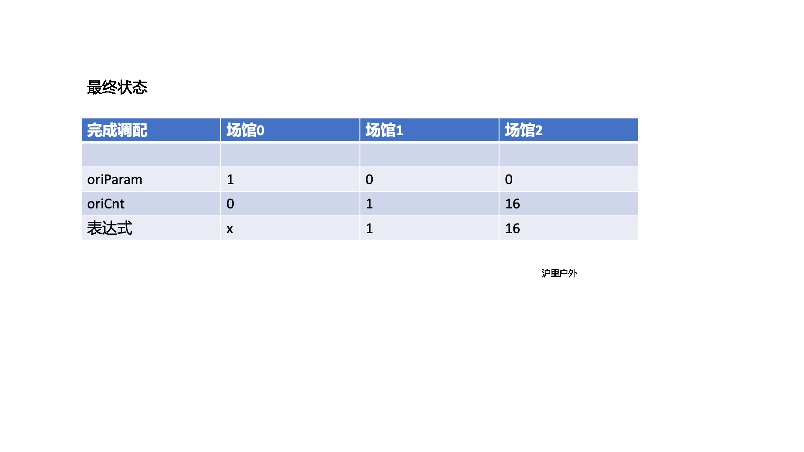

> 原文链接: https://leetcode-cn.com/problems/05ZEDJ


## 英文原文
<div></div>

## 中文题目
<div>「力扣挑战赛」有 `n` 个比赛场馆（场馆编号从 `0` 开始），场馆之间的通道分布情况记录于二维数组 `edges` 中，`edges[i]= [x, y]` 表示第 `i` 条通道连接场馆 `x` 和场馆 `y`(即两个场馆相邻)。初始每个场馆中都有一定人数的志愿者（不同场馆人数可能不同），后续 `m` 天每天均会根据赛事热度进行志愿者人数调配。调配方案分为如下三种：
1. 将编号为 `idx` 的场馆内的志愿者人数减半；
2. 将编号为 `idx` 的场馆相邻的场馆的志愿者人数都加上编号为 `idx` 的场馆的志愿者人数；
3. 将编号为 `idx` 的场馆相邻的场馆的志愿者人数都减去编号为 `idx` 的场馆的志愿者人数。

所有的调配信息记录于数组 `plans` 中，`plans[i] = [num,idx]` 表示第 `i` 天对编号 `idx` 的场馆执行了第 `num` 种调配方案。
在比赛结束后对调配方案进行复盘时，不慎将第 `0` 个场馆的**最终**志愿者人数丢失，只保留了**初始**所有场馆的志愿者总人数 `totalNum` ，以及记录了第 `1 ~ n-1` 个场馆的**最终**志愿者人数的一维数组 `finalCnt`。请你根据现有的信息求出初始每个场馆的志愿者人数，并按场馆编号顺序返回志愿者人数列表。

**注意：**
- 测试数据保证当某场馆进行第一种调配时，该场馆的志愿者人数一定为偶数；
- 测试数据保证当某场馆进行第三种调配时，该场馆的相邻场馆志愿者人数不为负数；
- 测试数据保证比赛开始时每个场馆的志愿者人数都不超过 `10^9`；
- 测试数据保证给定的场馆间的道路分布情况中不会出现自环、重边的情况。


**示例 1：**
>
> 输入：
>`finalCnt = [1,16], totalNum = 21, edges = [[0,1],[1,2]], plans = [[2,1],[1,0],[3,0]]`
>
> 输出：`[5,7,9]`
>
> 解释：
> {:height=200}


**示例 2 ：**
> 输入：
>`finalCnt = [4,13,4,3,8], totalNum = 54, edges = [[0,3],[1,3],[4,3],[2,3],[2,5]], plans = [[1,1],[3,3],[2,5],[1,0]]`
>
> 输出：`[10,16,9,4,7,8]`


**提示：**
- `2 <= n <= 5*10^4`
- `1 <= edges.length <= min((n * (n - 1)) / 2, 5*10^4)`
- `0 <= edges[i][0], edges[i][1] < n`
- `1 <= plans.length <= 10`
- `1 <= plans[i][0] <=3`
- `0 <= plans[i][1] < n`
- `finalCnt.length = n-1`
- `0 <= finalCnt[i] < 10^9`
- `0 <= totalNum < 5*10^13`
</div>

## 通过代码
<RecoDemo>
</RecoDemo>


## 高赞题解
## 方法：模拟


**思路及算法**
由于倍增和加减操作都是线性，考虑对线性操作的做**线性拆分**，将以 val = k * x + b 的形式表达出来， x 即为场馆 0 在所有操作后的人数
引入两个数组：
1. oriParam 数组表示每个位置 i 的*系数 k*
2. oriCnt 数组表示每个位置 i 的*常数 b*

此时每个位置 i 的值 val 就等于 oriParam[i] * x + oriCnt[i]
显而易见，
初始状态：
 - oriCnt[i+1] = finalCnt[i]
 - oriParam[0] = 1

用 HashMap 保存相邻场馆，之后模拟 plans 的操作。
以示例一为例，两个数组的变化情况如下：



得到初始状态表示数组的每个数后，求和就能得到 totalNum，此时就可以**反解出** x
最后 将常数数组 oriCnt 加上 k * x 即为初始值

**代码**

```java
class Solution {

  public int[] volunteerDeployment(int[] finalCnt, long totalNum, int[][] edges, int[][] plans) {
    int n = finalCnt.length + 1, m = plans.length;
    int[] oriParam = new int[n];
    int[] oriCnt = new int[n];
    oriParam[0] = 1;
    for (int i = 0; i < n - 1; i++) {
      oriCnt[i + 1] = finalCnt[i];
    }
    HashMap<Integer, List<Integer>> related = new HashMap<>();
    for (int[] e : edges) {
      //保存相邻场馆
      addRelations(e[0], e[1], related);
      addRelations(e[1], e[0], related);
    }
    for (int i = m - 1; i >= 0; i--) {
      int idx = plans[i][1];
      int num = plans[i][0];
      //模拟 plans 的操作
      operate(num, idx, oriParam, related);
      operate(num, idx, oriCnt, related);
    }
    //汇总k0,k1,k2...及 y - b0 - b1 - ...
    int param = 0;
    for (int i = 0; i < n; i++) {
      totalNum -= oriCnt[i];
      param += oriParam[i];
    }
    //求解x
    int x = (int) (totalNum / param);
    //将常数数组加上 k * x 即为初始值
    for (int i = 0; i < n ; i++) {
      oriCnt[i] += oriParam[i] * x;
    }
    return oriCnt;
  }

  private void operate(int num, int idx, int[] array, HashMap<Integer, List<Integer>> related) {
    if (num == 1) array[idx] *= 2;
    else {
      for (int r : related.getOrDefault(idx, new ArrayList<>())) {
        if (num == 2) array[r] -= array[idx];
        else array[r] += array[idx];
      }
    }
  }

  private void addRelations(int x, int y, HashMap<Integer, List<Integer>> related) {
    List<Integer> relations = related.getOrDefault(x, new ArrayList<>());
    relations.add(y);
    related.put(x, relations);
  }

```

**结语**
如果对您有帮助，欢迎**点赞、收藏、[关注 沪里户外](/u/hu-li-hu-wai/)**，让更多的小伙伴看到，祝大家**offer多多，AC多多**！

## 统计信息
| 通过次数 | 提交次数 | AC比率 |
| :------: | :------: | :------: |
|    953    |    2482    |   38.4%   |

## 提交历史
| 提交时间 | 提交结果 | 执行时间 |  内存消耗  | 语言 |
| :------: | :------: | :------: | :--------: | :--------: |
