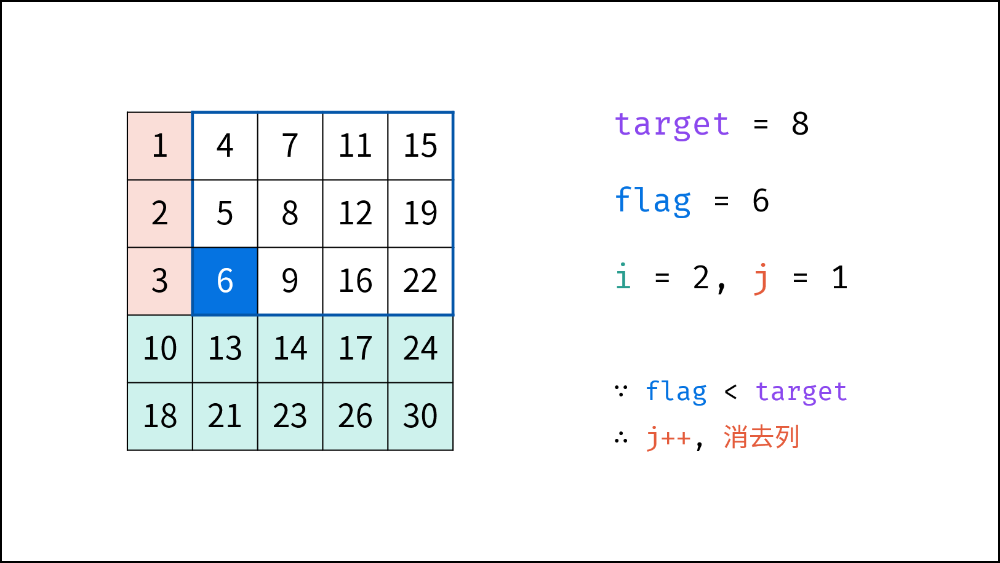

> 原文链接: https://leetcode-cn.com/problems/er-wei-shu-zu-zhong-de-cha-zhao-lcof


## 中文题目
<div><p>在一个 n * m 的二维数组中，每一行都按照从左到右递增的顺序排序，每一列都按照从上到下递增的顺序排序。请完成一个高效的函数，输入这样的一个二维数组和一个整数，判断数组中是否含有该整数。</p>

<p> </p>

<p><strong>示例:</strong></p>

<p>现有矩阵 matrix 如下：</p>

<pre>
[
  [1,   4,  7, 11, 15],
  [2,   5,  8, 12, 19],
  [3,   6,  9, 16, 22],
  [10, 13, 14, 17, 24],
  [18, 21, 23, 26, 30]
]
</pre>

<p>给定 target = <code>5</code>，返回 <code>true</code>。</p>

<p>给定 target = <code>20</code>，返回 <code>false</code>。</p>

<p> </p>

<p><strong>限制：</strong></p>

<p><code>0 <= n <= 1000</code></p>

<p><code>0 <= m <= 1000</code></p>

<p> </p>

<p><strong>注意：</strong>本题与主站 240 题相同：<a href="https://leetcode-cn.com/problems/search-a-2d-matrix-ii/">https://leetcode-cn.com/problems/search-a-2d-matrix-ii/</a></p>
</div>

## 通过代码
<RecoDemo>
</RecoDemo>


## 高赞题解
#### 解题思路：

> 若使用暴力法遍历矩阵 `matrix` ，则时间复杂度为 $O(NM)$ 。暴力法未利用矩阵 **“从上到下递增、从左到右递增”** 的特点，显然不是最优解法。

如下图所示，我们将矩阵逆时针旋转 45° ，并将其转化为图形式，发现其类似于 **二叉搜索树** ，即对于每个元素，其左分支元素更小、右分支元素更大。因此，通过从 “根节点” 开始搜索，遇到比 `target` 大的元素就向左，反之向右，即可找到目标值 `target` 。

{:width=450}

“根节点” 对应的是矩阵的 “左下角” 和 “右上角” 元素，本文称之为 **标志数** ，以 `matrix` 中的 **左下角元素** 为标志数 `flag` ，则有:

1. 若 `flag > target` ，则 `target` 一定在 `flag` 所在 **行的上方** ，即 `flag` 所在行可被消去。
2. 若 `flag < target` ，则 `target` 一定在 `flag` 所在 **列的右方** ，即 `flag` 所在列可被消去。

##### **算法流程：**

1. 从矩阵 `matrix` 左下角元素（索引设为 `(i, j)` ）开始遍历，并与目标值对比：
   - 当 `matrix[i][j] > target` 时，执行 `i--` ，即消去第 `i` 行元素；
   - 当 `matrix[i][j] < target` 时，执行 `j++` ，即消去第 `j` 列元素；
   - 当 `matrix[i][j] = target` 时，返回 $true$ ，代表找到目标值。
2. 若行索引或列索引越界，则代表矩阵中无目标值，返回 $false$ 。

> 每轮 `i` 或 `j` 移动后，相当于生成了“消去一行（列）的新矩阵”， 索引`(i,j)` 指向新矩阵的左下角元素（标志数），因此可重复使用以上性质消去行（列）。

##### 复杂度分析：

- 时间复杂度 $O(M+N)$ ：其中，$N$ 和 $M$ 分别为矩阵行数和列数，此算法最多循环 $M+N$ 次。
- 空间复杂度 $O(1)$ : `i`, `j` 指针使用常数大小额外空间。

<,,,,,>

#### 代码：

```Python []
class Solution:
    def findNumberIn2DArray(self, matrix: List[List[int]], target: int) -> bool:
        i, j = len(matrix) - 1, 0
        while i >= 0 and j < len(matrix[0]):
            if matrix[i][j] > target: i -= 1
            elif matrix[i][j] < target: j += 1
            else: return True
        return False
```

```Java []
class Solution {
    public boolean findNumberIn2DArray(int[][] matrix, int target) {
        int i = matrix.length - 1, j = 0;
        while(i >= 0 && j < matrix[0].length)
        {
            if(matrix[i][j] > target) i--;
            else if(matrix[i][j] < target) j++;
            else return true;
        }
        return false;
    }
}
```

```C++ []
class Solution {
public:
    bool findNumberIn2DArray(vector<vector<int>>& matrix, int target) {
        int i = matrix.size() - 1, j = 0;
        while(i >= 0 && j < matrix[0].size())
        {
            if(matrix[i][j] > target) i--;
            else if(matrix[i][j] < target) j++;
            else return true;
        }
        return false;
    }
};
```

## 统计信息
| 通过次数 | 提交次数 | AC比率 |
| :------: | :------: | :------: |
|    283279    |    702632    |   40.3%   |

## 提交历史
| 提交时间 | 提交结果 | 执行时间 |  内存消耗  | 语言 |
| :------: | :------: | :------: | :--------: | :--------: |
