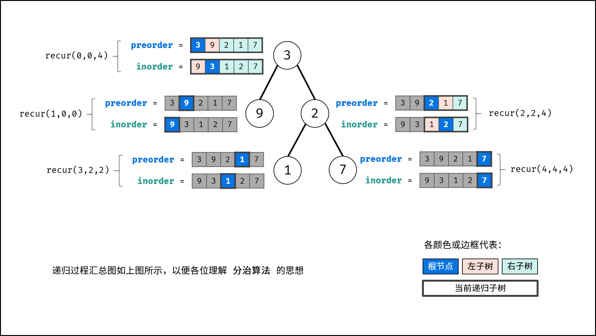

> 原文链接: https://leetcode-cn.com/problems/zhong-jian-er-cha-shu-lcof


## 中文题目
<div><p>输入某二叉树的前序遍历和中序遍历的结果，请构建该二叉树并返回其根节点。</p>

<p>假设输入的前序遍历和中序遍历的结果中都不含重复的数字。</p>

<p> </p>

<p><strong>示例 1:</strong></p>

<pre>
<strong>Input:</strong> preorder = [3,9,20,15,7], inorder = [9,3,15,20,7]
<strong>Output:</strong> [3,9,20,null,null,15,7]
</pre>

<p><strong>示例 2:</strong></p>

<pre>
<strong>Input:</strong> preorder = [-1], inorder = [-1]
<strong>Output:</strong> [-1]
</pre>

<p> </p>

<p><strong>限制：</strong></p>

<p><code>0 <= 节点个数 <= 5000</code></p>

<p> </p>

<p><strong>注意</strong>：本题与主站 105 题重复：<a href="https://leetcode-cn.com/problems/construct-binary-tree-from-preorder-and-inorder-traversal/">https://leetcode-cn.com/problems/construct-binary-tree-from-preorder-and-inorder-traversal/</a></p>
</div>

## 通过代码
<RecoDemo>
</RecoDemo>


## 高赞题解
### 解题思路：

前序遍历性质： 节点按照 `[ 根节点 | 左子树 | 右子树 ]` 排序。
中序遍历性质： 节点按照 `[ 左子树 | 根节点 | 右子树 ]` 排序。

> 以题目示例为例：
> 
> - 前序遍历划分 `[ 3 | 9 | 20 15 7 ]`
> - 中序遍历划分 `[ 9 | 3 | 15 20 7 ]`

根据以上性质，可得出以下推论：

1. 前序遍历的首元素 为 树的根节点 `node` 的值。
2. 在中序遍历中搜索根节点 `node` 的索引 ，可将 中序遍历 划分为 `[ 左子树 | 根节点 | 右子树 ]` 。
3. 根据中序遍历中的左（右）子树的节点数量，可将 前序遍历 划分为 `[ 根节点 | 左子树 | 右子树 ] ` 。

{:width=550}

通过以上三步，可确定 **三个节点** ：1.树的根节点、2.左子树根节点、3.右子树根节点。

根据「分治算法」思想，对于树的左、右子树，仍可复用以上方法划分子树的左右子树。

#### 分治算法解析：

- **递推参数：** 根节点在前序遍历的索引 `root` 、子树在中序遍历的左边界 `left` 、子树在中序遍历的右边界 `right` ；

- **终止条件：** 当 `left > right` ，代表已经越过叶节点，此时返回 $null$ ；

- **递推工作：**

  1. **建立根节点 `node` ：** 节点值为 `preorder[root]` ；
  2. **划分左右子树：** 查找根节点在中序遍历 `inorder` 中的索引 `i` ；
  
  > 为了提升效率，本文使用哈希表 `dic` 存储中序遍历的值与索引的映射，查找操作的时间复杂度为 $O(1)$ ；
  
  3. **构建左右子树：** 开启左右子树递归；

  |            | 根节点索引            | 中序遍历左边界 | 中序遍历右边界 |
  | ---------- | -------------------- | ------------- | ------------- |
  | **左子树** | `root + 1`            | `left`         | `i - 1`        |
  | **右子树** | `i - left + root + 1` | `i + 1`        | `right`        |

    > **TIPS：** `i - left + root + 1`含义为 `根节点索引 + 左子树长度 + 1`

- **返回值：** 回溯返回 `node` ，作为上一层递归中根节点的左 / 右子节点；

<,,,,,,,,,,>

#### 复杂度分析：

- **时间复杂度 $O(N)$ ：** 其中 $N$ 为树的节点数量。初始化 HashMap 需遍历 `inorder` ，占用 $O(N)$ 。递归共建立 $N$ 个节点，每层递归中的节点建立、搜索操作占用 $O(1)$ ，因此使用 $O(N)$ 时间。
- **空间复杂度 $O(N)$ ：** HashMap 使用 $O(N)$ 额外空间；最差情况下（输入二叉树为链表时），递归深度达到 $N$ ，占用 $O(N)$ 的栈帧空间；因此总共使用 $O(N)$ 空间。

### 代码：

> 注意：本文方法只适用于 “无重复节点值” 的二叉树。

```Python []
class Solution:
    def buildTree(self, preorder: List[int], inorder: List[int]) -> TreeNode:
        def recur(root, left, right):
            if left > right: return                               # 递归终止
            node = TreeNode(preorder[root])                       # 建立根节点
            i = dic[preorder[root]]                               # 划分根节点、左子树、右子树
            node.left = recur(root + 1, left, i - 1)              # 开启左子树递归
            node.right = recur(i - left + root + 1, i + 1, right) # 开启右子树递归
            return node                                           # 回溯返回根节点

        dic, preorder = {}, preorder
        for i in range(len(inorder)):
            dic[inorder[i]] = i
        return recur(0, 0, len(inorder) - 1)
```

```Java []
class Solution {
    int[] preorder;
    HashMap<Integer, Integer> dic = new HashMap<>();
    public TreeNode buildTree(int[] preorder, int[] inorder) {
        this.preorder = preorder;
        for(int i = 0; i < inorder.length; i++)
            dic.put(inorder[i], i);
        return recur(0, 0, inorder.length - 1);
    }
    TreeNode recur(int root, int left, int right) {
        if(left > right) return null;                          // 递归终止
        TreeNode node = new TreeNode(preorder[root]);          // 建立根节点
        int i = dic.get(preorder[root]);                       // 划分根节点、左子树、右子树
        node.left = recur(root + 1, left, i - 1);              // 开启左子树递归
        node.right = recur(root + i - left + 1, i + 1, right); // 开启右子树递归
        return node;                                           // 回溯返回根节点
    }
}
```

```C++ []
class Solution {
public:
    TreeNode* buildTree(vector<int>& preorder, vector<int>& inorder) {
        this->preorder = preorder;
        for(int i = 0; i < inorder.size(); i++)
            dic[inorder[i]] = i;
        return recur(0, 0, inorder.size() - 1);
    }
private:
    vector<int> preorder;
    unordered_map<int, int> dic;
    TreeNode* recur(int root, int left, int right) { 
        if(left > right) return nullptr;                        // 递归终止
        TreeNode* node = new TreeNode(preorder[root]);          // 建立根节点
        int i = dic[preorder[root]];                            // 划分根节点、左子树、右子树
        node->left = recur(root + 1, left, i - 1);              // 开启左子树递归
        node->right = recur(root + i - left + 1, i + 1, right); // 开启右子树递归
        return node;                                            // 回溯返回根节点
    }
};
```


## 统计信息
| 通过次数 | 提交次数 | AC比率 |
| :------: | :------: | :------: |
|    200784    |    287328    |   69.9%   |

## 提交历史
| 提交时间 | 提交结果 | 执行时间 |  内存消耗  | 语言 |
| :------: | :------: | :------: | :--------: | :--------: |
