> 原文链接: https://leetcode-cn.com/problems/ju-zhen-zhong-de-lu-jing-lcof


## 中文题目
<div><p>给定一个 <code>m x n</code> 二维字符网格 <code>board</code> 和一个字符串单词 <code>word</code> 。如果 <code>word</code> 存在于网格中，返回 <code>true</code> ；否则，返回 <code>false</code> 。</p>

<p>单词必须按照字母顺序，通过相邻的单元格内的字母构成，其中“相邻”单元格是那些水平相邻或垂直相邻的单元格。同一个单元格内的字母不允许被重复使用。</p>

<p> </p>

<p>例如，在下面的 3×4 的矩阵中包含单词 "ABCCED"（单词中的字母已标出）。</p>

<p></p>

<p> </p>

<p><strong>示例 1：</strong></p>

<pre>
<strong>输入：</strong>board = [["A","B","C","E"],["S","F","C","S"],["A","D","E","E"]], word = "ABCCED"
<strong>输出：</strong>true
</pre>

<p><strong>示例 2：</strong></p>

<pre>
<strong>输入：</strong>board = [["a","b"],["c","d"]], word = "abcd"
<strong>输出：</strong>false
</pre>

<p> </p>

<p><strong>提示：</strong></p>

<ul>
	<li><code>1 <= board.length <= 200</code></li>
	<li><code>1 <= board[i].length <= 200</code></li>
	<li><code>board</code> 和 <code>word</code> 仅由大小写英文字母组成</li>
</ul>

<p> </p>

<p><strong>注意：</strong>本题与主站 79 题相同：<a href="https://leetcode-cn.com/problems/word-search/">https://leetcode-cn.com/problems/word-search/</a></p>
</div>

## 通过代码
<RecoDemo>
</RecoDemo>


## 高赞题解
#### 解题思路：

本问题是典型的矩阵搜索问题，可使用 **深度优先搜索（DFS）+ 剪枝** 解决。

- **深度优先搜索：** 可以理解为暴力法遍历矩阵中所有字符串可能性。DFS 通过递归，先朝一个方向搜到底，再回溯至上个节点，沿另一个方向搜索，以此类推。
- **剪枝：** 在搜索中，遇到 `这条路不可能和目标字符串匹配成功` 的情况（*例如：此矩阵元素和目标字符不同、此元素已被访问）*，则应立即返回，称之为 `可行性剪枝` 。

{:width=500}

##### DFS 解析：

- **递归参数：** 当前元素在矩阵 `board` 中的行列索引 `i` 和 `j` ，当前目标字符在 `word` 中的索引 `k` 。
- **终止条件：**
  1. 返回 $false$ ： (1) 行或列索引越界 **或** (2) 当前矩阵元素与目标字符不同 **或** (3) 当前矩阵元素已访问过 （ (3) 可合并至 (2) ） 。
  2. 返回 $true$ ： `k = len(word) - 1` ，即字符串 `word` 已全部匹配。
- **递推工作：**
  1. 标记当前矩阵元素： 将 `board[i][j]` 修改为 **空字符** `''` ，代表此元素已访问过，防止之后搜索时重复访问。
  2. 搜索下一单元格： 朝当前元素的 **上、下、左、右** 四个方向开启下层递归，使用 `或` 连接 （代表只需找到一条可行路径就直接返回，不再做后续 DFS ），并记录结果至 `res` 。
  3. 还原当前矩阵元素： 将 `board[i][j]` 元素还原至初始值，即 `word[k]` 。
- **返回值：** 返回布尔量 `res` ，代表是否搜索到目标字符串。

> 使用空字符（Python: `''` , Java/C++: `'\0'` ）做标记是为了防止标记字符与矩阵原有字符重复。当存在重复时，此算法会将矩阵原有字符认作标记字符，从而出现错误。

<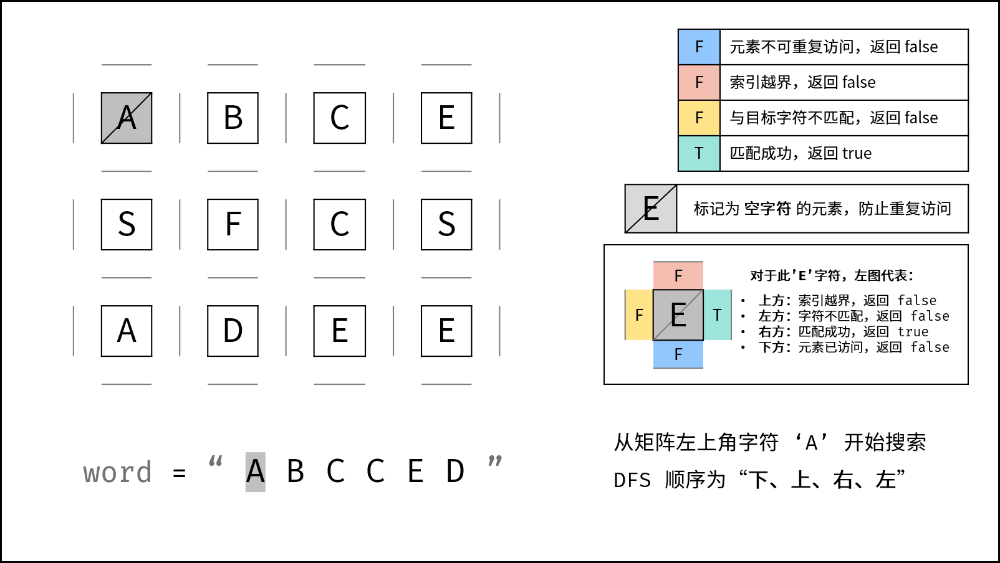,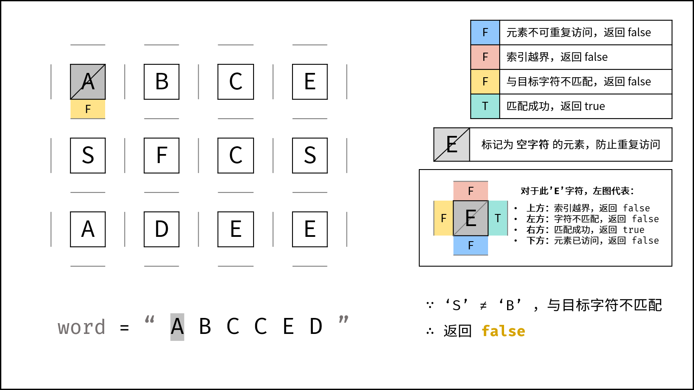,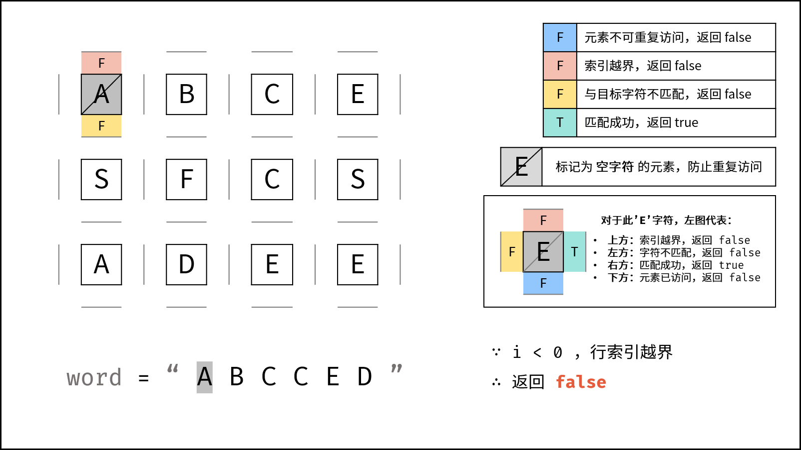,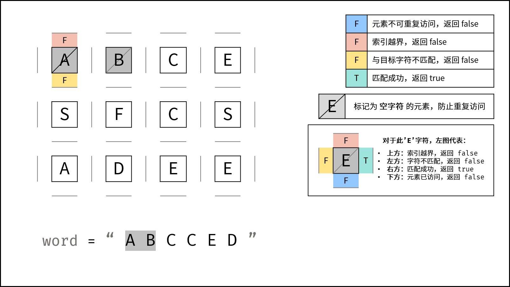,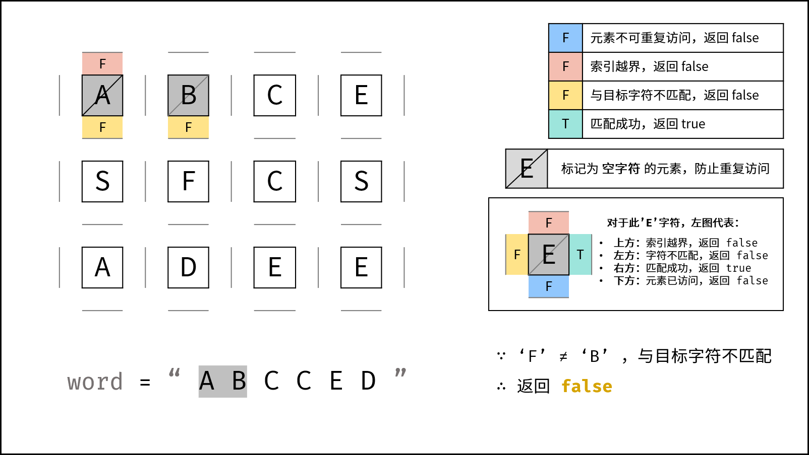,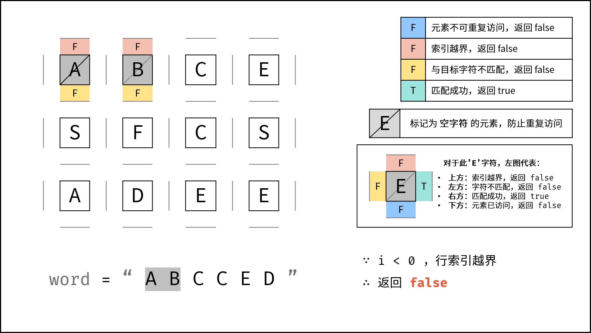,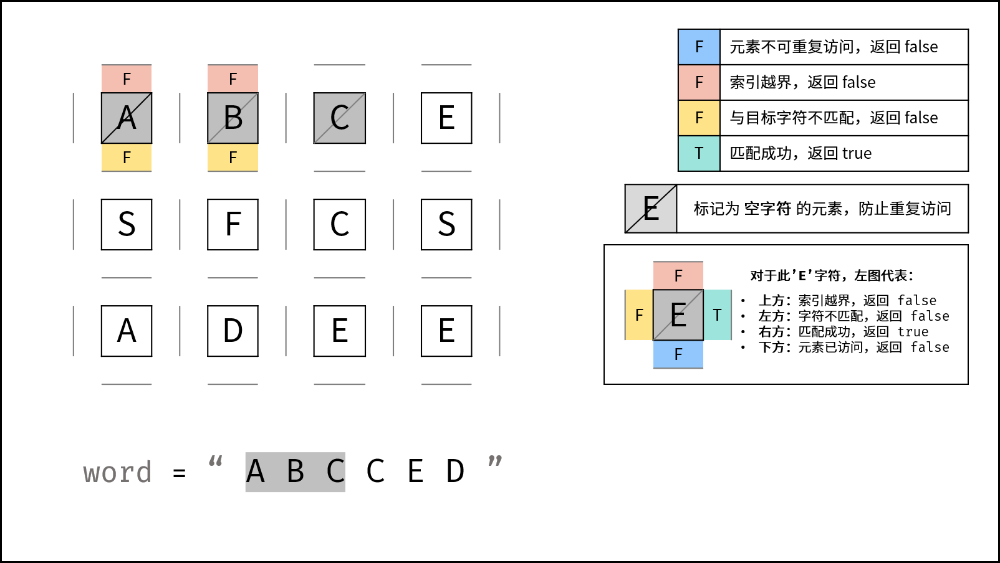,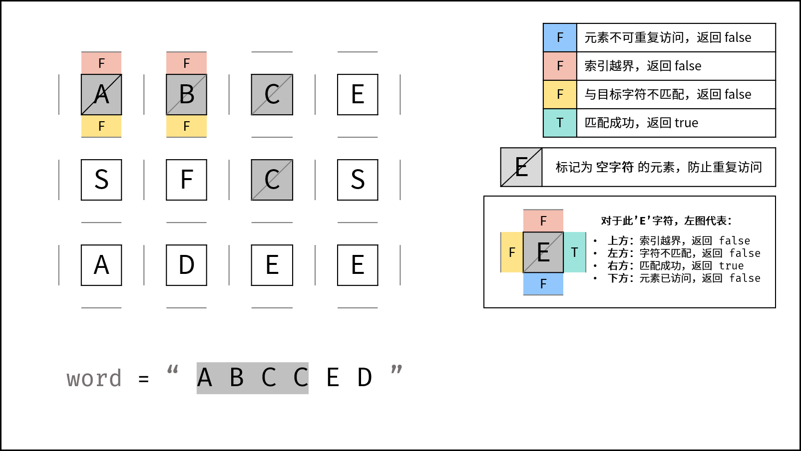,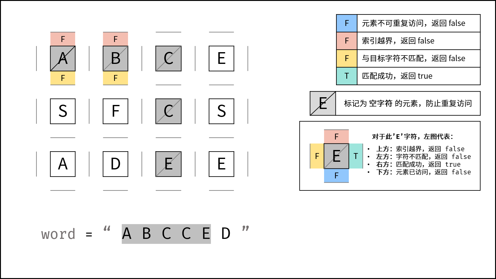,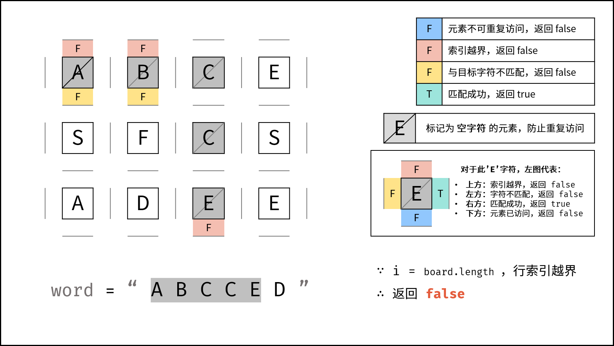,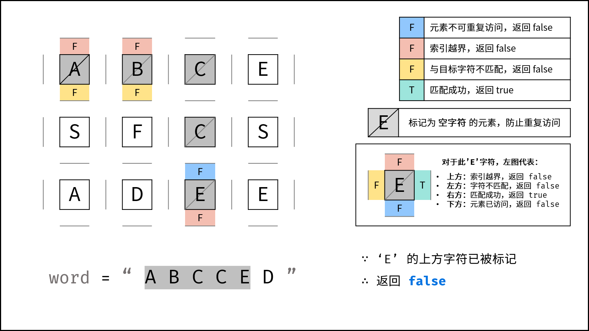,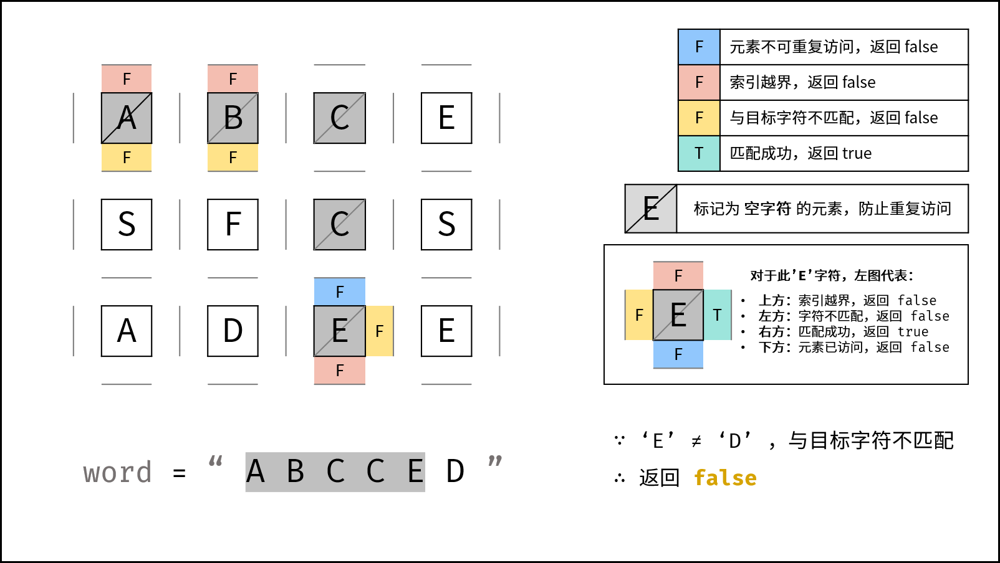,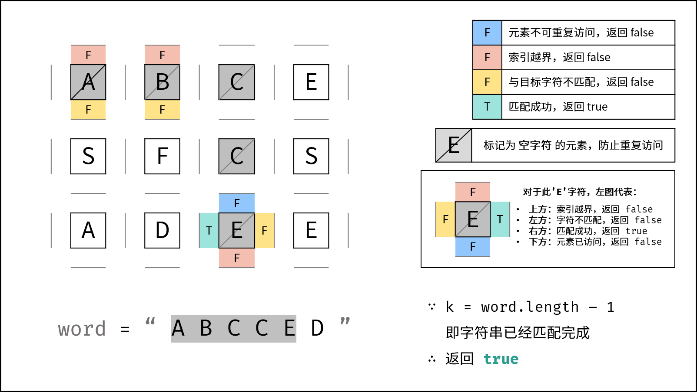,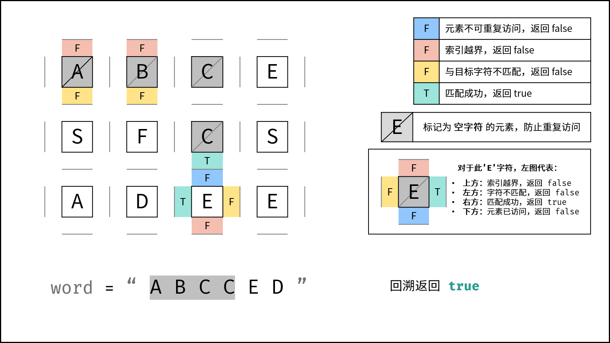,,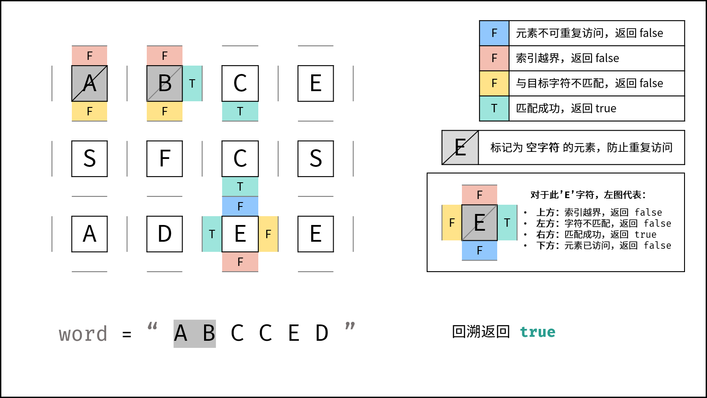,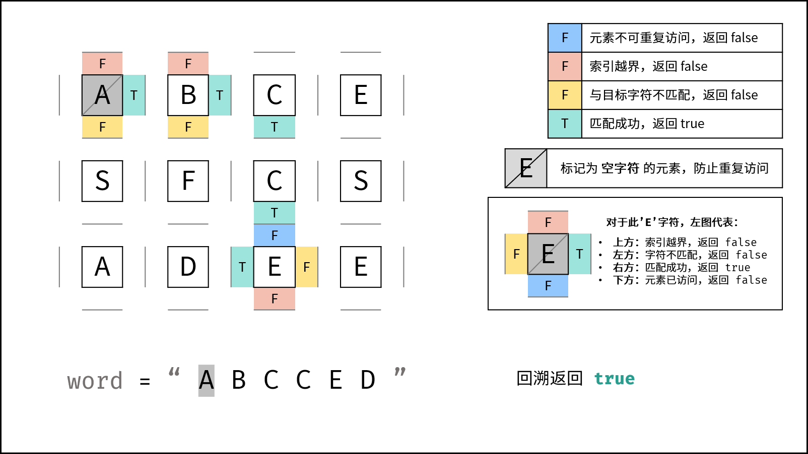,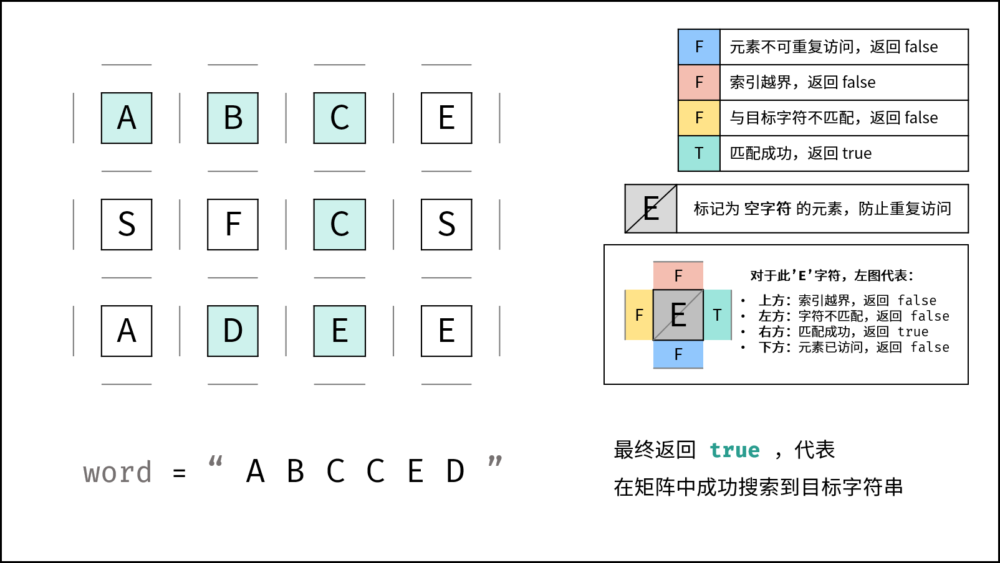>

##### 复杂度分析：

> $M, N$ 分别为矩阵行列大小， $K$ 为字符串 `word` 长度。

- **时间复杂度 $O(3^KMN)$ ：** 最差情况下，需要遍历矩阵中长度为 $K$ 字符串的所有方案，时间复杂度为 $O(3^K)$；矩阵中共有 $MN$ 个起点，时间复杂度为 $O(MN)$ 。
  - **方案数计算：** 设字符串长度为 $K$ ，搜索中每个字符有上、下、左、右四个方向可以选择，舍弃回头（上个字符）的方向，剩下 $3$ 种选择，因此方案数的复杂度为 $O(3^K)$ 。
- **空间复杂度 $O(K)$ ：** 搜索过程中的递归深度不超过 $K$ ，因此系统因函数调用累计使用的栈空间占用 $O(K)$ （因为函数返回后，系统调用的[栈空间会释放](https://leetcode-cn.com/explore/orignial/card/recursion-i/259/complexity-analysis/1223/)）。最坏情况下 $K = MN$ ，递归深度为 $MN$ ，此时系统栈使用 $O(MN)$ 的额外空间。

#### 代码：

```Python []
class Solution:
    def exist(self, board: List[List[str]], word: str) -> bool:
        def dfs(i, j, k):
            if not 0 <= i < len(board) or not 0 <= j < len(board[0]) or board[i][j] != word[k]: return False
            if k == len(word) - 1: return True
            board[i][j] = ''
            res = dfs(i + 1, j, k + 1) or dfs(i - 1, j, k + 1) or dfs(i, j + 1, k + 1) or dfs(i, j - 1, k + 1)
            board[i][j] = word[k]
            return res

        for i in range(len(board)):
            for j in range(len(board[0])):
                if dfs(i, j, 0): return True
        return False
```

```Java []
class Solution {
    public boolean exist(char[][] board, String word) {
        char[] words = word.toCharArray();
        for(int i = 0; i < board.length; i++) {
            for(int j = 0; j < board[0].length; j++) {
                if(dfs(board, words, i, j, 0)) return true;
            }
        }
        return false;
    }
    boolean dfs(char[][] board, char[] word, int i, int j, int k) {
        if(i >= board.length || i < 0 || j >= board[0].length || j < 0 || board[i][j] != word[k]) return false;
        if(k == word.length - 1) return true;
        board[i][j] = '\0';
        boolean res = dfs(board, word, i + 1, j, k + 1) || dfs(board, word, i - 1, j, k + 1) || 
                      dfs(board, word, i, j + 1, k + 1) || dfs(board, word, i , j - 1, k + 1);
        board[i][j] = word[k];
        return res;
    }
}
```

```C++ []
class Solution {
public:
    bool exist(vector<vector<char>>& board, string word) {
        rows = board.size();
        cols = board[0].size();
        for(int i = 0; i < rows; i++) {
            for(int j = 0; j < cols; j++) {
                if(dfs(board, word, i, j, 0)) return true;
            }
        }
        return false;
    }
private:
    int rows, cols;
    bool dfs(vector<vector<char>>& board, string word, int i, int j, int k) {
        if(i >= rows || i < 0 || j >= cols || j < 0 || board[i][j] != word[k]) return false;
        if(k == word.size() - 1) return true;
        board[i][j] = '\0';
        bool res = dfs(board, word, i + 1, j, k + 1) || dfs(board, word, i - 1, j, k + 1) || 
                      dfs(board, word, i, j + 1, k + 1) || dfs(board, word, i , j - 1, k + 1);
        board[i][j] = word[k];
        return res;
    }
};
```

## 统计信息
| 通过次数 | 提交次数 | AC比率 |
| :------: | :------: | :------: |
|    184553    |    408079    |   45.2%   |

## 提交历史
| 提交时间 | 提交结果 | 执行时间 |  内存消耗  | 语言 |
| :------: | :------: | :------: | :--------: | :--------: |
