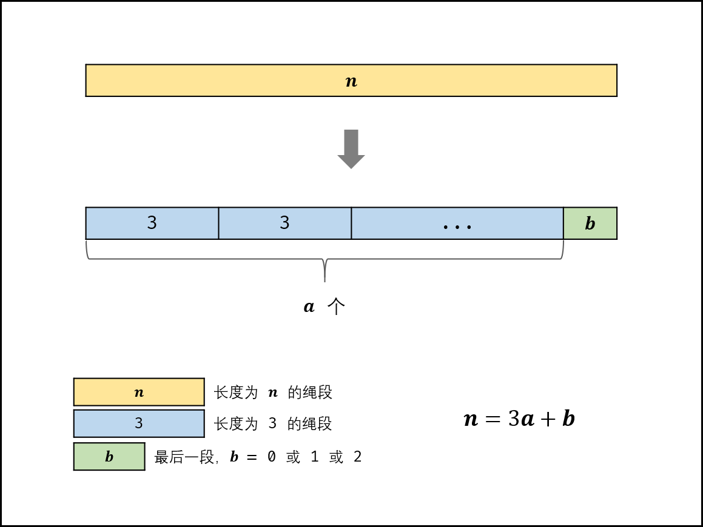

> 原文链接: https://leetcode-cn.com/problems/jian-sheng-zi-lcof


## 中文题目
<div><p>给你一根长度为 <code>n</code> 的绳子，请把绳子剪成整数长度的 <code>m</code> 段（m、n都是整数，n&gt;1并且m&gt;1），每段绳子的长度记为 <code>k[0],k[1]...k[m-1]</code> 。请问 <code>k[0]*k[1]*...*k[m-1]</code> 可能的最大乘积是多少？例如，当绳子的长度是8时，我们把它剪成长度分别为2、3、3的三段，此时得到的最大乘积是18。</p>

<p><strong>示例 1：</strong></p>

<pre><strong>输入: </strong>2
<strong>输出: </strong>1
<strong>解释: </strong>2 = 1 + 1, 1 &times; 1 = 1</pre>

<p><strong>示例&nbsp;2:</strong></p>

<pre><strong>输入: </strong>10
<strong>输出: </strong>36
<strong>解释: </strong>10 = 3 + 3 + 4, 3 &times;&nbsp;3 &times;&nbsp;4 = 36</pre>

<p><strong>提示：</strong></p>

<ul>
	<li><code>2 &lt;= n &lt;= 58</code></li>
</ul>

<p>注意：本题与主站 343 题相同：<a href="https://leetcode-cn.com/problems/integer-break/">https://leetcode-cn.com/problems/integer-break/</a></p>
</div>

## 通过代码
<RecoDemo>
</RecoDemo>


## 高赞题解
#### 解题思路：

- 设将长度为 $n$ 的绳子切为 $a$ 段：

$$
n = n_1 + n_2 + ... + n_a
$$

- 本题等价于求解：

$$
\max(n_1 \times n_2 \times ... \times n_a)
$$

> 以下数学推导总体分为两步：① 当所有绳段长度相等时，乘积最大。② 最优的绳段长度为 $3$ 。

##### 数学推导：

- 以下公式为“算术几何均值不等式” ，等号当且仅当 $n_1 = n_2 = ... = n_a$ 时成立。

$$
\frac{n_1 + n_2 + ... + n_a}{a} \geq \sqrt[a]{n_1 n_2 ... n_a}
$$

> **推论一：** 将绳子 **以相等的长度等分为多段** ，得到的乘积最大。

- 设将绳子按照 $x$ 长度等分为 $a$ 段，即 $n = ax$ ，则乘积为 $x^a$ 。观察以下公式，由于 $n$ 为常数，因此当 $x^{\frac{1}{x}}$ 取最大值时， 乘积达到最大值。

$$
x^a = x^{\frac{n}{x}} = (x^{\frac{1}{x}})^n
$$

- 根据分析，可将问题转化为求 $y = x^{\frac{1}{x}}$ 的极大值，因此对 $x$ 求导数。

$$
\begin{aligned}
 \ln y & = \frac{1}{x} \ln x & \text{取对数} \\
 \frac{1}{y} \dot {y} & = \frac{1}{x^2} - \frac{1}{x^2} \ln x & \text{对 $x$ 求导} \\
 & = \frac{1 - \ln x}{x^2} \\
 \dot {y} & = \frac{1 - \ln x}{x^2} x^{\frac{1}{x}} & \text{整理得}
\end{aligned}
$$

- 令 $\dot {y} = 0$ ，则 $1 - \ln x = 0$ ，易得驻点为 $x_0 = e \approx 2.7$ ；根据以下公式，可知 $x_0$ 为极大值点。

$$
\dot {y}
\begin{cases}
 > 0 & , x \in [- \infty, e) \\
 < 0 & , x \in (e, \infty] \\
\end{cases}
$$

- 由于切分长度 $x$ 必须为整数，最接近 $e$ 的整数为 $2$ 或 $3$ 。如下式所示，代入 $x = 2$ 和 $x = 3$ ，得出 $x = 3$ 时，乘积达到最大。

$$
y(3) = 3^{1/3} \approx 1.44 \\
y(2) = 2^{1/2} \approx 1.41
$$

- 口算对比方法：给两数字同时取 $6$ 次方，再对比。

$$
[y(3)]^6 = (3^{1/3})^6 = 9 \\
[y(2)]^6 = (2^{1/2})^6 = 8
$$

> **推论二：** 尽可能将绳子以长度 $3$ 等分为多段时，乘积最大。

##### 切分规则：

1. **最优：** $3$ 。把绳子尽可能切为多个长度为 $3$ 的片段，留下的最后一段绳子的长度可能为 $0,1,2$ 三种情况。
2. **次优：** $2$ 。若最后一段绳子长度为 $2$ ；则保留，不再拆为 $1+1$ 。
3. **最差：** $1$ 。若最后一段绳子长度为 $1$ ；则应把一份 $3 + 1$ 替换为 $2 + 2$，因为 $2 \times 2 > 3 \times 1$。

##### 算法流程：

1. 当 $n \leq 3$ 时，按照规则应不切分，但由于题目要求必须剪成 $m>1$ 段，因此必须剪出一段长度为 $1$ 的绳子，即返回 $n - 1$ 。
2. 当 $n>3$ 时，求 $n$ 除以 $3$ 的 整数部分 $a$ 和 余数部分 $b$ （即 $n = 3a + b$ ），并分为以下三种情况：
    - 当 $b = 0$ 时，直接返回 $3^a$；
    - 当 $b = 1$ 时，要将一个 $1 + 3$ 转换为 $2+2$，因此返回 $3^{a-1} \times 4$；
    - 当 $b = 2$ 时，返回 $3^a \times 2$。

{:width=600}

##### 复杂度分析：

- **时间复杂度 $O(1)$ ：** 仅有求整、求余、次方运算。
  - [求整和求余运算](https://stackoverflow.com/questions/35189851/time-complexity-of-modulo-operator-in-python)：资料提到不超过机器数的整数可以看作是 $O(1)$ ；
  - [幂运算](https://stackoverflow.com/questions/32418731/java-math-powa-b-time-complexity)：查阅资料，提到浮点取幂为 $O(1)$ 。
- **空间复杂度 $O(1)$ ：** 变量 `a` 和 `b` 使用常数大小额外空间。

#### 代码：

> Python 中常见有三种幂计算函数： **`*`** 和 **`pow()`** 的时间复杂度均为 $O(\log a)$ ；而 **`math.pow()`** 始终调用 C 库的 `pow()` 函数，其执行浮点取幂，时间复杂度为 $O(1)$ 。

```python []
class Solution:
    def cuttingRope(self, n: int) -> int:
        if n <= 3: return n - 1
        a, b = n // 3, n % 3
        if b == 0: return int(math.pow(3, a))
        if b == 1: return int(math.pow(3, a - 1) * 4)
        return int(math.pow(3, a) * 2)
```

```java []
class Solution {
    public int cuttingRope(int n) {
        if(n <= 3) return n - 1;
        int a = n / 3, b = n % 3;
        if(b == 0) return (int)Math.pow(3, a);
        if(b == 1) return (int)Math.pow(3, a - 1) * 4;
        return (int)Math.pow(3, a) * 2;
    }
}
```

> 数学推导需要一定的知识基础。下面分享一种基于贪心思想的思路，个人认为适合于时间有限情况下的快速解题。

##### 贪心思路：

> 设一绳子长度为 $n$ ( $n>1$ )，则其必可被切分为两段 $n=n_1+n_2$ 。
> 根据经验推测，切分的两数字乘积往往原数字更大，即往往有 $n_1 \times n_2 > n_1 + n_2 = n$ 。
>
> - **例如绳子长度为 $6$ ：**  $6 = 3 + 3 < 3 \times 3 = 9$ ；
> - **也有少数反例，例如 $2$ ：** $2 = 1 + 1 > 1 \times 1 = 1$ 。

- **推论一：** 合理的切分方案可以带来更大的乘积。

> 设一绳子长度为 $n$ ( $n>1$ )，**切分为两段** $n=n_1+n_2$ ，**切分为三段** $n=n_1+n_2+n_3$ 。
> 根据经验推测，**三段** 的乘积往往更大，即往往有 $n_1 n_2 n_3 > n_1 n_2$ 。
>
> - **例如绳子长度为 $9$ ：** 两段 $9=4+5$ 和 三段 $9=3+3+3$，则有 $4 \times 5 < 3 \times 3 \times 3$ 。
> - **也有少数反例，例如 $6$ ：** 两段 $6=3+3$ 和 三段 $6=2+2+2$，则有 $3 \times 3 > 2 \times 2 \times 2$ 。

- **推论二：** 若切分方案合理，绳子段切分的越多，乘积越大。

> 总体上看，貌似长绳子切分为越多段乘积越大，但其实到某个长度分界点后，乘积到达最大值，就不应再切分了。
> **问题转化：** 是否有**优先级最高的长度** $x$ 存在？若有，则应该尽可能把绳子以 $x$ 长度切为多段，以获取最大乘积。

- **推论三：** 为使乘积最大，只有长度为 $2$ 和 $3$ 的绳子不应再切分，且 $3$ 比 $2$ 更优 *（详情见下表）* 。

| 绳子切分方案  | 乘积                                       |      结论                                        |
| ------------- | ------------------------------------------ | ----------------------------------------------- |
| $2 = 1 + 1$   | $1 \times 1 = 1$                           | $2$ 不应切分                                     |
| $3=1+2$       | $1 \times 2 = 2$                           | $3$ 不应切分                                     |
| $4=2+2=1+3$   | $2 \times 2 = 4 > 1 \times 3 = 3$          | $4$ 和 $2$ 等价，且 $2+2$ 比 $1+3$ 更优           |
| $5=2+3=1+4$   | $2 \times 3 = 6 > 1 \times 4 = 4$          | $5$ 应切分为 $2+3$                               |
| $6=3+3=2+2+2$ | $3 \times 3 = 9 > 2 \times 2 \times 2 = 8$ | $6$ 应切分为 $3+3$ ，进而**推出 $3$ 比 $2$ 更优** |
| $>7$          | ...                                        | **长绳**（长度>7）可转化为多个**短绳**（长度1~6），因此肯定应切分 |

## 统计信息
| 通过次数 | 提交次数 | AC比率 |
| :------: | :------: | :------: |
|    167778    |    294419    |   57.0%   |

## 提交历史
| 提交时间 | 提交结果 | 执行时间 |  内存消耗  | 语言 |
| :------: | :------: | :------: | :--------: | :--------: |
