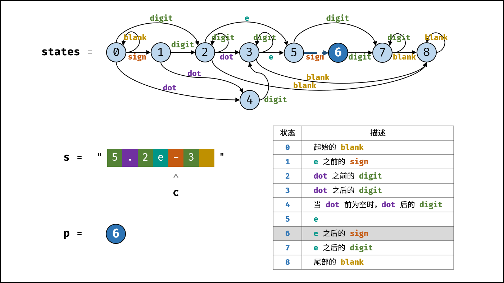

> 原文链接: https://leetcode-cn.com/problems/biao-shi-shu-zhi-de-zi-fu-chuan-lcof


## 中文题目
<div><p>请实现一个函数用来判断字符串是否表示<strong>数值</strong>（包括整数和小数）。</p>

<p><strong>数值</strong>（按顺序）可以分成以下几个部分：</p>

<ol>
	<li>若干空格</li>
	<li>一个 <strong>小数</strong> 或者 <strong>整数</strong></li>
	<li>（可选）一个 <code>'e'</code> 或 <code>'E'</code> ，后面跟着一个 <strong>整数</strong></li>
	<li>若干空格</li>
</ol>

<p><strong>小数</strong>（按顺序）可以分成以下几个部分：</p>

<ol>
	<li>（可选）一个符号字符（<code>'+'</code> 或 <code>'-'</code>）</li>
	<li>下述格式之一：
	<ol>
		<li>至少一位数字，后面跟着一个点 <code>'.'</code></li>
		<li>至少一位数字，后面跟着一个点 <code>'.'</code> ，后面再跟着至少一位数字</li>
		<li>一个点 <code>'.'</code> ，后面跟着至少一位数字</li>
	</ol>
	</li>
</ol>

<p><strong>整数</strong>（按顺序）可以分成以下几个部分：</p>

<ol>
	<li>（可选）一个符号字符（<code>'+'</code> 或 <code>'-'</code>）</li>
	<li>至少一位数字</li>
</ol>

<p>部分<strong>数值</strong>列举如下：</p>

<ul>
	<li><code>["+100", "5e2", "-123", "3.1416", "-1E-16", "0123"]</code></li>
</ul>

<p>部分<strong>非数值</strong>列举如下：</p>

<ul>
	<li><code>["12e", "1a3.14", "1.2.3", "+-5", "12e+5.4"]</code></li>
</ul>

<p> </p>

<p><strong>示例 1：</strong></p>

<pre>
<strong>输入：</strong>s = "0"
<strong>输出：</strong>true
</pre>

<p><strong>示例 2：</strong></p>

<pre>
<strong>输入：</strong>s = "e"
<strong>输出：</strong>false
</pre>

<p><strong>示例 3：</strong></p>

<pre>
<strong>输入：</strong>s = "."
<strong>输出：</strong>false</pre>

<p><strong>示例 4：</strong></p>

<pre>
<strong>输入：</strong>s = "    .1  "
<strong>输出：</strong>true
</pre>

<p> </p>

<p><strong>提示：</strong></p>

<ul>
	<li><code>1 <= s.length <= 20</code></li>
	<li><code>s</code> 仅含英文字母（大写和小写），数字（<code>0-9</code>），加号 <code>'+'</code> ，减号 <code>'-'</code> ，空格 <code>' '</code> 或者点 <code>'.'</code> 。</li>
</ul>
</div>

## 通过代码
<RecoDemo>
</RecoDemo>


## 高赞题解
#### 解题思路：

本题使用有限状态自动机。根据字符类型和合法数值的特点，先定义状态，再画出状态转移图，最后编写代码即可。

**字符类型：**

空格 「   」、数字「 $0—9$ 」 、正负号 「 $+-$ 」 、小数点 「 $.$ 」 、幂符号 「 $eE$ 」 。

**状态定义：**

按照字符串从左到右的顺序，定义以下 9 种状态。

0. 开始的空格
1. 幂符号前的正负号
2. 小数点前的数字
3. 小数点、小数点后的数字
4. 当小数点前为空格时，小数点、小数点后的数字
5. 幂符号
6. 幂符号后的正负号
7. 幂符号后的数字
8. 结尾的空格

**结束状态：** 

合法的结束状态有 2, 3, 7, 8 。

{:width=650}

##### 算法流程：

1. **初始化：**
   1. **状态转移表 $states$ ：** 设 $states[i]$ ，其中 $i$ 为所处状态， $states[i]$ 使用哈希表存储可转移至的状态。键值对 $(key, value)$ 含义：若输入 $key$ ，则可从状态 $i$ 转移至状态 $value$ 。
   2. **当前状态 $p$ ：** 起始状态初始化为 $p = 0$ 。

2. **状态转移循环：** 遍历字符串 $s$ 的每个字符 $c$ 。
   1. **记录字符类型 $t$ ：** 分为四种情况。
      - 当 $c$ 为正负号时，执行 `t = 's'` ;
      - 当 $c$ 为数字时，执行 `t = 'd'` ;
      - 当 $c$ 为 `e` , `E` 时，执行 `t = 'e'` ;
      - 当 $c$ 为 `.` , `空格` 时，执行 `t = c` （即用字符本身表示字符类型）;
      - 否则，执行 `t = '?'` ，代表为不属于判断范围的非法字符，后续直接返回 $false$ 。
   2. **终止条件：** 若字符类型 $t$ 不在哈希表 $states[p]$ 中，说明无法转移至下一状态，因此直接返回 $False$ 。
   3. **状态转移：** 状态 $p$ 转移至 $states[p][t]$ 。

3. **返回值：** 跳出循环后，若状态 $p \in {2, 3, 7, 8}$ ，说明结尾合法，返回 $True$ ，否则返回 $False$ 。

##### 复杂度分析：

- **时间复杂度 $O(N)$ ：** 其中 $N$ 为字符串 $s$ 的长度，判断需遍历字符串，每轮状态转移的使用 $O(1)$ 时间。
- **空间复杂度 $O(1)$ ：** $states$ 和 $p$ 使用常数大小的额外空间。

<,,,,,,,,>


#### 代码：

Java 的状态转移表 $states$ 使用 $Map[]$ 数组存储。

```Python []
class Solution:
    def isNumber(self, s: str) -> bool:
        states = [
            { ' ': 0, 's': 1, 'd': 2, '.': 4 }, # 0. start with 'blank'
            { 'd': 2, '.': 4 } ,                # 1. 'sign' before 'e'
            { 'd': 2, '.': 3, 'e': 5, ' ': 8 }, # 2. 'digit' before 'dot'
            { 'd': 3, 'e': 5, ' ': 8 },         # 3. 'digit' after 'dot'
            { 'd': 3 },                         # 4. 'digit' after 'dot' (‘blank’ before 'dot')
            { 's': 6, 'd': 7 },                 # 5. 'e'
            { 'd': 7 },                         # 6. 'sign' after 'e'
            { 'd': 7, ' ': 8 },                 # 7. 'digit' after 'e'
            { ' ': 8 }                          # 8. end with 'blank'
        ]
        p = 0                           # start with state 0
        for c in s:
            if '0' <= c <= '9': t = 'd' # digit
            elif c in "+-": t = 's'     # sign
            elif c in "eE": t = 'e'     # e or E
            elif c in ". ": t = c       # dot, blank
            else: t = '?'               # unknown
            if t not in states[p]: return False
            p = states[p][t]
        return p in (2, 3, 7, 8)
```

```Java []
class Solution {
    public boolean isNumber(String s) {
        Map[] states = {
            new HashMap<>() {{ put(' ', 0); put('s', 1); put('d', 2); put('.', 4); }}, // 0.
            new HashMap<>() {{ put('d', 2); put('.', 4); }},                           // 1.
            new HashMap<>() {{ put('d', 2); put('.', 3); put('e', 5); put(' ', 8); }}, // 2.
            new HashMap<>() {{ put('d', 3); put('e', 5); put(' ', 8); }},              // 3.
            new HashMap<>() {{ put('d', 3); }},                                        // 4.
            new HashMap<>() {{ put('s', 6); put('d', 7); }},                           // 5.
            new HashMap<>() {{ put('d', 7); }},                                        // 6.
            new HashMap<>() {{ put('d', 7); put(' ', 8); }},                           // 7.
            new HashMap<>() {{ put(' ', 8); }}                                         // 8.
        };
        int p = 0;
        char t;
        for(char c : s.toCharArray()) {
            if(c >= '0' && c <= '9') t = 'd';
            else if(c == '+' || c == '-') t = 's';
            else if(c == 'e' || c == 'E') t = 'e';
            else if(c == '.' || c == ' ') t = c;
            else t = '?';
            if(!states[p].containsKey(t)) return false;
            p = (int)states[p].get(t);
        }
        return p == 2 || p == 3 || p == 7 || p == 8;
    }
}
```

## 统计信息
| 通过次数 | 提交次数 | AC比率 |
| :------: | :------: | :------: |
|    82047    |    335848    |   24.4%   |

## 提交历史
| 提交时间 | 提交结果 | 执行时间 |  内存消耗  | 语言 |
| :------: | :------: | :------: | :--------: | :--------: |
