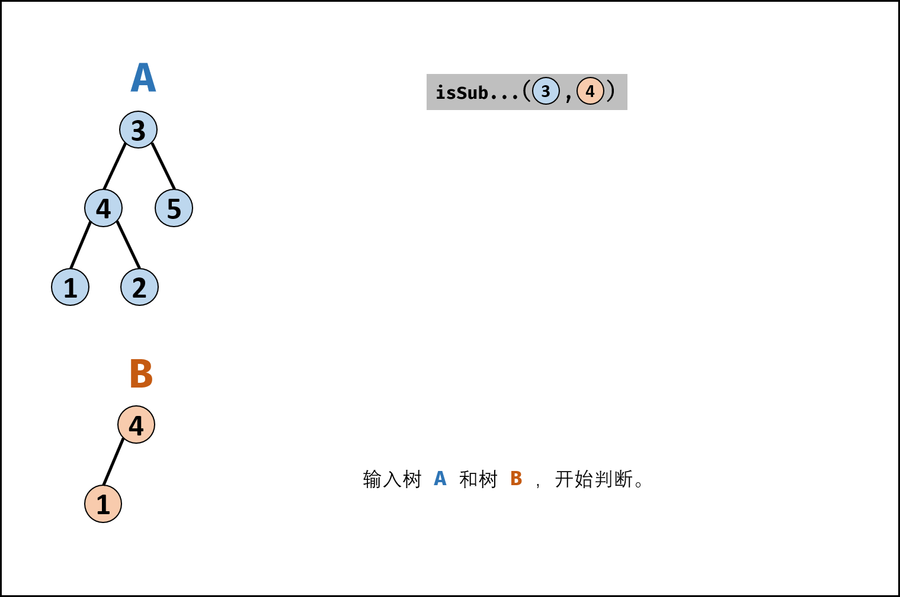
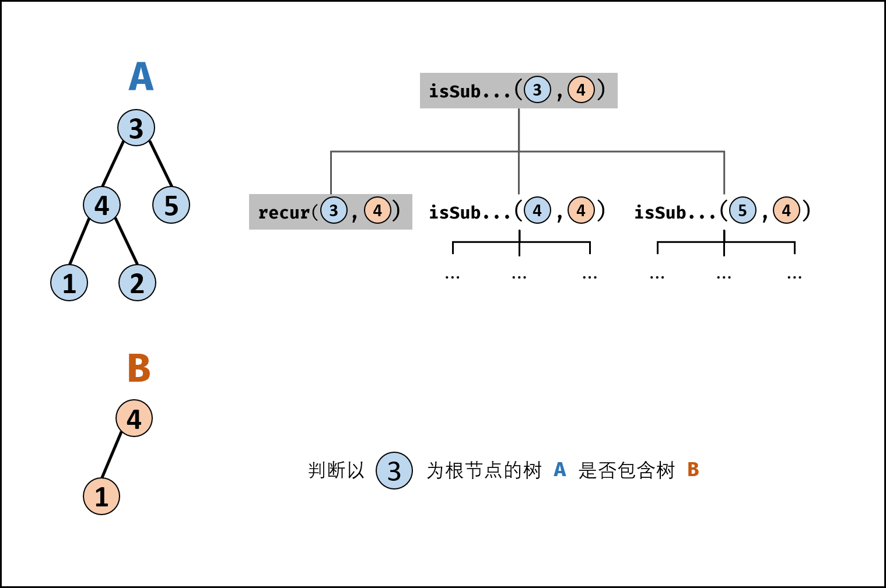
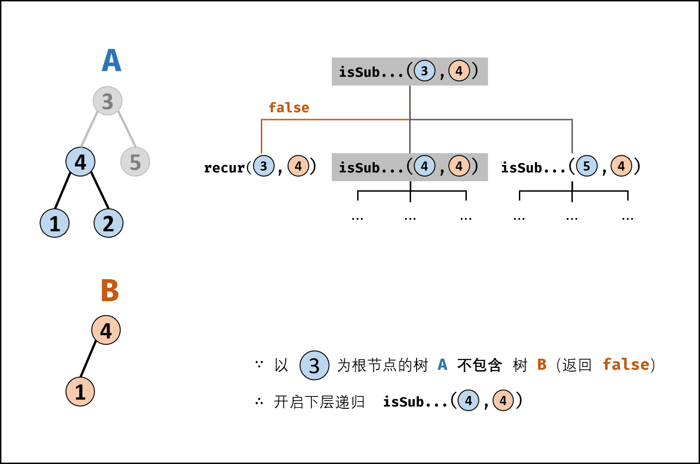
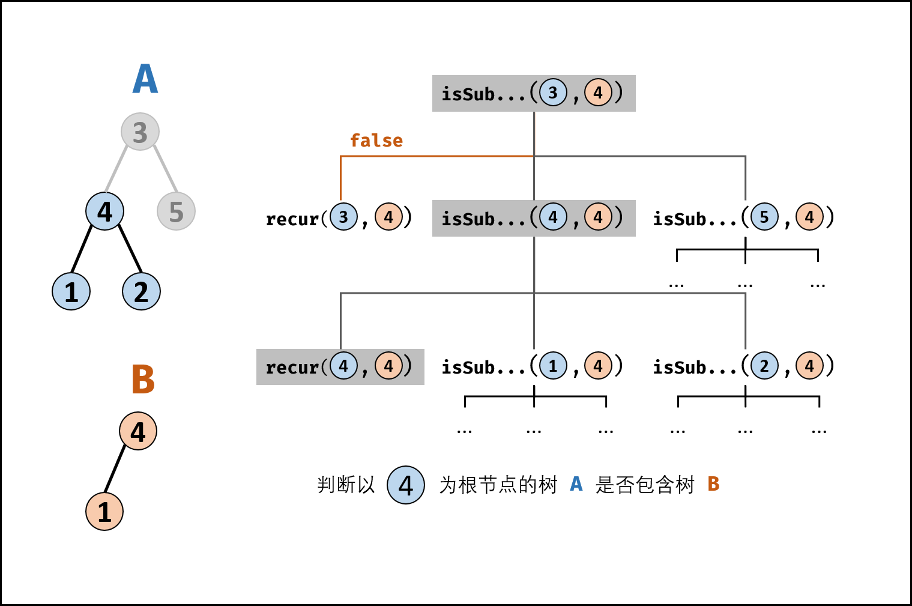
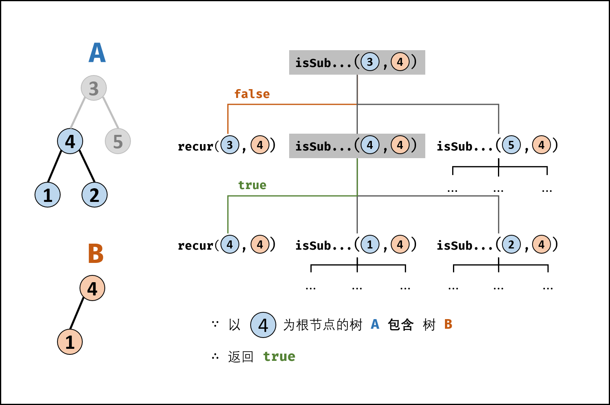
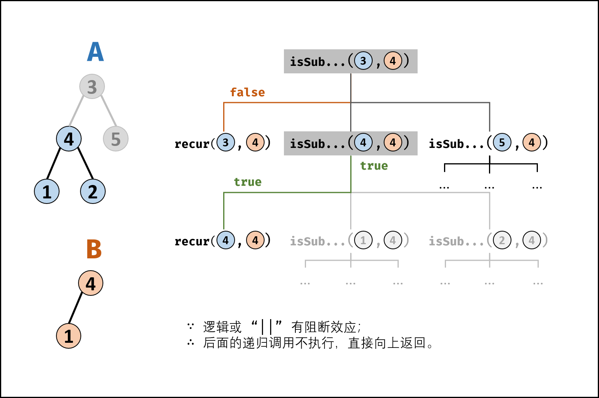
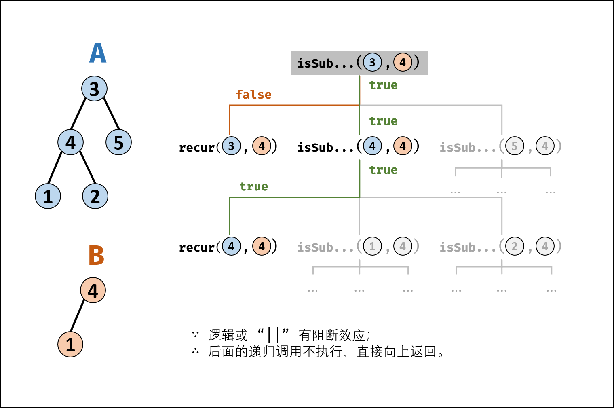
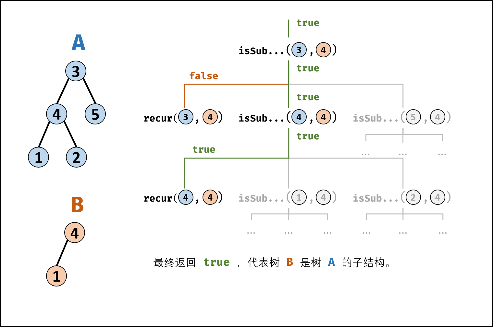

> 原文链接: https://leetcode-cn.com/problems/shu-de-zi-jie-gou-lcof


## 中文题目
<div><p>输入两棵二叉树A和B，判断B是不是A的子结构。(约定空树不是任意一个树的子结构)</p>

<p>B是A的子结构， 即 A中有出现和B相同的结构和节点值。</p>

<p>例如:<br>
给定的树 A:</p>

<p><code>&nbsp; &nbsp; &nbsp;3<br>
&nbsp; &nbsp; / \<br>
&nbsp; &nbsp;4 &nbsp; 5<br>
&nbsp; / \<br>
&nbsp;1 &nbsp; 2</code><br>
给定的树 B：</p>

<p><code>&nbsp; &nbsp;4&nbsp;<br>
&nbsp; /<br>
&nbsp;1</code><br>
返回 true，因为 B 与 A 的一个子树拥有相同的结构和节点值。</p>

<p><strong>示例 1：</strong></p>

<pre><strong>输入：</strong>A = [1,2,3], B = [3,1]
<strong>输出：</strong>false
</pre>

<p><strong>示例 2：</strong></p>

<pre><strong>输入：</strong>A = [3,4,5,1,2], B = [4,1]
<strong>输出：</strong>true</pre>

<p><strong>限制：</strong></p>

<p><code>0 &lt;= 节点个数 &lt;= 10000</code></p>
</div>

## 通过代码
<RecoDemo>
</RecoDemo>


## 高赞题解
#### 解题思路：

若树 $B$ 是树 $A$ 的子结构，则子结构的根节点可能为树 $A$ 的任意一个节点。因此，判断树 $B$ 是否是树 $A$ 的子结构，需完成以下两步工作：

1. 先序遍历树 $A$ 中的每个节点 $n_A$ ；（对应函数 `isSubStructure(A, B)`）
2. 判断树 $A$ 中 **以 $n_A$ 为根节点的子树** 是否包含树 $B$ 。（对应函数 `recur(A, B)`）

{:width=450}

##### 算法流程：

> 名词规定：**树 $A$** 的根节点记作 **节点 $A$** ，**树 $B$** 的根节点称为 **节点 $B$**  。  

**`recur(A, B)` 函数：**

1. **终止条件：**
    1. 当节点 $B$ 为空：说明树 $B$ 已匹配完成（越过叶子节点），因此返回 $true$ ；
    2. 当节点 $A$ 为空：说明已经越过树 $A$ 叶子节点，即匹配失败，返回 $false$ ；
    3. 当节点 $A$ 和 $B$ 的值不同：说明匹配失败，返回 $false$ ；
2. **返回值：**
    1. 判断 $A$ 和 $B$ 的**左**子节点是否相等，即 `recur(A.left, B.left)` ；
    2. 判断 $A$ 和 $B$ 的**右**子节点是否相等，即 `recur(A.right, B.right)` ；

**`isSubStructure(A, B)` 函数：**

1. **特例处理：** 当 树 $A$ 为空 **或** 树 $B$ 为空 时，直接返回 $false$ ；
2. **返回值：** 若树 $B$ 是树 $A$ 的子结构，则必满足以下三种情况之一，因此用或 `||` 连接；
    1. 以 **节点 $A$ 为根节点的子树** 包含树 $B$ ，对应 `recur(A, B)`；
    2. 树 $B$ 是 **树 $A$ 左子树** 的子结构，对应 `isSubStructure(A.left, B)`；
    3. 树 $B$ 是 **树 $A$ 右子树** 的子结构，对应 `isSubStructure(A.right, B)`；
    > 以上 `2.` `3.` 实质上是在对树 $A$ 做 **先序遍历** 。

<,,,,,,,>

##### 复杂度分析：

- **时间复杂度 $O(MN)$ ：** 其中 $M,N$ 分别为树 $A$ 和 树 $B$ 的节点数量；先序遍历树 $A$ 占用 $O(M)$ ，每次调用 `recur(A, B)` 判断占用 $O(N)$  。
- **空间复杂度 $O(M)$ ：** 当树 $A$ 和树 $B$ 都退化为链表时，递归调用深度最大。当 $M \leq N$ 时，遍历树 $A$ 与递归判断的总递归深度为 $M$ ；当 $M>N$ 时，最差情况为遍历至树 $A$ 叶子节点，此时总递归深度为 $M$。

#### 代码：

```python []
class Solution:
    def isSubStructure(self, A: TreeNode, B: TreeNode) -> bool:
        def recur(A, B):
            if not B: return True
            if not A or A.val != B.val: return False
            return recur(A.left, B.left) and recur(A.right, B.right)

        return bool(A and B) and (recur(A, B) or self.isSubStructure(A.left, B) or self.isSubStructure(A.right, B))
```

```java []
class Solution {
    public boolean isSubStructure(TreeNode A, TreeNode B) {
        return (A != null && B != null) && (recur(A, B) || isSubStructure(A.left, B) || isSubStructure(A.right, B));
    }
    boolean recur(TreeNode A, TreeNode B) {
        if(B == null) return true;
        if(A == null || A.val != B.val) return false;
        return recur(A.left, B.left) && recur(A.right, B.right);
    }
}
```

## 统计信息
| 通过次数 | 提交次数 | AC比率 |
| :------: | :------: | :------: |
|    159380    |    342131    |   46.6%   |

## 提交历史
| 提交时间 | 提交结果 | 执行时间 |  内存消耗  | 语言 |
| :------: | :------: | :------: | :--------: | :--------: |
