> 原文链接: https://leetcode-cn.com/problems/zhan-de-ya-ru-dan-chu-xu-lie-lcof


## 中文题目
<div><p>输入两个整数序列，第一个序列表示栈的压入顺序，请判断第二个序列是否为该栈的弹出顺序。假设压入栈的所有数字均不相等。例如，序列 {1,2,3,4,5} 是某栈的压栈序列，序列 {4,5,3,2,1} 是该压栈序列对应的一个弹出序列，但 {4,3,5,1,2} 就不可能是该压栈序列的弹出序列。</p>

<p>&nbsp;</p>

<p><strong>示例 1：</strong></p>

<pre><strong>输入：</strong>pushed = [1,2,3,4,5], popped = [4,5,3,2,1]
<strong>输出：</strong>true
<strong>解释：</strong>我们可以按以下顺序执行：
push(1), push(2), push(3), push(4), pop() -&gt; 4,
push(5), pop() -&gt; 5, pop() -&gt; 3, pop() -&gt; 2, pop() -&gt; 1
</pre>

<p><strong>示例 2：</strong></p>

<pre><strong>输入：</strong>pushed = [1,2,3,4,5], popped = [4,3,5,1,2]
<strong>输出：</strong>false
<strong>解释：</strong>1 不能在 2 之前弹出。
</pre>

<p>&nbsp;</p>

<p><strong>提示：</strong></p>

<ol>
	<li><code>0 &lt;= pushed.length == popped.length &lt;= 1000</code></li>
	<li><code>0 &lt;= pushed[i], popped[i] &lt; 1000</code></li>
	<li><code>pushed</code>&nbsp;是&nbsp;<code>popped</code>&nbsp;的排列。</li>
</ol>

<p>注意：本题与主站 946 题相同：<a href="https://leetcode-cn.com/problems/validate-stack-sequences/">https://leetcode-cn.com/problems/validate-stack-sequences/</a></p>
</div>

## 通过代码
<RecoDemo>
</RecoDemo>


## 高赞题解
#### 解题思路：

如下图所示，给定一个压入序列 $pushed$ 和弹出序列 $popped$ ，则压入 / 弹出操作的顺序（即排列）是 **唯一确定** 的。

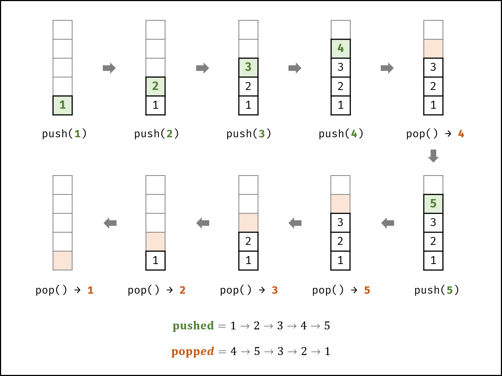{:width=500}

如下图所示，栈的数据操作具有 **先入后出** 的特性，因此某些弹出序列是无法实现的。

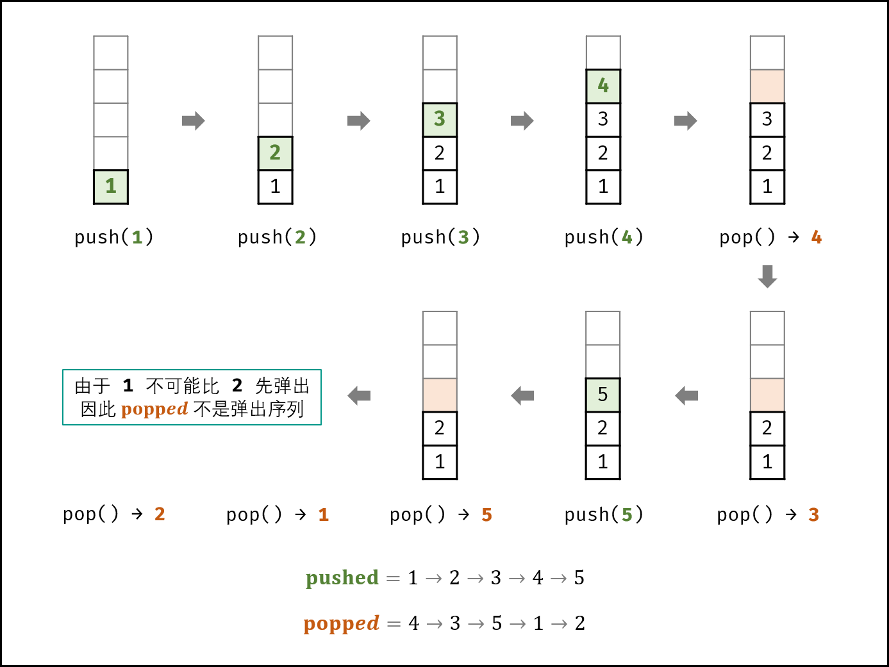{:width=500}

考虑借用一个辅助栈 $stack$ ，**模拟** 压入 / 弹出操作的排列。根据是否模拟成功，即可得到结果。

- **入栈操作：** 按照压栈序列的顺序执行。
- **出栈操作：** 每次入栈后，循环判断 “栈顶元素 $=$ 弹出序列的当前元素” 是否成立，将符合弹出序列顺序的栈顶元素全部弹出。

> 由于题目规定 `栈的所有数字均不相等` ，因此在循环入栈中，每个元素出栈的位置的可能性是唯一的（若有重复数字，则具有多个可出栈的位置）。因而，在遇到 “栈顶元素 $=$ 弹出序列的当前元素” 就应立即执行出栈。

##### 算法流程：

1. **初始化：** 辅助栈 $stack$ ，弹出序列的索引 $i$ ；
2. **遍历压栈序列：** 各元素记为 $num$ ；
   1. 元素 $num$ 入栈；
   2. 循环出栈：若 $stack$ 的栈顶元素 $=$ 弹出序列元素 $popped[i]$ ，则执行出栈与 $i++$ ；
3. **返回值：** 若 $stack$ 为空，则此弹出序列合法。

##### 复杂度分析：

- **时间复杂度 $O(N)$ ：** 其中 $N$ 为列表 $pushed$ 的长度；每个元素最多入栈与出栈一次，即最多共 $2N$ 次出入栈操作。
- **空间复杂度 $O(N)$ ：** 辅助栈 $stack$ 最多同时存储 $N$ 个元素。

<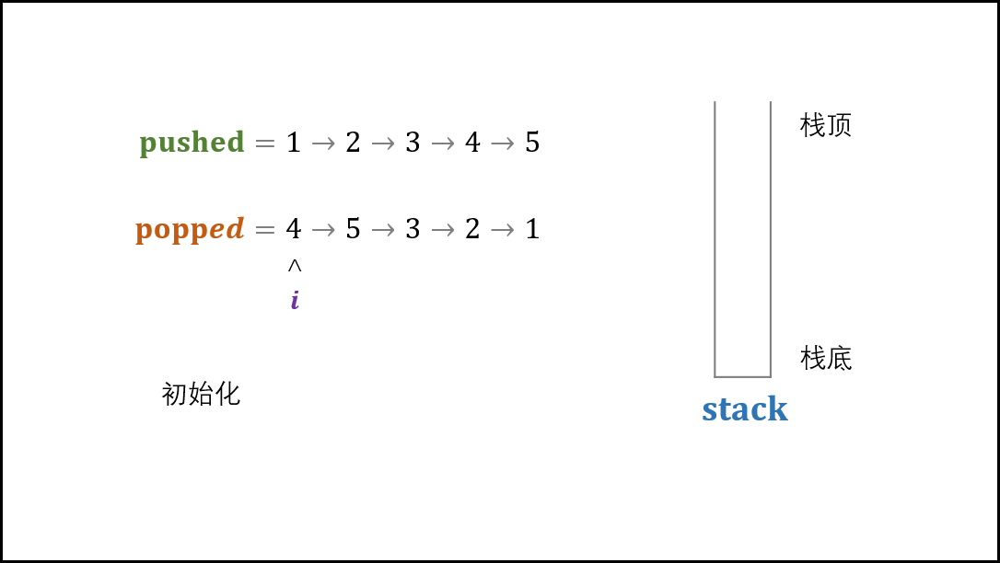,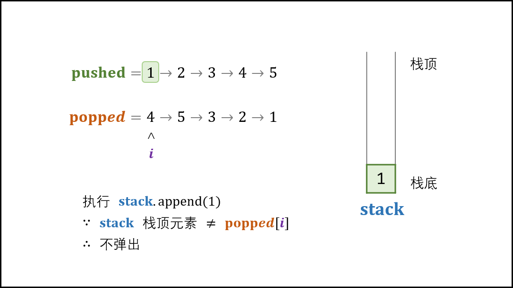,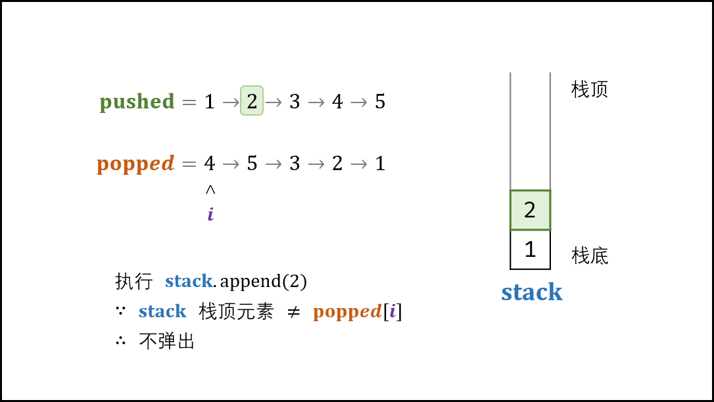,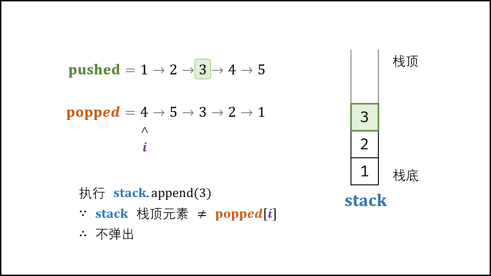,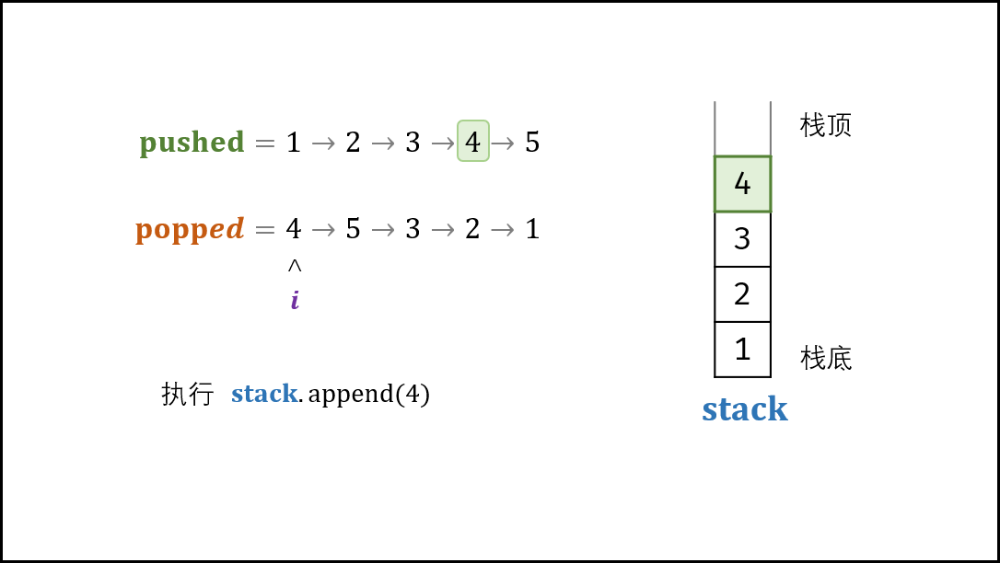,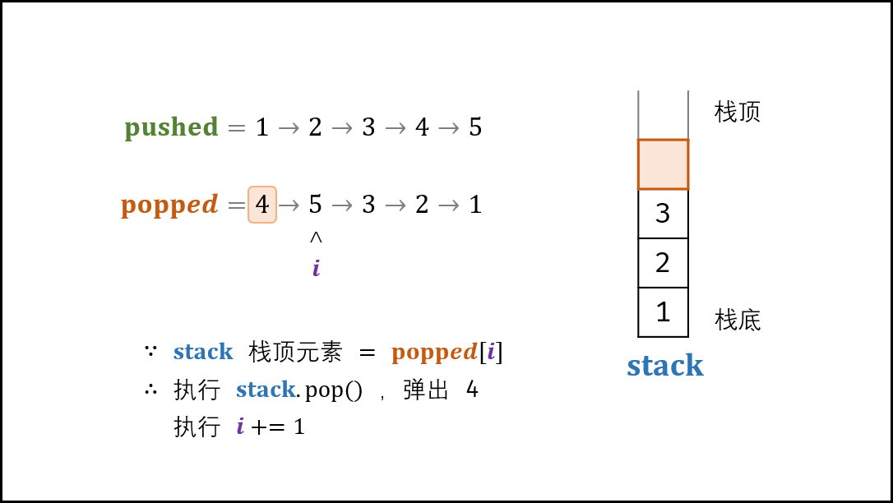,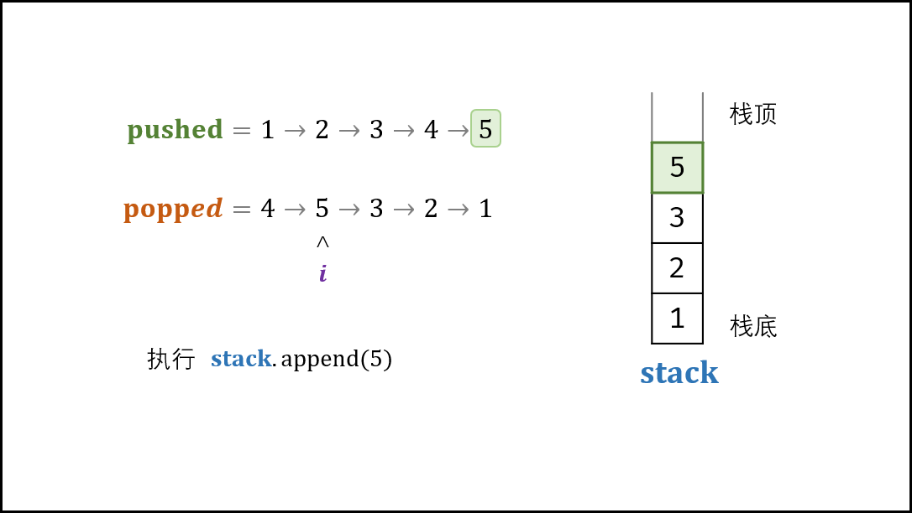,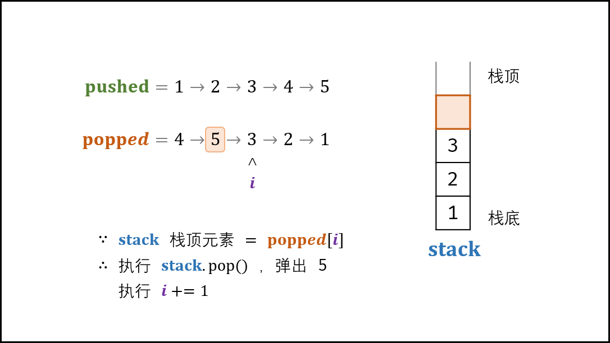,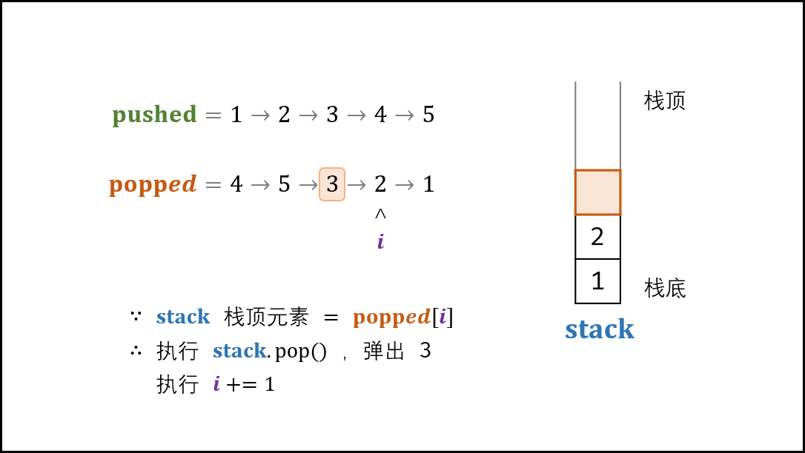,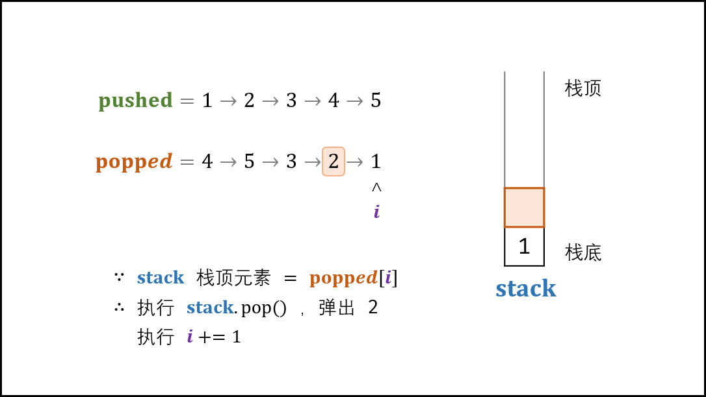,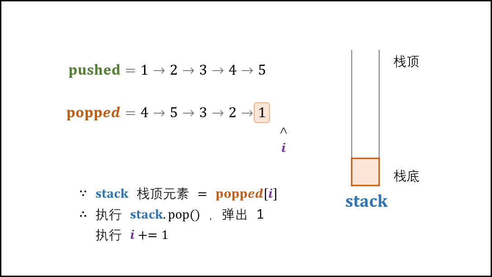,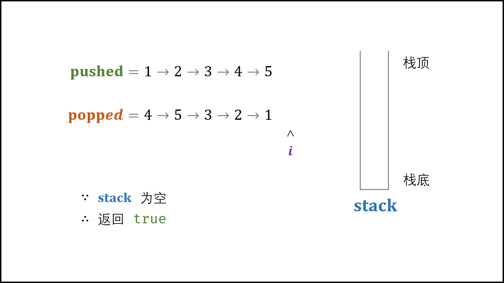>

#### 代码：

> 题目指出 `pushed 是 popped 的排列` 。因此，无需考虑 $pushed$ 和 $popped$ **长度不同** 或 **包含元素不同** 的情况。

```python []
class Solution:
    def validateStackSequences(self, pushed: List[int], popped: List[int]) -> bool:
        stack, i = [], 0
        for num in pushed:
            stack.append(num) # num 入栈
            while stack and stack[-1] == popped[i]: # 循环判断与出栈
                stack.pop()
                i += 1
        return not stack
```

```java []
class Solution {
    public boolean validateStackSequences(int[] pushed, int[] popped) {
        Stack<Integer> stack = new Stack<>();
        int i = 0;
        for(int num : pushed) {
            stack.push(num); // num 入栈
            while(!stack.isEmpty() && stack.peek() == popped[i]) { // 循环判断与出栈
                stack.pop();
                i++;
            }
        }
        return stack.isEmpty();
    }
}
```

## 统计信息
| 通过次数 | 提交次数 | AC比率 |
| :------: | :------: | :------: |
|    120877    |    196296    |   61.6%   |

## 提交历史
| 提交时间 | 提交结果 | 执行时间 |  内存消耗  | 语言 |
| :------: | :------: | :------: | :--------: | :--------: |
