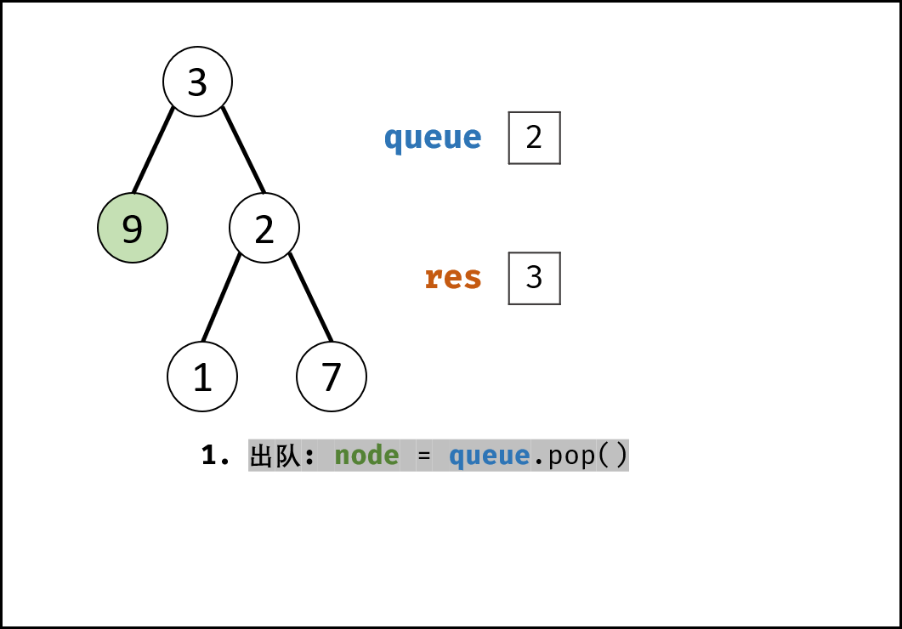
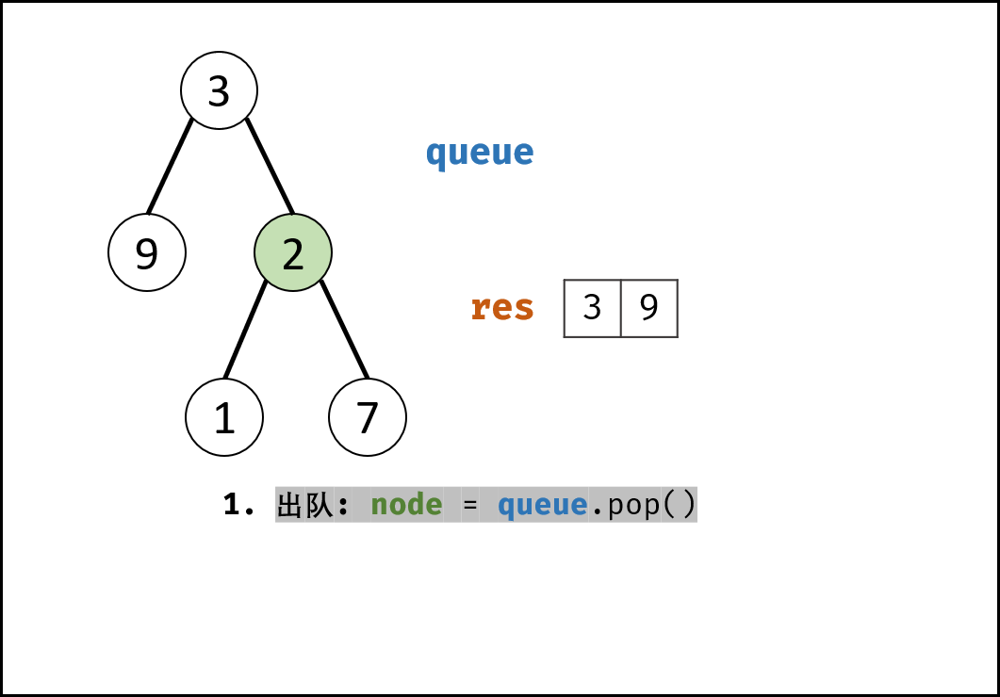
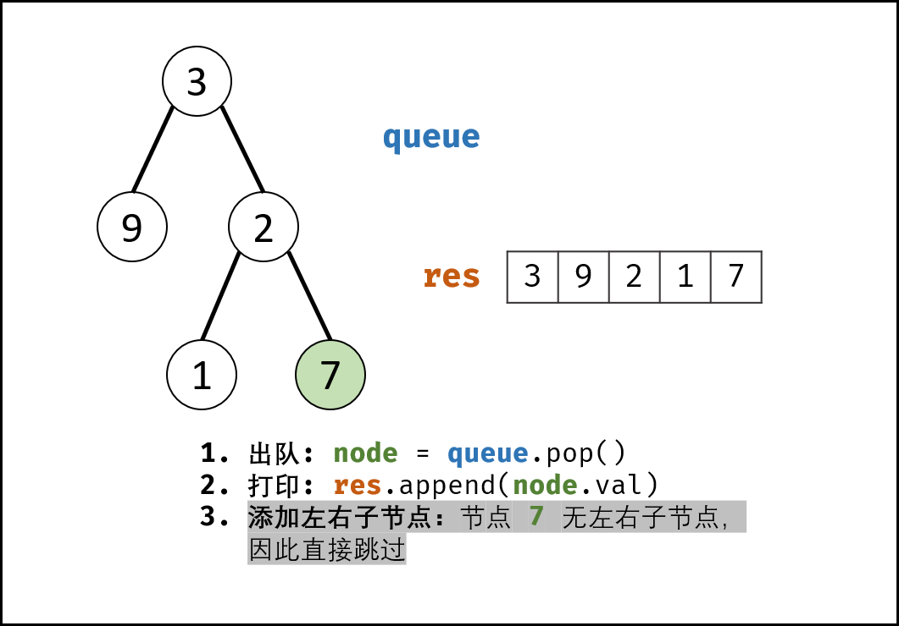

> 原文链接: https://leetcode-cn.com/problems/cong-shang-dao-xia-da-yin-er-cha-shu-lcof


## 中文题目
<div><p>从上到下打印出二叉树的每个节点，同一层的节点按照从左到右的顺序打印。</p>

<p>&nbsp;</p>

<p>例如:<br>
给定二叉树:&nbsp;<code>[3,9,20,null,null,15,7]</code>,</p>

<pre>    3
   / \
  9  20
    /  \
   15   7
</pre>

<p>返回：</p>

<pre>[3,9,20,15,7]
</pre>

<p>&nbsp;</p>

<p><strong>提示：</strong></p>

<ol>
	<li><code>节点总数 &lt;= 1000</code></li>
</ol>
</div>

## 通过代码
<RecoDemo>
</RecoDemo>


## 高赞题解
#### 解题思路：

- 题目要求的二叉树的 **从上至下** 打印（即按层打印），又称为二叉树的 **广度优先搜索**（BFS）。
- BFS 通常借助 **队列** 的先入先出特性来实现。

{:width=400}

##### 算法流程：

1. **特例处理：** 当树的根节点为空，则直接返回空列表 `[]` ；
2. **初始化：** 打印结果列表 `res = []` ，包含根节点的队列 `queue = [root]` ；
3. **BFS 循环：** 当队列 `queue` 为空时跳出；
    1. **出队：** 队首元素出队，记为 `node`；
    2. **打印：** 将 `node.val` 添加至列表 `tmp` 尾部；
    3. **添加子节点：** 若 `node` 的左（右）子节点不为空，则将左（右）子节点加入队列 `queue` ；
4. **返回值：** 返回打印结果列表 `res` 即可。

<,,,,,,,,,,,,,,,,>

##### 复杂度分析：

- **时间复杂度 $O(N)$ ：** $N$ 为二叉树的节点数量，即 BFS 需循环 $N$ 次。
- **空间复杂度 $O(N)$ ：** 最差情况下，即当树为平衡二叉树时，最多有 $N/2$ 个树节点**同时**在 `queue` 中，使用 $O(N)$ 大小的额外空间。

#### 代码：

> Python 中使用 collections 中的双端队列 `deque()` ，其 `popleft()` 方法可达到 $O(1)$ 时间复杂度；列表 list 的 `pop(0)` 方法时间复杂度为 $O(N)$ 。

```python []
class Solution:
    def levelOrder(self, root: TreeNode) -> List[int]:
        if not root: return []
        res, queue = [], collections.deque()
        queue.append(root)
        while queue:
            node = queue.popleft()
            res.append(node.val)
            if node.left: queue.append(node.left)
            if node.right: queue.append(node.right)
        return res
```

```java []
class Solution {
    public int[] levelOrder(TreeNode root) {
        if(root == null) return new int[0];
        Queue<TreeNode> queue = new LinkedList<>(){{ add(root); }};
        ArrayList<Integer> ans = new ArrayList<>();
        while(!queue.isEmpty()) {
            TreeNode node = queue.poll();
            ans.add(node.val);
            if(node.left != null) queue.add(node.left);
            if(node.right != null) queue.add(node.right);
        }
        int[] res = new int[ans.size()];
        for(int i = 0; i < ans.size(); i++)
            res[i] = ans.get(i);
        return res;
    }
}
```

## 统计信息
| 通过次数 | 提交次数 | AC比率 |
| :------: | :------: | :------: |
|    151036    |    235341    |   64.2%   |

## 提交历史
| 提交时间 | 提交结果 | 执行时间 |  内存消耗  | 语言 |
| :------: | :------: | :------: | :--------: | :--------: |
