> 原文链接: https://leetcode-cn.com/problems/er-cha-sou-suo-shu-de-hou-xu-bian-li-xu-lie-lcof


## 中文题目
<div><p>输入一个整数数组，判断该数组是不是某二叉搜索树的后序遍历结果。如果是则返回&nbsp;<code>true</code>，否则返回&nbsp;<code>false</code>。假设输入的数组的任意两个数字都互不相同。</p>

<p>&nbsp;</p>

<p>参考以下这颗二叉搜索树：</p>

<pre>     5
    / \
   2   6
  / \
 1   3</pre>

<p><strong>示例 1：</strong></p>

<pre><strong>输入: </strong>[1,6,3,2,5]
<strong>输出: </strong>false</pre>

<p><strong>示例 2：</strong></p>

<pre><strong>输入: </strong>[1,3,2,6,5]
<strong>输出: </strong>true</pre>

<p>&nbsp;</p>

<p><strong>提示：</strong></p>

<ol>
	<li><code>数组长度 &lt;= 1000</code></li>
</ol>
</div>

## 通过代码
<RecoDemo>
</RecoDemo>


## 高赞题解
#### 解题思路：

- **后序遍历定义：** `[ 左子树 | 右子树 | 根节点 ]` ，即遍历顺序为 “左、右、根” 。
- **二叉搜索树定义：** 左子树中所有节点的值 $<$ 根节点的值；右子树中所有节点的值 $>$ 根节点的值；其左、右子树也分别为二叉搜索树。

{:width=400}

#### 方法一：递归分治

- 根据二叉搜索树的定义，可以通过递归，判断所有子树的 **正确性** （即其后序遍历是否满足二叉搜索树的定义） ，若所有子树都正确，则此序列为二叉搜索树的后序遍历。

##### 递归解析：

- **终止条件：** 当 $i \geq j$ ，说明此子树节点数量 $\leq 1$ ，无需判别正确性，因此直接返回 $true$ ；
- **递推工作：**
  1. **划分左右子树：** 遍历后序遍历的 $[i, j]$ 区间元素，寻找 **第一个大于根节点** 的节点，索引记为 $m$ 。此时，可划分出左子树区间 $[i,m-1]$ 、右子树区间 $[m, j - 1]$ 、根节点索引 $j$ 。
  2. **判断是否为二叉搜索树：**
     - **左子树区间** $[i, m - 1]$ 内的所有节点都应 $<$ $postorder[j]$ 。而第 `1.划分左右子树`  步骤已经保证左子树区间的正确性，因此只需要判断右子树区间即可。
     - **右子树区间** $[m, j-1]$ 内的所有节点都应 $>$ $postorder[j]$ 。实现方式为遍历，当遇到 $\leq postorder[j]$ 的节点则跳出；则可通过 $p = j$ 判断是否为二叉搜索树。
- **返回值：** 所有子树都需正确才可判定正确，因此使用 **与逻辑符** $\&\&$ 连接。
  1. **$p = j$ ：** 判断 **此树** 是否正确。
  2. **$recur(i, m - 1)$ ：** 判断 **此树的左子树** 是否正确。
  3. **$recur(m, j - 1)$ ：** 判断 **此树的右子树** 是否正确。

<,,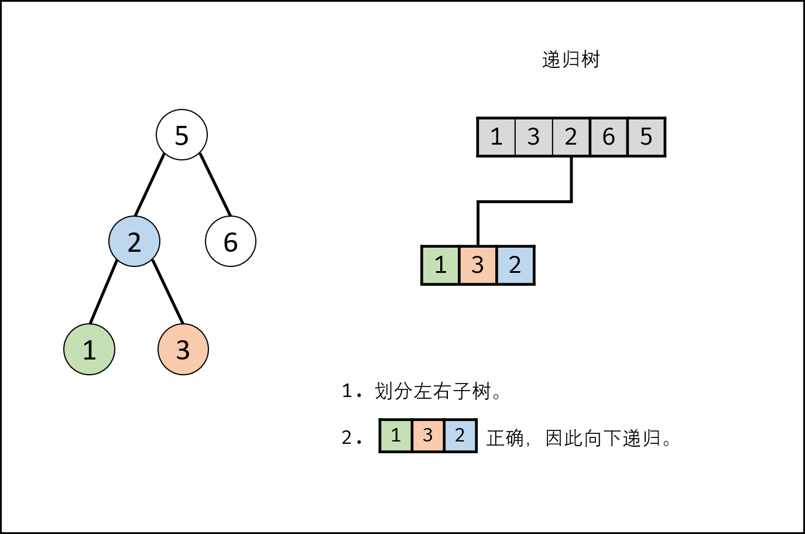,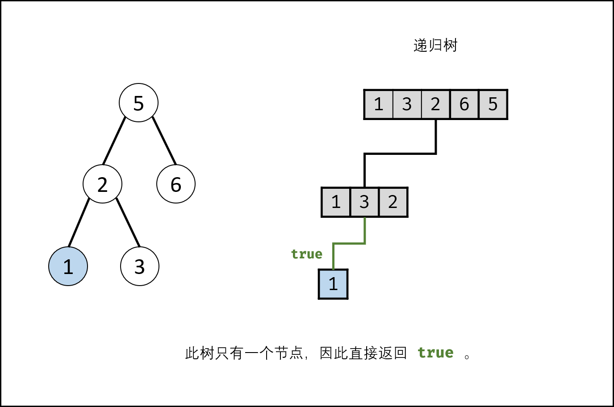,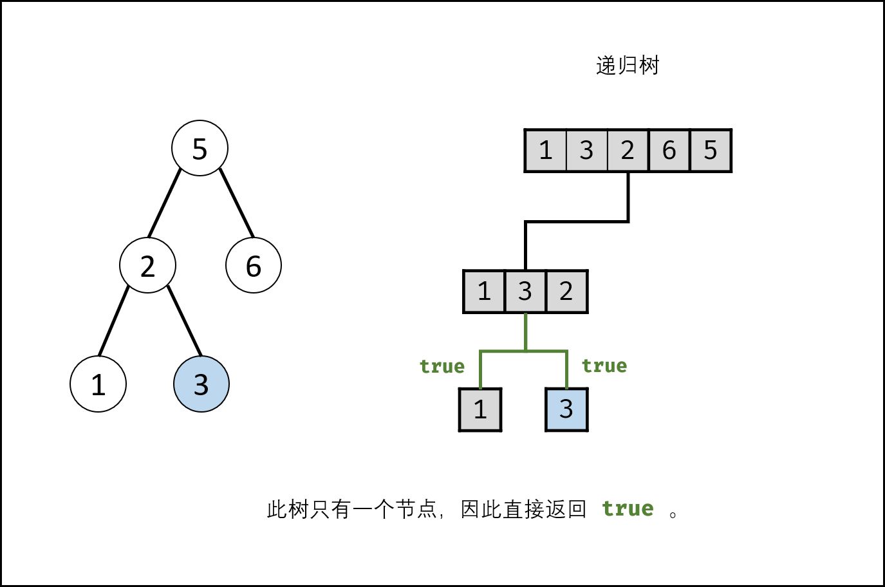,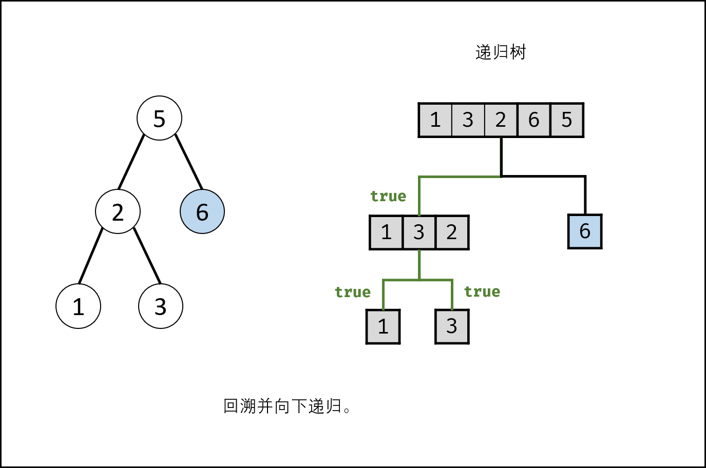,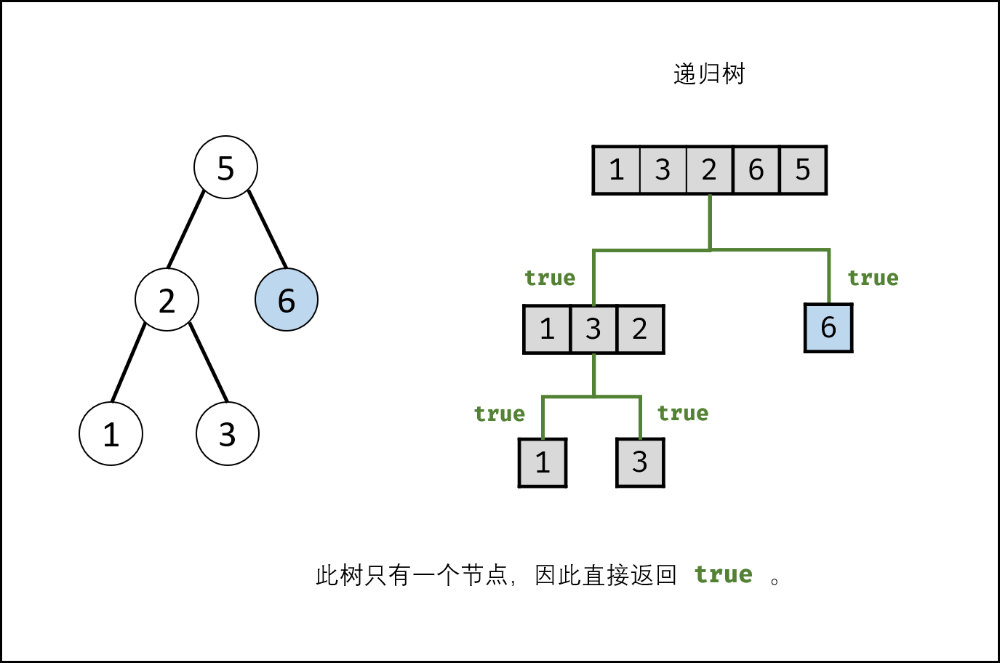,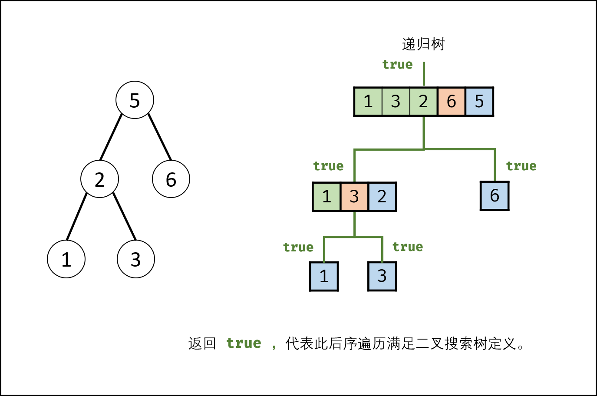>

**复杂度分析：**

- **时间复杂度 $O(N^2)$ ：** 每次调用 $recur(i,j)$ 减去一个根节点，因此递归占用 $O(N)$ ；最差情况下（即当树退化为链表），每轮递归都需遍历树所有节点，占用 $O(N)$ 。
- **空间复杂度 $O(N)$ ：** 最差情况下（即当树退化为链表），递归深度将达到 $N$ 。
<br>

```python []
class Solution:
    def verifyPostorder(self, postorder: [int]) -> bool:
        def recur(i, j):
            if i >= j: return True
            p = i
            while postorder[p] < postorder[j]: p += 1
            m = p
            while postorder[p] > postorder[j]: p += 1
            return p == j and recur(i, m - 1) and recur(m, j - 1)

        return recur(0, len(postorder) - 1)
```

```java []
class Solution {
    public boolean verifyPostorder(int[] postorder) {
        return recur(postorder, 0, postorder.length - 1);
    }
    boolean recur(int[] postorder, int i, int j) {
        if(i >= j) return true;
        int p = i;
        while(postorder[p] < postorder[j]) p++;
        int m = p;
        while(postorder[p] > postorder[j]) p++;
        return p == j && recur(postorder, i, m - 1) && recur(postorder, m, j - 1);
    }
}
```

#### 方法二：辅助单调栈

> 此方法参考于大佬 @失火的夏天 的解析。

- **后序遍历倒序：** `[ 根节点 | 右子树 | 左子树 ]` 。类似 **先序遍历的镜像** ，即先序遍历为 “根、左、右” 的顺序，而后序遍历的倒序为 “根、右、左” 顺序。

{:width=400}

- 设后序遍历倒序列表为 $[r_{n}, r_{n-1},...,r_1]$，遍历此列表，设索引为 $i$ ，若为 **二叉搜索树** ，则有：
  - **当节点值 $r_i > r_{i+1}$ 时：** 节点 $r_i$ 一定是节点 $r_{i+1}$ 的右子节点。
  - **当节点值 $r_i < r_{i+1}$ 时：** 节点 $r_i$ 一定是某节点 $root$ 的左子节点，且 $root$ 为节点 $r_{i+1}, r_{i+2},..., r_{n}$ 中值大于且最接近 $r_i$ 的节点（∵ $root$ **直接连接** 左子节点 $r_i$ ）。
- 当遍历时遇到递减节点 $r_i < r_{i+1}$ ，若为二叉搜索树，则对于后序遍历中节点 $r_i$ 右边的任意节点 $r_x \in [r_{i-1}, r_{i-2}, ..., r_1]$ ，必有节点值 $r_x < root$ 。

> 节点 $r_x$ 只可能为以下两种情况：① $r_x$ 为 $r_i$ 的左、右子树的各节点；② $r_x$ 为 $root$ 的父节点或更高层父节点的左子树的各节点。在二叉搜索树中，以上节点都应小于 $root$ 。

{:width=450}

- 遍历 “后序遍历的倒序” 会多次遇到递减节点 $r_i$ ，若所有的递减节点 $r_i$ 对应的父节点 $root$ 都满足以上条件，则可判定为二叉搜索树。
- 根据以上特点，考虑借助 **单调栈** 实现：
  1. 借助一个单调栈 $stack$ 存储值递增的节点；
  2. 每当遇到值递减的节点 $r_i$ ，则通过出栈来更新节点 $r_i$ 的父节点 $root$ ；
  3. 每轮判断 $r_i$ 和 $root$  的值关系：
     1. 若 $r_i > root$ 则说明不满足二叉搜索树定义，直接返回 $false$ 。
     2. 若 $r_i < root$ 则说明满足二叉搜索树定义，则继续遍历。

##### 算法流程：

1. **初始化：** 单调栈 $stack$ ，父节点值 $root = +\infin$ （初始值为正无穷大，可把树的根节点看为此无穷大节点的左孩子）；
2. **倒序遍历 $postorder$** ：记每个节点为 $r_i$；
   1. **判断：** 若 $r_i>root$ ，说明此后序遍历序列不满足二叉搜索树定义，直接返回 $false$ ；
   2. **更新父节点 $root$ ：** 当栈不为空 **且** $r_i<stack.peek()$ 时，循环执行出栈，并将出栈节点赋给 $root$ 。
   3. **入栈：** 将当前节点 $r_i$ 入栈；
3. 若遍历完成，则说明后序遍历满足二叉搜索树定义，返回 $true$ 。

<,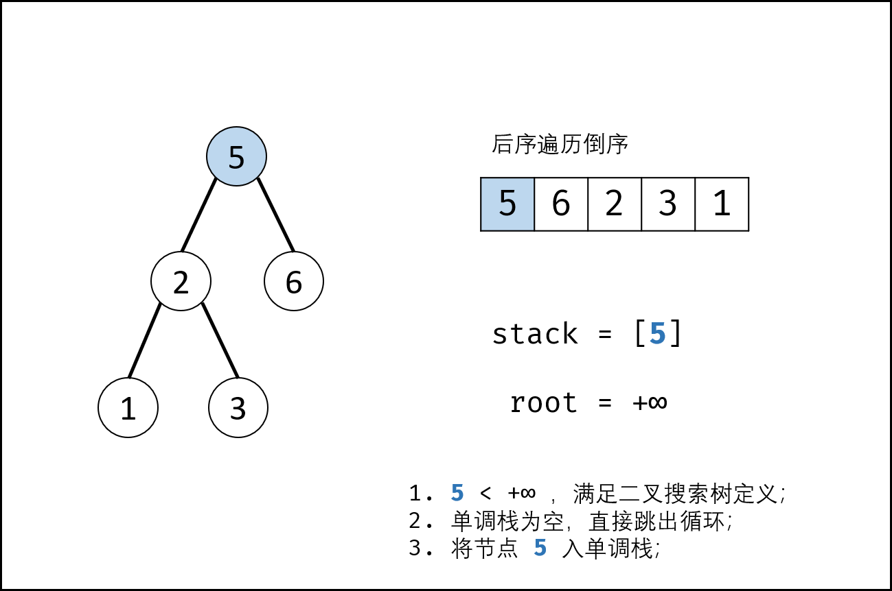,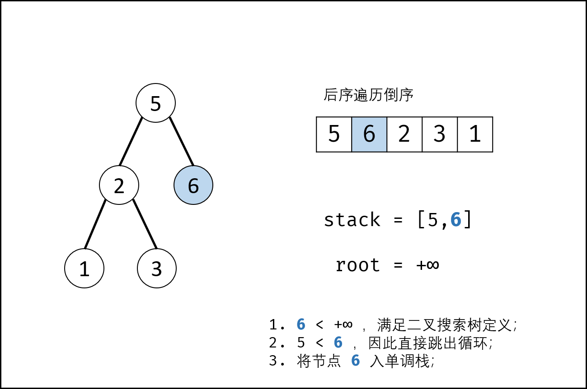,,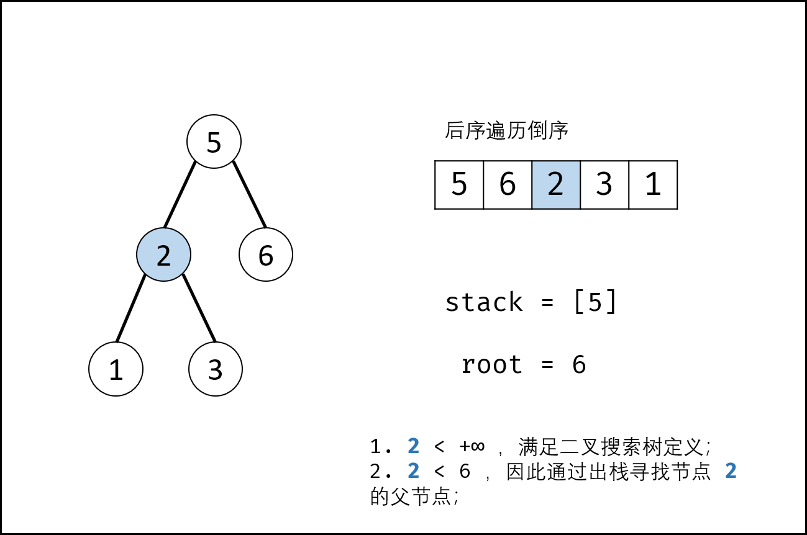,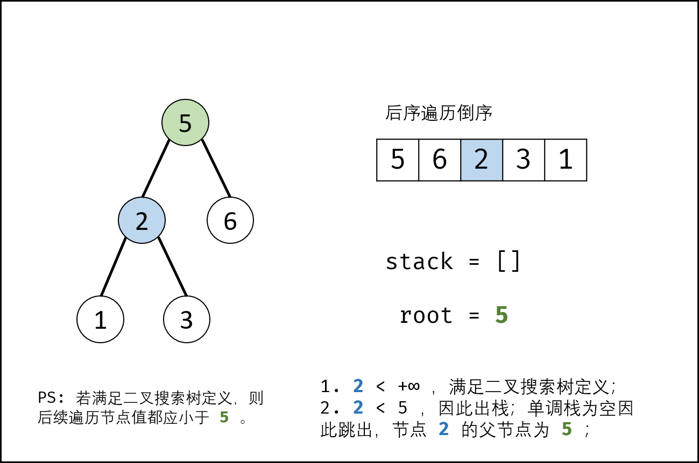,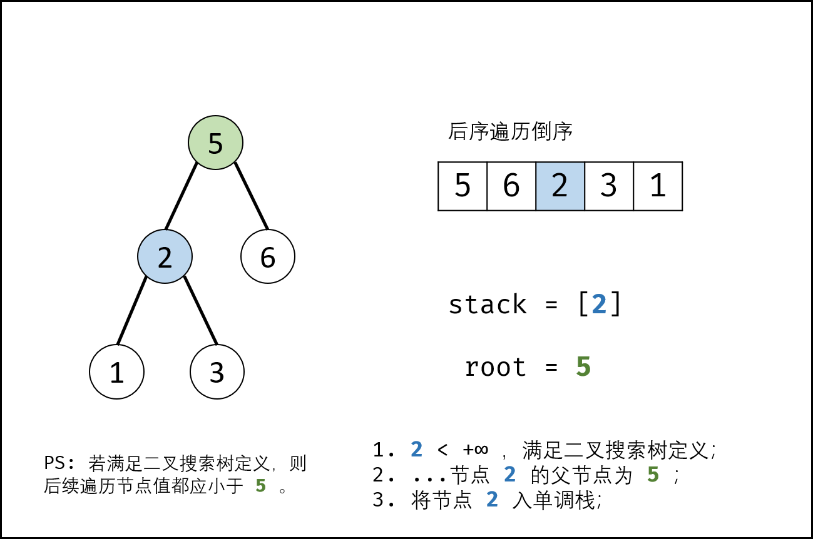,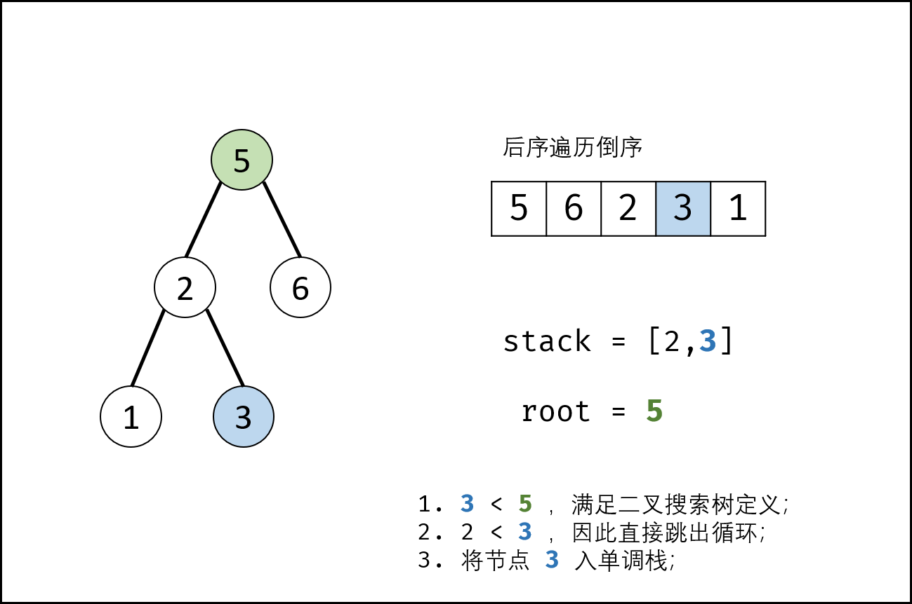,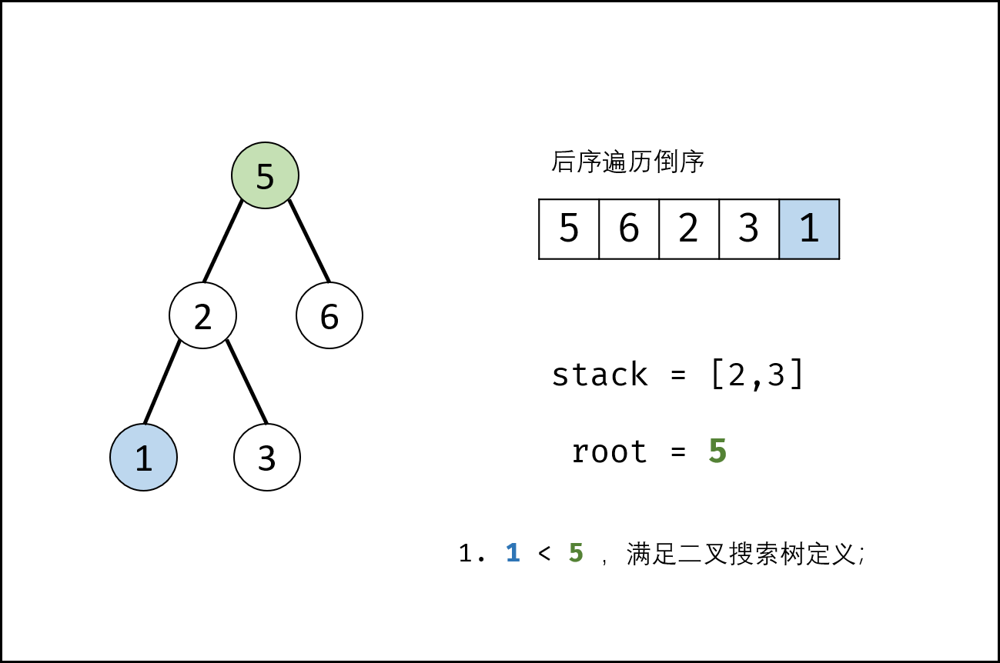,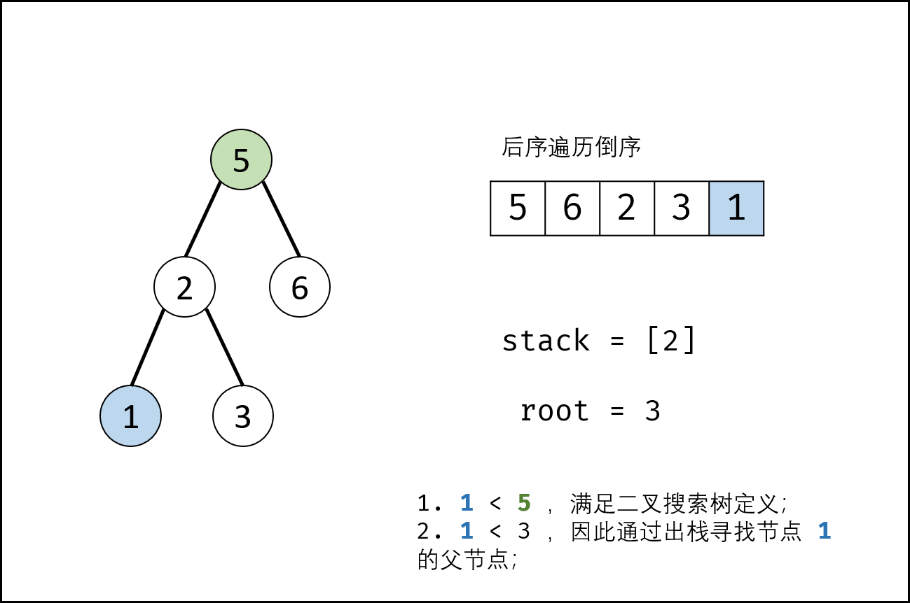,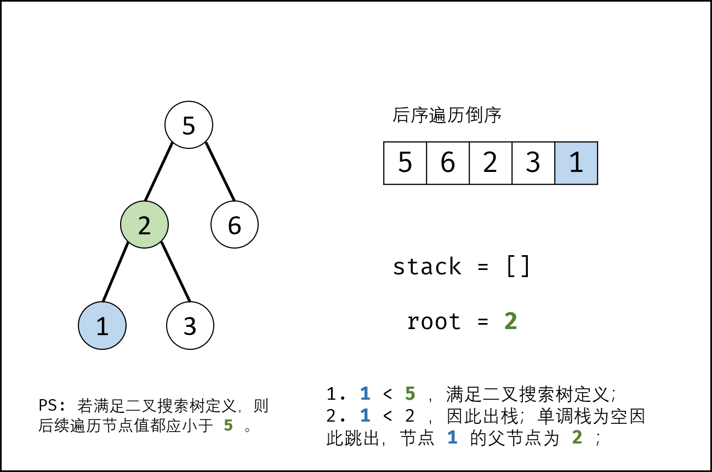,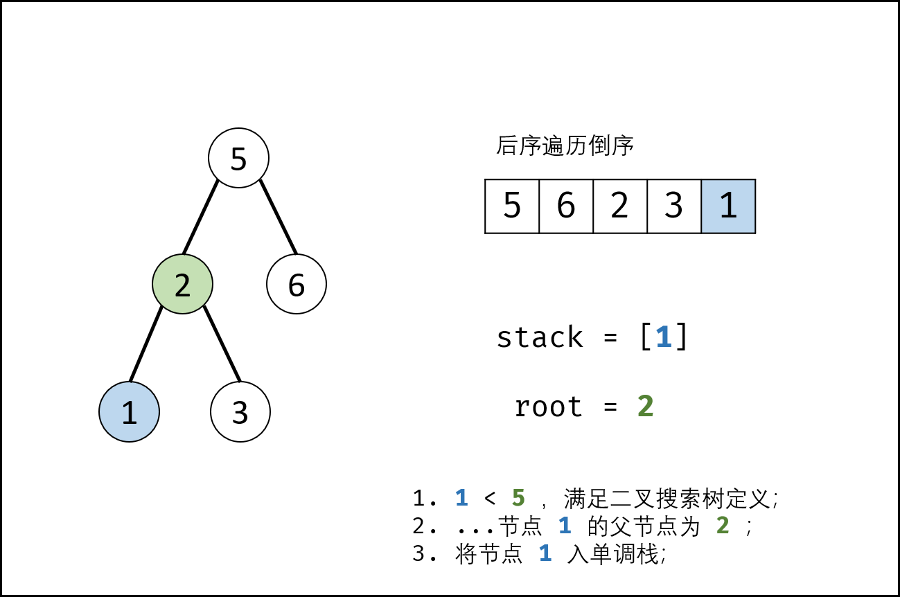,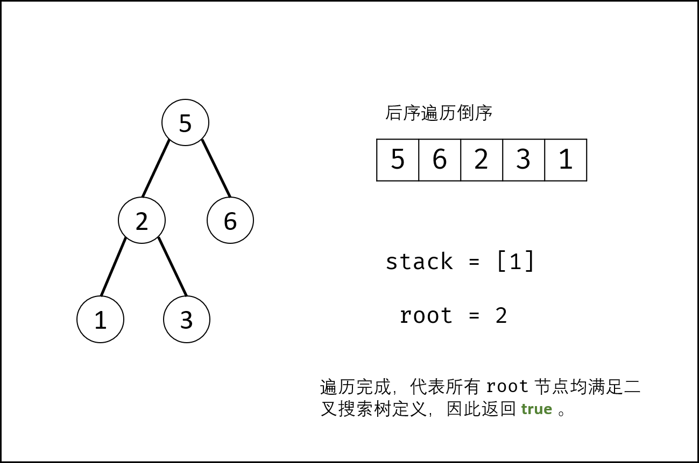>

**复杂度分析：**

- **时间复杂度 $O(N)$ ：** 遍历  $postorder$ 所有节点，各节点均入栈 / 出栈一次，使用 $O(N)$ 时间。
- **空间复杂度 $O(N)$ ：** 最差情况下，单调栈 $stack$ 存储所有节点，使用 $O(N)$ 额外空间。

<br>
```python []
class Solution:
    def verifyPostorder(self, postorder: [int]) -> bool:
        stack, root = [], float("+inf")
        for i in range(len(postorder) - 1, -1, -1):
            if postorder[i] > root: return False
            while(stack and postorder[i] < stack[-1]):
                root = stack.pop()
            stack.append(postorder[i])
        return True
```

```java []
class Solution {
    public boolean verifyPostorder(int[] postorder) {
        Stack<Integer> stack = new Stack<>();
        int root = Integer.MAX_VALUE;
        for(int i = postorder.length - 1; i >= 0; i--) {
            if(postorder[i] > root) return false;
            while(!stack.isEmpty() && stack.peek() > postorder[i])
            	root = stack.pop();
            stack.add(postorder[i]);
        }
        return true;
    }
}
```

## 统计信息
| 通过次数 | 提交次数 | AC比率 |
| :------: | :------: | :------: |
|    121613    |    219615    |   55.4%   |

## 提交历史
| 提交时间 | 提交结果 | 执行时间 |  内存消耗  | 语言 |
| :------: | :------: | :------: | :--------: | :--------: |
