> 原文链接: https://leetcode-cn.com/problems/er-cha-shu-zhong-he-wei-mou-yi-zhi-de-lu-jing-lcof


## 中文题目
<div><p>给你二叉树的根节点 <code>root</code> 和一个整数目标和 <code>targetSum</code> ，找出所有 <strong>从根节点到叶子节点</strong> 路径总和等于给定目标和的路径。</p>

<p><strong>叶子节点</strong> 是指没有子节点的节点。</p>

<p>&nbsp;</p>

<p><strong>示例 1：</strong></p>

<p></p>

<pre>
<strong>输入：</strong>root = [5,4,8,11,null,13,4,7,2,null,null,5,1], targetSum = 22
<strong>输出：</strong>[[5,4,11,2],[5,8,4,5]]
</pre>

<p><strong>示例 2：</strong></p>

<p></p>

<pre>
<strong>输入：</strong>root = [1,2,3], targetSum = 5
<strong>输出：</strong>[]
</pre>

<p><strong>示例 3：</strong></p>

<pre>
<strong>输入：</strong>root = [1,2], targetSum = 0
<strong>输出：</strong>[]
</pre>

<p>&nbsp;</p>

<p><strong>提示：</strong></p>

<ul>
	<li>树中节点总数在范围 <code>[0, 5000]</code> 内</li>
	<li><code>-1000 &lt;= Node.val &lt;= 1000</code></li>
	<li><code>-1000 &lt;= targetSum &lt;= 1000</code></li>
</ul>

<p>注意：本题与主站 113&nbsp;题相同：<a href="https://leetcode-cn.com/problems/path-sum-ii/">https://leetcode-cn.com/problems/path-sum-ii/</a></p>
</div>

## 通过代码
<RecoDemo>
</RecoDemo>


## 高赞题解
#### 解题思路：

> 本问题是典型的二叉树方案搜索问题，使用回溯法解决，其包含 **先序遍历 + 路径记录** 两部分。

- **先序遍历：** 按照 “根、左、右” 的顺序，遍历树的所有节点。
- **路径记录：** 在先序遍历中，记录从根节点到当前节点的路径。当路径为 ① 根节点到叶节点形成的路径 **且** ② 各节点值的和等于目标值 `sum` 时，将此路径加入结果列表。

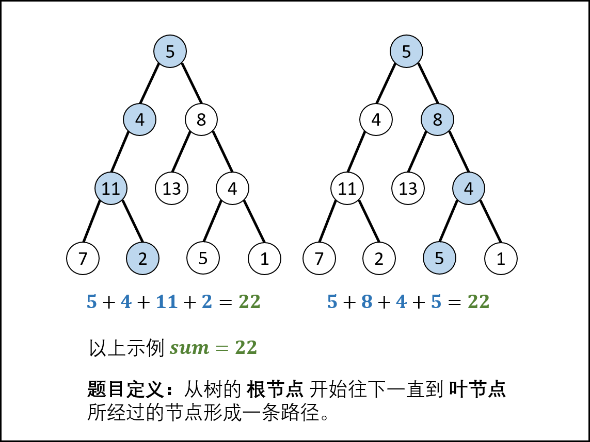{:width=500}

##### 算法流程：

**`pathSum(root, sum)` 函数：**

- **初始化：** 结果列表 `res` ，路径列表 `path` 。
- **返回值：** 返回 `res` 即可。

**`recur(root, tar) 函数：`**

- **递推参数：** 当前节点 `root` ，当前目标值 `tar` 。
- **终止条件：** 若节点 `root` 为空，则直接返回。
- **递推工作：**
  1. 路径更新： 将当前节点值 `root.val` 加入路径 `path` ；
  2. 目标值更新： `tar = tar - root.val`（即目标值 `tar` 从 `sum` 减至 $0$ ）；
  3. 路径记录： 当 ① `root` 为叶节点 **且** ② 路径和等于目标值 ，则将此路径 `path` 加入 `res` 。
  4. 先序遍历： 递归左 / 右子节点。
  5. 路径恢复： 向上回溯前，需要将当前节点从路径 `path` 中删除，即执行 `path.pop()` 。

<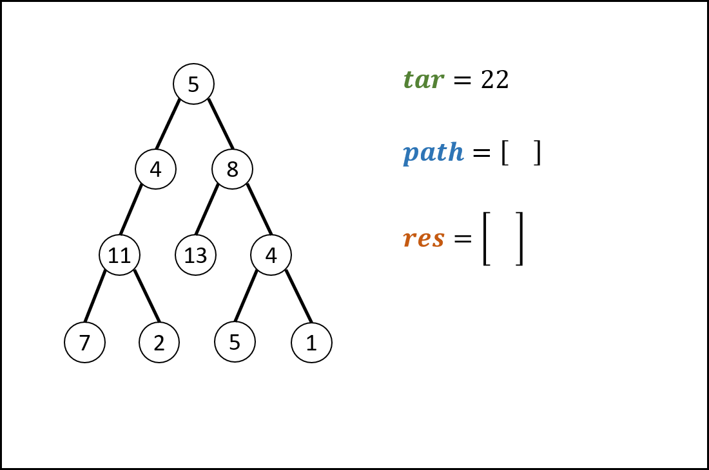,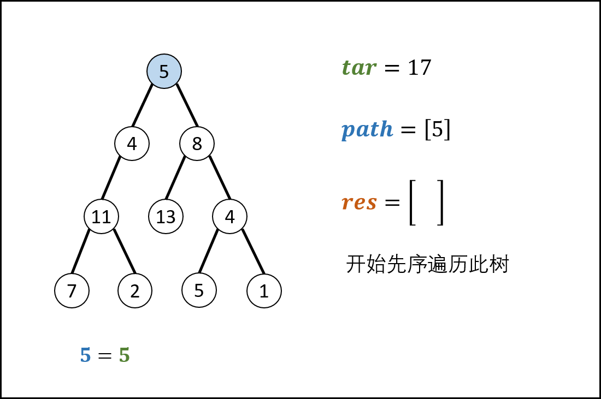,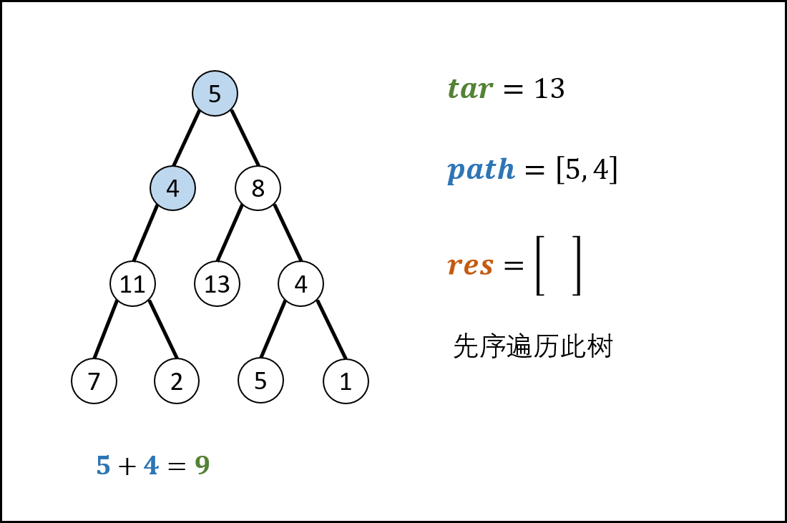,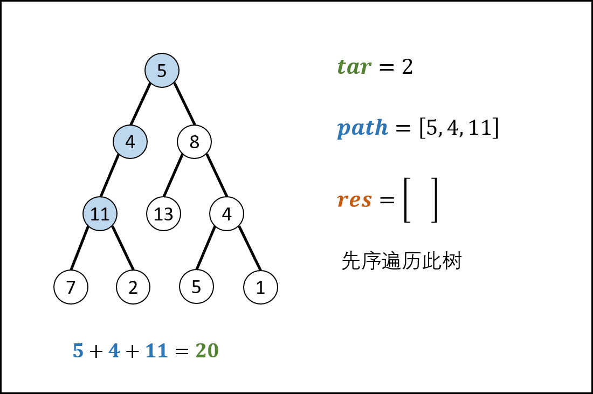,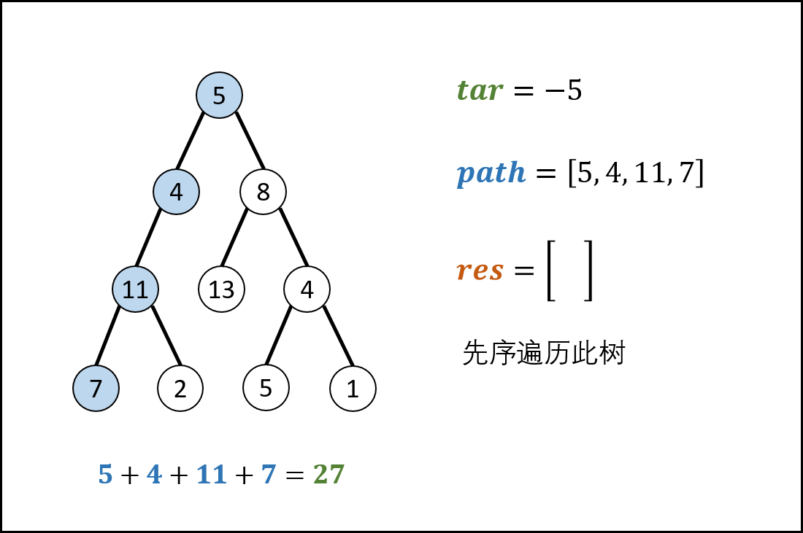,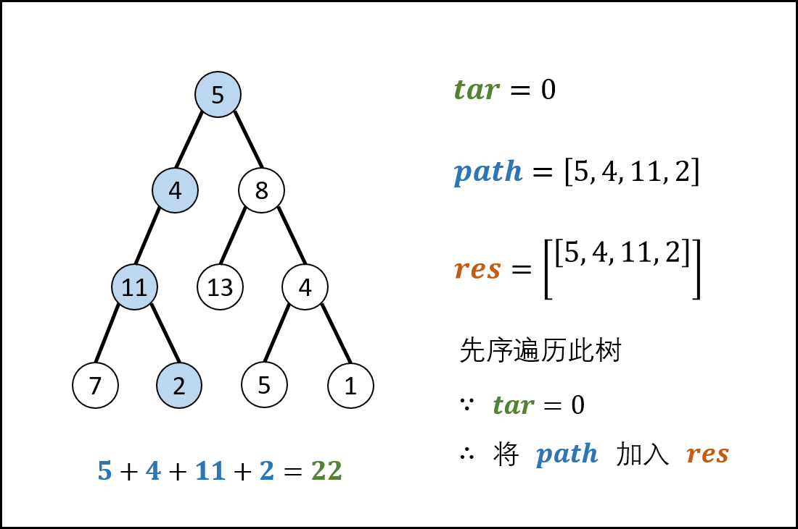,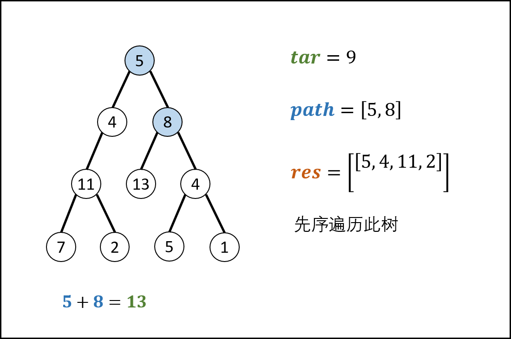,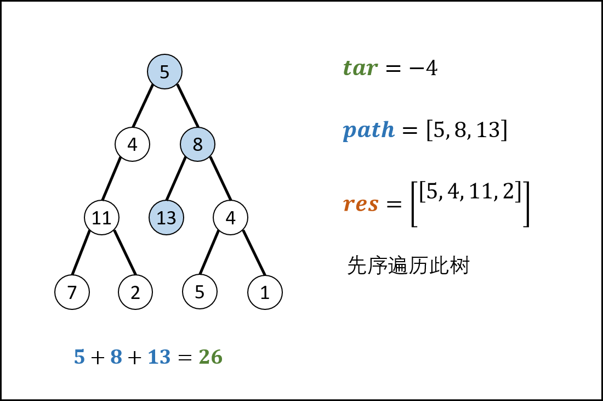,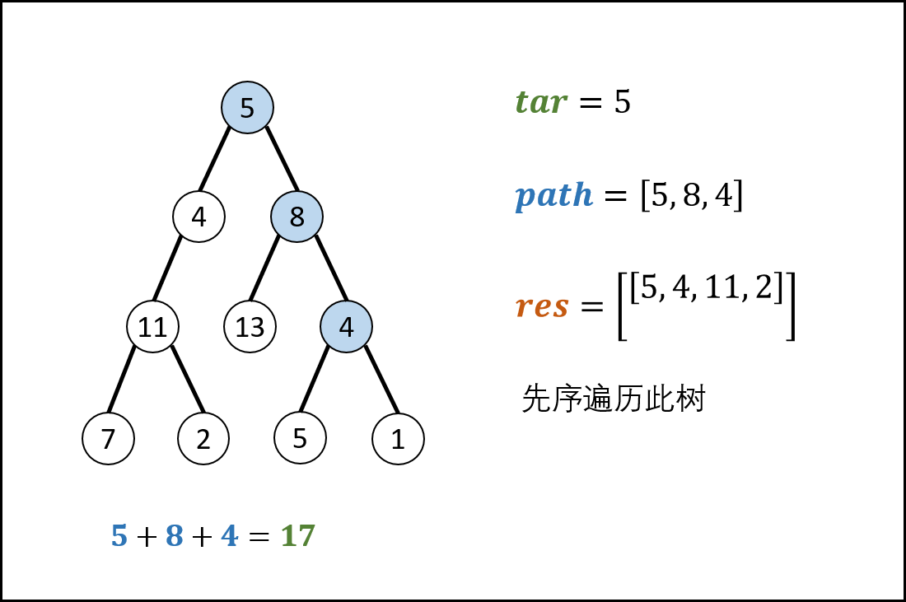,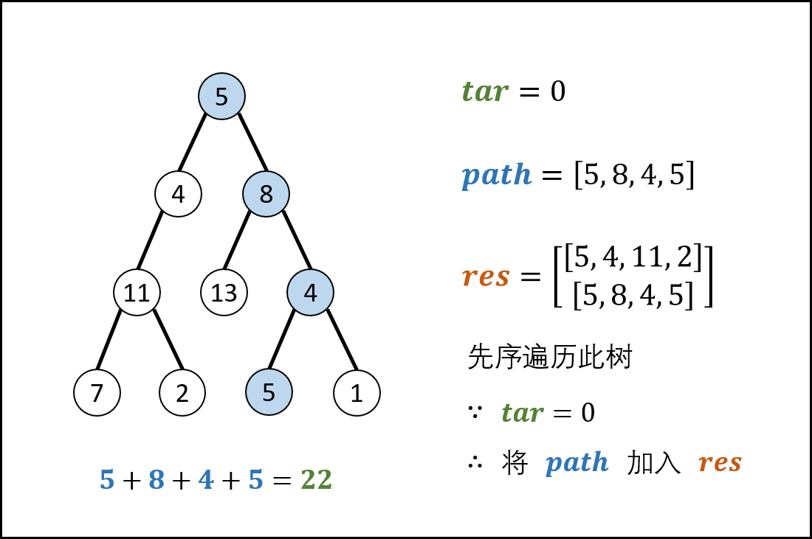,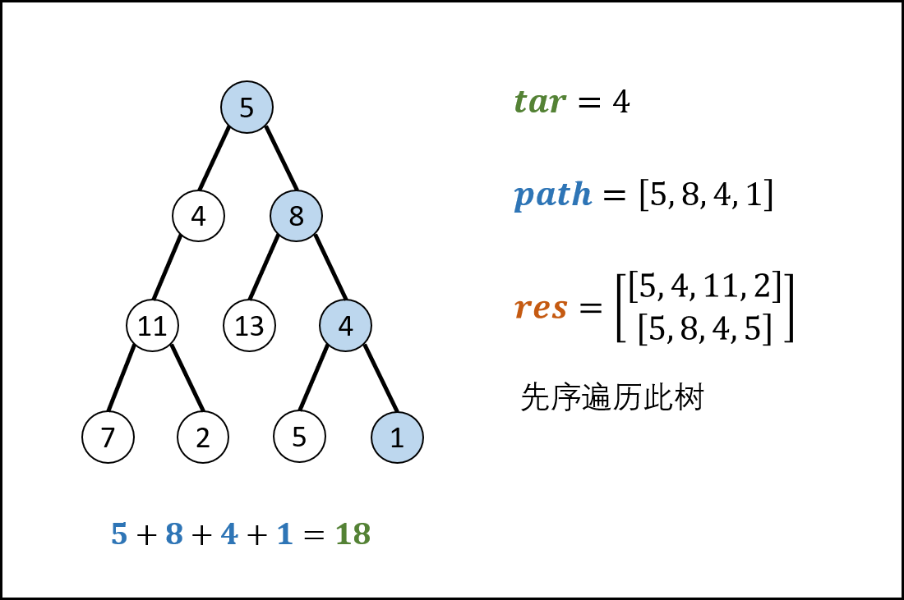,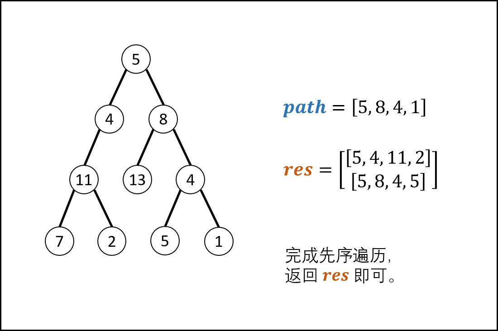>

##### 复杂度分析：

- **时间复杂度 $O(N)$ ：** $N$ 为二叉树的节点数，先序遍历需要遍历所有节点。
- **空间复杂度 $O(N)$ ：** 最差情况下，即树退化为链表时，`path` 存储所有树节点，使用 $O(N)$ 额外空间。

##### 代码：

> 值得注意的是，记录路径时若直接执行 `res.append(path)` ，则是将 `path` 对象加入了 `res` ；后续 `path` 改变时， `res` 中的 `path` 对象也会随之改变。
>
> 正确做法：`res.append(list(path))` ，相当于复制了一个 `path` 并加入到 `res` 。

```python []
class Solution:
    def pathSum(self, root: TreeNode, sum: int) -> List[List[int]]:
        res, path = [], []
        def recur(root, tar):
            if not root: return
            path.append(root.val)
            tar -= root.val
            if tar == 0 and not root.left and not root.right:
                res.append(list(path))
            recur(root.left, tar)
            recur(root.right, tar)
            path.pop()

        recur(root, sum)
        return res
```

```java []
class Solution {
    LinkedList<List<Integer>> res = new LinkedList<>();
    LinkedList<Integer> path = new LinkedList<>(); 
    public List<List<Integer>> pathSum(TreeNode root, int sum) {
        recur(root, sum);
        return res;
    }
    void recur(TreeNode root, int tar) {
        if(root == null) return;
        path.add(root.val);
        tar -= root.val;
        if(tar == 0 && root.left == null && root.right == null)
            res.add(new LinkedList(path));
        recur(root.left, tar);
        recur(root.right, tar);
        path.removeLast();
    }
}
```

## 统计信息
| 通过次数 | 提交次数 | AC比率 |
| :------: | :------: | :------: |
|    144388    |    249364    |   57.9%   |

## 提交历史
| 提交时间 | 提交结果 | 执行时间 |  内存消耗  | 语言 |
| :------: | :------: | :------: | :--------: | :--------: |
