> 原文链接: https://leetcode-cn.com/problems/er-cha-sou-suo-shu-yu-shuang-xiang-lian-biao-lcof


## 中文题目
<div><p>输入一棵二叉搜索树，将该二叉搜索树转换成一个排序的循环双向链表。要求不能创建任何新的节点，只能调整树中节点指针的指向。</p>

<p>&nbsp;</p>

<p>为了让您更好地理解问题，以下面的二叉搜索树为例：</p>

<p>&nbsp;</p>

<p></p>

<p>&nbsp;</p>

<p>我们希望将这个二叉搜索树转化为双向循环链表。链表中的每个节点都有一个前驱和后继指针。对于双向循环链表，第一个节点的前驱是最后一个节点，最后一个节点的后继是第一个节点。</p>

<p>下图展示了上面的二叉搜索树转化成的链表。&ldquo;head&rdquo; 表示指向链表中有最小元素的节点。</p>

<p>&nbsp;</p>

<p></p>

<p>&nbsp;</p>

<p>特别地，我们希望可以就地完成转换操作。当转化完成以后，树中节点的左指针需要指向前驱，树中节点的右指针需要指向后继。还需要返回链表中的第一个节点的指针。</p>

<p>&nbsp;</p>

<p><strong>注意：</strong>本题与主站 426 题相同：<a href="https://leetcode-cn.com/problems/convert-binary-search-tree-to-sorted-doubly-linked-list/">https://leetcode-cn.com/problems/convert-binary-search-tree-to-sorted-doubly-linked-list/</a></p>

<p><strong>注意：</strong>此题对比原题有改动。</p>
</div>

## 通过代码
<RecoDemo>
</RecoDemo>


## 高赞题解
#### 解题思路：

本文解法基于性质：二叉搜索树的中序遍历为 **递增序列** 。
将 二叉搜索树 转换成一个 “排序的循环双向链表” ，其中包含三个要素：

1. **排序链表：** 节点应从小到大排序，因此应使用 **中序遍历** “从小到大”访问树的节点。
2. **双向链表：** 在构建相邻节点的引用关系时，设前驱节点 `pre` 和当前节点 `cur` ，不仅应构建 `pre.right = cur` ，也应构建 `cur.left = pre` 。
3. **循环链表：** 设链表头节点 `head` 和尾节点 `tail` ，则应构建 `head.left = tail` 和 `tail.right = head` 。

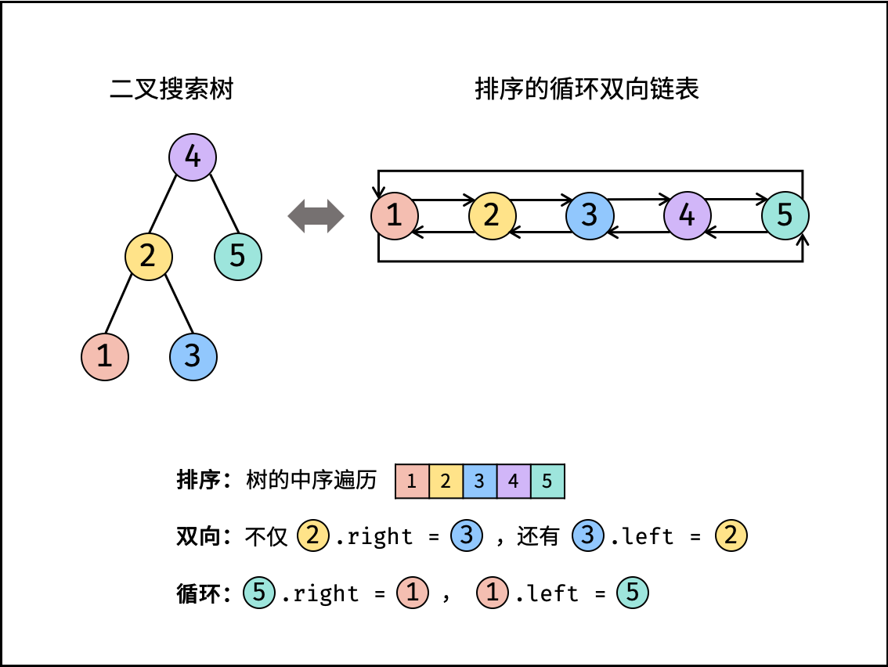{:width=500}

**中序遍历** 为对二叉树作 “左、根、右” 顺序遍历，递归实现如下：

```Python []
# 打印中序遍历
def dfs(root):
    if not root: return
    dfs(root.left)  # 左
    print(root.val) # 根
    dfs(root.right) # 右
```

```Java []
// 打印中序遍历
void dfs(Node root) {
    if(root == null) return;
    dfs(root.left); // 左
    System.out.println(root.val); // 根
    dfs(root.right); // 右
}
```

```C++ []
// 打印中序遍历
void dfs(Node* root) {
    if(root == nullptr) return;
    dfs(root->left); // 左
    cout << root->val << endl; // 根
    dfs(root->right); // 右
}
```

根据以上分析，考虑使用中序遍历访问树的各节点 `cur` ；并在访问每个节点时构建 `cur` 和前驱节点 `pre` 的引用指向；中序遍历完成后，最后构建头节点和尾节点的引用指向即可。

##### 算法流程：

**`dfs(cur):`** 递归法中序遍历；

1. **终止条件：** 当节点 `cur` 为空，代表越过叶节点，直接返回；
2. 递归左子树，即 `dfs(cur.left)` ；
3. **构建链表：**
    1. **当 `pre` 为空时：** 代表正在访问链表头节点，记为 `head` ；
    2. **当 `pre` 不为空时：** 修改双向节点引用，即 `pre.right = cur` ， `cur.left = pre` ；
    3. **保存 `cur` ：** 更新 `pre = cur` ，即节点 `cur` 是后继节点的 `pre` ；
4. 递归右子树，即 `dfs(cur.right)` ；

**`treeToDoublyList(root)：`**

1. **特例处理：** 若节点 `root` 为空，则直接返回；
2. **初始化：** 空节点 `pre` ；
3. **转化为双向链表：** 调用 `dfs(root)` ；
4. **构建循环链表：** 中序遍历完成后，`head` 指向头节点， `pre` 指向尾节点，因此修改 `head` 和 `pre` 的双向节点引用即可；
5. **返回值：** 返回链表的头节点 `head` 即可；

<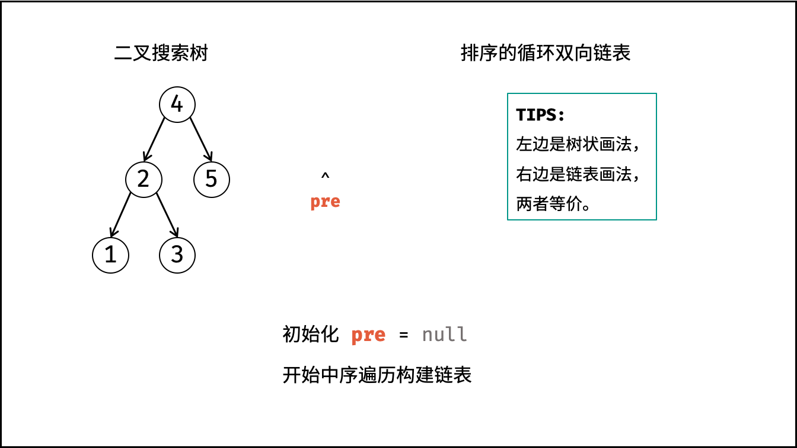,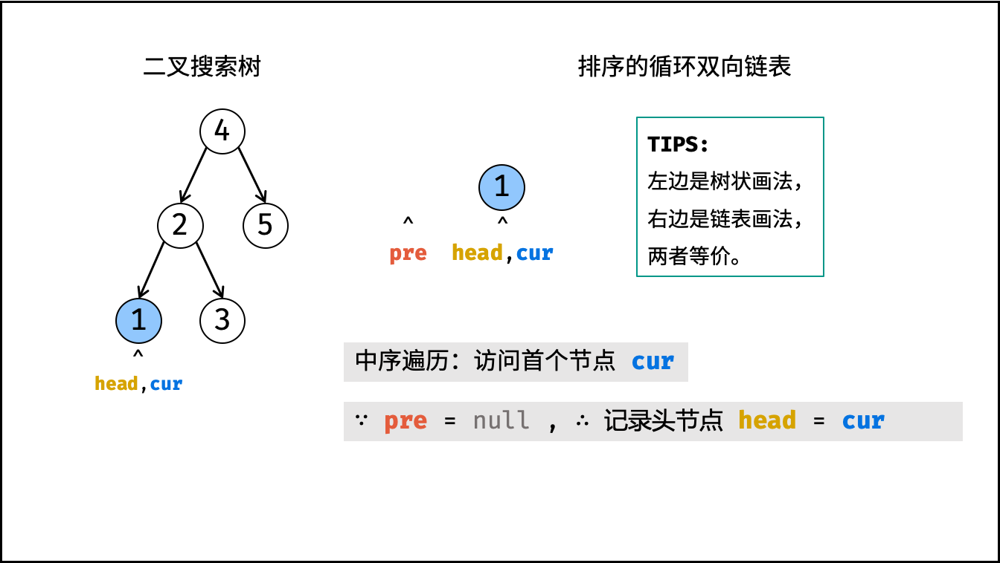,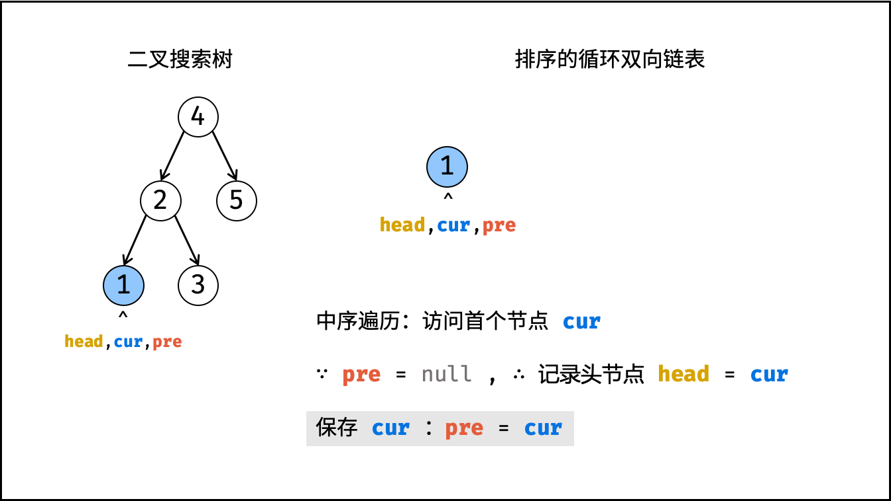,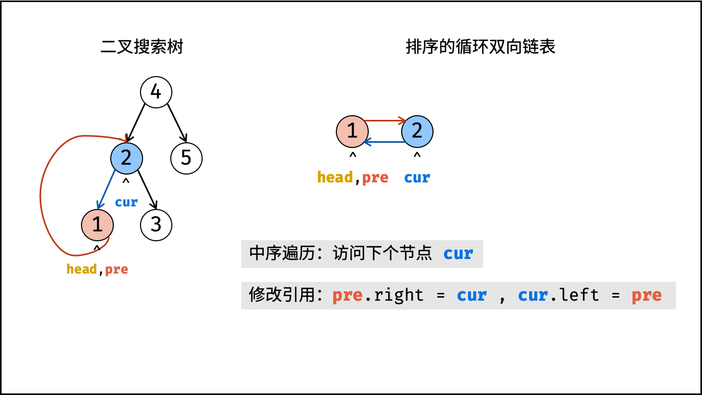,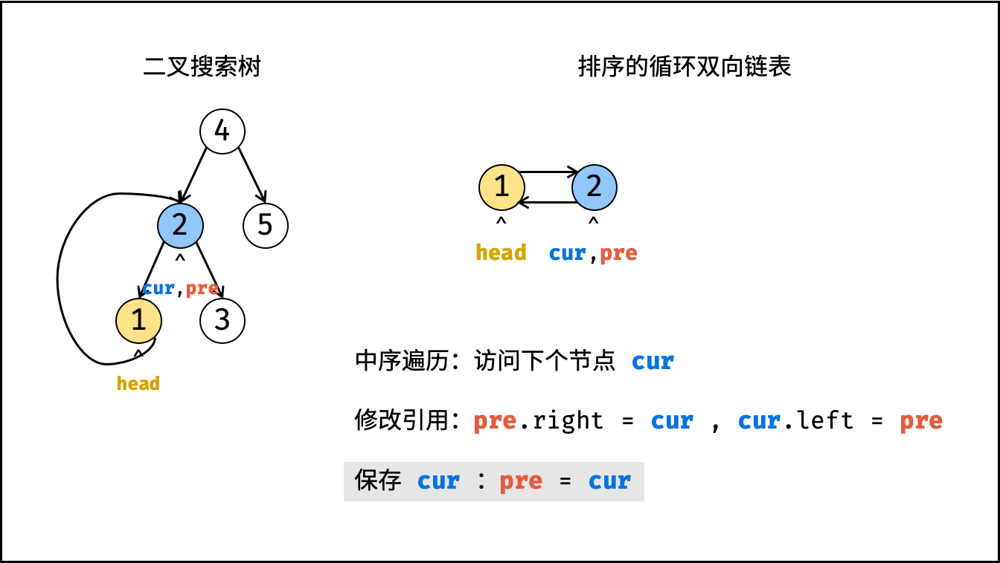,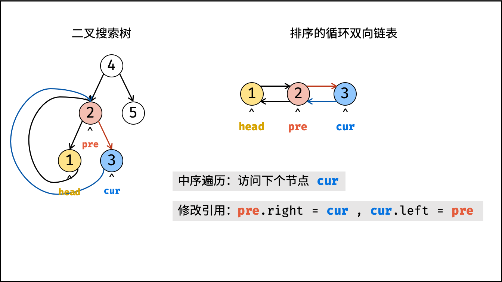,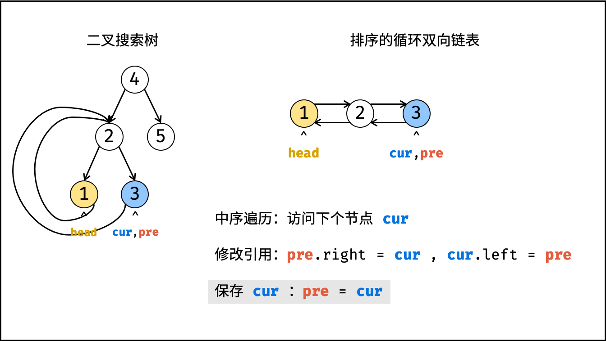,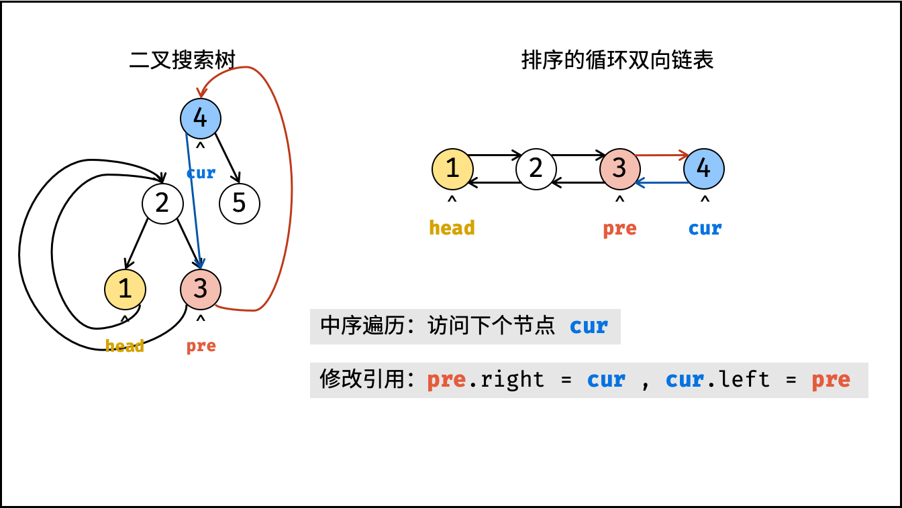,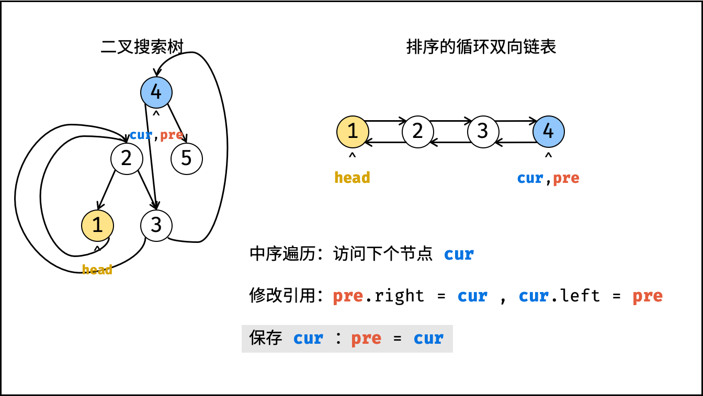,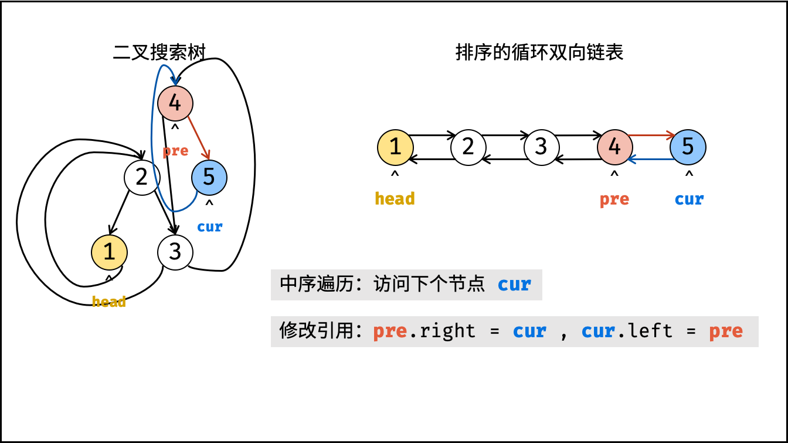,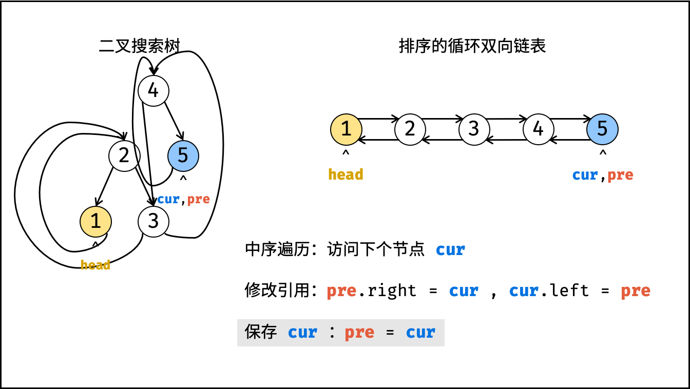,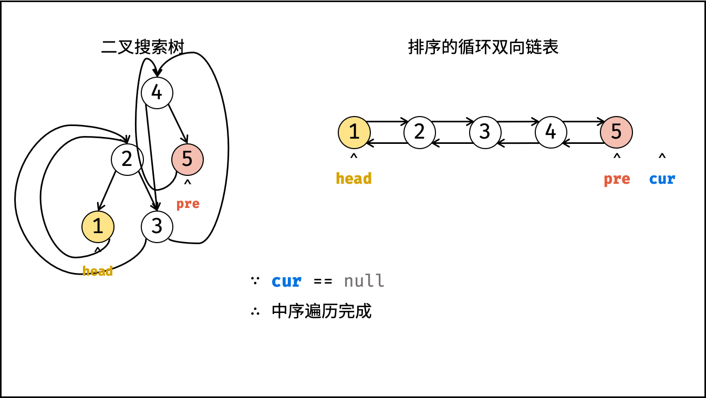,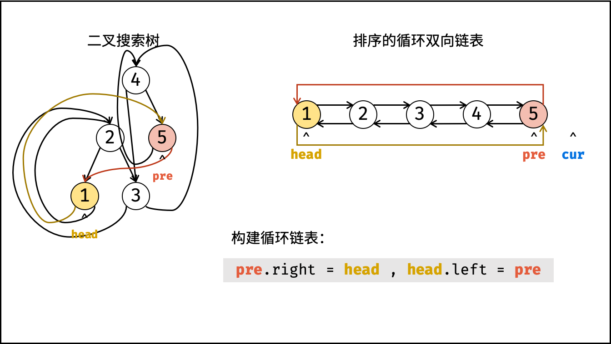,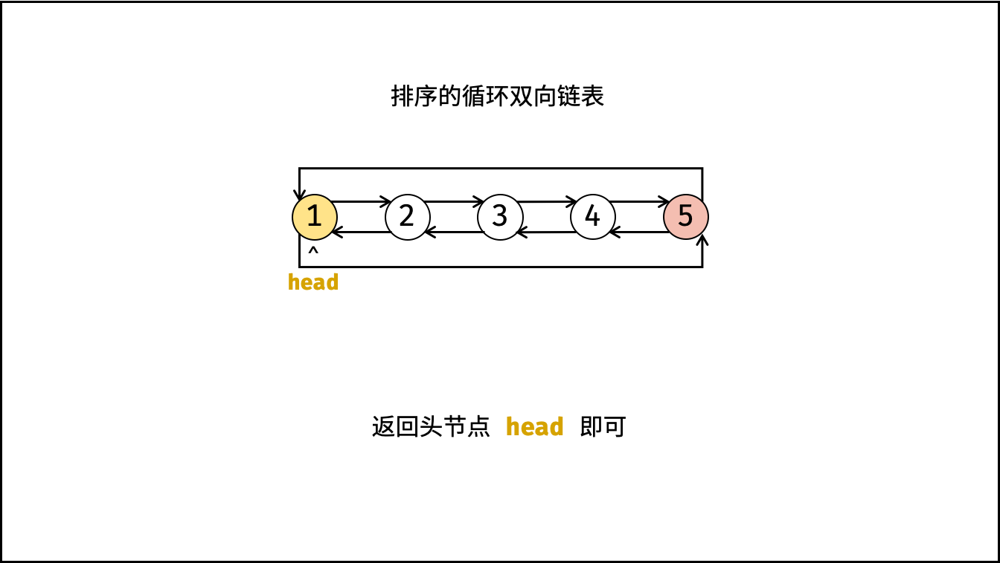>

##### 复杂度分析：

- **时间复杂度 $O(N)$ ：** $N$ 为二叉树的节点数，中序遍历需要访问所有节点。
- **空间复杂度 $O(N)$ ：** 最差情况下，即树退化为链表时，递归深度达到 $N$，系统使用 $O(N)$ 栈空间。

#### 代码：

```Python []
class Solution:
    def treeToDoublyList(self, root: 'Node') -> 'Node':
        def dfs(cur):
            if not cur: return
            dfs(cur.left) # 递归左子树
            if self.pre: # 修改节点引用
                self.pre.right, cur.left = cur, self.pre
            else: # 记录头节点
                self.head = cur
            self.pre = cur # 保存 cur
            dfs(cur.right) # 递归右子树
        
        if not root: return
        self.pre = None
        dfs(root)
        self.head.left, self.pre.right = self.pre, self.head
        return self.head
```

```Java []
class Solution {
    Node pre, head;
    public Node treeToDoublyList(Node root) {
        if(root == null) return null;
        dfs(root);
        head.left = pre;
        pre.right = head;
        return head;
    }
    void dfs(Node cur) {
        if(cur == null) return;
        dfs(cur.left);
        if(pre != null) pre.right = cur;
        else head = cur;
        cur.left = pre;
        pre = cur;
        dfs(cur.right);
    }
}
```

```C++ []
class Solution {
public:
    Node* treeToDoublyList(Node* root) {
        if(root == nullptr) return nullptr;
        dfs(root);
        head->left = pre;
        pre->right = head;
        return head;
    }
private:
    Node *pre, *head;
    void dfs(Node* cur) {
        if(cur == nullptr) return;
        dfs(cur->left);
        if(pre != nullptr) pre->right = cur;
        else head = cur;
        cur->left = pre;
        pre = cur;
        dfs(cur->right);
    }
};
```


## 统计信息
| 通过次数 | 提交次数 | AC比率 |
| :------: | :------: | :------: |
|    113355    |    173184    |   65.5%   |

## 提交历史
| 提交时间 | 提交结果 | 执行时间 |  内存消耗  | 语言 |
| :------: | :------: | :------: | :--------: | :--------: |
