> 原文链接: https://leetcode-cn.com/problems/zi-fu-chuan-de-pai-lie-lcof


## 中文题目
<div><p>输入一个字符串，打印出该字符串中字符的所有排列。</p>

<p>&nbsp;</p>

<p>你可以以任意顺序返回这个字符串数组，但里面不能有重复元素。</p>

<p>&nbsp;</p>

<p><strong>示例:</strong></p>

<pre><strong>输入：</strong>s = &quot;abc&quot;
<strong>输出：[</strong>&quot;abc&quot;,&quot;acb&quot;,&quot;bac&quot;,&quot;bca&quot;,&quot;cab&quot;,&quot;cba&quot;<strong>]</strong>
</pre>

<p>&nbsp;</p>

<p><strong>限制：</strong></p>

<p><code>1 &lt;= s 的长度 &lt;= 8</code></p>
</div>

## 通过代码
<RecoDemo>
</RecoDemo>


## 高赞题解
#### 解题思路：

对于一个长度为 $n$ 的字符串（假设字符互不重复），其排列方案数共有：

$$
n \times (n-1) \times (n-2) … \times 2 \times 1
$$

**排列方案的生成：**

根据字符串排列的特点，考虑深度优先搜索所有排列方案。即通过字符交换，先固定第 $1$ 位字符（ $n$ 种情况）、再固定第 $2$ 位字符（ $n-1$ 种情况）、... 、最后固定第 $n$ 位字符（ $1$ 种情况）。

{:width=500}

**重复排列方案与剪枝：**

当字符串存在重复字符时，排列方案中也存在重复的排列方案。为排除重复方案，需在固定某位字符时，保证 “每种字符只在此位固定一次” ，即遇到重复字符时不交换，直接跳过。从 DFS 角度看，此操作称为 “剪枝” 。

{:width=500}

##### 递归解析：

1. **终止条件：** 当 `x = len(c) - 1`  时，代表所有位已固定（最后一位只有 $1$ 种情况），则将当前组合 `c` 转化为字符串并加入 `res` ，并返回；
2. **递推参数：** 当前固定位 `x` ；
3. **递推工作：** 初始化一个 Set ，用于排除重复的字符；将第 `x` 位字符与 `i` $\in$ `[x, len(c)]` 字符分别交换，并进入下层递归；
   1. **剪枝：** 若 `c[i]` 在 Set​ 中，代表其是重复字符，因此 “剪枝” ；
   2. 将 `c[i]` 加入 Set​ ，以便之后遇到重复字符时剪枝；
   3. **固定字符：** 将字符 `c[i]` 和 `c[x]` 交换，即固定 `c[i]` 为当前位字符；
   4. **开启下层递归：** 调用 `dfs(x + 1)` ，即开始固定第 `x + 1` 个字符；
   5. **还原交换：** 将字符 `c[i]` 和 `c[x]` 交换（还原之前的交换）；

> 下图中 `list` 对应文中的列表 `c` 。

<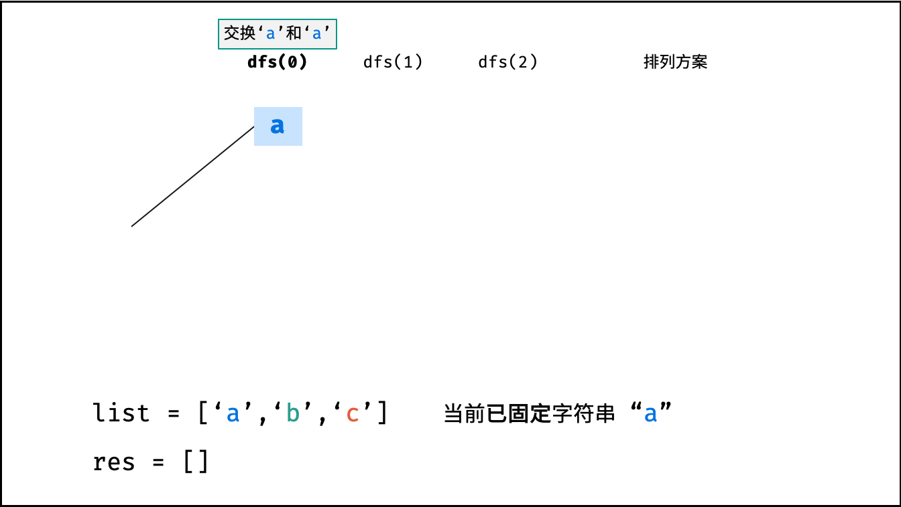,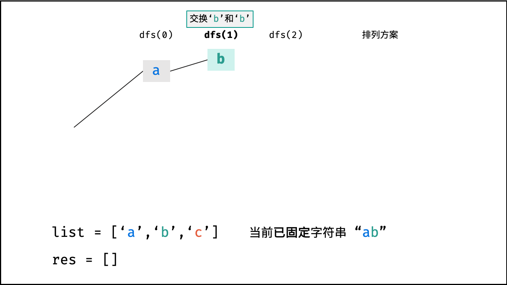,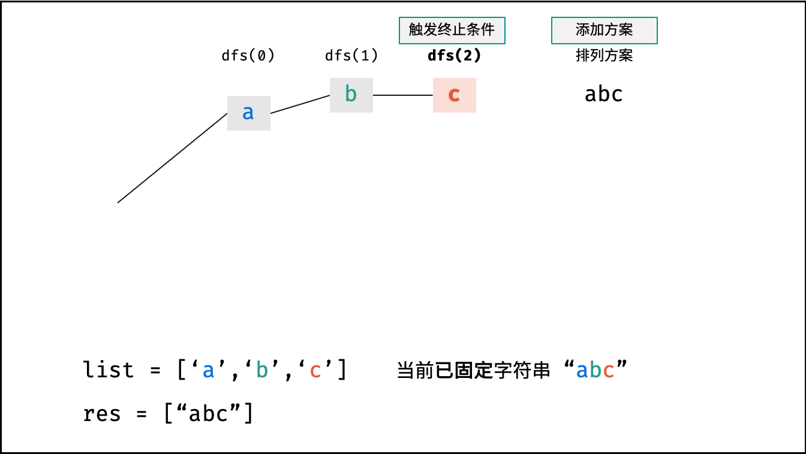,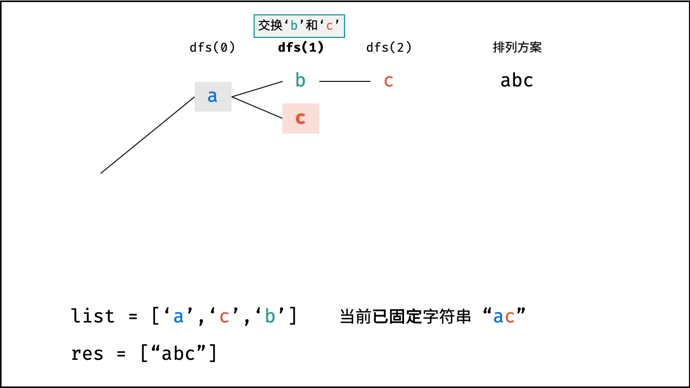,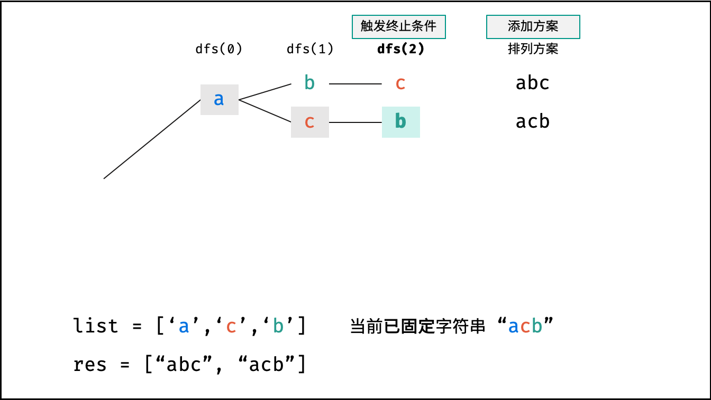,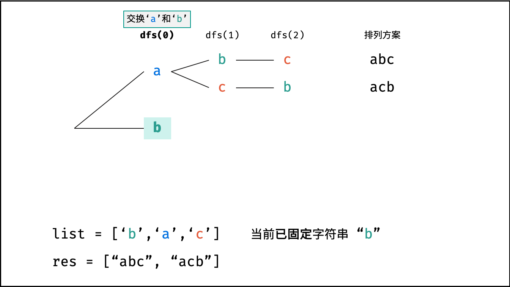,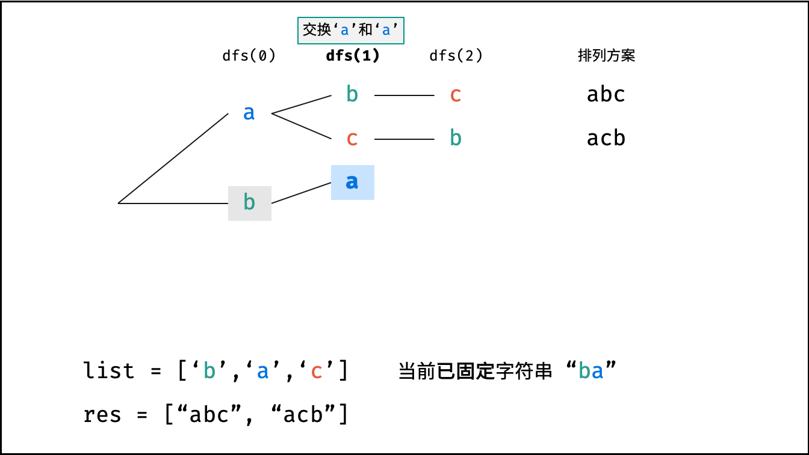,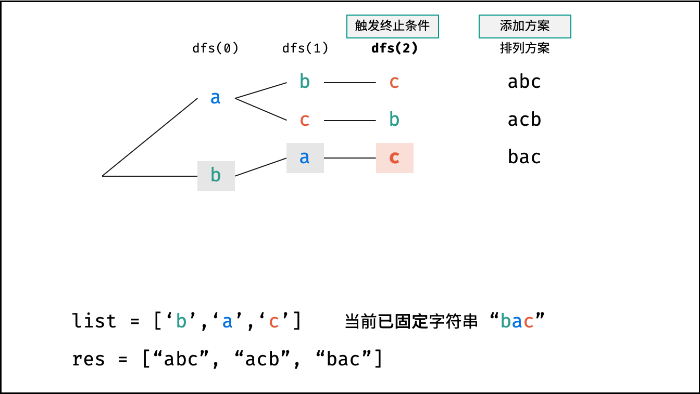,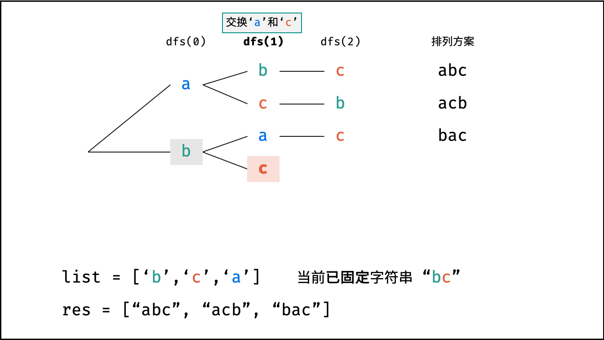,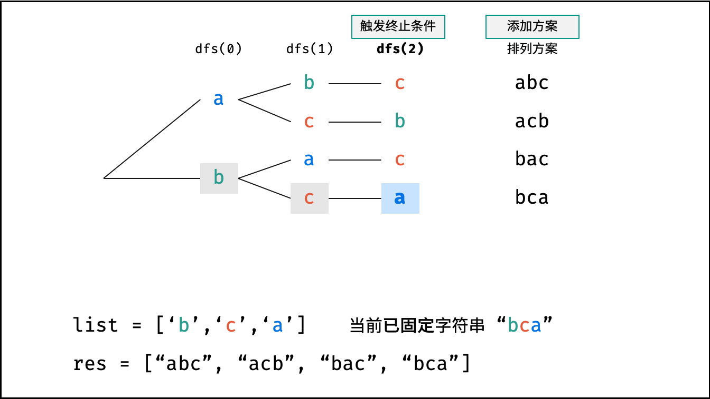,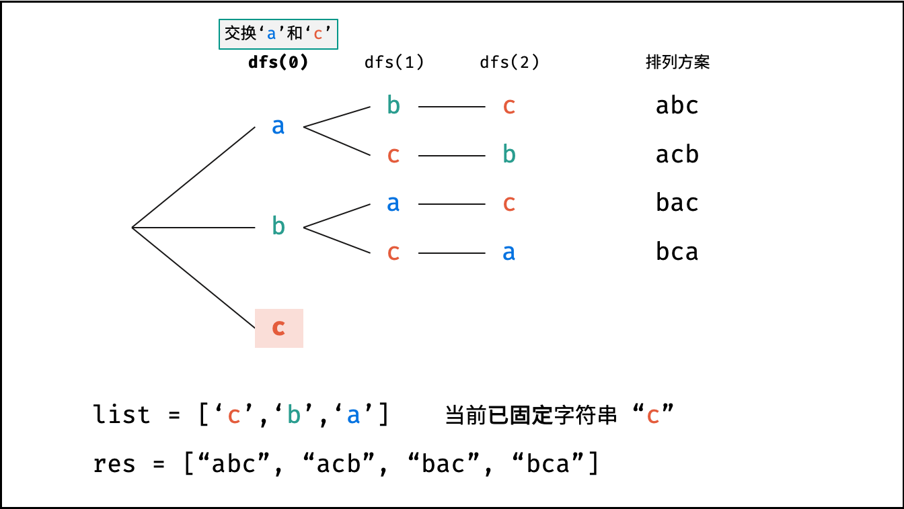,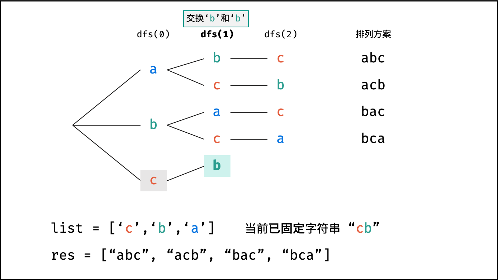,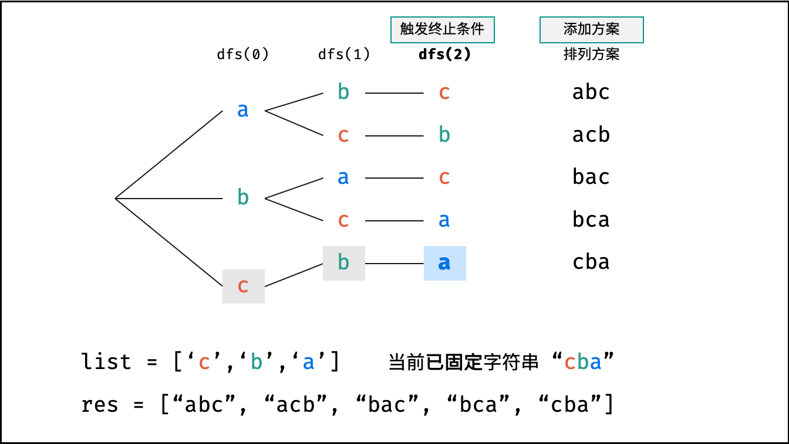,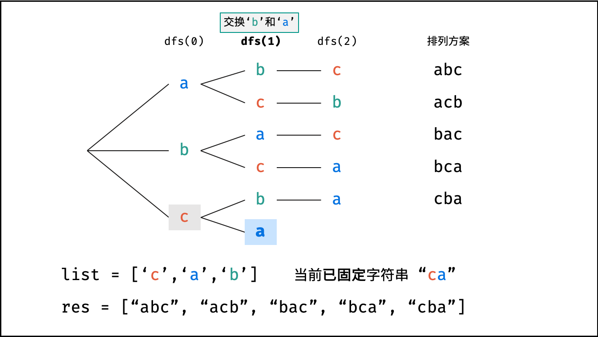,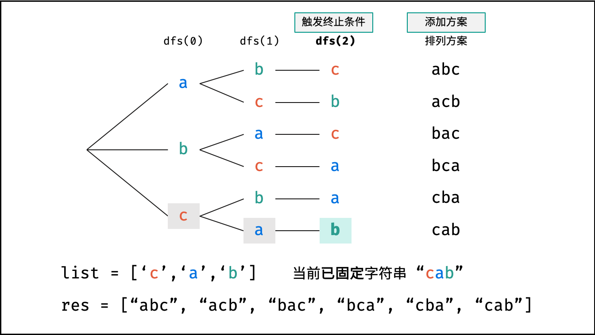,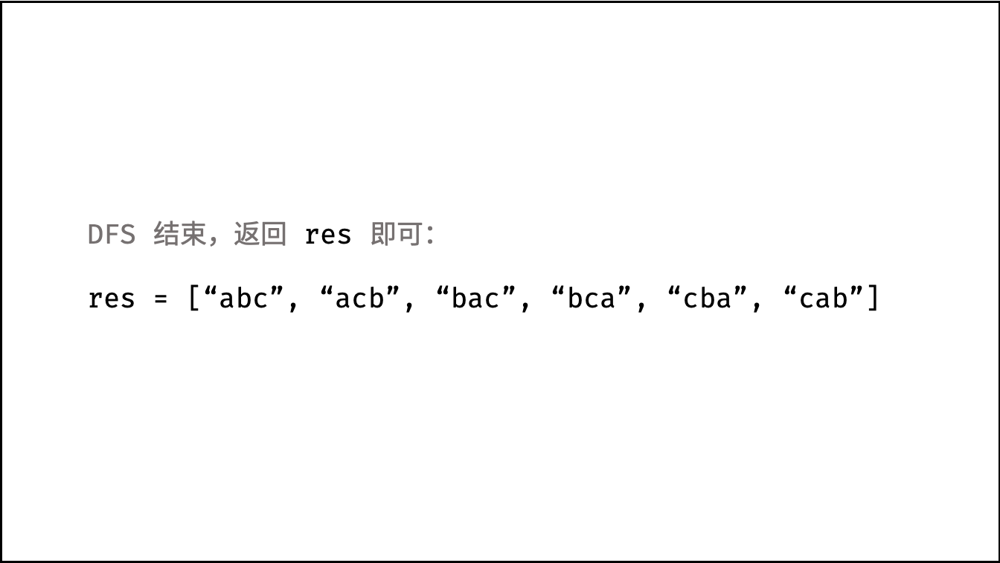>

##### 复杂度分析：

- **时间复杂度 $O(N!N)$ ：** $N$ 为字符串 `s` 的长度；时间复杂度和字符串排列的方案数成线性关系，方案数为 $N \times (N-1) \times (N-2) … \times 2 \times 1$ ，即复杂度为 $O(N!)$ ；字符串拼接操作 `join()` 使用 $O(N)$ ；因此总体时间复杂度为 $O(N!N)$ 。
- **空间复杂度 $O(N^2)$ ：** 全排列的递归深度为 $N$ ，系统累计使用栈空间大小为 $O(N)$ ；递归中辅助 Set 累计存储的字符数量最多为 $N + (N-1) + ... + 2 + 1 = (N+1)N/2$ ，即占用 $O(N^2)$ 的额外空间。

#### 代码：

```Python []
class Solution:
    def permutation(self, s: str) -> List[str]:
        c, res = list(s), []
        def dfs(x):
            if x == len(c) - 1:
                res.append(''.join(c))   # 添加排列方案
                return
            dic = set()
            for i in range(x, len(c)):
                if c[i] in dic: continue # 重复，因此剪枝
                dic.add(c[i])
                c[i], c[x] = c[x], c[i]  # 交换，将 c[i] 固定在第 x 位
                dfs(x + 1)               # 开启固定第 x + 1 位字符
                c[i], c[x] = c[x], c[i]  # 恢复交换
        dfs(0)
        return res
```

```Java []
class Solution {
    List<String> res = new LinkedList<>();
    char[] c;
    public String[] permutation(String s) {
        c = s.toCharArray();
        dfs(0);
        return res.toArray(new String[res.size()]);
    }
    void dfs(int x) {
        if(x == c.length - 1) {
            res.add(String.valueOf(c));      // 添加排列方案
            return;
        }
        HashSet<Character> set = new HashSet<>();
        for(int i = x; i < c.length; i++) {
            if(set.contains(c[i])) continue; // 重复，因此剪枝
            set.add(c[i]);
            swap(i, x);                      // 交换，将 c[i] 固定在第 x 位
            dfs(x + 1);                      // 开启固定第 x + 1 位字符
            swap(i, x);                      // 恢复交换
        }
    }
    void swap(int a, int b) {
        char tmp = c[a];
        c[a] = c[b];
        c[b] = tmp;
    }
}
```

```C++ []
class Solution {
public:
    vector<string> permutation(string s) {
        dfs(s, 0);
        return res;
    }
private:
    vector<string> res;
    void dfs(string s, int x) {
        if(x == s.size() - 1) {
            res.push_back(s);                       // 添加排列方案
            return;
        }
        set<int> st;
        for(int i = x; i < s.size(); i++) {
            if(st.find(s[i]) != st.end()) continue; // 重复，因此剪枝
            st.insert(s[i]);
            swap(s[i], s[x]);                       // 交换，将 s[i] 固定在第 x 位
            dfs(s, x + 1);                          // 开启固定第 x + 1 位字符
            swap(s[i], s[x]);                       // 恢复交换
        }
    }
};
```

## 统计信息
| 通过次数 | 提交次数 | AC比率 |
| :------: | :------: | :------: |
|    167042    |    288074    |   58.0%   |

## 提交历史
| 提交时间 | 提交结果 | 执行时间 |  内存消耗  | 语言 |
| :------: | :------: | :------: | :--------: | :--------: |
