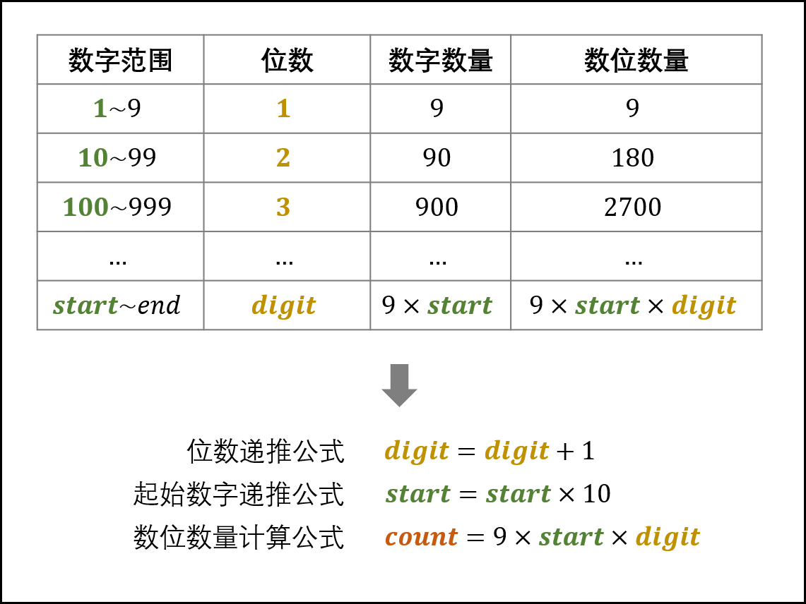
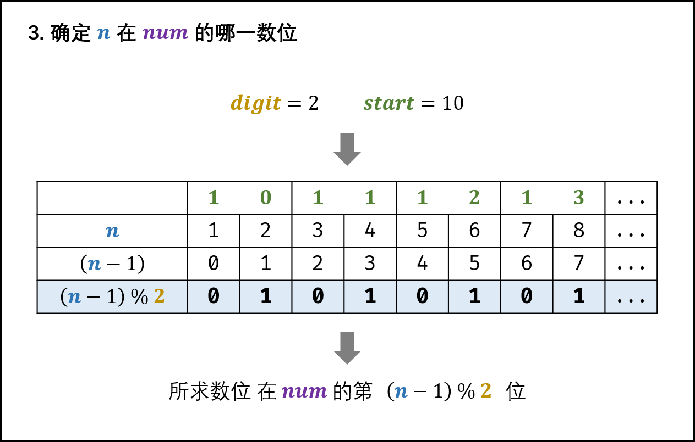

> 原文链接: https://leetcode-cn.com/problems/shu-zi-xu-lie-zhong-mou-yi-wei-de-shu-zi-lcof


## 中文题目
<div><p>数字以0123456789101112131415&hellip;的格式序列化到一个字符序列中。在这个序列中，第5位（从下标0开始计数）是5，第13位是1，第19位是4，等等。</p>

<p>请写一个函数，求任意第n位对应的数字。</p>

<p>&nbsp;</p>

<p><strong>示例 1：</strong></p>

<pre><strong>输入：</strong>n = 3
<strong>输出：</strong>3
</pre>

<p><strong>示例 2：</strong></p>

<pre><strong>输入：</strong>n = 11
<strong>输出：</strong>0</pre>

<p>&nbsp;</p>

<p><strong>限制：</strong></p>

<ul>
	<li><code>0 &lt;= n &lt;&nbsp;2^31</code></li>
</ul>

<p>注意：本题与主站 400 题相同：<a href="https://leetcode-cn.com/problems/nth-digit/">https://leetcode-cn.com/problems/nth-digit/</a></p>
</div>

## 通过代码
<RecoDemo>
</RecoDemo>


## 高赞题解
#### 解题思路：

1. 将 $101112 \cdots$ 中的每一位称为 **数位** ，记为 $n$ ；
2. 将 $10, 11, 12, \cdots$  称为 **数字** ，记为 $num$ ；
3. 数字 $10$ 是一个两位数，称此数字的 **位数** 为 $2$ ，记为 $digit$ ；
4. 每 $digit$ 位数的起始数字（即：$1, 10, 100, \cdots$），记为 $start$ 。

{:width=400}

观察上表，可推出各 $digit$ 下的数位数量 $count$ 的计算公式：

$$
count = 9 \times start \times digit
$$

根据以上分析，可将求解分为三步：

1. 确定 $n$ 所在 **数字** 的 **位数** ，记为 $digit$ ；
2. 确定 $n$ 所在的 **数字** ，记为 $num$ ；
3. 确定 $n$ 是 $num$ 中的哪一数位，并返回结果。

#####

##### 1. 确定所求数位的所在数字的位数

如下图所示，循环执行 $n$ 减去 一位数、两位数、... 的数位数量 $count$ ，直至 $n \leq count$ 时跳出。

由于 $n$ 已经减去了一位数、两位数、...、$(digit-1)$ 位数的 **数位数量** $count$ ，因而此时的 $n$ 是从起始数字 $start$ 开始计数的。

```python
digit, start, count = 1, 1, 9
while n > count:
    n -= count
    start *= 10 # 1, 10, 100, ...
    digit += 1  # 1,  2,  3, ...
    count = 9 * start * digit # 9, 180, 2700, ...
```

**结论：** 所求数位 ① 在某个 $digit$ 位数中； ② 为从数字 $start$ 开始的第 $n$ 个数位。

{:width=400}

##### 2. 确定所求数位所在的数字

如下图所示，所求数位 在从数字 $start$ 开始的第 $[(n - 1) / digit]$ 个 **数字** 中（ $start$ 为第 0 个数字）。

```python
num = start + (n - 1) // digit
```

**结论：** 所求数位在数字 $num$ 中。

{:width=400}

##### 3. 确定所求数位在 $num$ 的哪一数位

如下图所示，所求数位为数字 $num$ 的第 $(n - 1) \% digit$ 位（ 数字的首个数位为第 0 位）。

```python
s = str(num) # 转化为 string
res = int(s[(n - 1) % digit]) # 获得 num 的 第 (n - 1) % digit 个数位，并转化为 int
```

**结论：** 所求数位是 $res$ 。

{:width=400}

##### 复杂度分析：

- **时间复杂度 $O(\log n)$ ：** 所求数位 $n$ 对应数字 $num$ 的位数 $digit$ 最大为 $O(\log n)$ ；第一步最多循环 $O(\log n)$ 次；第三步中将 $num$ 转化为字符串使用 $O(\log n)$ 时间；因此总体为 $O(\log n)$ 。 
- **空间复杂度 $O(\log n)$ ：** 将数字 $num$ 转化为字符串 `str(num)` ，占用 $O(\log n)$ 的额外空间。

<,,>

##### 代码：

```python []
class Solution:
    def findNthDigit(self, n: int) -> int:
        digit, start, count = 1, 1, 9
        while n > count: # 1.
            n -= count
            start *= 10
            digit += 1
            count = 9 * start * digit
        num = start + (n - 1) // digit # 2.
        return int(str(num)[(n - 1) % digit]) # 3.
```

```java []
class Solution {
    public int findNthDigit(int n) {
        int digit = 1;
        long start = 1;
        long count = 9;
        while (n > count) { // 1.
            n -= count;
            digit += 1;
            start *= 10;
            count = digit * start * 9;
        }
        long num = start + (n - 1) / digit; // 2.
        return Long.toString(num).charAt((n - 1) % digit) - '0'; // 3.
    }
}
```

## 统计信息
| 通过次数 | 提交次数 | AC比率 |
| :------: | :------: | :------: |
|    59421    |    142233    |   41.8%   |

## 提交历史
| 提交时间 | 提交结果 | 执行时间 |  内存消耗  | 语言 |
| :------: | :------: | :------: | :--------: | :--------: |
