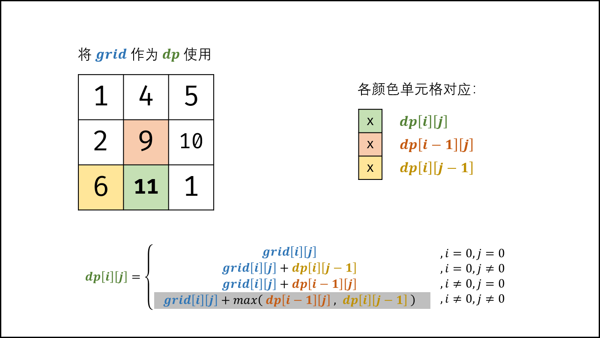

> 原文链接: https://leetcode-cn.com/problems/li-wu-de-zui-da-jie-zhi-lcof


## 中文题目
<div><p>在一个 m*n 的棋盘的每一格都放有一个礼物，每个礼物都有一定的价值（价值大于 0）。你可以从棋盘的左上角开始拿格子里的礼物，并每次向右或者向下移动一格、直到到达棋盘的右下角。给定一个棋盘及其上面的礼物的价值，请计算你最多能拿到多少价值的礼物？</p>

<p>&nbsp;</p>

<p><strong>示例 1:</strong></p>

<pre><strong>输入:</strong> 
<code>[
&nbsp; [1,3,1],
&nbsp; [1,5,1],
&nbsp; [4,2,1]
]</code>
<strong>输出:</strong> <code>12
</code><strong>解释:</strong> 路径 1&rarr;3&rarr;5&rarr;2&rarr;1 可以拿到最多价值的礼物</pre>

<p>&nbsp;</p>

<p>提示：</p>

<ul>
	<li><code>0 &lt; grid.length &lt;= 200</code></li>
	<li><code>0 &lt; grid[0].length &lt;= 200</code></li>
</ul>
</div>

## 通过代码
<RecoDemo>
</RecoDemo>


## 高赞题解
#### 解题思路：

题目说明：从棋盘的左上角开始拿格子里的礼物，并每次 **向右** 或者 **向下** 移动一格、直到到达棋盘的右下角。
根据题目说明，易得某单元格只可能从上边单元格或左边单元格到达。

设 $f(i, j)$ 为从棋盘左上角走至单元格 $(i ,j)$ 的礼物最大累计价值，易得到以下递推关系：$f(i,j)$ 等于 $f(i,j-1)$ 和 $f(i-1,j)$ 中的较大值加上当前单元格礼物价值 $grid(i,j)$ 。

$$
f(i,j) = \max[f(i,j-1), f(i-1,j)] + grid(i,j)
$$

因此，可用动态规划解决此问题，以上公式便为转移方程。

{:width=450}

##### 动态规划解析：

- **状态定义：** 设动态规划矩阵 $dp$ ，$dp(i,j)$ 代表从棋盘的左上角开始，到达单元格 $(i,j)$ 时能拿到礼物的最大累计价值。 
- **转移方程：**
  1. 当 $i = 0$ 且 $j = 0$ 时，为起始元素；
  2. 当 $i = 0$ 且 $j \ne 0$ 时，为矩阵第一行元素，只可从左边到达；
  3. 当 $i \ne 0$ 且 $j = 0$ 时，为矩阵第一列元素，只可从上边到达；
  4. 当 $i \ne 0$ 且 $j \ne 0$ 时，可从左边或上边到达；

$$
dp(i,j)=
\begin{cases}
grid(i,j) & {,i=0, j=0}\\
grid(i,j) + dp(i,j-1) & {,i=0, j \ne 0}\\
grid(i,j) + dp(i-1,j) & {,i \ne 0, j=0}\\
grid(i,j) + \max[dp(i-1,j),dp(i,j-1)]& ,{i \ne 0, j \ne 0}
\end{cases}
$$

- **初始状态：** $dp[0][0] = grid[0][0]$ ，即到达单元格 $(0,0)$ 时能拿到礼物的最大累计价值为 $grid[0][0]$ ；
- **返回值：** $dp[m-1][n-1]$ ，$m, n$ 分别为矩阵的行高和列宽，即返回 $dp$ 矩阵右下角元素。

##### 空间复杂度优化：

- 由于 $dp[i][j]$ 只与 $dp[i-1][j]$ , $dp[i][j-1]$ , $grid[i][j]$ 有关系，因此可以将原矩阵 $grid$ 用作 $dp$ 矩阵，即直接在 $grid$ 上修改即可。
- 应用此方法可省去 $dp$ 矩阵使用的额外空间，因此空间复杂度从 $O(MN)$ 降至 $O(1)$ 。 

<,,,,,,,,,>

##### 复杂度分析：

- **时间复杂度 $O(MN)$ ：** $M, N$ 分别为矩阵行高、列宽；动态规划需遍历整个 $grid$ 矩阵，使用 $O(MN)$ 时间。
- **空间复杂度 $O(1)$ ：** 原地修改使用常数大小的额外空间。

#### 代码：

```Python []
class Solution:
    def maxValue(self, grid: List[List[int]]) -> int:
        for i in range(len(grid)):
            for j in range(len(grid[0])):
                if i == 0 and j == 0: continue
                if i == 0: grid[i][j] += grid[i][j - 1]
                elif j == 0: grid[i][j] += grid[i - 1][j]
                else: grid[i][j] += max(grid[i][j - 1], grid[i - 1][j])
        return grid[-1][-1]
```

```Java []
class Solution {
    public int maxValue(int[][] grid) {
        int m = grid.length, n = grid[0].length;
        for(int i = 0; i < m; i++) {
            for(int j = 0; j < n; j++) {
                if(i == 0 && j == 0) continue;
                if(i == 0) grid[i][j] += grid[i][j - 1] ;
                else if(j == 0) grid[i][j] += grid[i - 1][j];
                else grid[i][j] += Math.max(grid[i][j - 1], grid[i - 1][j]);
            }
        }
        return grid[m - 1][n - 1];
    }
}
```

以上代码逻辑清晰，和转移方程直接对应，但仍可提升效率：当 $grid$ 矩阵很大时， $i = 0$ 或 $j = 0$ 的情况仅占极少数，相当循环每轮都冗余了一次判断。因此，可先初始化矩阵第一行和第一列，再开始遍历递推。

```Python []
class Solution:
    def maxValue(self, grid: List[List[int]]) -> int:
        m, n = len(grid), len(grid[0])
        for j in range(1, n): # 初始化第一行
            grid[0][j] += grid[0][j - 1]
        for i in range(1, m): # 初始化第一列
            grid[i][0] += grid[i - 1][0]
        for i in range(1, m):
            for j in range(1, n):
                grid[i][j] += max(grid[i][j - 1], grid[i - 1][j])
        return grid[-1][-1]
```

```Java []
class Solution {
    public int maxValue(int[][] grid) {
        int m = grid.length, n = grid[0].length;
        for(int j = 1; j < n; j++) // 初始化第一行
            grid[0][j] += grid[0][j - 1];
        for(int i = 1; i < m; i++) // 初始化第一列
            grid[i][0] += grid[i - 1][0];
        for(int i = 1; i < m; i++)
            for(int j = 1; j < n; j++) 
                grid[i][j] += Math.max(grid[i][j - 1], grid[i - 1][j]);
        return grid[m - 1][n - 1];
    }
}
```

## 统计信息
| 通过次数 | 提交次数 | AC比率 |
| :------: | :------: | :------: |
|    130239    |    188780    |   69.0%   |

## 提交历史
| 提交时间 | 提交结果 | 执行时间 |  内存消耗  | 语言 |
| :------: | :------: | :------: | :--------: | :--------: |
