> 原文链接: https://leetcode-cn.com/problems/chou-shu-lcof


## 中文题目
<div><p>我们把只包含质因子 2、3 和 5 的数称作丑数（Ugly Number）。求按从小到大的顺序的第 n 个丑数。</p>

<p>&nbsp;</p>

<p><strong>示例:</strong></p>

<pre><strong>输入:</strong> n = 10
<strong>输出:</strong> 12
<strong>解释: </strong><code>1, 2, 3, 4, 5, 6, 8, 9, 10, 12</code> 是前 10 个丑数。</pre>

<p><strong>说明:&nbsp;</strong>&nbsp;</p>

<ol>
	<li><code>1</code>&nbsp;是丑数。</li>
	<li><code>n</code>&nbsp;<strong>不超过</strong>1690。</li>
</ol>

<p>注意：本题与主站 264 题相同：<a href="https://leetcode-cn.com/problems/ugly-number-ii/">https://leetcode-cn.com/problems/ugly-number-ii/</a></p>
</div>

## 通过代码
<RecoDemo>
</RecoDemo>


## 高赞题解
#### 解题思路：

> **丑数的递推性质：** 丑数只包含因子 $2, 3, 5$ ，因此有 “丑数 $=$ 某较小丑数 $\times$ 某因子” （例如：$10 = 5 \times 2$）。

设已知长度为 $n$ 的丑数序列 $x_1, x_2, \cdots , x_n$ ，求第 $n+1$ 个丑数 $x_{n+1}$  。根根据递推性质，丑数 $x_{n+1}$ 只可能是以下三种情况其中之一（索引 $a, b, c$ 为未知数）：

$$
x_{n+1} =
\begin{cases}
x_{a} \times 2 & ,a \in [1, n] \\
x_{b} \times 3 & ,b \in [1, n] \\
x_{c} \times 5 & ,c \in [1, n]
\end{cases}
$$

**丑数递推公式：** 若索引 $a,b,c$ 满足以上条件，则下个丑数 $x_{n+1}$ 为以下三种情况中的 **最小值** ；

$$
x_{n+1} = \min(x_{a} \times 2, x_{b} \times 3, x_{c} \times 5)
$$

由于 $x_{n+1}$ 是 **最接近** $x_n$ 的丑数，因此索引 $a, b, c$ 需满足以下条件：

$$
\begin{cases}
x_{a} \times 2 > x_n \geq x_{a-1} \times 2 & ，即 x_a 为首个乘以 2 后大于 x_n 的丑数 \\
x_{b} \times 3 > x_n \geq x_{b-1} \times 3 & ，即 x_b 为首个乘以 3 后大于 x_n 的丑数 \\
x_{c} \times 5 > x_n \geq x_{c-1} \times 5 & ，即 x_c 为首个乘以 5 后大于 x_n 的丑数 \\
\end{cases}
$$

{:width=550}

因此，可设置指针 $a,b,c$ 指向首个丑数（即 $1$ ），循环根据递推公式得到下个丑数，并每轮将对应指针执行 $+1$ 即可。

##### 动态规划解析：

- **状态定义：** 设动态规划列表 $dp$ ，$dp[i]$ 代表第 $i + 1$ 个丑数；
- **转移方程：**
  1. 当索引 $a, b, c$ 满足以下条件时， $dp[i]$ 为三种情况的最小值；
  2. 每轮计算 $dp[i]$ 后，需要更新索引 $a, b, c$ 的值，使其始终满足方程条件。实现方法：**分别独立判断** $dp[i]$ 和 $dp[a] \times 2$ , $dp[b] \times 3$ ,  $dp[c] \times 5$ 的大小关系，若相等则将对应索引 $a$ , $b$ , $c$ 加 $1$ ；

$$
\begin{cases}
dp[a] \times 2 > dp[i-1] \geq dp[a-1] \times 2 \\
dp[b] \times 3 > dp[i-1] \geq dp[b-1] \times 3 \\
dp[c] \times 5 > dp[i-1] \geq dp[c-1] \times 5 \\
\end{cases}
$$

$$
dp[i] = \min(dp[a] \times 2, dp[b] \times 3, dp[c] \times 5)
$$

- **初始状态：** $dp[0] = 1$ ，即第一个丑数为 $1$ ；
- **返回值：** $dp[n-1]$ ，即返回第 $n$ 个丑数；

<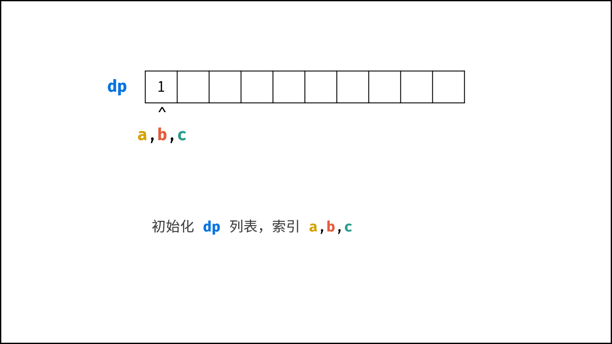,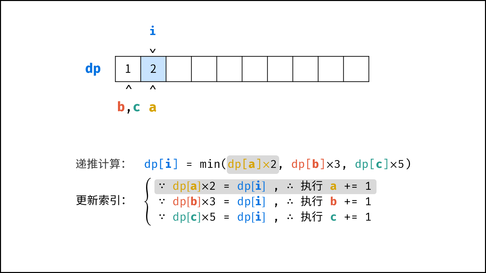,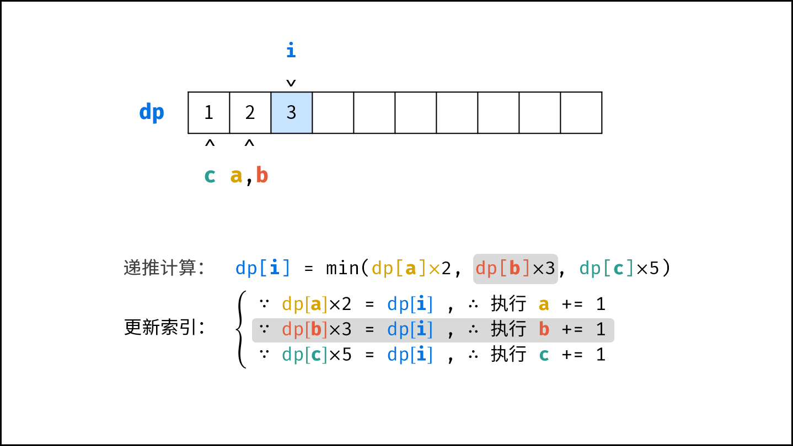,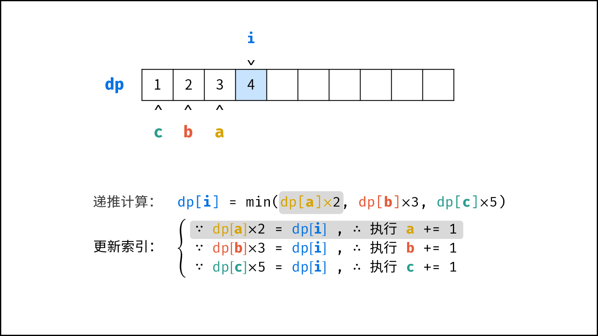,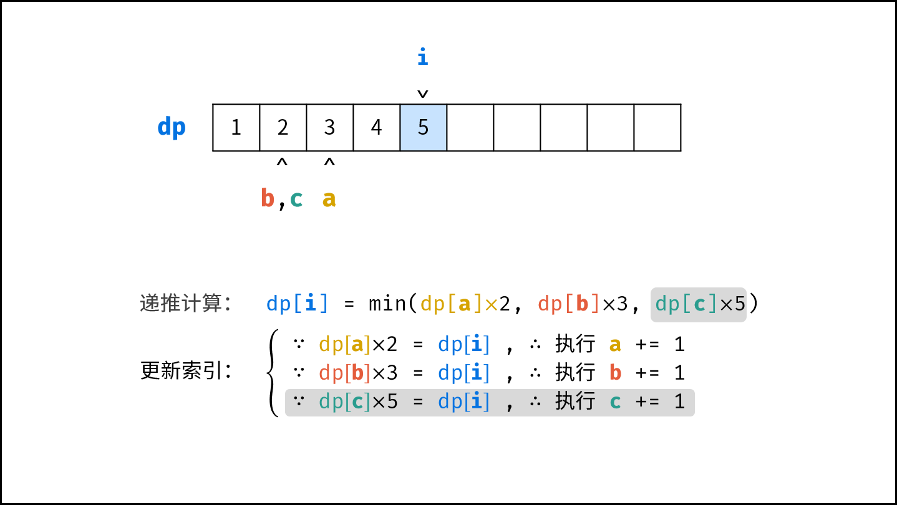,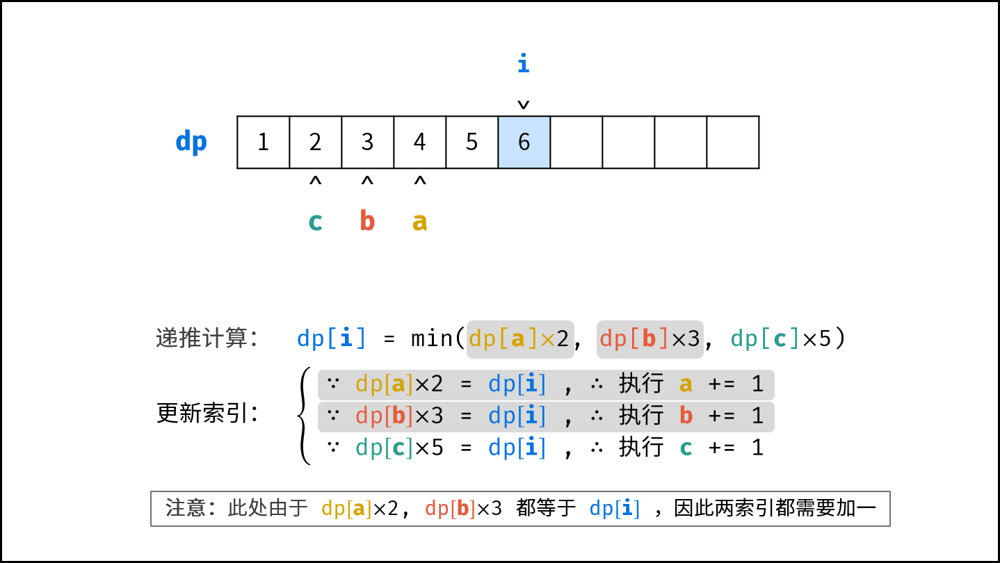,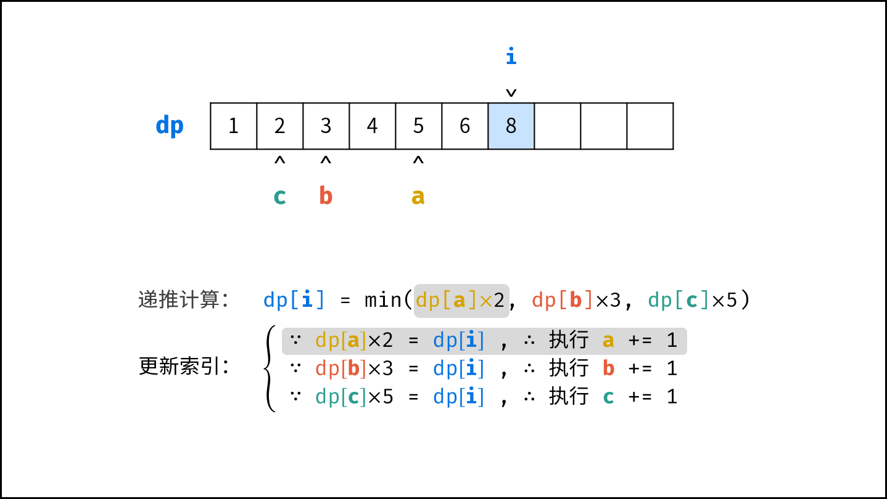,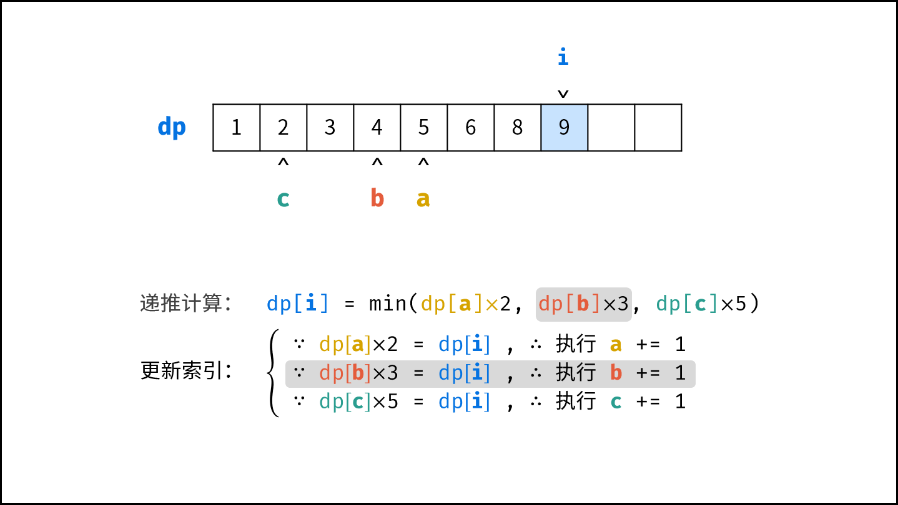,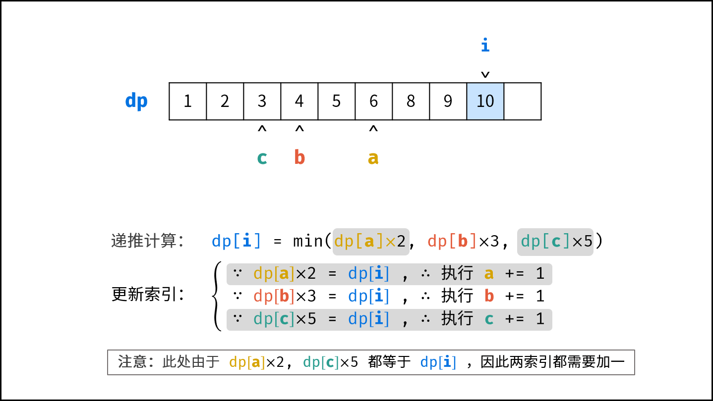,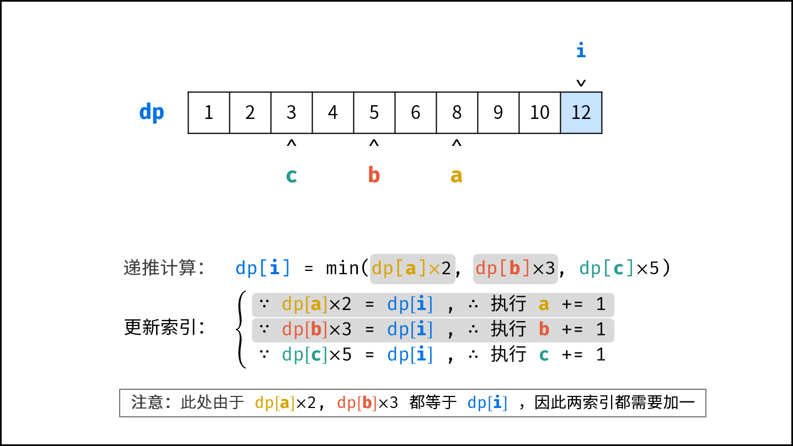,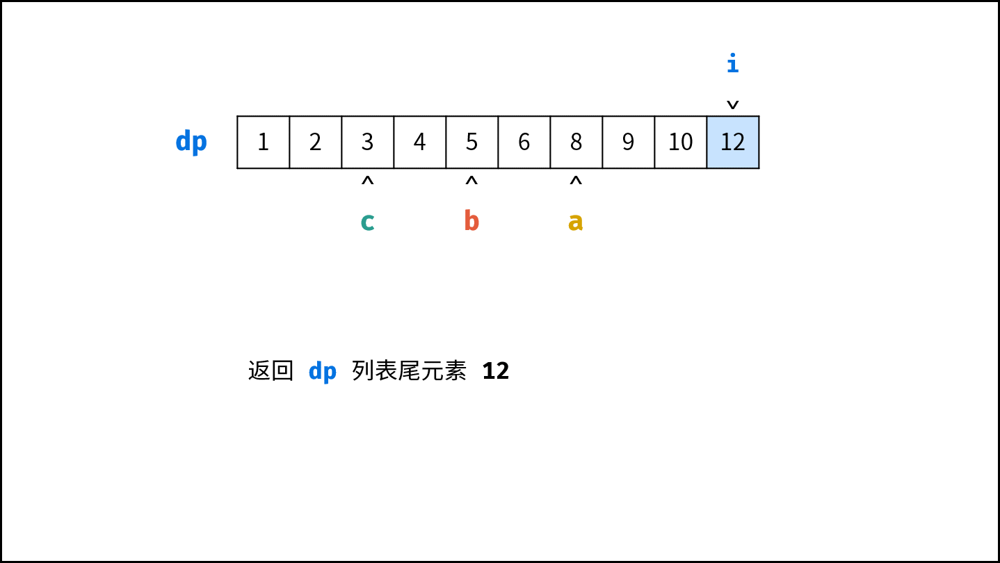>

**复杂度分析：**

- **时间复杂度 $O(N)$ ：** 其中 $N = n$ ，动态规划需遍历计算 $dp$ 列表。
- **空间复杂度 $O(N)$ ：** 长度为 $N$ 的 $dp$ 列表使用 $O(N)$ 的额外空间。

#### 代码：

```Python []
class Solution:
    def nthUglyNumber(self, n: int) -> int:
        dp, a, b, c = [1] * n, 0, 0, 0
        for i in range(1, n):
            n2, n3, n5 = dp[a] * 2, dp[b] * 3, dp[c] * 5
            dp[i] = min(n2, n3, n5)
            if dp[i] == n2: a += 1
            if dp[i] == n3: b += 1
            if dp[i] == n5: c += 1
        return dp[-1]
```

```Java []
class Solution {
    public int nthUglyNumber(int n) {
        int a = 0, b = 0, c = 0;
        int[] dp = new int[n];
        dp[0] = 1;
        for(int i = 1; i < n; i++) {
            int n2 = dp[a] * 2, n3 = dp[b] * 3, n5 = dp[c] * 5;
            dp[i] = Math.min(Math.min(n2, n3), n5);
            if(dp[i] == n2) a++;
            if(dp[i] == n3) b++;
            if(dp[i] == n5) c++;
        }
        return dp[n - 1];
    }
}
```

```C++ []
class Solution {
public:
    int nthUglyNumber(int n) {
        int a = 0, b = 0, c = 0;
        int dp[n];
        dp[0] = 1;
        for(int i = 1; i < n; i++) {
            int n2 = dp[a] * 2, n3 = dp[b] * 3, n5 = dp[c] * 5;
            dp[i] = min(min(n2, n3), n5);
            if(dp[i] == n2) a++;
            if(dp[i] == n3) b++;
            if(dp[i] == n5) c++;
        }
        return dp[n - 1];
    }
};
```

## 统计信息
| 通过次数 | 提交次数 | AC比率 |
| :------: | :------: | :------: |
|    93849    |    144084    |   65.1%   |

## 提交历史
| 提交时间 | 提交结果 | 执行时间 |  内存消耗  | 语言 |
| :------: | :------: | :------: | :--------: | :--------: |
