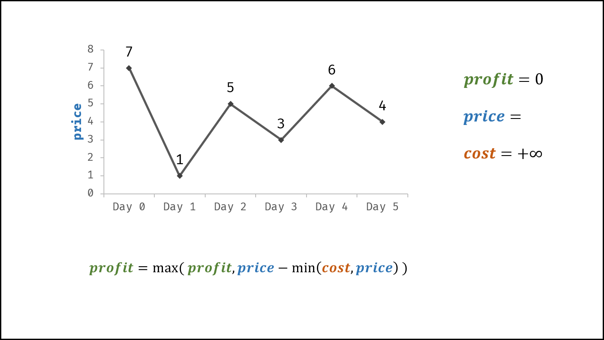

> 原文链接: https://leetcode-cn.com/problems/gu-piao-de-zui-da-li-run-lcof


## 中文题目
<div><p>假设把某股票的价格按照时间先后顺序存储在数组中，请问买卖该股票一次可能获得的最大利润是多少？</p>

<p>&nbsp;</p>

<p><strong>示例 1:</strong></p>

<pre><strong>输入:</strong> [7,1,5,3,6,4]
<strong>输出:</strong> 5
<strong>解释: </strong>在第 2 天（股票价格 = 1）的时候买入，在第 5 天（股票价格 = 6）的时候卖出，最大利润 = 6-1 = 5 。
     注意利润不能是 7-1 = 6, 因为卖出价格需要大于买入价格。
</pre>

<p><strong>示例 2:</strong></p>

<pre><strong>输入:</strong> [7,6,4,3,1]
<strong>输出:</strong> 0
<strong>解释: </strong>在这种情况下, 没有交易完成, 所以最大利润为 0。</pre>

<p>&nbsp;</p>

<p><strong>限制：</strong></p>

<p><code>0 &lt;= 数组长度 &lt;= 10^5</code></p>

<p>&nbsp;</p>

<p><strong>注意：</strong>本题与主站 121 题相同：<a href="https://leetcode-cn.com/problems/best-time-to-buy-and-sell-stock/">https://leetcode-cn.com/problems/best-time-to-buy-and-sell-stock/</a></p>
</div>

## 通过代码
<RecoDemo>
</RecoDemo>


## 高赞题解
#### 解题思路：

- 设共有 $n$ 天，第 $a$ 天买，第 $b$ 天卖，则需保证 $a < b$ ；可推出交易方案数共有：

$$
(n - 1) + (n - 2) + \cdots + 2 + 1 = n(n - 1) / 2
$$

- 因此，暴力法的时间复杂度为 $O(n^2)$ 。考虑使用动态规划降低时间复杂度，以下按照流程解题。

##### 动态规划解析：

- **状态定义：** 设动态规划列表 $dp$ ，$dp[i]$ 代表以 $prices[i]$ 为结尾的子数组的最大利润（以下简称为 **前 $i$ 日的最大利润** ）。
- **转移方程：** 由于题目限定 “买卖该股票一次” ，因此前 $i$ 日最大利润 $dp[i]$ 等于前 $i - 1$ 日最大利润 $dp[i-1]$ 和第 $i$ 日卖出的最大利润中的最大值。

$$
前 i 日最大利润 = \max(前 (i-1) 日最大利润, 第 i 日价格 - 前 i 日最低价格)
$$

$$
dp[i] = \max(dp[i - 1], prices[i] - \min(prices[0:i]))
$$

- **初始状态：** $dp[0] = 0$ ，即首日利润为 $0$ ；
- **返回值：** $dp[n - 1]$ ，其中 $n$ 为 $dp$ 列表长度。

{:width=550}

##### 效率优化：

- **时间复杂度降低：** 前 $i$ 日的最低价格 $\min(prices[0:i])$ 时间复杂度为 $O(i)$ 。而在遍历 $prices$ 时，可以借助一个变量（记为成本 $cost$ ）每日更新最低价格。优化后的转移方程为：

$$
dp[i] = \max(dp[i - 1], prices[i] - \min(cost, prices[i])
$$

- **空间复杂度降低：** 由于 $dp[i]$ 只与 $dp[i - 1]$ , $prices[i]$ , $cost$ 相关，因此可使用一个变量（记为利润 $profit$ ）代替 $dp$ 列表。优化后的转移方程为：

$$
profit = \max(profit, prices[i] - \min(cost, prices[i])
$$

##### 复杂度分析：

- **时间复杂度 $O(N)$ ：** 其中 $N$ 为 $prices$ 列表长度，动态规划需遍历 $prices$ 。
- **空间复杂度 $O(1)$ ：** 变量 $cost$ 和 $profit$ 使用常数大小的额外空间。

<,,,,,,,>

#### 代码：

```python []
class Solution:
    def maxProfit(self, prices: List[int]) -> int:
        cost, profit = float("+inf"), 0
        for price in prices:
            cost = min(cost, price)
            profit = max(profit, price - cost)
        return profit
```

```java []
class Solution {
    public int maxProfit(int[] prices) {
        int cost = Integer.MAX_VALUE, profit = 0;
        for(int price : prices) {
            cost = Math.min(cost, price);
            profit = Math.max(profit, price - cost);
        }
        return profit;
    }
}
```


## 统计信息
| 通过次数 | 提交次数 | AC比率 |
| :------: | :------: | :------: |
|    143759    |    226474    |   63.5%   |

## 提交历史
| 提交时间 | 提交结果 | 执行时间 |  内存消耗  | 语言 |
| :------: | :------: | :------: | :--------: | :--------: |
