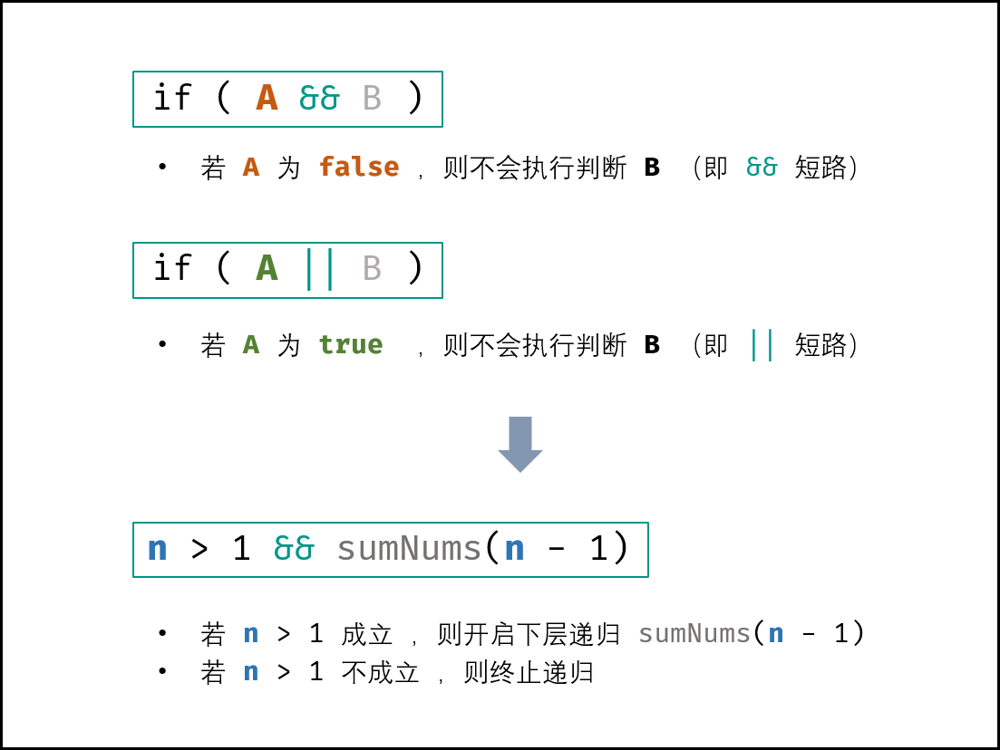
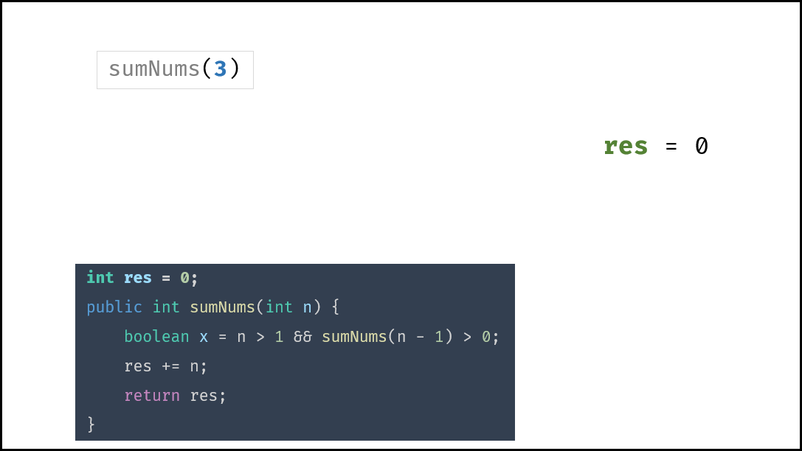
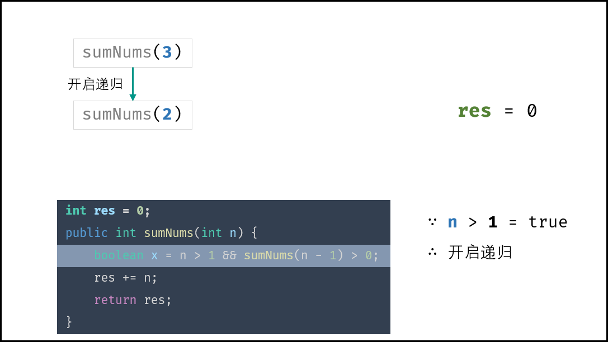
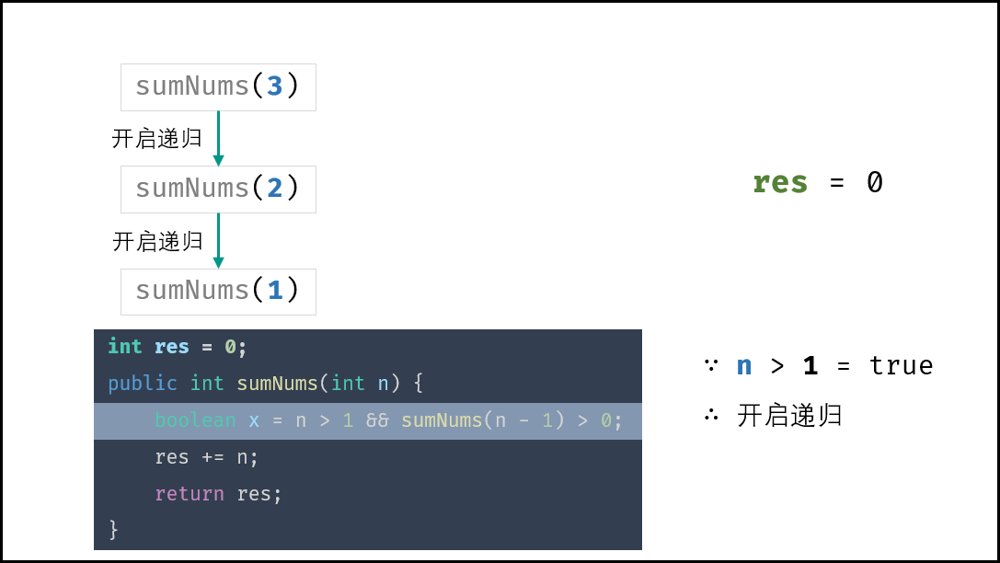
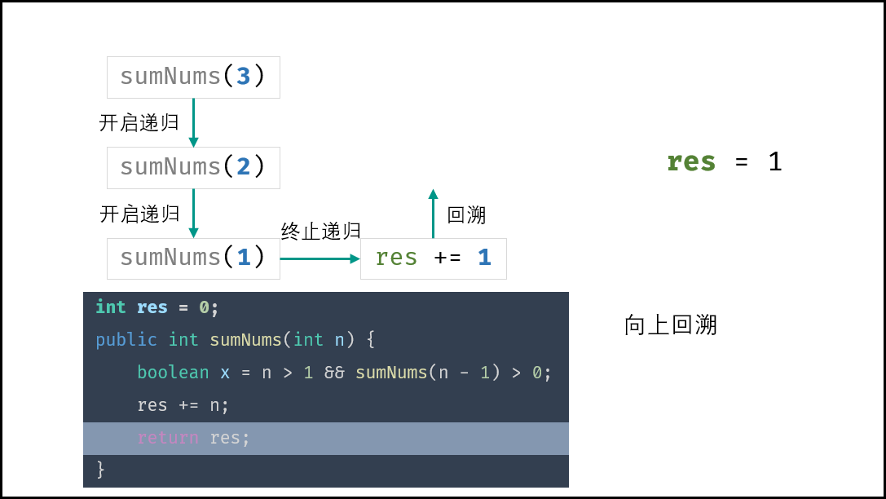
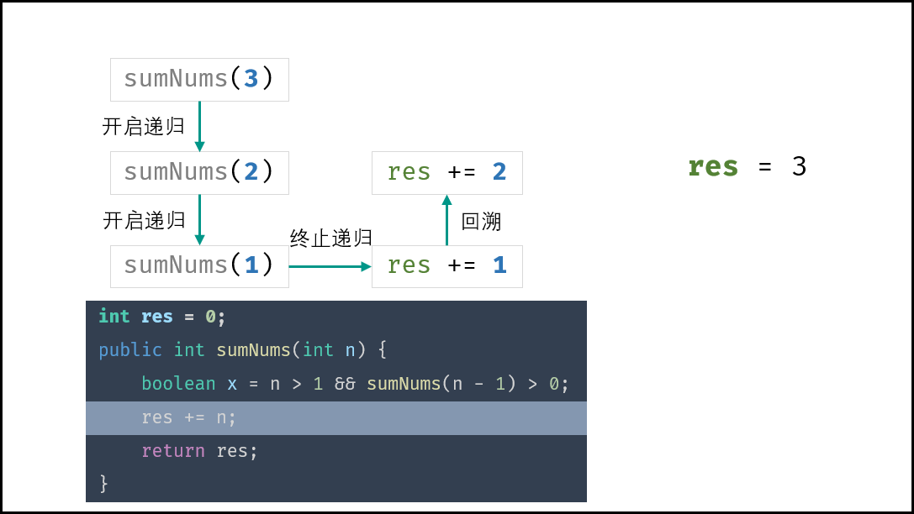
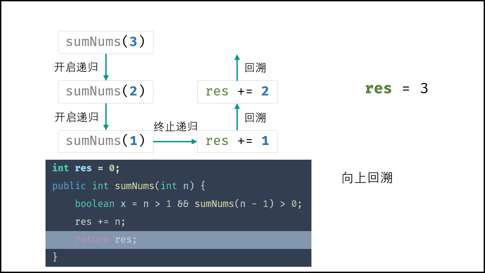
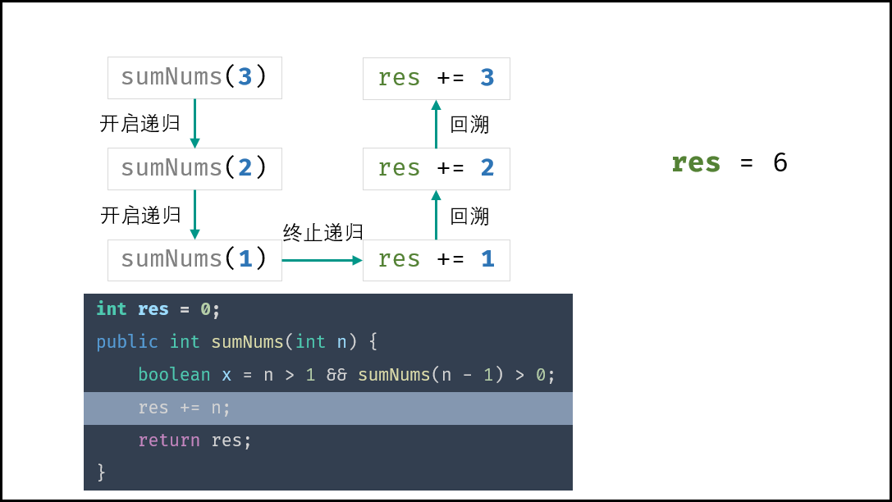
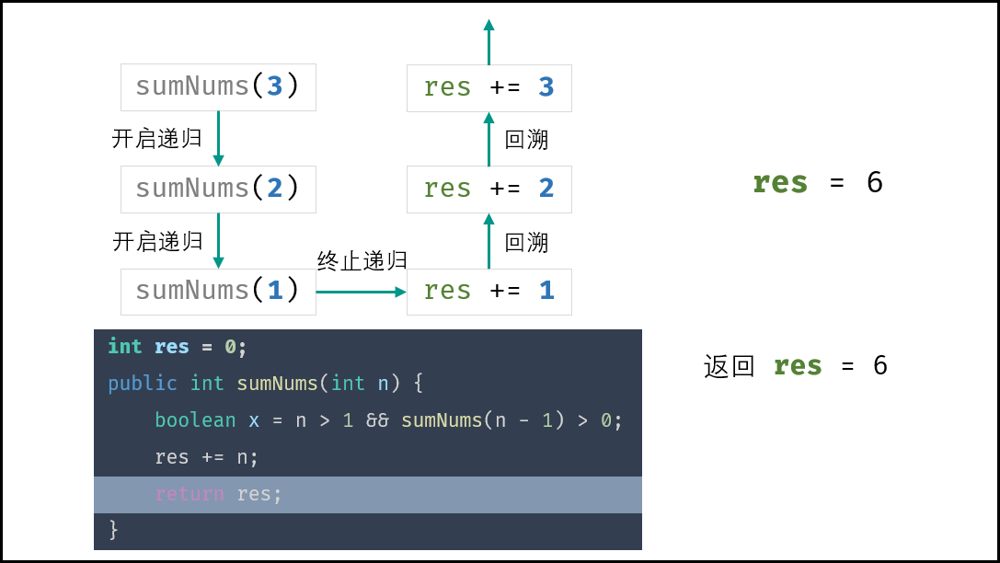

> 原文链接: https://leetcode-cn.com/problems/qiu-12n-lcof


## 中文题目
<div><p>求 <code>1+2+...+n</code> ，要求不能使用乘除法、for、while、if、else、switch、case等关键字及条件判断语句（A?B:C）。</p>

<p>&nbsp;</p>

<p><strong>示例 1：</strong></p>

<pre><strong>输入:</strong> n = 3
<strong>输出:&nbsp;</strong>6
</pre>

<p><strong>示例 2：</strong></p>

<pre><strong>输入:</strong> n = 9
<strong>输出:&nbsp;</strong>45
</pre>

<p>&nbsp;</p>

<p><strong>限制：</strong></p>

<ul>
	<li><code>1 &lt;= n&nbsp;&lt;= 10000</code></li>
</ul>
</div>

## 通过代码
<RecoDemo>
</RecoDemo>


## 高赞题解
#### 解题思路：

本题在简单问题上做了许多限制，需要使用排除法一步步导向答案。
$1+2+...+(n-1)+n$ 的计算方法主要有三种：平均计算、迭代、递归。

**方法一：** 平均计算
**问题：** 此计算必须使用 **乘除法** ，因此本方法不可取，直接排除。

```java []
public int sumNums(int n) {
    return (1 + n) * n / 2;
}
```

```python []
def sumNums(n):
    return (1 + n) * n // 2
```

**方法二：** 迭代
**问题：** 循环必须使用 $while$ 或 $for$ ，因此本方法不可取，直接排除。

```java []
public int sumNums(int n) {
    int res = 0;
    for(int i = 1; i <= n; i++)
        res += i;
    return res;
}
```

```python []
def sumNums(n):
    res = 0
    for i in range(1, n + 1):
        res += i
    return res
```

**方法三：** 递归
**问题：** 终止条件需要使用 $if$ ，因此本方法不可取。
**思考：** 除了 $if$ 和 $switch$ 等判断语句外，是否有其他方法可用来终止递归？

```java []
public int sumNums(int n) {
    if(n == 1) return 1;
    n += sumNums(n - 1);
    return n;
}
```

```python []
def sumNums(n):
    if n == 1: return 1
    n += sumNums(n - 1)
    return n
```

{:width=450}

##### 逻辑运算符的短路效应：

常见的逻辑运算符有三种，即 “与 $\&\&$ ”，“或 $||$ ”，“非 $!$ ” ；而其有重要的短路效应，如下所示：

```java
if(A && B)  // 若 A 为 false ，则 B 的判断不会执行（即短路），直接判定 A && B 为 false

if(A || B) // 若 A 为 true ，则 B 的判断不会执行（即短路），直接判定 A || B 为 true
```

本题需要实现 “当 $n = 1$ 时终止递归” 的需求，可通过短路效应实现。

```java
n > 1 && sumNums(n - 1) // 当 n = 1 时 n > 1 不成立 ，此时 “短路” ，终止后续递归
```

##### 复杂度分析：

- **时间复杂度 $O(n)$ ：** 计算 $n + (n-1) + ... + 2 + 1$ 需要开启 $n$ 个递归函数。
- **空间复杂度 $O(n)$ ：** 递归深度达到 $n$ ，系统使用 $O(n)$ 大小的额外空间。

<,,,,,,,,>

#### 代码：

1. Java 中，为构成语句，需加一个辅助布尔量 $x$ ，否则会报错；
2. Java 中，开启递归函数需改写为 `sumNums(n - 1) > 0` ，此整体作为一个布尔量输出，否则会报错；
3. 初始化变量 $res$ 记录结果。（ Java 可使用第二栏的简洁写法，不用借助变量 $res$ ）。

```java []
class Solution {
    int res = 0;
    public int sumNums(int n) {
        boolean x = n > 1 && sumNums(n - 1) > 0;
        res += n;
        return res;
    }
}
```

```java []
class Solution {
    public int sumNums(int n) {
        boolean x = n > 1 && (n += sumNums(n - 1)) > 0;
        return n;
    }
}
```

```python []
class Solution:
    def __init__(self):
        self.res = 0
    def sumNums(self, n: int) -> int:
        n > 1 and self.sumNums(n - 1)
        self.res += n
        return self.res
```

## 统计信息
| 通过次数 | 提交次数 | AC比率 |
| :------: | :------: | :------: |
|    146491    |    171007    |   85.7%   |

## 提交历史
| 提交时间 | 提交结果 | 执行时间 |  内存消耗  | 语言 |
| :------: | :------: | :------: | :--------: | :--------: |
