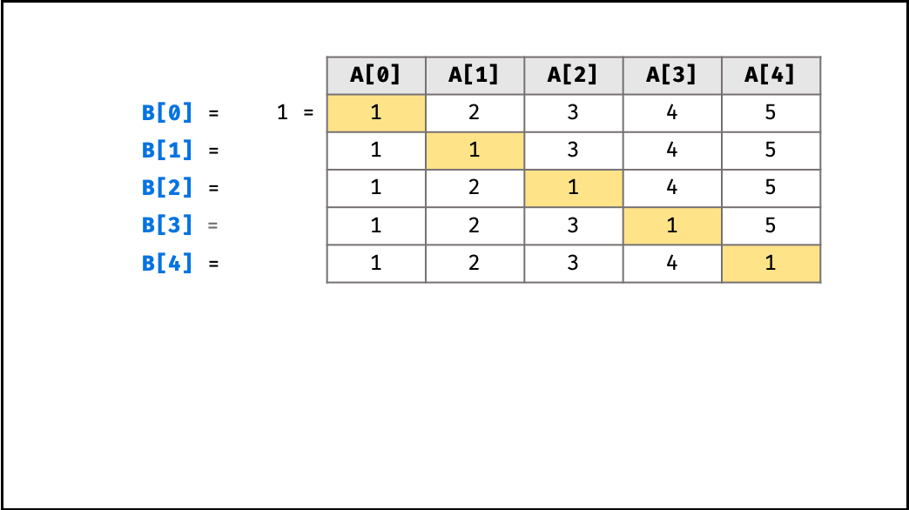
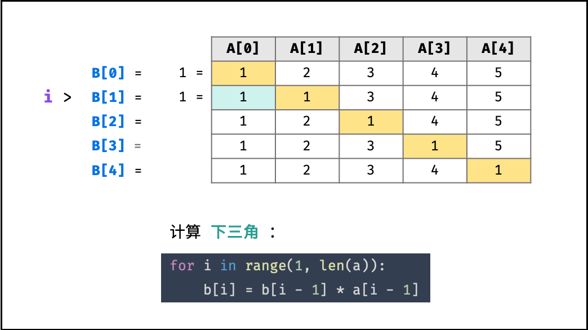
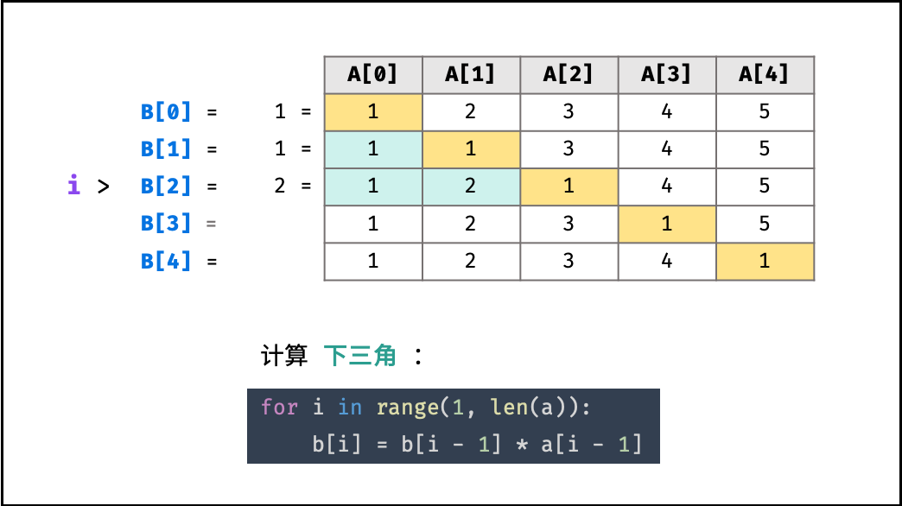
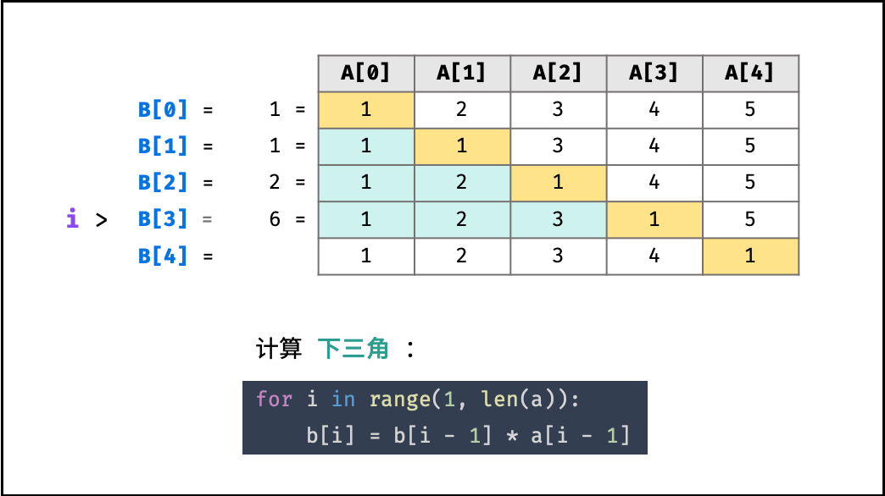
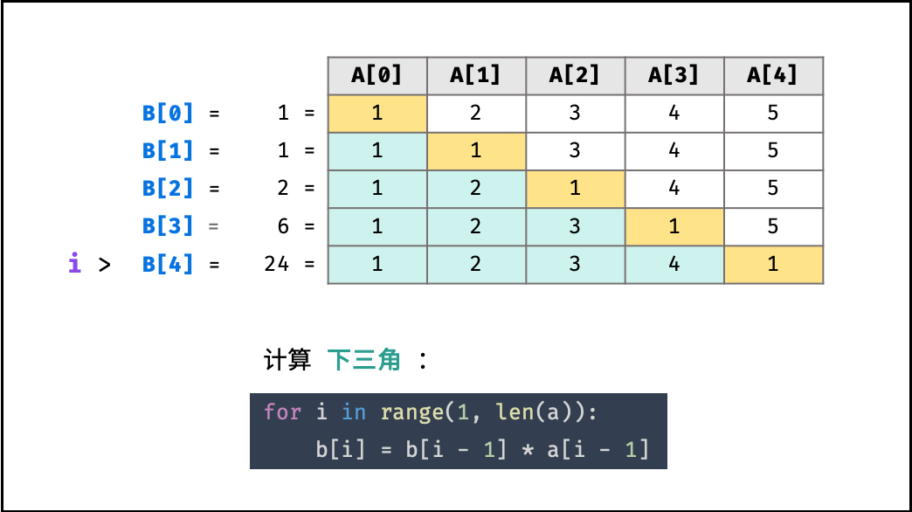
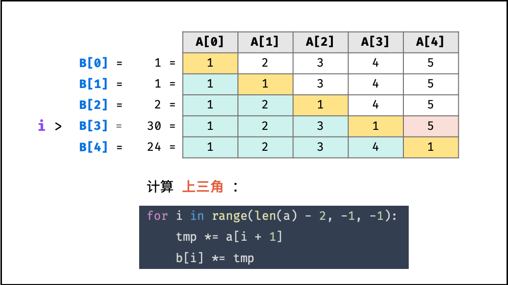
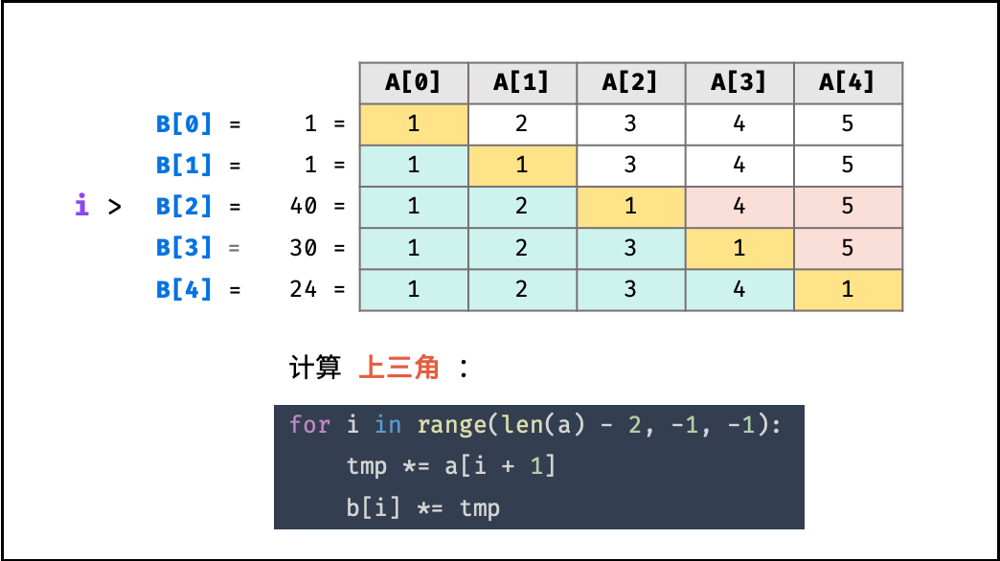
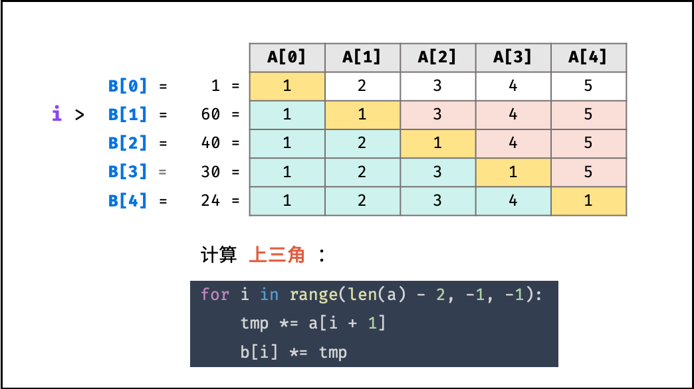
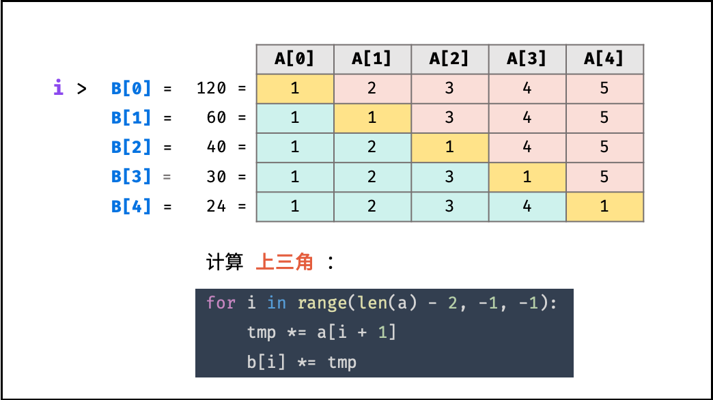
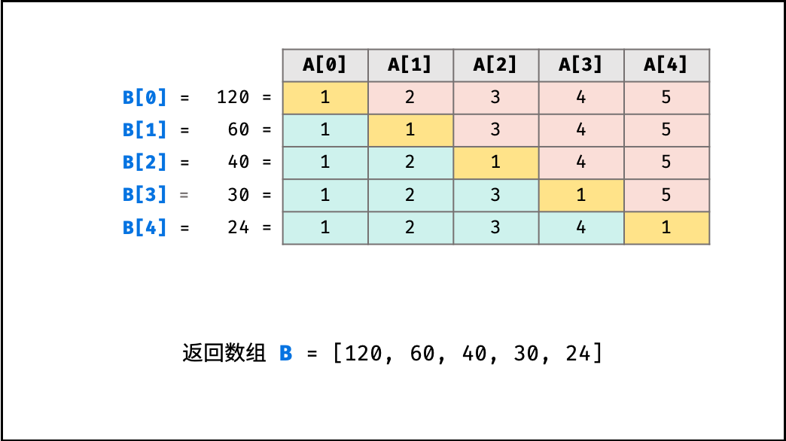

> 原文链接: https://leetcode-cn.com/problems/gou-jian-cheng-ji-shu-zu-lcof


## 中文题目
<div><p>给定一个数组 <code>A[0,1,…,n-1]</code>，请构建一个数组 <code>B[0,1,…,n-1]</code>，其中 <code>B[i]</code> 的值是数组 <code>A</code> 中除了下标 <code>i</code> 以外的元素的积, 即 <code>B[i]=A[0]×A[1]×…×A[i-1]×A[i+1]×…×A[n-1]</code>。不能使用除法。</p>

<p> </p>

<p><strong>示例:</strong></p>

<pre>
<strong>输入:</strong> [1,2,3,4,5]
<strong>输出:</strong> [120,60,40,30,24]</pre>

<p> </p>

<p><strong>提示：</strong></p>

<ul>
	<li>所有元素乘积之和不会溢出 32 位整数</li>
	<li><code>a.length <= 100000</code></li>
</ul>
</div>

## 通过代码
<RecoDemo>
</RecoDemo>


## 高赞题解
#### 解题思路：

本题的难点在于 **不能使用除法** ，即需要 **只用乘法** 生成数组 $B$ 。根据题目对 $B[i]$ 的定义，可列表格，如下图所示。

根据表格的主对角线（全为 $1$ ），可将表格分为 **上三角** 和 **下三角** 两部分。分别迭代计算下三角和上三角两部分的乘积，即可 **不使用除法** 就获得结果。

{:width=500}

##### 算法流程：

1. 初始化：数组 $B$ ，其中 $B[0] = 1$ ；辅助变量 $tmp = 1$ ；
2. 计算 $B[i]$ 的 **下三角** 各元素的乘积，直接乘入 $B[i]$ ；
3. 计算 $B[i]$ 的 **上三角** 各元素的乘积，记为 $tmp$ ，并乘入 $B[i]$ ；
4. 返回 $B$ 。

##### 复杂度分析：

- **时间复杂度 $O(N)$ ：** 其中 $N$ 为数组长度，两轮遍历数组 $a$ ，使用 $O(N)$ 时间。
- **空间复杂度 $O(1)$ ：** 变量 $tmp$ 使用常数大小额外空间（数组 $b$ 作为返回值，不计入复杂度考虑）。

<,,,,,,,,,>

#### 代码：

```Python []
class Solution:
    def constructArr(self, a: List[int]) -> List[int]:
        b, tmp = [1] * len(a), 1
        for i in range(1, len(a)):
            b[i] = b[i - 1] * a[i - 1] # 下三角
        for i in range(len(a) - 2, -1, -1):
            tmp *= a[i + 1]            # 上三角
            b[i] *= tmp                # 下三角 * 上三角
        return b
```

```Java []
class Solution {
    public int[] constructArr(int[] a) {
        int len = a.length;
        if(len == 0) return new int[0];
        int[] b = new int[len];
        b[0] = 1;
        int tmp = 1;
        for(int i = 1; i < len; i++) {
            b[i] = b[i - 1] * a[i - 1];
        }
        for(int i = len - 2; i >= 0; i--) {
            tmp *= a[i + 1];
            b[i] *= tmp;
        }
        return b;
    }
}
```

```C++ []
class Solution {
public:
    vector<int> constructArr(vector<int>& a) {
        int len = a.size();
        if(len == 0) return {};
        vector<int> b(len, 1);
        b[0] = 1;
        int tmp = 1;
        for(int i = 1; i < len; i++) {
            b[i] = b[i - 1] * a[i - 1];
        }
        for(int i = len - 2; i >= 0; i--) {
            tmp *= a[i + 1];
            b[i] *= tmp;
        }
        return b;
    }
};
```

## 统计信息
| 通过次数 | 提交次数 | AC比率 |
| :------: | :------: | :------: |
|    78951    |    132048    |   59.8%   |

## 提交历史
| 提交时间 | 提交结果 | 执行时间 |  内存消耗  | 语言 |
| :------: | :------: | :------: | :--------: | :--------: |
