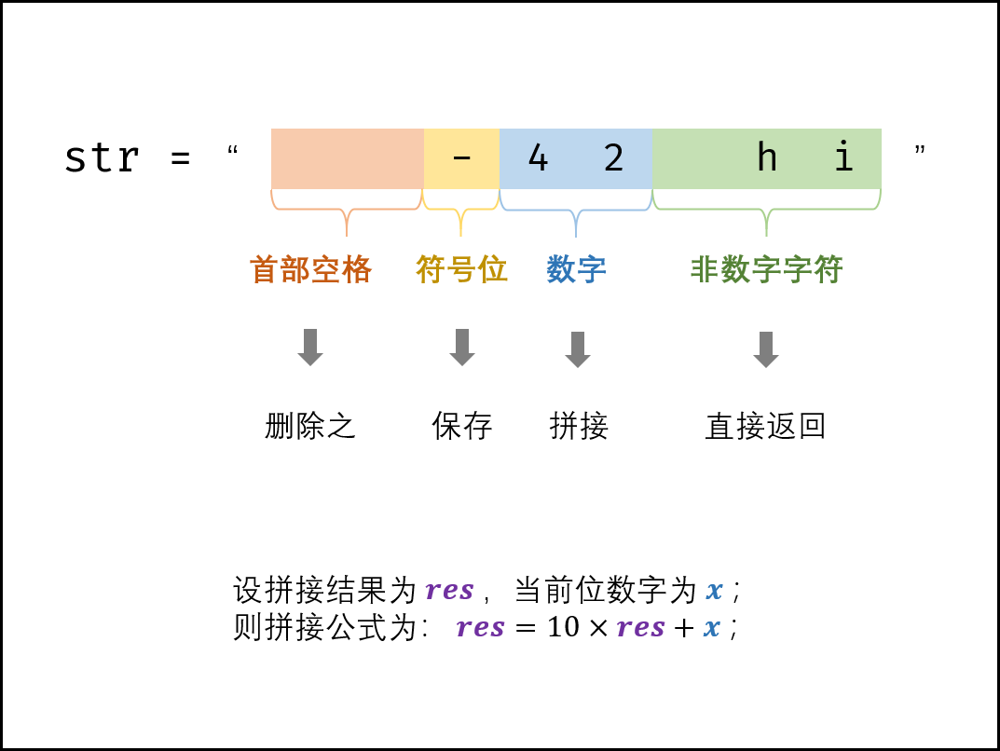
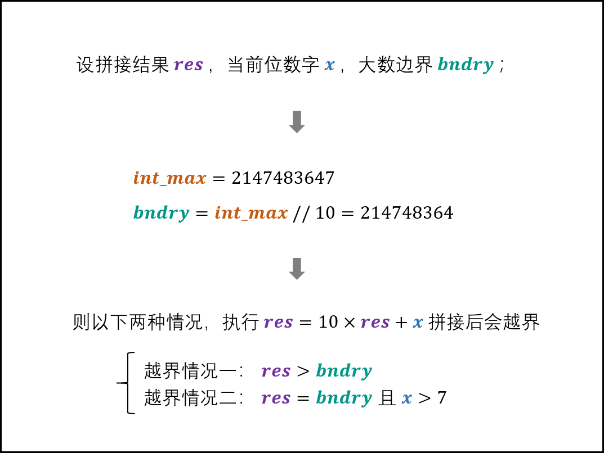
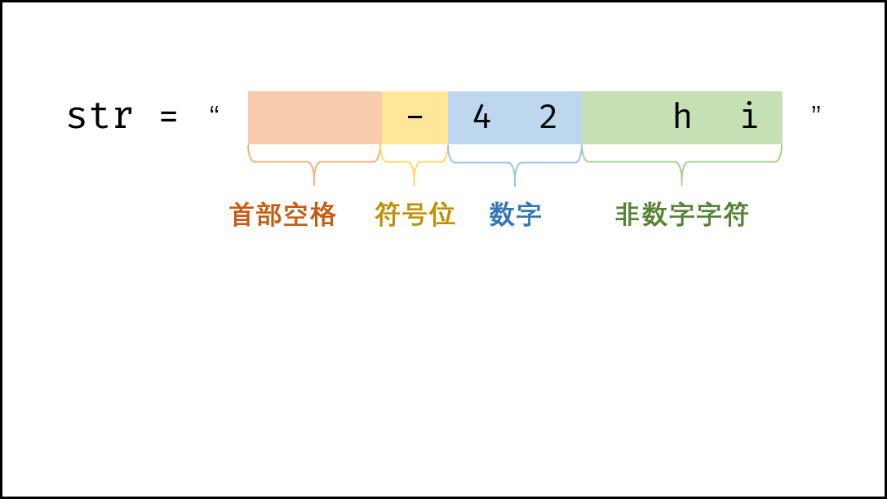
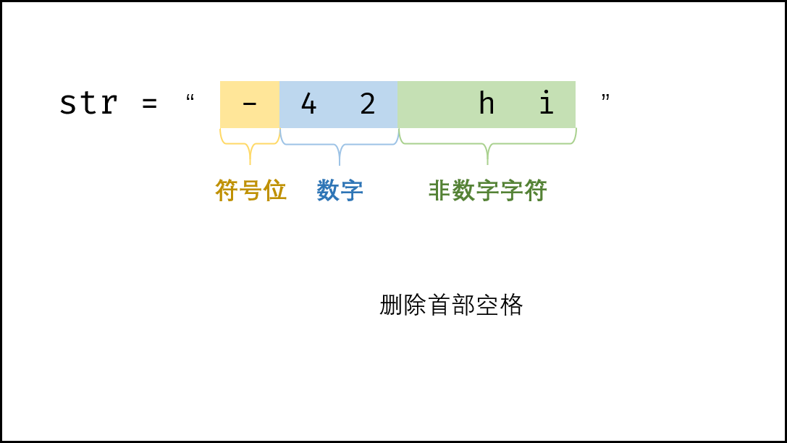
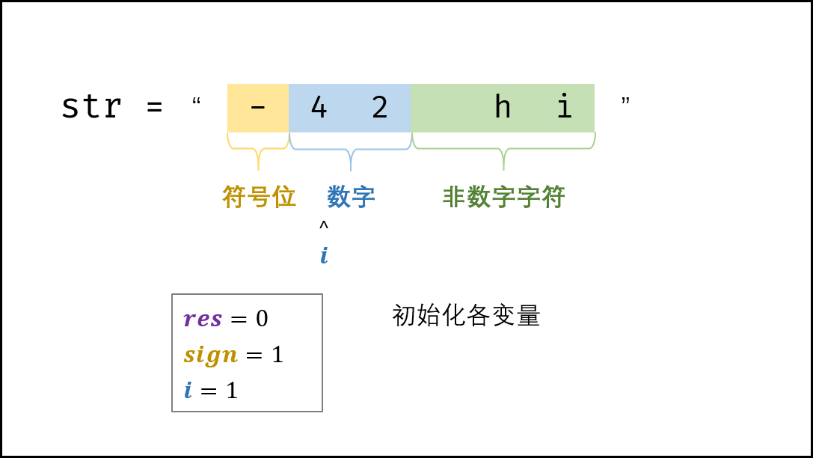
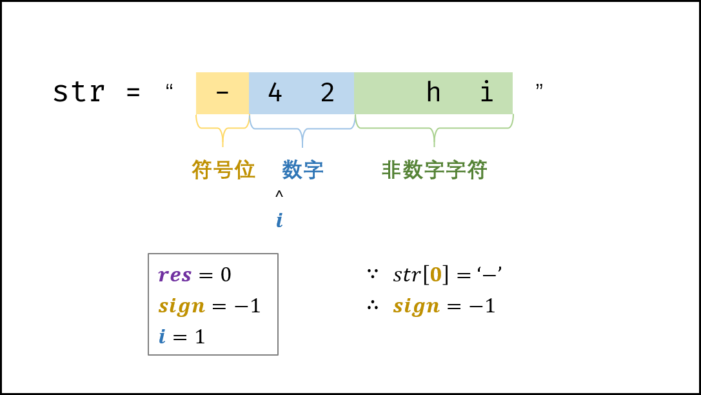
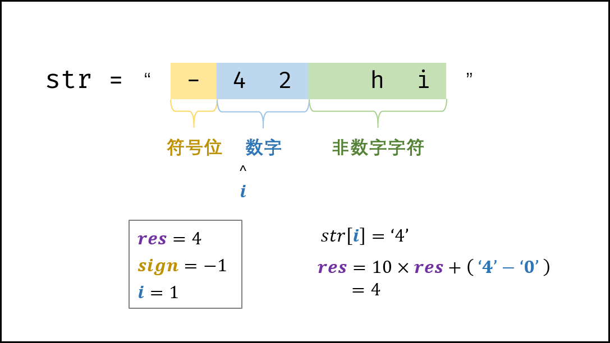
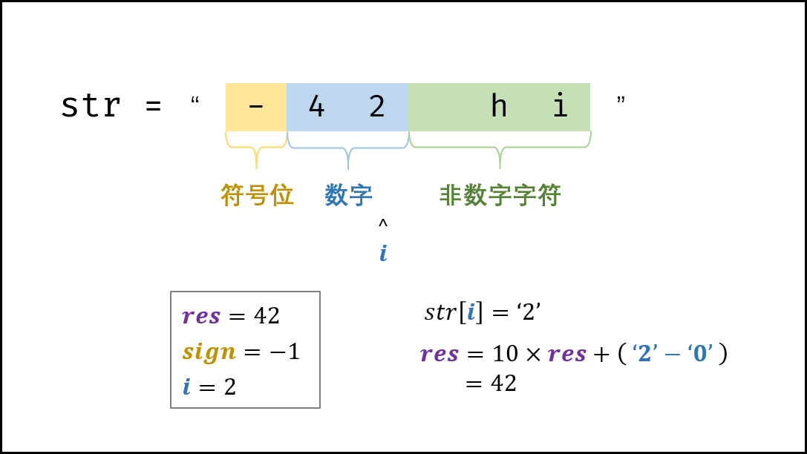
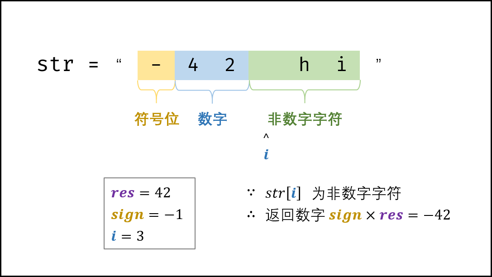

> 原文链接: https://leetcode-cn.com/problems/ba-zi-fu-chuan-zhuan-huan-cheng-zheng-shu-lcof


## 中文题目
<div><p>写一个函数 StrToInt，实现把字符串转换成整数这个功能。不能使用 atoi 或者其他类似的库函数。</p>

<p>&nbsp;</p>

<p>首先，该函数会根据需要丢弃无用的开头空格字符，直到寻找到第一个非空格的字符为止。</p>

<p>当我们寻找到的第一个非空字符为正或者负号时，则将该符号与之后面尽可能多的连续数字组合起来，作为该整数的正负号；假如第一个非空字符是数字，则直接将其与之后连续的数字字符组合起来，形成整数。</p>

<p>该字符串除了有效的整数部分之后也可能会存在多余的字符，这些字符可以被忽略，它们对于函数不应该造成影响。</p>

<p>注意：假如该字符串中的第一个非空格字符不是一个有效整数字符、字符串为空或字符串仅包含空白字符时，则你的函数不需要进行转换。</p>

<p>在任何情况下，若函数不能进行有效的转换时，请返回 0。</p>

<p><strong>说明：</strong></p>

<p>假设我们的环境只能存储 32 位大小的有符号整数，那么其数值范围为&nbsp;[&minus;2<sup>31</sup>,&nbsp; 2<sup>31&nbsp;</sup>&minus; 1]。如果数值超过这个范围，请返回 &nbsp;INT_MAX (2<sup>31&nbsp;</sup>&minus; 1) 或&nbsp;INT_MIN (&minus;2<sup>31</sup>) 。</p>

<p><strong>示例&nbsp;1:</strong></p>

<pre><strong>输入:</strong> &quot;42&quot;
<strong>输出:</strong> 42
</pre>

<p><strong>示例&nbsp;2:</strong></p>

<pre><strong>输入:</strong> &quot;   -42&quot;
<strong>输出:</strong> -42
<strong>解释: </strong>第一个非空白字符为 &#39;-&#39;, 它是一个负号。
&nbsp;    我们尽可能将负号与后面所有连续出现的数字组合起来，最后得到 -42 。
</pre>

<p><strong>示例&nbsp;3:</strong></p>

<pre><strong>输入:</strong> &quot;4193 with words&quot;
<strong>输出:</strong> 4193
<strong>解释:</strong> 转换截止于数字 &#39;3&#39; ，因为它的下一个字符不为数字。
</pre>

<p><strong>示例&nbsp;4:</strong></p>

<pre><strong>输入:</strong> &quot;words and 987&quot;
<strong>输出:</strong> 0
<strong>解释:</strong> 第一个非空字符是 &#39;w&#39;, 但它不是数字或正、负号。
     因此无法执行有效的转换。</pre>

<p><strong>示例&nbsp;5:</strong></p>

<pre><strong>输入:</strong> &quot;-91283472332&quot;
<strong>输出:</strong> -2147483648
<strong>解释:</strong> 数字 &quot;-91283472332&quot; 超过 32 位有符号整数范围。 
&nbsp;    因此返回 INT_MIN (&minus;2<sup>31</sup>) 。
</pre>

<p>&nbsp;</p>

<p>注意：本题与主站 8 题相同：<a href="https://leetcode-cn.com/problems/string-to-integer-atoi/">https://leetcode-cn.com/problems/string-to-integer-atoi/</a></p>
</div>

## 通过代码
<RecoDemo>
</RecoDemo>


## 高赞题解
#### 解题思路：

根据题意，有以下四种字符需要考虑：

1. **首部空格：** 删除之即可；
2. **符号位：** 三种情况，即 ''$+$'' , ''$-$'' , ''无符号"  ；新建一个变量保存符号位，返回前判断正负即可。
3. **非数字字符：** 遇到首个非数字的字符时，应立即返回。
4. **数字字符：**
   1. **字符转数字：** “此数字的 ASCII 码” 与 “ $0$ 的 ASCII 码” 相减即可；
   2. **数字拼接：** 若从左向右遍历数字，设当前位字符为 $c$ ，当前位数字为 $x$ ，数字结果为 $res$ ，则数字拼接公式为：

$$
res = 10 \times res + x \\
x = ascii(c) - ascii('0')
$$

{:width=450}

**数字越界处理：**

> 题目要求返回的数值范围应在 $[-2^{31}, 2^{31} - 1]$ ，因此需要考虑数字越界问题。而由于题目指出 `环境只能存储 32 位大小的有符号整数` ，因此判断数字越界时，要始终保持 $res$ 在 int 类型的取值范围内。 

在每轮数字拼接前，判断 $res$ **在此轮拼接后是否超过 $2147483647$** ，若超过则加上符号位直接返回。
设数字拼接边界 $bndry = 2147483647 // 10 = 214748364$ ，则以下两种情况越界：

$$
\begin{cases}
 res > bndry & 情况一：执行拼接 10 \times res \geq 2147483650 越界 \\
 res = bndry, x > 7 & 情况二：拼接后是 2147483648 或 2147483649 越界 \\
\end{cases}
$$

{:width=450}

##### 复杂度分析：

- **时间复杂度 $O(N)$ ：** 其中 $N$ 为字符串长度，线性遍历字符串占用 $O(N)$ 时间。
- **空间复杂度 $O(N)$ ：** 删除首尾空格后需建立新字符串，最差情况下占用 $O(N)$ 额外空间。

<,,,,,,>

#### 代码：

```Python []
class Solution:
    def strToInt(self, str: str) -> int:
        str = str.strip()                      # 删除首尾空格
        if not str: return 0                   # 字符串为空则直接返回
        res, i, sign = 0, 1, 1
        int_max, int_min, bndry = 2 ** 31 - 1, -2 ** 31, 2 ** 31 // 10
        if str[0] == '-': sign = -1            # 保存负号
        elif str[0] != '+': i = 0              # 若无符号位，则需从 i = 0 开始数字拼接
        for c in str[i:]:
            if not '0' <= c <= '9' : break     # 遇到非数字的字符则跳出
            if res > bndry or res == bndry and c > '7': return int_max if sign == 1 else int_min # 数字越界处理
            res = 10 * res + ord(c) - ord('0') # 数字拼接
        return sign * res
```

```Java []
class Solution {
    public int strToInt(String str) {
        char[] c = str.trim().toCharArray();
        if(c.length == 0) return 0;
        int res = 0, bndry = Integer.MAX_VALUE / 10;
        int i = 1, sign = 1;
        if(c[0] == '-') sign = -1;
        else if(c[0] != '+') i = 0;
        for(int j = i; j < c.length; j++) {
            if(c[j] < '0' || c[j] > '9') break;
            if(res > bndry || res == bndry && c[j] > '7') return sign == 1 ? Integer.MAX_VALUE : Integer.MIN_VALUE;
            res = res * 10 + (c[j] - '0');
        }
        return sign * res;
    }
}
```

若不使用 `trim() / strip()` 方法，而从头开始遍历字符串，则可以将空间复杂度降低至 $O(1)$ ，代码如下：

```Python []
class Solution:
    def strToInt(self, str: str) -> int:
        res, i, sign, length = 0, 0, 1, len(str)
        int_max, int_min, bndry = 2 ** 31 - 1, -2 ** 31, 2 ** 31 // 10
        if not str: return 0         # 空字符串，提前返回
        while str[i] == ' ':
            i += 1
            if i == length: return 0 # 字符串全为空格，提前返回
        if str[i] == '-': sign = -1
        if str[i] in '+-': i += 1
        for c in str[i:]:
            if not '0' <= c <= '9' : break
            if res > bndry or res == bndry and c > '7':
                return int_max if sign == 1 else int_min
            res = 10 * res + ord(c) - ord('0')
        return sign * res
```

```Java []
class Solution {
    public int strToInt(String str) {
        int res = 0, bndry = Integer.MAX_VALUE / 10;
        int i = 0, sign = 1, length = str.length();
        if(length == 0) return 0;
        while(str.charAt(i) == ' ')
            if(++i == length) return 0;
        if(str.charAt(i) == '-') sign = -1;
        if(str.charAt(i) == '-' || str.charAt(i) == '+') i++;
        for(int j = i; j < length; j++) {
            if(str.charAt(j) < '0' || str.charAt(j) > '9') break;
            if(res > bndry || res == bndry && str.charAt(j) > '7')
                return sign == 1 ? Integer.MAX_VALUE : Integer.MIN_VALUE;
            res = res * 10 + (str.charAt(j) - '0');
        }
        return sign * res;
    }
}
```

## 统计信息
| 通过次数 | 提交次数 | AC比率 |
| :------: | :------: | :------: |
|    74034    |    257344    |   28.8%   |

## 提交历史
| 提交时间 | 提交结果 | 执行时间 |  内存消耗  | 语言 |
| :------: | :------: | :------: | :--------: | :--------: |
