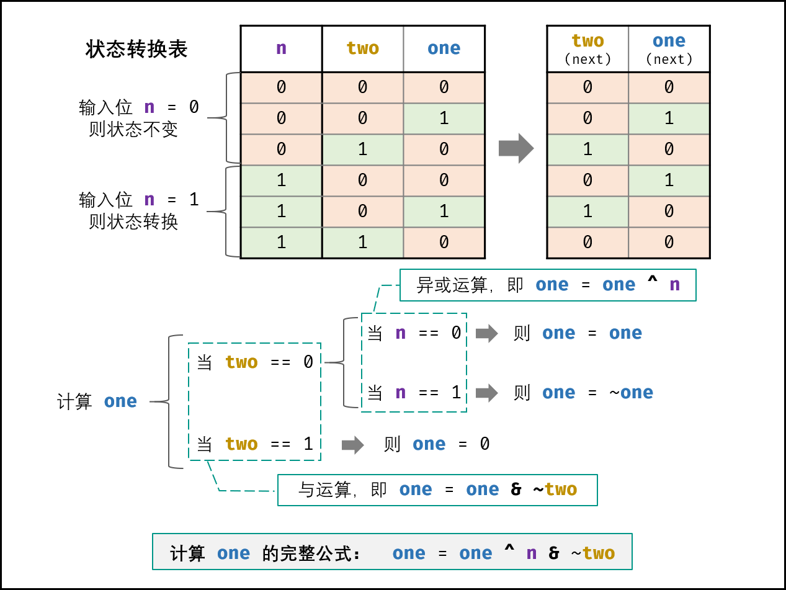

> 原文链接: https://leetcode-cn.com/problems/WGki4K


## 中文题目
<div><p>给你一个整数数组&nbsp;<code>nums</code> ，除某个元素仅出现 <strong>一次</strong> 外，其余每个元素都恰出现 <strong>三次 。</strong>请你找出并返回那个只出现了一次的元素。</p>

<p>&nbsp;</p>

<p><strong>示例 1：</strong></p>

<pre>
<strong>输入：</strong>nums = [2,2,3,2]
<strong>输出：</strong>3
</pre>

<p><strong>示例 2：</strong></p>

<pre>
<strong>输入：</strong>nums = [0,1,0,1,0,1,100]
<strong>输出：</strong>100
</pre>

<p>&nbsp;</p>

<p><strong>提示：</strong></p>

<ul>
	<li><code>1 &lt;= nums.length &lt;= 3 * 10<sup>4</sup></code></li>
	<li><code>-2<sup>31</sup> &lt;= nums[i] &lt;= 2<sup>31</sup> - 1</code></li>
	<li><code>nums</code> 中，除某个元素仅出现 <strong>一次</strong> 外，其余每个元素都恰出现 <strong>三次</strong></li>
</ul>

<p>&nbsp;</p>

<p><strong>进阶：</strong>你的算法应该具有线性时间复杂度。 你可以不使用额外空间来实现吗？</p>

<p>&nbsp;</p>

<p><meta charset="UTF-8" />注意：本题与主站 137&nbsp;题相同：<a href="https://leetcode-cn.com/problems/single-number-ii/">https://leetcode-cn.com/problems/single-number-ii/</a></p>
</div>

## 通过代码
<RecoDemo>
</RecoDemo>


## 高赞题解
#### 解题思路：

如下图所示，考虑数字的二进制形式，对于出现三次的数字，各 **二进制位** 出现的次数都是 $3$ 的倍数。
因此，统计所有数字的各二进制位中 $1$ 的出现次数，并对 $3$ 求余，结果则为只出现一次的数字。

{:width=450}

#### 方法一：有限状态自动机

各二进制位的 **位运算规则相同** ，因此只需考虑一位即可。如下图所示，对于所有数字中的某二进制位 $1$ 的个数，存在 3 种状态，即对 3 余数为 $0, 1, 2$ 。

- 若输入二进制位 $1$ ，则状态按照以下顺序转换；
- 若输入二进制位 $0$ ，则状态不变。

$$
0 \rightarrow 1 \rightarrow 2 \rightarrow 0 \rightarrow \cdots
$$

{:width=400}

如下图所示，由于二进制只能表示 $0, 1$ ，因此需要使用两个二进制位来表示 $3$ 个状态。设此两位分别为 $two$ , $one$ ，则状态转换变为：

$$
00 \rightarrow 01 \rightarrow 10 \rightarrow 00 \rightarrow \cdots
$$

{:width=400}

接下来，需要通过 **状态转换表** 导出 **状态转换的计算公式** 。首先回忆一下位运算特点，对于任意二进制位 $x$ ，有：

- 异或运算：`x ^ 0 = x`​ ， `x ^ 1 = ~x`
- 与运算：`x & 0 = 0` ， `x & 1 = x`

**计算 $one$ 方法：**

设当前状态为 $two$ $one$ ，此时输入二进制位 $n$ 。如下图所示，通过对状态表的情况拆分，可推出 $one$ 的计算方法为：

```python
if two == 0:
  if n == 0:
    one = one
  if n == 1:
    one = ~one
if two == 1:
    one = 0
```

引入 **异或运算** ，可将以上拆分简化为：

```python
if two == 0:
    one = one ^ n
if two == 1:
    one = 0
```

引入 **与运算** ，可继续简化为：

```python
one = one ^ n & ~two
```

{:width=550}

**计算 $two$ 方法：**

由于是先计算 $one$ ，因此应在新 $one$ 的基础上计算 $two$ 。
如下图所示，修改为新 $one$ 后，得到了新的状态图。观察发现，可以使用同样的方法计算 $two$ ，即：

```python
two = two ^ n & ~one
```

{:width=450}

**返回值：**

以上是对数字的二进制中 “一位” 的分析，而 `int` 类型的其他 31 位具有相同的运算规则，因此可将以上公式直接套用在 32 位数上。

遍历完所有数字后，各二进制位都处于状态 $00$ 和状态 $01$ （取决于 “只出现一次的数字” 的各二进制位是 $1$ 还是 $0$ ），而此两状态是由 $one$ 来记录的（此两状态下 $twos$ 恒为 $0$ ），因此返回 $ones$ 即可。

##### 复杂度分析：

- **时间复杂度 $O(N)$ ：** 其中 $N$ 位数组 $nums$ 的长度；遍历数组占用 $O(N)$ ，每轮中的常数个位运算操作占用 $O(32 \times3 \times 2) = O(1)$ 。
- **空间复杂度 $O(1)$ ：** 变量 $ones$ , $twos$ 使用常数大小的额外空间。

<,,,,,>

##### 代码：

```python []
class Solution:
    def singleNumber(self, nums: List[int]) -> int:
        ones, twos = 0, 0
        for num in nums:
            ones = ones ^ num & ~twos
            twos = twos ^ num & ~ones
        return ones
```

```java []
class Solution {
    public int singleNumber(int[] nums) {
        int ones = 0, twos = 0;
        for(int num : nums){
            ones = ones ^ num & ~twos;
            twos = twos ^ num & ~ones;
        }
        return ones;
    }
}
```

#### 方法二：遍历统计

> 此方法相对容易理解，但效率较低，总体推荐方法一。

使用 **与运算** ，可获取二进制数字 $num$ 的最右一位 $n_1$ ：

$$
n_1 = num \& i
$$

配合 **无符号右移操作** ，可获取 $num$ 所有位的值（即 $n_1$ ~ $n_{32}$ ）：

$$
num = num >>> 1
$$

建立一个长度为 32 的数组 $counts$ ，通过以上方法可记录所有数字的各二进制位的 $1$ 的出现次数。

```java
int[] counts = new int[32];
for(int i = 0; i < nums.length; i++) {
    for(int j = 0; j < 32; j++) {
        counts[j] += nums[i] & 1; // 更新第 j 位
        nums[i] >>>= 1; // 第 j 位 --> 第 j + 1 位
    }
}
```

将 $counts$ 各元素对 $3$ 求余，则结果为 “只出现一次的数字” 的各二进制位。

```java
for(int i = 0; i < 32; i++) {
    counts[i] %= 3; // 得到 只出现一次的数字 的第 (31 - i) 位
}
```

利用 **左移操作** 和 **或运算** ，可将 $counts$ 数组中各二进位的值恢复到数字 $res$ 上（循环区间是 $i \in [0, 31]$ ）。

```java
for(int i = 0; i < counts.length; i++) {
    res <<= 1; // 左移 1 位
    res |= counts[31 - i]; // 恢复第 i 位的值到 res
}
```

最终返回 $res$ 即可。

> 由于 Python 的存储负数的特殊性，需要先将 $0$ - $32$ 位取反（即 `res ^ 0xffffffff` ），再将所有位取反（即 `~` ）。
> 两个组合操作实质上是将数字 $32$ 以上位取反， $0$ - $32$ 位不变。

##### 复杂度分析：

- **时间复杂度 $O(N)$ ：** 其中 $N$ 位数组 $nums$ 的长度；遍历数组占用 $O(N)$ ，每轮中的常数个位运算操作占用 $O(1)$ 。
- **空间复杂度 $O(1)$ ：** 数组 $counts$ 长度恒为 $32$ ，占用常数大小的额外空间。

##### 代码：

实际上，只需要修改求余数值 $m$ ，即可实现解决 **除了一个数字以外，其余数字都出现 $m$ 次** 的通用问题。

```python []
class Solution:
    def singleNumber(self, nums: List[int]) -> int:
        counts = [0] * 32
        for num in nums:
            for j in range(32):
                counts[j] += num & 1
                num >>= 1
        res, m = 0, 3
        for i in range(32):
            res <<= 1
            res |= counts[31 - i] % m
        return res if counts[31] % m == 0 else ~(res ^ 0xffffffff)
```

```java []
class Solution {
    public int singleNumber(int[] nums) {
        int[] counts = new int[32];
        for(int num : nums) {
            for(int j = 0; j < 32; j++) {
                counts[j] += num & 1;
                num >>>= 1;
            }
        }
        int res = 0, m = 3;
        for(int i = 0; i < 32; i++) {
            res <<= 1;
            res |= counts[31 - i] % m;
        }
        return res;
    }
}
```

## 统计信息
| 通过次数 | 提交次数 | AC比率 |
| :------: | :------: | :------: |
|    12442    |    17798    |   69.9%   |

## 提交历史
| 提交时间 | 提交结果 | 执行时间 |  内存消耗  | 语言 |
| :------: | :------: | :------: | :--------: | :--------: |
