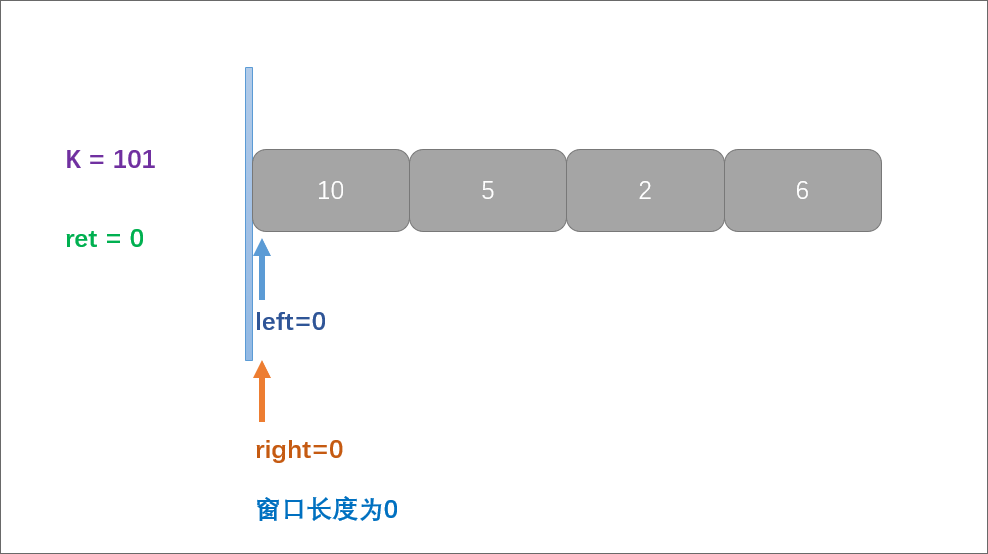
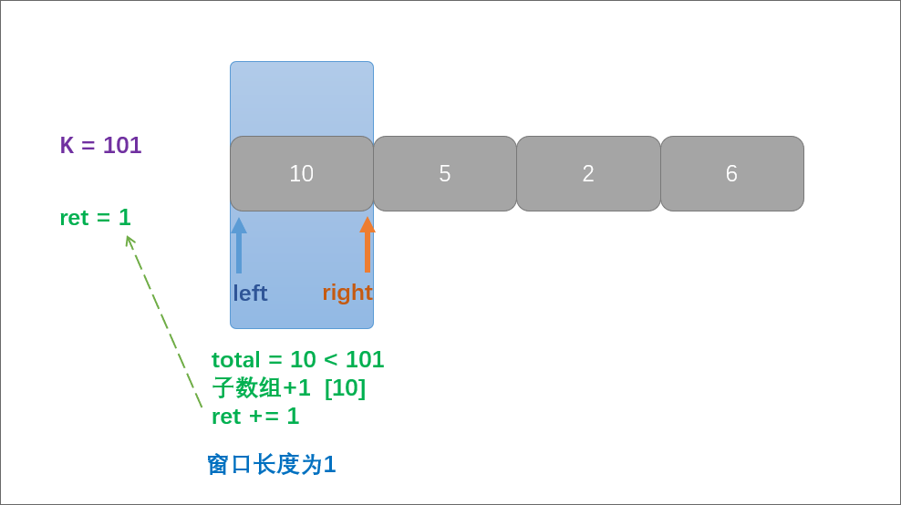
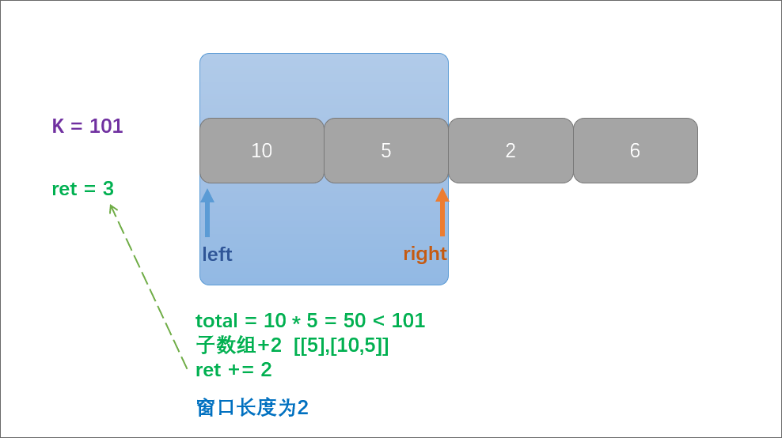
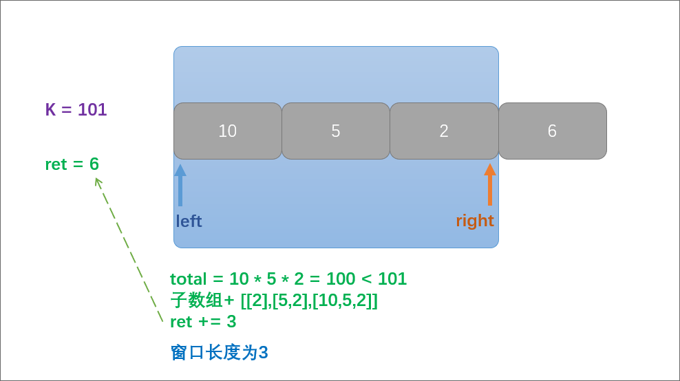
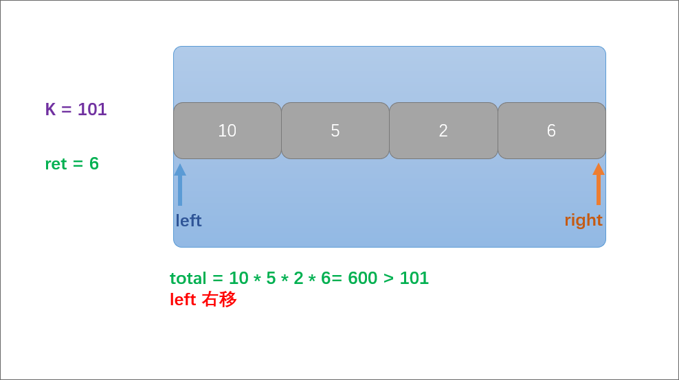
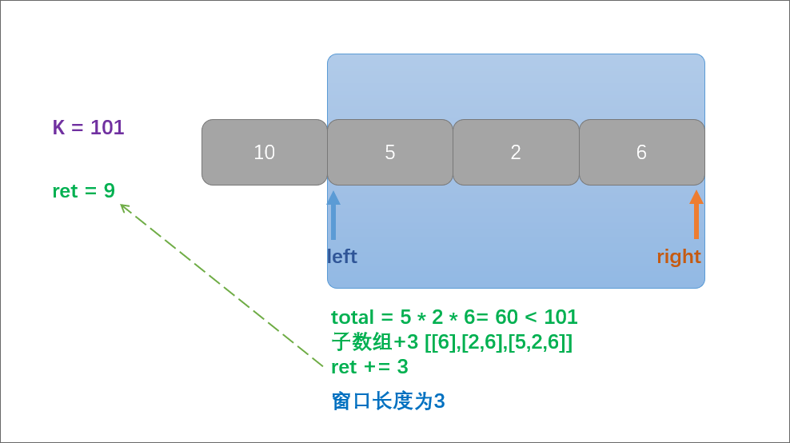

> 原文链接: https://leetcode-cn.com/problems/ZVAVXX


## 中文题目
<div><p>给定一个正整数数组&nbsp;<code>nums</code>和整数 <code>k</code>&nbsp;，请找出该数组内乘积小于&nbsp;<code>k</code>&nbsp;的连续的子数组的个数。</p>

<p>&nbsp;</p>

<p><strong>示例 1:</strong></p>

<pre>
<strong>输入:</strong> nums = [10,5,2,6], k = 100
<strong>输出:</strong> 8
<strong>解释:</strong> 8 个乘积小于 100 的子数组分别为: [10], [5], [2], [6], [10,5], [5,2], [2,6], [5,2,6]。
需要注意的是 [10,5,2] 并不是乘积小于100的子数组。
</pre>

<p><strong>示例 2:</strong></p>

<pre>
<strong>输入:</strong> nums = [1,2,3], k = 0
<strong>输出:</strong> 0</pre>

<p>&nbsp;</p>

<p><strong>提示:&nbsp;</strong></p>

<ul>
	<li><code>1 &lt;= nums.length &lt;= 3 * 10<sup>4</sup></code></li>
	<li><code>1 &lt;= nums[i] &lt;= 1000</code></li>
	<li><code>0 &lt;= k &lt;= 10<sup>6</sup></code></li>
</ul>

<p>&nbsp;</p>

<p><meta charset="UTF-8" />注意：本题与主站 713&nbsp;题相同：<a href="https://leetcode-cn.com/problems/subarray-product-less-than-k/">https://leetcode-cn.com/problems/subarray-product-less-than-k/</a>&nbsp;</p>
</div>

## 通过代码
<RecoDemo>
</RecoDemo>


## 高赞题解
# [剑指OfferII009.乘积小于K的子数组](https://leetcode-cn.com/problems/ZVAVXX/solution/jian-zhi-offerii009cheng-ji-xiao-yu-kde-q158e/)
> https://leetcode-cn.com/problems/ZVAVXX/solution/jian-zhi-offerii009cheng-ji-xiao-yu-kde-q158e/
> 
> 难度：中等

## 题目

给定一个正整数数组 nums和整数 k ，请找出该数组内乘积小于 k 的连续的子数组的个数。

提示: 
- 1 <= nums.length <= 3 * 104
- 1 <= nums[i] <= 1000
- 0 <= k <= 106

## 示例

```
示例 1:
输入: nums = [10,5,2,6], k = 100
输出: 8
解释: 8 个乘积小于 100 的子数组分别为: [10], [5], 
[2], [6], [10,5], [5,2], [2,6], [5,2,6]。
需要注意的是 [10,5,2] 并不是乘积小于100的子数组。

示例 2:
输入: nums = [1,2,3], k = 0
输出: 0
```

## 分析
这道题乍一看满足滑窗的条件，让我们找**小于**K的**连续子数组**的个数，但这不是求最大最小滑窗的长度，而是要求子数组的个数。有点不满足公式啊？
别着急否定，让我们来画个图考虑下滑窗右边界移动这个操作与滑窗内子数组个数的关系吧！

<,,,,,>


通过画图我们发现:
> 窗口每次移动后，ret都可以增加 **right - left + 1**个子数组。

这不就可以通过滑窗来解题了么？

但这里要注意一点：
如果数组中某个数字比K还大，则left会超过right，以保证有值，此时窗口长度为-1，无需计算。

另外：由于K<=10 ^ 6，nums[i]<=1000, 10 ^ 9 小于Integer.MAX_VALUE，所以Java使用int类型不会越界。

## 解题

```python []
class Solution:
    def numSubarrayProductLessThanK(self, nums, k):
        left = ret = 0
        total = 1
        for right, num in enumerate(nums):
            total *= num
            while left <= right and total >= k:
                total //= nums[left]
                left += 1
            if left <= right:
                ret += right - left + 1
        return ret
```

```java []
class Solution {
    public int numSubarrayProductLessThanK(int[] nums, int k) {
        int left = 0;
        int ret = 0;
        int total = 1;
        for (int right = 0; right < nums.length; right++) {
            total *= nums[right];
            while (left <= right && total >= k) {
                total /= nums[left++];
            }
            if (left <= right) {
                ret += right - left + 1;
            }
        }
        return ret;
    }
}
```


## 统计信息
| 通过次数 | 提交次数 | AC比率 |
| :------: | :------: | :------: |
|    7924    |    14264    |   55.6%   |

## 提交历史
| 提交时间 | 提交结果 | 执行时间 |  内存消耗  | 语言 |
| :------: | :------: | :------: | :--------: | :--------: |
