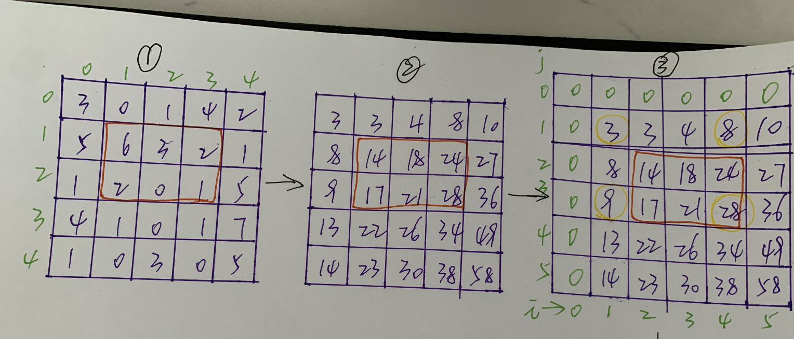

> 原文链接: https://leetcode-cn.com/problems/O4NDxx


## 中文题目
<div><p><big><small>给定一个二维矩阵 <code>matrix</code>，</small></big>以下类型的多个请求：</p>

<ul>
	<li><big><small>计算其子矩形范围内元素的总和，该子矩阵的左上角为 <code>(row1,&nbsp;col1)</code> ，右下角为 <code>(row2,&nbsp;col2)</code> 。</small></big></li>
</ul>

<p>实现 <code>NumMatrix</code> 类：</p>

<ul>
	<li><code>NumMatrix(int[][] matrix)</code>&nbsp;给定整数矩阵 <code>matrix</code> 进行初始化</li>
	<li><code>int sumRegion(int row1, int col1, int row2, int col2)</code>&nbsp;返回<big><small>左上角</small></big><big><small> <code>(row1,&nbsp;col1)</code>&nbsp;、右下角&nbsp;<code>(row2,&nbsp;col2)</code></small></big>&nbsp;的子矩阵的元素总和。</li>
</ul>

<p>&nbsp;</p>

<p><strong>示例 1：</strong></p>

<p></p>

<pre>
<strong>输入:</strong> 
[&quot;NumMatrix&quot;,&quot;sumRegion&quot;,&quot;sumRegion&quot;,&quot;sumRegion&quot;]
[[[[3,0,1,4,2],[5,6,3,2,1],[1,2,0,1,5],[4,1,0,1,7],[1,0,3,0,5]]],[2,1,4,3],[1,1,2,2],[1,2,2,4]]
<strong>输出:</strong> 
[null, 8, 11, 12]

<strong>解释:</strong>
NumMatrix numMatrix = new NumMatrix([[3,0,1,4,2],[5,6,3,2,1],[1,2,0,1,5],[4,1,0,1,7],[1,0,3,0,5]]]);
numMatrix.sumRegion(2, 1, 4, 3); // return 8 (红色矩形框的元素总和)
numMatrix.sumRegion(1, 1, 2, 2); // return 11 (绿色矩形框的元素总和)
numMatrix.sumRegion(1, 2, 2, 4); // return 12 (蓝色矩形框的元素总和)
</pre>

<p>&nbsp;</p>

<p><strong>提示：</strong></p>

<ul>
	<li><code>m == matrix.length</code></li>
	<li><code>n == matrix[i].length</code></li>
	<li><code>1 &lt;= m,&nbsp;n &lt;=&nbsp;200</code><meta charset="UTF-8" /></li>
	<li><code>-10<sup>5</sup>&nbsp;&lt;= matrix[i][j] &lt;= 10<sup>5</sup></code></li>
	<li><code>0 &lt;= row1 &lt;= row2 &lt; m</code></li>
	<li><code>0 &lt;= col1 &lt;= col2 &lt; n</code></li>
	<li><meta charset="UTF-8" />最多调用 <code>10<sup>4</sup></code> 次&nbsp;<code>sumRegion</code> 方法</li>
</ul>

<p>&nbsp;</p>

<p><meta charset="UTF-8" />注意：本题与主站 304&nbsp;题相同：&nbsp;<a href="https://leetcode-cn.com/problems/range-sum-query-2d-immutable/">https://leetcode-cn.com/problems/range-sum-query-2d-immutable/</a></p>
</div>

## 通过代码
<RecoDemo>
</RecoDemo>


## 高赞题解
### 解题思路
- 对于一个二维矩阵，可能由于输入不同的坐标而反复求不同子矩阵的数字之和，所以需要尽可能快的实现子矩阵的数字求和
- 用前缀和的方式可快速求子矩阵的数字和
- 为了代码实现上方便，特意在最左边一列，最上边一列空出来


- 先根据原矩阵，求出前缀和矩阵，然后通过观察得知公式
` sum[row2 + 1][col2 + 1] -
    sum[row1][col2 + 1] -
    sum[row2 + 1][col1] +
    sum[row1][col1]`
- 举例来说上图红框中的和，就是上面第三图当中黄色圈出来的数字**28-8-9+3 = 14**

### 代码

```javascript
/**
 * @param {number[][]} matrix
 */
let sum;
var NumMatrix = function(matrix) {
  // 非空判断处理
  if (matrix == null || !matrix.length || !matrix[0].length) {
    return;
  }
  // 初始化前缀和数组
  // 如果输入矩阵的行数和列数分别是m和n，那么sum辅助矩阵的行数和列数分别是m+1和n+1，只是为了简化代码逻辑
  sum = new Array(matrix.length + 1)
    .fill(0)
    .map(() => new Array(matrix[0].length + 1).fill(0));
  for (let i = 0; i < matrix.length; i++) {
    let rowSum = 0;
    for (let j = 0; j < matrix[0].length; j++) {
      rowSum += matrix[i][j] - 0;
      sum[i + 1][j + 1] = sum[i][j + 1] + rowSum;
    }
  }
};

/** 
 * @param {number} row1 
 * @param {number} col1 
 * @param {number} row2 
 * @param {number} col2
 * @return {number}
 */
NumMatrix.prototype.sumRegion = function(row1, col1, row2, col2) {
  // 公式sum[r2][c2] + sum[r1 - 1][c2] - sum[r2][c1 - 1] + sum[r1 - 1][c1 - 1];
  // 来求解左上角坐标(r1,c1)右下角(r2,c2)的子矩阵的数字之和，
  // 由于坐标r1或c1有可能等于0，因此r1-1或c1-1可能是负数，
  // 所以在辅助矩阵的最上面增加一行，最左边增加一列，这样就不必担心出现数组下标-1的的情形
  return (
    sum[row2 + 1][col2 + 1] -
    sum[row1][col2 + 1] -
    sum[row2 + 1][col1] +
    sum[row1][col1]
  );
};
```

## 统计信息
| 通过次数 | 提交次数 | AC比率 |
| :------: | :------: | :------: |
|    5354    |    8139    |   65.8%   |

## 提交历史
| 提交时间 | 提交结果 | 执行时间 |  内存消耗  | 语言 |
| :------: | :------: | :------: | :--------: | :--------: |
