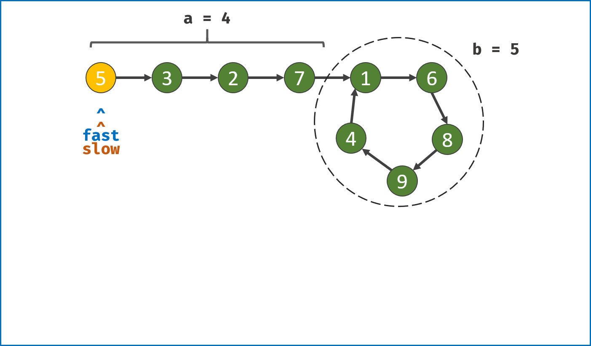
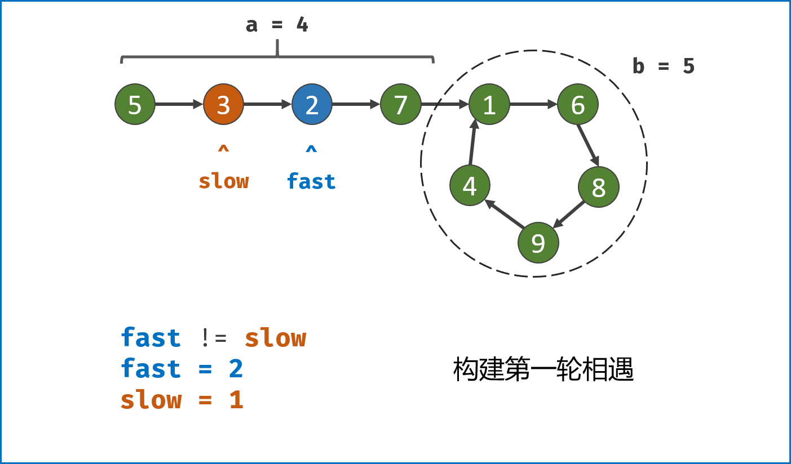
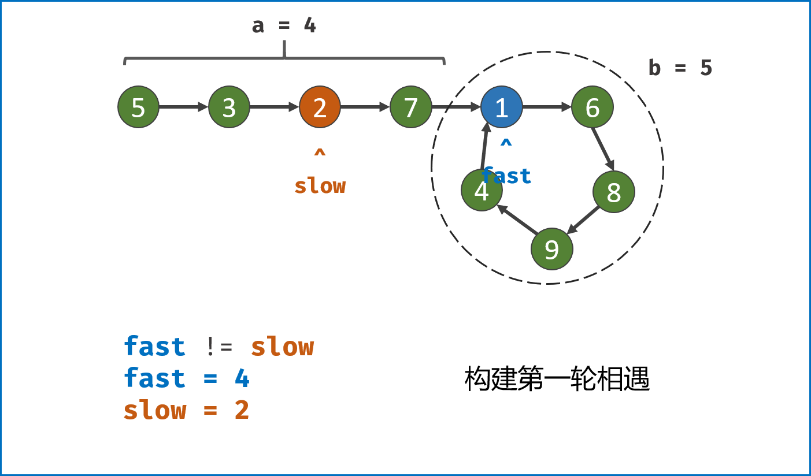
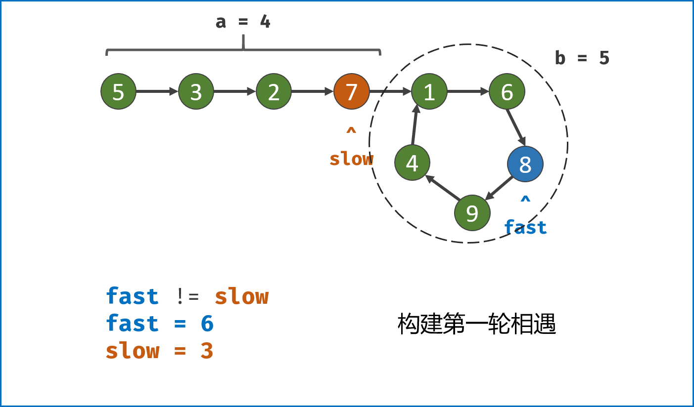
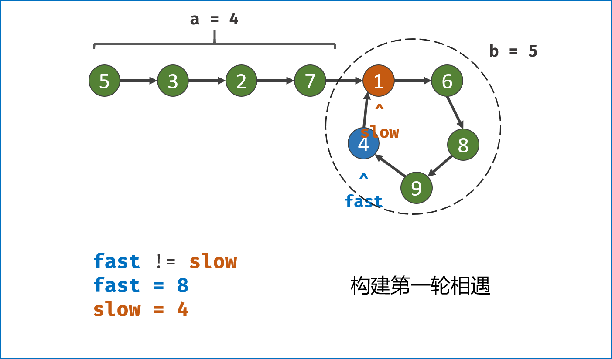
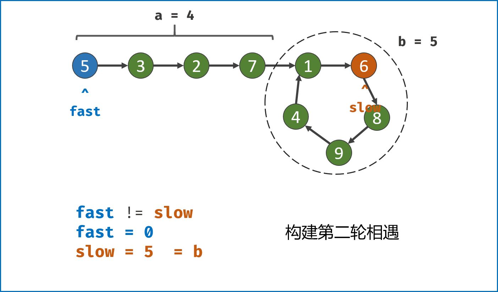
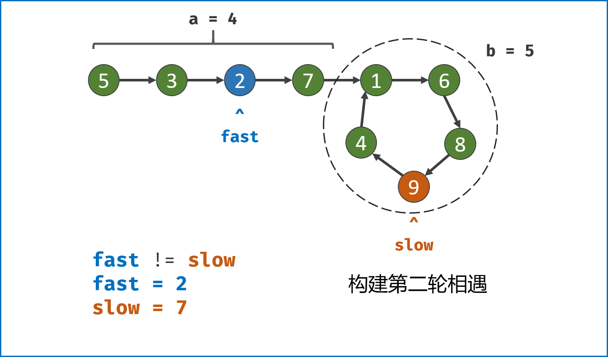
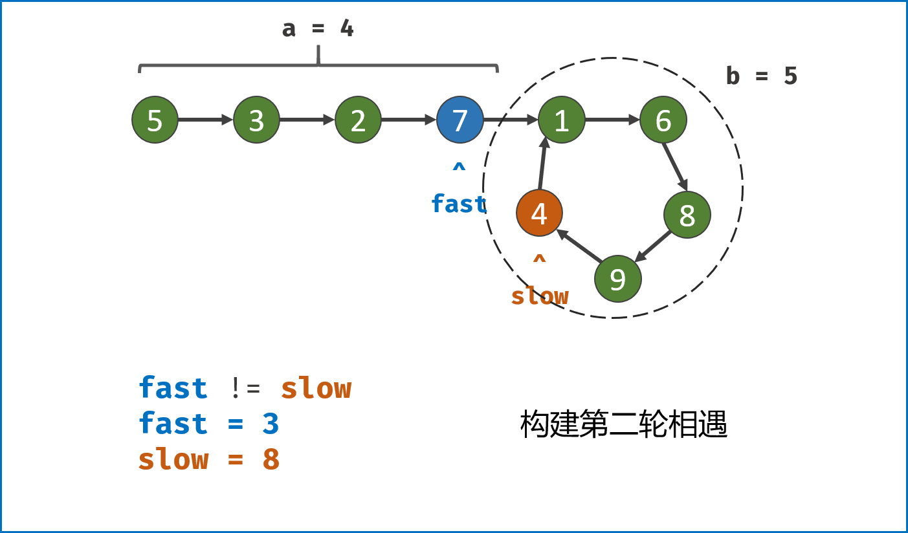
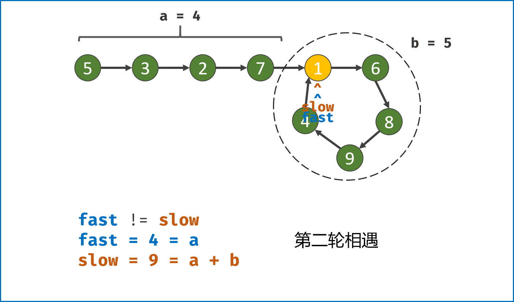

> 原文链接: https://leetcode-cn.com/problems/c32eOV


## 中文题目
<div><p>给定一个链表，返回链表开始入环的第一个节点。 从链表的头节点开始沿着 <code>next</code> 指针进入环的第一个节点为环的入口节点。如果链表无环，则返回&nbsp;<code>null</code>。</p>

<p>为了表示给定链表中的环，我们使用整数 <code>pos</code> 来表示链表尾连接到链表中的位置（索引从 0 开始）。 如果 <code>pos</code> 是 <code>-1</code>，则在该链表中没有环。<strong>注意，<code>pos</code> 仅仅是用于标识环的情况，并不会作为参数传递到函数中。</strong></p>

<p><strong>说明：</strong>不允许修改给定的链表。</p>

<ul>
</ul>

<p>&nbsp;</p>

<p><strong>示例 1：</strong></p>

<p></p>

<pre>
<strong>输入：</strong>head = [3,2,0,-4], pos = 1
<strong>输出：</strong>返回索引为 1 的链表节点
<strong>解释：</strong>链表中有一个环，其尾部连接到第二个节点。
</pre>

<p><strong>示例&nbsp;2：</strong></p>

<p></p>

<pre>
<strong>输入：</strong>head = [1,2], pos = 0
<strong>输出：</strong>返回索引为 0 的链表节点
<strong>解释：</strong>链表中有一个环，其尾部连接到第一个节点。
</pre>

<p><strong>示例 3：</strong></p>

<p></p>

<pre>
<strong>输入：</strong>head = [1], pos = -1
<strong>输出：</strong>返回 null
<strong>解释：</strong>链表中没有环。
</pre>

<p>&nbsp;</p>

<p><strong>提示：</strong></p>

<ul>
	<li>链表中节点的数目范围在范围 <code>[0, 10<sup>4</sup>]</code> 内</li>
	<li><code>-10<sup>5</sup> &lt;= Node.val &lt;= 10<sup>5</sup></code></li>
	<li><code>pos</code> 的值为 <code>-1</code> 或者链表中的一个有效索引</li>
</ul>

<p>&nbsp;</p>

<p><strong>进阶：</strong>是否可以使用 <code>O(1)</code> 空间解决此题？</p>

<p>&nbsp;</p>

<p><meta charset="UTF-8" />注意：本题与主站 142&nbsp;题相同：&nbsp;<a href="https://leetcode-cn.com/problems/linked-list-cycle-ii/">https://leetcode-cn.com/problems/linked-list-cycle-ii/</a></p>
</div>

## 通过代码
<RecoDemo>
</RecoDemo>


## 高赞题解
### 解题思路：

此类链表题目一般都是使用双指针法解决的，例如寻找距离尾部第 k 个节点、寻找环入口、寻找公共尾部入口等。

#### 算法流程：

**双指针第一次相遇：** 设两指针 `fast`，`slow` 指向链表头部 `head`，`fast` 每轮走 $2$ 步，`slow` 每轮走 $1$ 步；

1. **第一种结果：** `fast` 指针走过链表末端，说明链表无环，直接返回 `null`；

    - TIPS: 若有环，两指针一定会相遇。因为每走 $1$ 轮，`fast` 与 `slow` 的间距 $+1$，`fast` 终会追上 `slow`；

2. **第二种结果：** 当 `fast == slow`时， 两指针在环中 **第一次相遇** 。下面分析此时 `fast` 与 `slow`走过的 **步数关系** ：

    - 设链表共有 $a+b$ 个节点，其中 **链表头部到链表入口** 有 $a$ 个节点（不计链表入口节点）， **链表环** 有 $b$ 个节点（这里需要注意，$a$ 和 $b$ 是未知数，例如图解上链表 $a=4$ , $b=5$）；设两指针分别走了 $f$ ，$s$ 步，则有：

    1. `fast` 走的步数是 `slow` 步数的 $2$ 倍，即 $f = 2s$；（**解析：** `fast` 每轮走 $2$ 步）
    2. `fast` 比 `slow` 多走了 $n$ 个环的长度，即 $f = s + nb$；（ **解析：** 双指针都走过 $a$ 步，然后在环内绕圈直到重合，重合时 `fast` 比 `slow` 多走 **环的长度整数倍** ）；

    - 以上两式相减得：$f = 2nb$，$s = nb$，即`fast`和`slow` 指针分别走了 $2n$，$n$ 个 **环的周长** （注意： $n$  是未知数，不同链表的情况不同）。

**目前情况分析：** 

- 如果让指针从链表头部一直向前走并统计步数 $k$ ，那么所有 **走到链表入口节点时的步数** 是：$k = a + nb$（先走 $a$ 步到入口节点，之后每绕 $1$ 圈环（ $b$ 步）都会再次到入口节点）。
- 而目前，`slow` 指针走过的步数为 $nb$ 步。因此，我们只要想办法让 `slow` 再走  $a$  步停下来，就可以到环的入口。
- 但是我们不知道 $a$  的值，该怎么办？依然是使用双指针法。我们构建一个指针，此指针需要有以下性质：此指针和 `slow` 一起向前走 $a$ 步后，两者在入口节点重合。那么从哪里走到入口节点需要 $a$ 步？答案是链表头部 `head` 。

**双指针第二次相遇：**

- `slow`指针 **位置不变** ，将 `fast` 指针重新 **指向链表头部节点** ；`slow` 和 `fast` 同时每轮向前走 $1$ 步；

    > TIPS：此时 $f = 0$，$s = nb$ ；

- 当 `fast` 指针走到 $f = a$ 步时，`slow` 指针走到步 $s = a+nb$ ，此时 **两指针重合，并同时指向链表环入口** 。

第二次相遇后，返回 `slow` 指针指向的节点即可。

<,,,,,,,,,,>{:width=500}
{:align=center}

#### 复杂度分析：

- **时间复杂度** $O(N)$ ：第二次相遇中，慢指针须走步数 $a < a + b$；第一次相遇中，慢指针须走步数 $a + b - x < a + b$，其中 $x$ 为双指针重合点与环入口距离；因此总体为线性复杂度。
- **空间复杂度** $O(1)$ ：双指针使用常数大小的额外空间。

### 代码：

```Python []
class Solution(object):
    def detectCycle(self, head):
        fast, slow = head, head
        while True:
            if not (fast and fast.next): return
            fast, slow = fast.next.next, slow.next
            if fast == slow: break
        fast = head
        while fast != slow:
            fast, slow = fast.next, slow.next
        return fast
```

```Java []
public class Solution {
    public ListNode detectCycle(ListNode head) {
        ListNode fast = head, slow = head;
        while (true) {
            if (fast == null || fast.next == null) return null;
            fast = fast.next.next;
            slow = slow.next;
            if (fast == slow) break;
        }
        fast = head;
        while (slow != fast) {
            slow = slow.next;
            fast = fast.next;
        }
        return fast;
    }
}
```

```C++ []
class Solution {
public:
    ListNode *detectCycle(ListNode *head) {
        ListNode *fast = head, *slow = head;
        while (true) {
            if (fast == nullptr || fast->next == nullptr) return nullptr;
            fast = fast->next->next;
            slow = slow->next;
            if (fast == slow) break;
        }
        fast = head;
        while (slow != fast) {
            slow = slow->next;
            fast = fast->next;
        }
        return fast;
    }
};
```

## 统计信息
| 通过次数 | 提交次数 | AC比率 |
| :------: | :------: | :------: |
|    10114    |    18826    |   53.7%   |

## 提交历史
| 提交时间 | 提交结果 | 执行时间 |  内存消耗  | 语言 |
| :------: | :------: | :------: | :--------: | :--------: |
