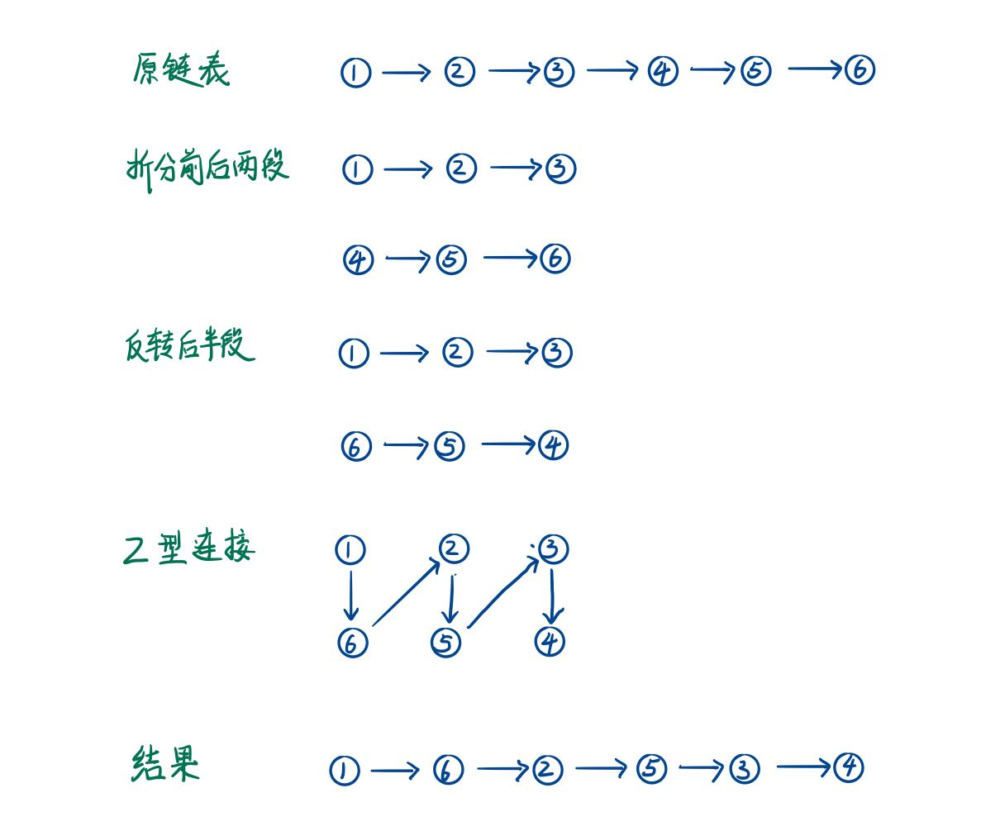
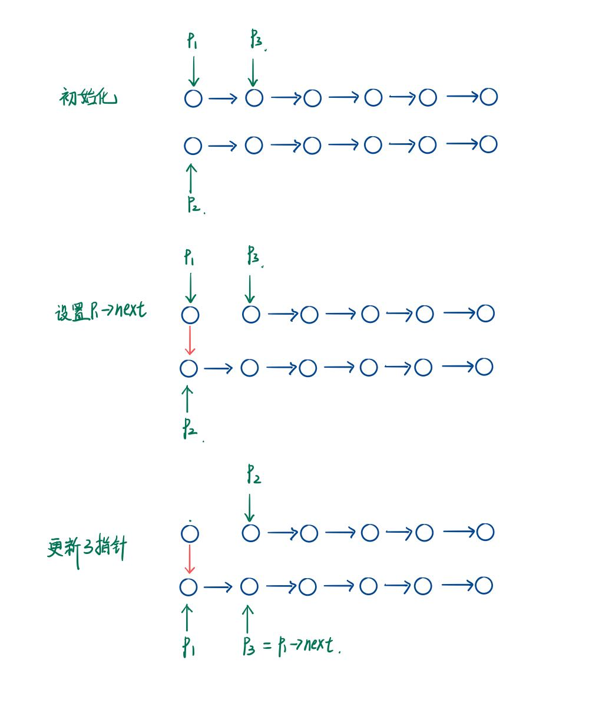

> 原文链接: https://leetcode-cn.com/problems/LGjMqU


## 中文题目
<div><p>给定一个单链表 <code>L</code><em> </em>的头节点 <code>head</code> ，单链表 <code>L</code> 表示为：</p>

<p><code>&nbsp;L<sub>0&nbsp;</sub>&rarr; L<sub>1&nbsp;</sub>&rarr; &hellip; &rarr; L<sub>n-1&nbsp;</sub>&rarr; L<sub>n&nbsp;</sub></code><br />
请将其重新排列后变为：</p>

<p><code>L<sub>0&nbsp;</sub>&rarr;&nbsp;L<sub>n&nbsp;</sub>&rarr;&nbsp;L<sub>1&nbsp;</sub>&rarr;&nbsp;L<sub>n-1&nbsp;</sub>&rarr;&nbsp;L<sub>2&nbsp;</sub>&rarr;&nbsp;L<sub>n-2&nbsp;</sub>&rarr; &hellip;</code></p>

<p>不能只是单纯的改变节点内部的值，而是需要实际的进行节点交换。</p>

<p>&nbsp;</p>

<p><strong>示例 1:</strong></p>

<p></p>

<pre>
<strong>输入: </strong>head = [1,2,3,4]
<strong>输出: </strong>[1,4,2,3]</pre>

<p><strong>示例 2:</strong></p>

<p></p>

<pre>
<strong>输入: </strong>head = [1,2,3,4,5]
<strong>输出: </strong>[1,5,2,4,3]</pre>

<p>&nbsp;</p>

<p><strong>提示：</strong></p>

<ul>
	<li>链表的长度范围为 <code>[1, 5 * 10<sup>4</sup>]</code></li>
	<li><code>1 &lt;= node.val &lt;= 1000</code></li>
</ul>

<p>&nbsp;</p>

<p><meta charset="UTF-8" />注意：本题与主站 143&nbsp;题相同：<a href="https://leetcode-cn.com/problems/reorder-list/">https://leetcode-cn.com/problems/reorder-list/</a>&nbsp;</p>
</div>

## 通过代码
<RecoDemo>
</RecoDemo>


## 高赞题解
# **思路**
整个过程分成：
1. 把链表分成前后两段，当链表节点数为奇数时，前半段要比后半段多一个节点；
2. 把链表的后半段进行反转；
3. 从前半段的头节点出发 Z 字形重新连接前后段。

如下图


把链表分为前后两段可以使用快慢指针的方式，慢指针一次走一步，快指针一次走两步，最后快指针遍历完链表后，慢指针所指的节点就是中间节点。得到中间节点便可以得到后半段的头节点，之后应用[《剑指offer 2 面试题24》 书中算法C++实现](https://leetcode-cn.com/problems/UHnkqh/solution/jian-zhi-offer-2-mian-shi-ti-24-shu-zhon-7nq5/) 反转后半段。

Z 字形重连需要使用三个指针，具体操作如下图，不断改变指针 p1->next 指向指针 p2，之后更新三个指针的位置，循环解结束条件为指针 p2 是空指针。


代码如下，时间复杂度为 O(n)，空间复杂度为 O(1)。

```
class Solution {
public:
    void reorderList(ListNode* head) {
        ListNode* dummmy = new ListNode(0);
        dummmy->next = head;
        ListNode* slow = dummmy;
        ListNode* fast = dummmy;
        while (fast != nullptr && fast->next != nullptr) {
            slow = slow->next;
            fast = fast->next->next;
        }
        delete dummmy;
        dummmy = nullptr;
        ListNode* headB = slow->next;
        slow->next = nullptr;
        ListNode* p2 = reverseList(headB);
        ListNode* p1 = head;
        ListNode* p3 = nullptr;
        while (p2 != nullptr) {
            p3 = p1->next;
            p1->next = p2;
            p1 = p2;
            p2 = p3;
        }
    }

    ListNode* reverseList(ListNode* head) {
        if (head == nullptr) {
            return head;
        }
        ListNode* left = nullptr;
        ListNode* cur = head;
        ListNode* right = nullptr;
        while (cur != nullptr) {
            right = cur->next;
            cur->next = left;
            left = cur;
            cur = right;
        }
        return left;
    }
};
```


## 统计信息
| 通过次数 | 提交次数 | AC比率 |
| :------: | :------: | :------: |
|    6852    |    10399    |   65.9%   |

## 提交历史
| 提交时间 | 提交结果 | 执行时间 |  内存消耗  | 语言 |
| :------: | :------: | :------: | :--------: | :--------: |
