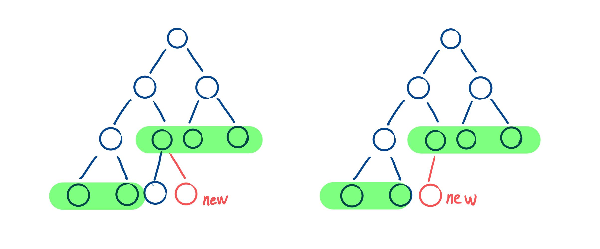

> 原文链接: https://leetcode-cn.com/problems/NaqhDT


## 中文题目
<div><p>完全二叉树是每一层（除最后一层外）都是完全填充（即，节点数达到最大，第 <code>n</code> 层有 <code>2<sup>n-1</sup></code>&nbsp;个节点）的，并且所有的节点都尽可能地集中在左侧。</p>

<p>设计一个用完全二叉树初始化的数据结构&nbsp;<code>CBTInserter</code>，它支持以下几种操作：</p>

<ul>
	<li><code>CBTInserter(TreeNode root)</code>&nbsp;使用根节点为&nbsp;<code>root</code>&nbsp;的给定树初始化该数据结构；</li>
	<li><code>CBTInserter.insert(int v)</code>&nbsp; 向树中插入一个新节点，节点类型为 <code>TreeNode</code>，值为 <code>v</code> 。使树保持完全二叉树的状态，<strong>并返回插入的新节点的父节点的值</strong>；</li>
	<li><code>CBTInserter.get_root()</code> 将返回树的根节点。</li>
</ul>

<p>&nbsp;</p>

<ol>
</ol>

<p><strong>示例 1：</strong></p>

<pre>
<strong>输入：</strong>inputs = [&quot;CBTInserter&quot;,&quot;insert&quot;,&quot;get_root&quot;], inputs = [[[1]],[2],[]]
<strong>输出：</strong>[null,1,[1,2]]
</pre>

<p><strong>示例 2：</strong></p>

<pre>
<strong>输入：</strong>inputs = [&quot;CBTInserter&quot;,&quot;insert&quot;,&quot;insert&quot;,&quot;get_root&quot;], inputs = [[[1,2,3,4,5,6]],[7],[8],[]]
<strong>输出：</strong>[null,3,4,[1,2,3,4,5,6,7,8]]
</pre>

<p>&nbsp;</p>

<p><strong>提示：</strong></p>

<ul>
	<li>最初给定的树是完全二叉树，且包含&nbsp;<code>1</code>&nbsp;到&nbsp;<code>1000</code>&nbsp;个节点。</li>
	<li>每个测试用例最多调用&nbsp;<code>CBTInserter.insert</code>&nbsp; 操作&nbsp;<code>10000</code>&nbsp;次。</li>
	<li>给定节点或插入节点的每个值都在&nbsp;<code>0</code>&nbsp;到&nbsp;<code>5000</code>&nbsp;之间。</li>
</ul>

<p>&nbsp;</p>

<p><meta charset="UTF-8" />注意：本题与主站 919&nbsp;题相同：&nbsp;<a href="https://leetcode-cn.com/problems/complete-binary-tree-inserter/">https://leetcode-cn.com/problems/complete-binary-tree-inserter/</a></p>
</div>

## 通过代码
<RecoDemo>
</RecoDemo>


## 高赞题解
# **层次遍历**
这道题其实是考察使用队列完成二叉树的层次遍历，二叉树的层次遍历必须熟练掌握。

完全二叉树在题目中已经详细介绍，这里不做过多说明。先考虑如何在一棵满二叉树下插入新节点，通过观察可以发现新节点需要插入层次遍历时第一个出现的 “不完整的节点” （即不同时具有左右孩子节点）。如图中所示，绿色代表当前队列中的节点（规定节点的左右孩子均存在时才将它们一起先后压入队列)，当遍历到 “不完整的节点” 就找到了新节点插入的节点位置，“不完整的节点” 位于队列的头部。在 CBTInserter 函数中实现该过程，找到插入的位置，以及得到当前的队列。


插入操作时，先后检查队列头部节点的左右孩子，若左孩子缺失则将新节点插入其左孩子，右孩子缺失则插入右孩子。当队列头部节点的左右孩子都存在，则将其左右孩子压入队列尾部，队列的头部节点出队列，因为此时它已不是 “不完整的节点” 。更新后的队列的头部节点将是下一个 “不完整的节点”。按照规则依次处理接下来的插入操作。

代码如下，时间复杂度为 O(n)，队列中存的节点数为 O(n)，所以空间复杂度为 O(n)。

```
class CBTInserter {
private:
    queue<TreeNode*> que;
    TreeNode* root;
public:
    CBTInserter(TreeNode* root) {
        this->root = root;
        que.push(root);
        while (que.front()->left != nullptr && que.front()->right != nullptr) {
            que.push(que.front()->left);
            que.push(que.front()->right);
            que.pop();
        }
    }
    
    int insert(int v) {
        TreeNode* node = new TreeNode(v);
        TreeNode* fa = que.front();
        if (fa->left == nullptr) {
            fa->left = node;
        }
        else {
            fa->right = node;
            que.push(fa->left);
            que.push(fa->right);
            que.pop();
        }
        return fa->val;
    }
    
    TreeNode* get_root() {
        return this->root;
    }
};
```



## 统计信息
| 通过次数 | 提交次数 | AC比率 |
| :------: | :------: | :------: |
|    2894    |    4442    |   65.2%   |

## 提交历史
| 提交时间 | 提交结果 | 执行时间 |  内存消耗  | 语言 |
| :------: | :------: | :------: | :--------: | :--------: |
