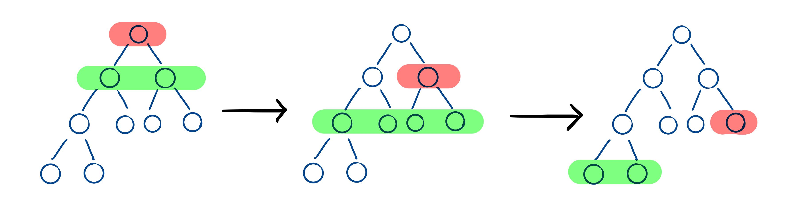

> 原文链接: https://leetcode-cn.com/problems/hPov7L


## 中文题目
<div><p>给定一棵二叉树的根节点&nbsp;<code>root</code> ，请找出该二叉树中每一层的最大值。</p>

<p>&nbsp;</p>

<p><strong>示例1：</strong></p>

<pre>
<strong>输入: </strong>root = [1,3,2,5,3,null,9]
<strong>输出: </strong>[1,3,9]
<strong>解释:</strong>
          1
         / \
        3   2
       / \   \  
      5   3   9 
</pre>

<p><strong>示例2：</strong></p>

<pre>
<strong>输入: </strong>root = [1,2,3]
<strong>输出: </strong>[1,3]
<strong>解释:</strong>
          1
         / \
        2   3
</pre>

<p><strong>示例3：</strong></p>

<pre>
<strong>输入: </strong>root = [1]
<strong>输出: </strong>[1]
</pre>

<p><strong>示例4：</strong></p>

<pre>
<strong>输入: </strong>root = [1,null,2]
<strong>输出: </strong>[1,2]
<strong>解释:</strong>      
&nbsp;          1 
&nbsp;           \
&nbsp;            2     
</pre>

<p><strong>示例5：</strong></p>

<pre>
<strong>输入: </strong>root = []
<strong>输出: </strong>[]
</pre>

<p>&nbsp;</p>

<p><strong>提示：</strong></p>

<ul>
	<li>二叉树的节点个数的范围是 <code>[0,10<sup>4</sup>]</code></li>
	<li><meta charset="UTF-8" /><code>-2<sup>31</sup>&nbsp;&lt;= Node.val &lt;= 2<sup>31</sup>&nbsp;- 1</code></li>
</ul>

<p>&nbsp;</p>

<p><meta charset="UTF-8" />注意：本题与主站 515&nbsp;题相同：&nbsp;<a href="https://leetcode-cn.com/problems/find-largest-value-in-each-tree-row/">https://leetcode-cn.com/problems/find-largest-value-in-each-tree-row/</a></p>
</div>

## 通过代码
<RecoDemo>
</RecoDemo>


## 高赞题解
# **层次遍历**
因为要求解二叉树每一层的最大值，所以使用二叉树的层次遍历是最适合不过的。但是因为需要求二叉树的每一层的最大值，所以需要确定哪些节点属于同一层。一种简单的方式就是，在遍历完当前层的最后一个节点之后，队列中所保存的节点数就是下一层的节点数。如下图所示，红色节点为当前层的最后一个节点，绿色为处于队列中的下一层的所有节点。因为队列的初始状态是只有一个不为空的根节点，所以第一层就是一个节点，第二次就是遍历完根节点之后的队列中的节点，以此类推。



代码如下，注意空根节点的判断，另外注意 size 必须在进入 for 循环前就确定，而不是使用 que.size()，因为队列大小实时在改变。
```
class Solution {
public:
    vector<int> largestValues(TreeNode* root) {
        if (root == nullptr) {
            return {};
        }
        vector<int> allMax;
        queue<TreeNode*> que;
        que.push(root);
        while (!que.empty()) {
            int size = que.size();
            int curMax = INT_MIN;
            for (int i = 0; i < size; ++i) {
                TreeNode* node = que.front();
                que.pop();
                curMax = max(curMax, node->val);
                if (node->left != nullptr) {
                    que.push(node->left);
                }
                if (node->right != nullptr) {
                    que.push(node->right);
                }
            }
            allMax.push_back(curMax);
        }
        return allMax;
    }
};
```


## 统计信息
| 通过次数 | 提交次数 | AC比率 |
| :------: | :------: | :------: |
|    4851    |    7517    |   64.5%   |

## 提交历史
| 提交时间 | 提交结果 | 执行时间 |  内存消耗  | 语言 |
| :------: | :------: | :------: | :--------: | :--------: |
