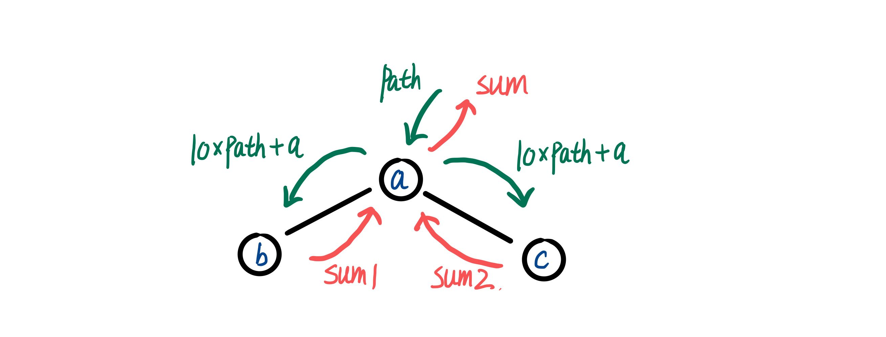
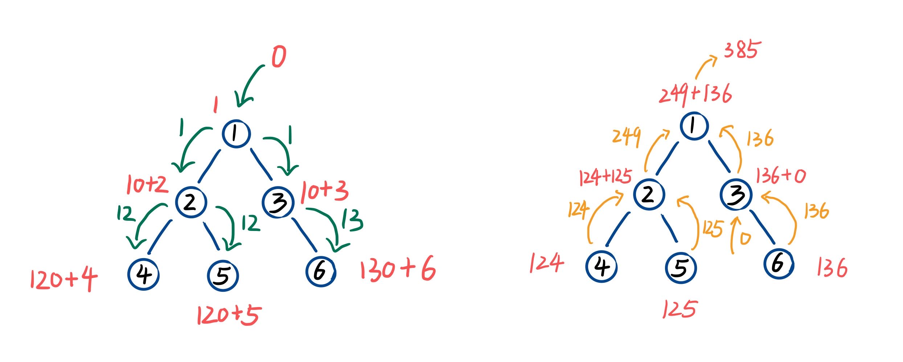

> 原文链接: https://leetcode-cn.com/problems/3Etpl5


## 中文题目
<div><p>给定一个二叉树的根节点 <code>root</code> ，树中每个节点都存放有一个 <code>0</code> 到 <code>9</code> 之间的数字。</p>

<div class="original__bRMd">
<div>
<p>每条从根节点到叶节点的路径都代表一个数字：</p>

<ul>
	<li>例如，从根节点到叶节点的路径 <code>1 -&gt; 2 -&gt; 3</code> 表示数字 <code>123</code> 。</li>
</ul>

<p>计算从根节点到叶节点生成的 <strong>所有数字之和</strong> 。</p>

<p><strong>叶节点</strong> 是指没有子节点的节点。</p>

<p>&nbsp;</p>

<p><strong>示例 1：</strong></p>

<pre>
<strong>输入：</strong>root = [1,2,3]
<strong>输出：</strong>25
<strong>解释：</strong>
从根到叶子节点路径 <code>1-&gt;2</code> 代表数字 <code>12</code>
从根到叶子节点路径 <code>1-&gt;3</code> 代表数字 <code>13</code>
因此，数字总和 = 12 + 13 = <code>25</code></pre>

<p><strong>示例 2：</strong></p>

<pre>
<strong>输入：</strong>root = [4,9,0,5,1]
<strong>输出：</strong>1026
<strong>解释：</strong>
从根到叶子节点路径 <code>4-&gt;9-&gt;5</code> 代表数字 495
从根到叶子节点路径 <code>4-&gt;9-&gt;1</code> 代表数字 491
从根到叶子节点路径 <code>4-&gt;0</code> 代表数字 40
因此，数字总和 = 495 + 491 + 40 = <code>1026</code>
</pre>

<p>&nbsp;</p>

<p><strong>提示：</strong></p>

<ul>
	<li>树中节点的数目在范围 <code>[1, 1000]</code> 内</li>
	<li><code>0 &lt;= Node.val &lt;= 9</code></li>
	<li>树的深度不超过 <code>10</code></li>
</ul>
</div>
</div>

<p>&nbsp;</p>

<p><meta charset="UTF-8" />注意：本题与主站 129&nbsp;题相同：&nbsp;<a href="https://leetcode-cn.com/problems/sum-root-to-leaf-numbers/">https://leetcode-cn.com/problems/sum-root-to-leaf-numbers/</a></p>
</div>

## 通过代码
<RecoDemo>
</RecoDemo>


## 高赞题解
# **先序遍历递归**
首先考虑如何计算每个路径表示的数字。顺着节点的子节点指针路径遍历二叉树，每到达一个节点，相当于在该路径表示的数字的末尾加一位。比如路径 1 → 2 → 3，遍历到节点 1 时路径表示为 1 （0 * 10 + 1），遍历到节点 2 时路径表示为 12 （1 * 10 + 2），遍历到节点 3 时路径表示为 123 （12 * 10 + 3），最后到达叶子节点，之后从叶子节点开始把数字一步一步回传。

如下图，对于一个二叉树节点 a。在下传路径的数字表示时，path 表示节点 a 之前的节点所表示的数字，然后该节点将更新后的表示的数 10 * path + a 传给左右子节点 b 和 c。在上传和的结果时，sum1 和 sum2 表示子节点 b 和 c 的上传的和，节点 a 将 sum = sum1 + sum2 上传，sum 就是节点 a 的和结果。这种形式可以用递归函数完成。



具体例子可以看下图表示，递归函数的终止条件是遍历到叶子节点，另外关注 3 节点的左节点为空指针，但是它并不是叶子节点，所以节点 3 的左子节点只会返回 0。


因为先处理当前节点再处理左右子节点，其本质也是一种先序遍历，完整代码如下。

```
class Solution {
public:
    int sumNumbers(TreeNode* root) {
        return dfs(root, 0);
    }
    
private:
    int dfs(TreeNode* root, int path) {
        if (root == nullptr) {
            return 0;
        }
        path = path * 10 + root->val;
        // 叶子节点
        if (root->left == nullptr && root->right == nullptr) {
            return path;
        }
        return dfs(root->left, path) + dfs(root->right, path);
    }
};
```


## 统计信息
| 通过次数 | 提交次数 | AC比率 |
| :------: | :------: | :------: |
|    4495    |    5986    |   75.1%   |

## 提交历史
| 提交时间 | 提交结果 | 执行时间 |  内存消耗  | 语言 |
| :------: | :------: | :------: | :--------: | :--------: |
