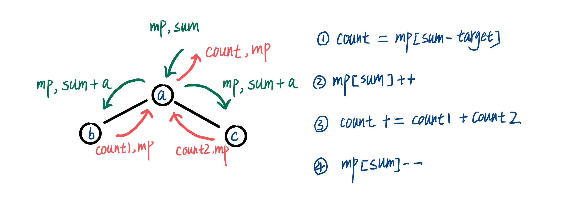

> 原文链接: https://leetcode-cn.com/problems/6eUYwP


## 中文题目
<div><p>给定一个二叉树的根节点 <code>root</code>&nbsp;，和一个整数 <code>targetSum</code> ，求该二叉树里节点值之和等于 <code>targetSum</code> 的 <strong>路径</strong> 的数目。</p>

<p><strong>路径</strong> 不需要从根节点开始，也不需要在叶子节点结束，但是路径方向必须是向下的（只能从父节点到子节点）。</p>

<p>&nbsp;</p>

<p><strong>示例 1：</strong></p>

<p></p>

<pre>
<strong>输入：</strong>root = [10,5,-3,3,2,null,11,3,-2,null,1], targetSum = 8
<strong>输出：</strong>3
<strong>解释：</strong>和等于 8 的路径有 3 条，如图所示。
</pre>

<p><strong>示例 2：</strong></p>

<pre>
<strong>输入：</strong>root = [5,4,8,11,null,13,4,7,2,null,null,5,1], targetSum = 22
<strong>输出：</strong>3
</pre>

<p>&nbsp;</p>

<p><strong>提示:</strong></p>

<ul>
	<li>二叉树的节点个数的范围是 <code>[0,1000]</code></li>
	<li><meta charset="UTF-8" /><code>-10<sup><span style="font-size: 9.449999809265137px;">9</span></sup>&nbsp;&lt;= Node.val &lt;= 10<sup><span style="font-size: 9.449999809265137px;">9</span></sup></code>&nbsp;</li>
	<li><code>-1000&nbsp;&lt;= targetSum&nbsp;&lt;= 1000</code>&nbsp;</li>
</ul>

<p>&nbsp;</p>

<p><meta charset="UTF-8" />注意：本题与主站 437&nbsp;题相同：<a href="https://leetcode-cn.com/problems/path-sum-iii/">https://leetcode-cn.com/problems/path-sum-iii/</a></p>
</div>

## 通过代码
<RecoDemo>
</RecoDemo>


## 高赞题解
# **前序遍历 + 哈希表**
做这道题强烈推荐先做面试题 10，并掌握面试题 10 的做法[《剑指offer 2 面试题10》 书中算法C++实现](https://leetcode-cn.com/problems/QTMn0o/solution/jian-zhi-offer-2-mian-shi-ti-9-shu-zhong-yivc/)。

这两道题可以说完全是一个思路，和面试题 10 一样都是先处理当前值再依次遍历，在二叉树中也是先处理当前节点再依次遍历左右子节点，这个特点符合前序遍历的规则。如图进行算法说明
1. 更新当前的 sum 值为 sum += root->val;
2. 因为 k = sum - target，所以从哈希表中找到当前路径符合要求的个数 count = mp[k];
3. 将当前的路径和存入哈希表 mp[sum]++;
4. 调用递归函数计算左右子树的符合要求的路径数 count1 和 count2;
5. 将以当前节点为根节点的子树的结果返回给上层节点 count += count1 + count2；
6. 更新哈希表去除记录当前的 sum， mp[sum]--;



完整代码如下。
```
class Solution {
public:
    int pathSum(TreeNode* root, int targetSum) {
        unordered_map<int, int> mp;
        // 代表无数字时和为0的情况
        mp[0] = 1;
        return dfs(root, mp, targetSum, 0);
    }

private:
    int dfs(TreeNode* root, unordered_map<int, int>& mp, int targetSum, int sum) {
        if (root == nullptr) {
            return 0;
        }
        sum += root->val;
        int count = (mp.count(sum - targetSum)) ? mp[sum - targetSum] : 0;
        (mp.count(sum)) ? mp[sum]++ : mp[sum] = 1;
        count += dfs(root->left, mp, targetSum, sum);
        count += dfs(root->right, mp, targetSum, sum);
        mp[sum]--;
        return count;
    }
};
```


## 统计信息
| 通过次数 | 提交次数 | AC比率 |
| :------: | :------: | :------: |
|    3489    |    5770    |   60.5%   |

## 提交历史
| 提交时间 | 提交结果 | 执行时间 |  内存消耗  | 语言 |
| :------: | :------: | :------: | :--------: | :--------: |
