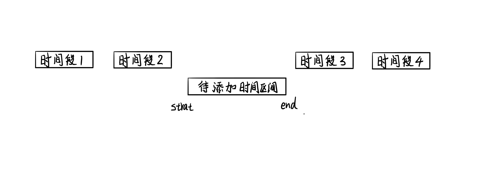

> 原文链接: https://leetcode-cn.com/problems/fi9suh


## 中文题目
<div><p>请实现一个 <code>MyCalendar</code> 类来存放你的日程安排。如果要添加的时间内没有其他安排，则可以存储这个新的日程安排。</p>

<p><code>MyCalendar</code> 有一个 <code>book(int start, int end)</code>方法。它意味着在 start 到 end 时间内增加一个日程安排，注意，这里的时间是半开区间，即 <code>[start, end)</code>, 实数&nbsp;<code>x</code> 的范围为， &nbsp;<code>start &lt;= x &lt; end</code>。</p>

<p>当两个日程安排有一些时间上的交叉时（例如两个日程安排都在同一时间内），就会产生重复预订。</p>

<p>每次调用 <code>MyCalendar.book</code>方法时，如果可以将日程安排成功添加到日历中而不会导致重复预订，返回 <code>true</code>。否则，返回 <code>false</code>&nbsp;并且不要将该日程安排添加到日历中。</p>

<p>请按照以下步骤调用 <code>MyCalendar</code> 类: <code>MyCalendar cal = new MyCalendar();</code> <code>MyCalendar.book(start, end)</code></p>

<p>&nbsp;</p>

<p><strong>示例:</strong></p>

<pre>
<strong>输入:
</strong>[&quot;MyCalendar&quot;,&quot;book&quot;,&quot;book&quot;,&quot;book&quot;]
[[],[10,20],[15,25],[20,30]]
<strong>输出:</strong> [null,true,false,true]
<strong>解释:</strong> 
MyCalendar myCalendar = new MyCalendar();
MyCalendar.book(10, 20); // returns true 
MyCalendar.book(15, 25); // returns false ，第二个日程安排不能添加到日历中，因为时间 15 已经被第一个日程安排预定了
MyCalendar.book(20, 30); // returns true ，第三个日程安排可以添加到日历中，因为第一个日程安排并不包含时间 20 
</pre>

<p>&nbsp;</p>

<p>&nbsp;</p>

<p><strong>提示：</strong></p>

<ul>
	<li>每个测试用例，调用&nbsp;<code>MyCalendar.book</code>&nbsp;函数最多不超过&nbsp;<code>1000</code>次。</li>
	<li><code>0 &lt;= start &lt; end &lt;= 10<sup>9</sup></code></li>
</ul>

<p>&nbsp;</p>

<p><meta charset="UTF-8" />注意：本题与主站 729&nbsp;题相同：&nbsp;<a href="https://leetcode-cn.com/problems/my-calendar-i/">https://leetcode-cn.com/problems/my-calendar-i/</a></p>
</div>

## 通过代码
<RecoDemo>
</RecoDemo>


## 高赞题解
# **map 解法**

可以观察上图，如果需要添加的时间区间是 [m, n)，就需要找出开始时间小于 m 的所有事项中开始最晚的一个（即图中时间段 2），以及开始时间大于 m 的所有事项中开始最早的一个（即图中的时间段 3）。如果待添加的时间段与这两个时间段无冲突，则可以添加入日程表中。

下一步分析如何进行高效的查找，可以根据开始时间的大小对已添加的时间段进行排序，然后使用二分法可以进行快速查找时间复杂度为 O(logn)，但是在排序数组内插入新的时间区间的时间复杂度为 O (n)。考虑到可以用搜索二叉树来加速整个过程，因为要存储一个时间段，所以可以使用 C++ STL 中的 map（Java 中的 TreeMap），查找和添加的时间复杂度均为 O(logn)。

先判断时间段 3 与当前待插入的时间段有无重叠，使用 map 中的 lower_bound 可以查到时间段 3 的迭代器 it，若时间段 3 存在且其开始时间小于待添加时间区间的 end 就会发生重叠，如下图。


再判断时间段 2 与当前待插入的时间段有无重叠，因为 map 内是按升序迭代的，所以若时间段 2 的迭代器存在，就是 it 的前一个，即 --it。若时间段 2 的结束时间大于待添加时间区间的 start 就会发生重叠，如下图。


完整代码如下。
```C++ []
class MyCalendar {
private:
    map<int, int> events;
public:
    MyCalendar() {

    }
    
    bool book(int start, int end) {
        auto it = events.lower_bound(start);
        // 与后一个时间段重叠
        if (it != events.end() && it->first < end) {
            return false;
        }
        // 与前一个时间段重叠
        if (it != events.begin() && (--it)->second > start) {
            return false;
        }
        events[start] = end;
        return true;
    }
};
```
```Java []
class MyCalendar {
    private TreeMap<Integer, Integer> events;
    public MyCalendar() {
        events = new TreeMap<>();
    }
    
    public boolean book(int start, int end) {
        Map.Entry<Integer, Integer> event = events.ceilingEntry(start);
        // 与后一个时间段重叠
        if (event != null && event.getKey() < end) {
            return false;
        }
        event = events.floorEntry(start);
        // 与前一个时间段重叠
        if (event != null && event.getValue() > start) {
            return false;
        }
        events.put(start, end);
        return true;
    }
}
```




## 统计信息
| 通过次数 | 提交次数 | AC比率 |
| :------: | :------: | :------: |
|    2208    |    3618    |   61.0%   |

## 提交历史
| 提交时间 | 提交结果 | 执行时间 |  内存消耗  | 语言 |
| :------: | :------: | :------: | :--------: | :--------: |
