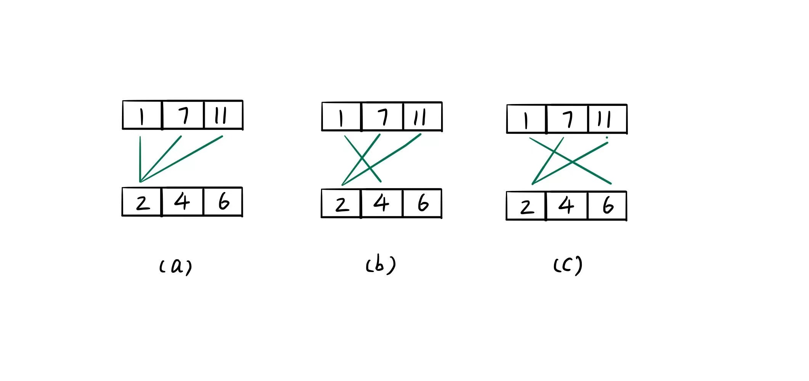

> 原文链接: https://leetcode-cn.com/problems/qn8gGX


## 中文题目
<div><p>给定两个以升序排列的整数数组 <code>nums1</code> 和<strong> </strong><code>nums2</code><strong>&nbsp;</strong>,&nbsp;以及一个整数 <code>k</code><strong>&nbsp;</strong>。</p>

<p>定义一对值&nbsp;<code>(u,v)</code>，其中第一个元素来自&nbsp;<code>nums1</code>，第二个元素来自 <code>nums2</code><strong>&nbsp;</strong>。</p>

<p>请找到和最小的 <code>k</code>&nbsp;个数对&nbsp;<code>(u<sub>1</sub>,v<sub>1</sub>)</code>, <code>&nbsp;(u<sub>2</sub>,v<sub>2</sub>)</code> &nbsp;... &nbsp;<code>(u<sub>k</sub>,v<sub>k</sub>)</code>&nbsp;。</p>

<p>&nbsp;</p>

<p><strong>示例 1:</strong></p>

<pre>
<strong>输入:</strong> nums1 = [1,7,11], nums2 = [2,4,6], k = 3
<strong>输出:</strong> [1,2],[1,4],[1,6]
<strong>解释: </strong>返回序列中的前 3 对数：
    [1,2],[1,4],[1,6],[7,2],[7,4],[11,2],[7,6],[11,4],[11,6]
</pre>

<p><strong>示例 2:</strong></p>

<pre>
<strong>输入: </strong>nums1 = [1,1,2], nums2 = [1,2,3], k = 2
<strong>输出: </strong>[1,1],[1,1]
<strong>解释: </strong>返回序列中的前 2 对数：
&nbsp;    [1,1],[1,1],[1,2],[2,1],[1,2],[2,2],[1,3],[1,3],[2,3]
</pre>

<p><strong>示例 3:</strong></p>

<pre>
<strong>输入: </strong>nums1 = [1,2], nums2 = [3], k = 3 
<strong>输出:</strong> [1,3],[2,3]
<strong>解释: </strong>也可能序列中所有的数对都被返回:[1,3],[2,3]
</pre>

<p>&nbsp;</p>

<p><strong>提示:</strong></p>

<ul>
	<li><code>1 &lt;= nums1.length, nums2.length &lt;= 10<sup>4</sup></code></li>
	<li><code>-10<sup>9</sup> &lt;= nums1[i], nums2[i] &lt;= 10<sup>9</sup></code></li>
	<li><code>nums1</code>, <code>nums2</code> 均为升序排列</li>
	<li><code>1 &lt;= k &lt;= 1000</code></li>
</ul>

<p>&nbsp;</p>

<p><meta charset="UTF-8" />注意：本题与主站 373&nbsp;题相同：<a href="https://leetcode-cn.com/problems/find-k-pairs-with-smallest-sums/">https://leetcode-cn.com/problems/find-k-pairs-with-smallest-sums/</a></p>
</div>

## 通过代码
<RecoDemo>
</RecoDemo>


## 高赞题解
# **最大堆**
一种最直观的想法就是枚举所有的组合，若 nums1 和 nums2 的长度分别为 m 和 n，那么共有 O(mn) 种组合，之后遍历这些组合使用一个最大堆就可以找到最小的 k 对组合，时间复杂度为 O(mnlogk)。但是这样处理未考虑两个数组本身就是升序的特点，若取 nums1 的第 k + 1 个数 a，其与 nums2 中的任何一个数 b 组合都不可能是最小的 k 对组合之一，因为 a 的前的 k 个数中任何一个数与 b 的组合都要比 a 与 b 组合要小。在 nums2 中也同理，所以最小的 k 对组合只会出现在 num1 的前 k 个数和 num2 的前 k 个数的组合中。所以可以把时间复杂度优化到 O(k^2logk)。完整代码如下。
```
class Solution {
public:
    vector<vector<int>> kSmallestPairs(vector<int>& nums1, vector<int>& nums2, int k) {
        // 最大堆
        auto cmp = [&](const pair<int, int>& lhs, const pair<int, int>& rhs) {
            return lhs.first + lhs.second < rhs.first + rhs.second;
        };
        priority_queue<pair<int, int>, vector<pair<int, int>>, decltype(cmp)> heap(cmp);
        for (int i = 0; i < nums1.size() && i < k; ++i) {
            for (int j = 0; j < nums2.size() && j < k; ++j) {
                if (heap.size() < k) {
                    heap.push({nums1[i], nums2[j]});
                }
                else if (nums1[i] + nums2[j] < heap.top().first + heap.top().second)  {
                    heap.pop();
                    heap.push({nums1[i], nums2[j]});
                }
            }
        }
        int size = heap.size();
        vector<vector<int>> ret(size, vector<int>(2, 0));
        for (int i = 0; i < size; ++i) {
            ret[size - 1 - i][0] = heap.top().first;
            ret[size - 1 - i][1] = heap.top().second;
            heap.pop();
        }
        return ret;
    }
};
```
# **最小堆**
下面换一种思路寻求更高效的解法，以示例一为例子，输入的两个数组分别为 [1, 7, 11] 和 [2, 4, 6] 求和最小的 3 个数对，那么首先选取 num1 中的前 3 个数与 nums2 的第一个数 2 组成数对 {1, 2} 、{7, 2} 、{11， 2} 进入最小堆。此时两个数组选中的数对可以参考图 (a)，使用最小堆可以找出当前三个数中最小的数对 {1, 2}，这是第一个答案。找出第一个最小数对之后寻找下一个，由于数对 {1, 2} 在 num1 和 num2 内的下标分别为 0 和 0，考虑到数组是有序的，所以下一个最小数对在 num1 和 num2 内的下标可能是 1 和 0 或者 0 和 1，其中下标为 1 和 0 的数对 {7, 2} 已经在堆内，所以只要添加数对 {1, 4} 即可。可以发现这个添加的数对 {1, 4} 的下标和已经找到的前一个最小数对 {1, 2} 的下标的区别是，在 nums1 的下标不变，在 nums2 的下标加 1。此时的数对情况如图 (b) 所示。此时最小的数对是 {1, 4} 并将其出堆，这是第 2 个最小的数对。 {1, 4} 的下标分别为 0 和 1，所以下一个添加的数为下标分别为 0 和 2 的数对{1, 6}。如图 (c) 所示，这时候最小的数对为 {1, 6}，至此最小的 3 个数对均已找到。

这时候考虑是否有遗漏的数对，即在选中 {1, 4} 后为什么没有添加下标分别为 1 和 1 的数对 {7, 4}，其实已经考虑，它会在下标分别为 1 和 0 的数对 {7, 2} 出堆后加入堆考虑，因为当前堆内的 {7, 2} 都未出堆，更大的 {7, 4} 更没有可能。

总结来说就是，每次都从 k 个候选数对中选取最小的数对，并将其从最小堆内出堆，记录答案。如果最小数对在两个数组内的下标为 i1 和 i2，那么将下标为 i1 和 i2 + 1 的数对添加进最小堆。

还是那个问题，为什么只考虑下标为 [i1, i2 + 1] 的数对，不考虑下标为 [i1 + 1, i2] 的数对？若已经在堆内那自然无需考虑，但是如果不在那么两种情况需要分析
1. 若下标为 [i1 + 1, i2 - 1] 的数对在堆内并且未出堆，那么和更大的下标为 [i1 + 1, i2] 的数对不可能是当前最小的数对，没必要添加到堆内；
2. 若下标为 [i1 + 1, i2 - 1] 的数对还未加入堆内，那么下标为 [i1 + 1, i2 - 2] 的数对也存在在与不在当前堆内的两种情况，若在堆内则可以一直反推到下标为 [i1 + 1, i2] 的数对不可能是当前最小的数对；若不在堆内就在考虑下标为 [i1 + 1, i2 - 3] 的数对，但是无论如何下标为 [i1 + 1, 0] 的数对，一定在堆内存在过，因为这是一开始就添加的，所以整个判断可以完成闭环，结论得证。

可以发现这种解法的巧妙之处在于，通过最小堆和初始数对的建堆让原本是需要考虑两种情况优化为只要考虑一种情况。完整代码如下，时间复杂度为 O(klogk)。

```
class Solution {
public:
  vector<vector<int>> kSmallestPairs(vector<int>& nums1, vector<int>& nums2, int k) {
        // 最小堆
        auto cmp = [&](const pair<int, int>& lhs, const pair<int, int>& rhs) {
            return nums1[lhs.first] + nums2[lhs.second] > nums1[rhs.first] + nums2[rhs.second];
        };
        priority_queue<pair<int, int>, vector<pair<int, int>>, decltype(cmp)> heap(cmp);

        for (int i = 0; i < k && i < nums1.size(); ++i) {
            heap.push({i, 0});
        }
        vector<vector<int>> ret;
        while (k-- > 0 && !heap.empty()) {
            auto ids = heap.top();
            heap.pop();
            ret.push_back({nums1[ids.first], nums2[ids.second]});

            if (ids.second < nums2.size() - 1) {
                heap.push({ids.first, ids.second + 1});
            }
        }

        return ret;
    }
};
```


## 统计信息
| 通过次数 | 提交次数 | AC比率 |
| :------: | :------: | :------: |
|    2712    |    5021    |   54.0%   |

## 提交历史
| 提交时间 | 提交结果 | 执行时间 |  内存消耗  | 语言 |
| :------: | :------: | :------: | :--------: | :--------: |
