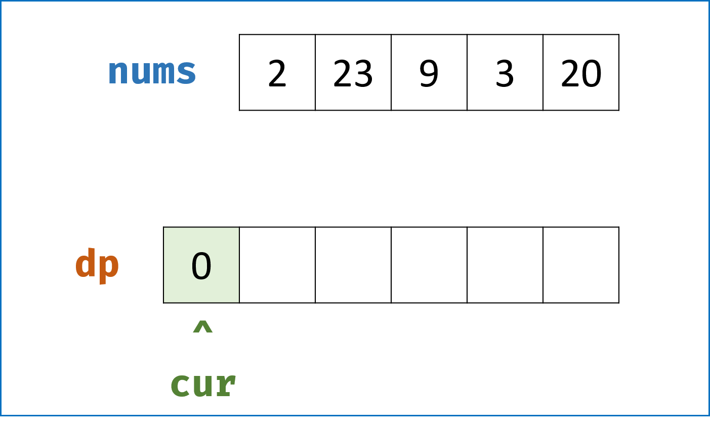
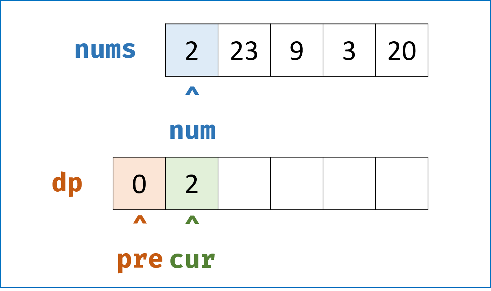
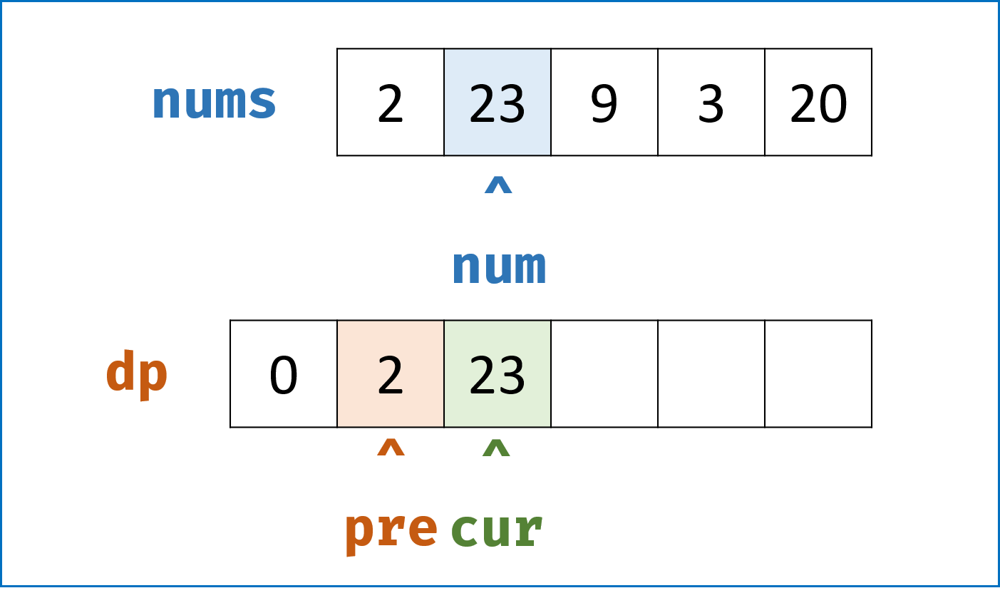
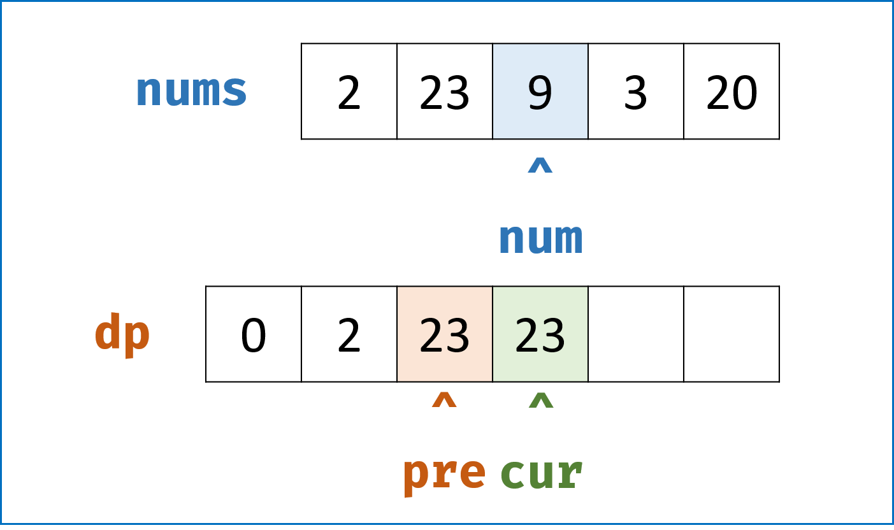
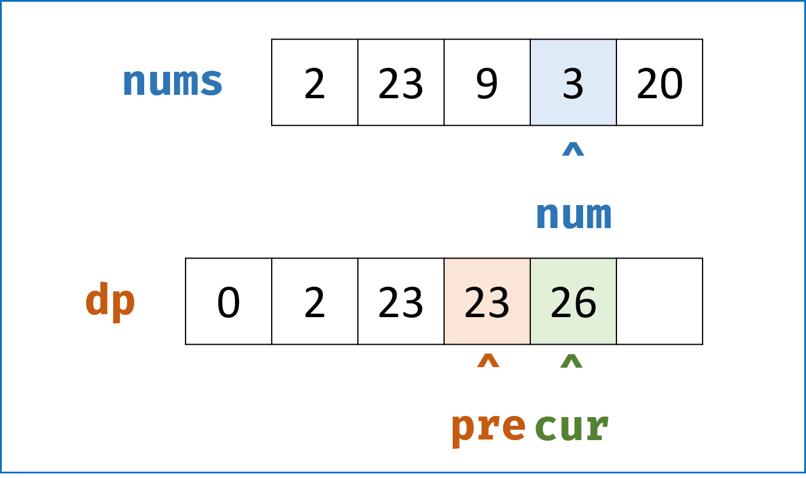
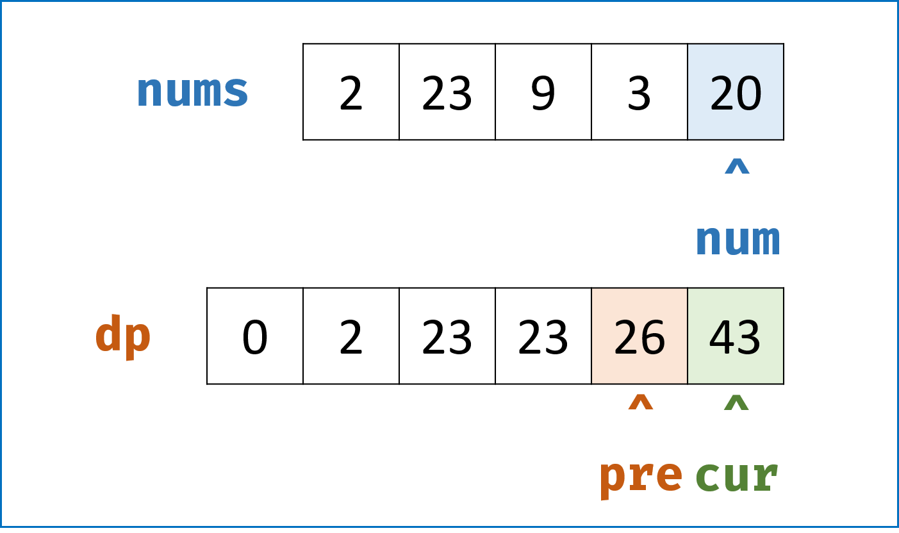
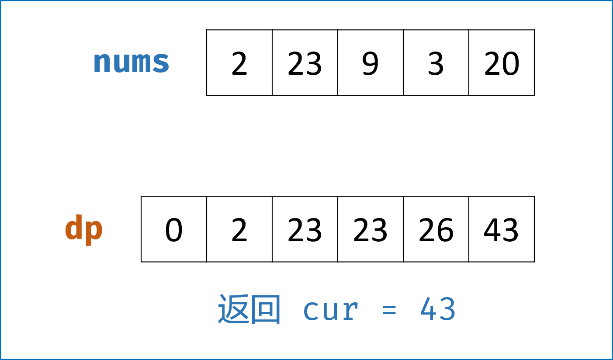

> 原文链接: https://leetcode-cn.com/problems/Gu0c2T


## 中文题目
<div><p>一个专业的小偷，计划偷窃沿街的房屋。每间房内都藏有一定的现金，影响小偷偷窃的唯一制约因素就是相邻的房屋装有相互连通的防盗系统，<strong>如果两间相邻的房屋在同一晚上被小偷闯入，系统会自动报警</strong>。</p>

<p>给定一个代表每个房屋存放金额的非负整数数组 <code>nums</code>&nbsp;，请计算<strong>&nbsp;不触动警报装置的情况下 </strong>，一夜之内能够偷窃到的最高金额。</p>

<p>&nbsp;</p>

<p><strong>示例 1：</strong></p>

<pre>
<strong>输入：</strong>nums =<strong> </strong>[1,2,3,1]
<strong>输出：</strong>4
<strong>解释：</strong>偷窃 1 号房屋 (金额 = 1) ，然后偷窃 3 号房屋 (金额 = 3)。
&nbsp;    偷窃到的最高金额 = 1 + 3 = 4 。</pre>

<p><strong>示例 2：</strong></p>

<pre>
<strong>输入：</strong>nums =<strong> </strong>[2,7,9,3,1]
<strong>输出：</strong>12
<strong>解释：</strong>偷窃 1 号房屋 (金额 = 2), 偷窃 3 号房屋 (金额 = 9)，接着偷窃 5 号房屋 (金额 = 1)。
&nbsp;    偷窃到的最高金额 = 2 + 9 + 1 = 12 。
</pre>

<p>&nbsp;</p>

<p><strong>提示：</strong></p>

<ul>
	<li><code>1 &lt;= nums.length &lt;= 100</code></li>
	<li><code>0 &lt;= nums[i] &lt;= 400</code></li>
</ul>

<p>&nbsp;</p>

<p><meta charset="UTF-8" />注意：本题与主站 198&nbsp;题相同：&nbsp;<a href="https://leetcode-cn.com/problems/house-robber/">https://leetcode-cn.com/problems/house-robber/</a></p>
</div>

## 通过代码
<RecoDemo>
</RecoDemo>


## 高赞题解
#### 解题思路：

> 典型的动态规划，以下按照标准流程解题。

- **状态定义：**

  - 设动态规划列表 $dp$ ，$dp[i]$ 代表前 $i$ 个房子在满足条件下的能偷盗到的最高金额。

- **转移方程：**

  - **设：** 有 $n$ 个房子，前 $n$ 间能偷盗到的最高金额是 $dp[n]$ ，前 $n-1$ 间能偷盗到的最高金额是 $dp[n-1]$ ，此时向这些房子后加一间房，此房间价值为 $num$ ；
  - **加一间房间后：** 由于不能抢相邻的房子，意味着抢第 $n+1$ 间就不能抢第 $n$ 间；那么前 $n+1$ 间房能偷取到的最高金额 $dp[n+1]$ 一定是以下两种情况的 **较大值** ：
    1. 不抢第 $n+1$ 个房间，因此等于前 $n$ 个房子的最高金额，即 $dp[n+1] = dp[n]$ ；
    2. 抢第 $n+1$ 个房间，此时不能抢第 $n$ 个房间；因此等于前 $n-1$ 个房子的最高金额加上当前房间价值，即 $dp[n+1] = dp[n-1] + num$ ；

  - **细心的我们发现：** 难道在前 $n$ 间的最高金额 $dp[n]$ 情况下，第 $n$ 间一定被偷了吗？假设没有被偷，那 $n+1$ 间的最大值应该也可能是  $dp[n+1] = dp[n] + num$ 吧？其实这种假设的情况可以被省略，这是因为：
    1. 假设第 $n$ 间没有被偷，那么此时 $dp[n] = dp[n-1]$ ，此时 $dp[n+1] = dp[n] + num = dp[n-1] + num$ ，即两种情况可以 **合并为一种情况** 考虑；
    2. 假设第 $n$ 间被偷，那么此时 $dp[n+1] = dp[n] + num$ **不可取** ，因为偷了第 $n$ 间就不能偷第 $n+1$ 间。
  
  - **最终的转移方程：** $dp[n+1] = max(dp[n],dp[n-1]+num)$
  
- **初始状态：**

  - 前 $0$ 间房子的最大偷盗价值为 $0$ ，即 $dp[0] = 0$ 。

- **返回值：**

  - 返回 $dp$ 列表最后一个元素值，即所有房间的最大偷盗价值。

- **简化空间复杂度：**

  - 我们发现 $dp[n]$ 只与 $dp[n-1]$ 和 $dp[n-2]$ 有关系，因此我们可以设两个变量 `cur`和 `pre` 交替记录，将空间复杂度降到 $O(1)$ 。

#### 复杂度分析：

- **时间复杂度 $O(N)$ ：** 遍历 `nums` 需要线性时间；
- **空间复杂度 $O(1)$ ：** `cur`和 `pre` 使用常数大小的额外空间。

<,,,,,,>

#### 代码：

```Python []
class Solution:
    def rob(self, nums: List[int]) -> int:
        cur, pre = 0, 0
        for num in nums:
            cur, pre = max(pre + num, cur), cur
        return cur
```

```Java []
class Solution {
    public int rob(int[] nums) {
        int pre = 0, cur = 0, tmp;
        for(int num : nums) {
            tmp = cur;
            cur = Math.max(pre + num, cur);
            pre = tmp;
        }
        return cur;
    }
}
```


## 统计信息
| 通过次数 | 提交次数 | AC比率 |
| :------: | :------: | :------: |
|    3931    |    6382    |   61.6%   |

## 提交历史
| 提交时间 | 提交结果 | 执行时间 |  内存消耗  | 语言 |
| :------: | :------: | :------: | :--------: | :--------: |
