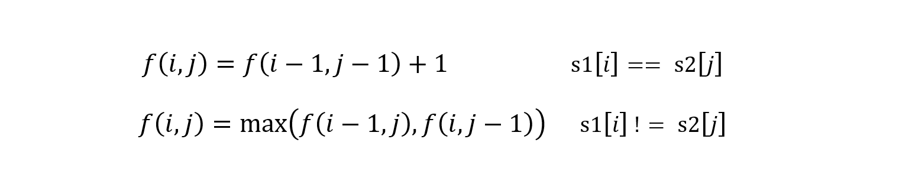
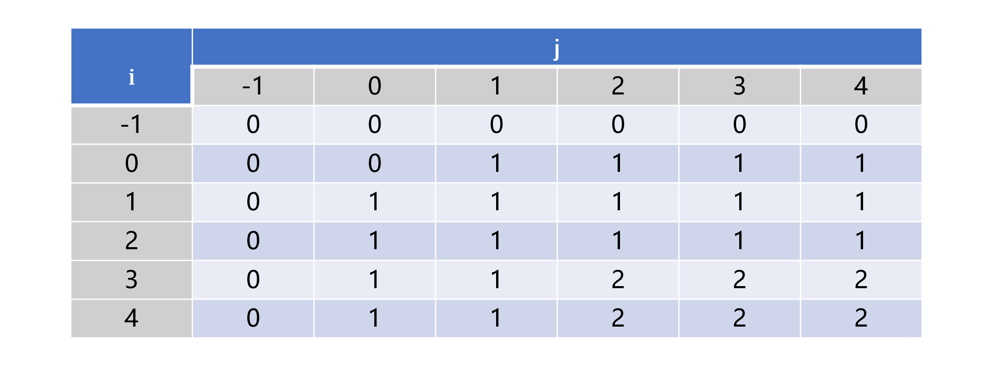
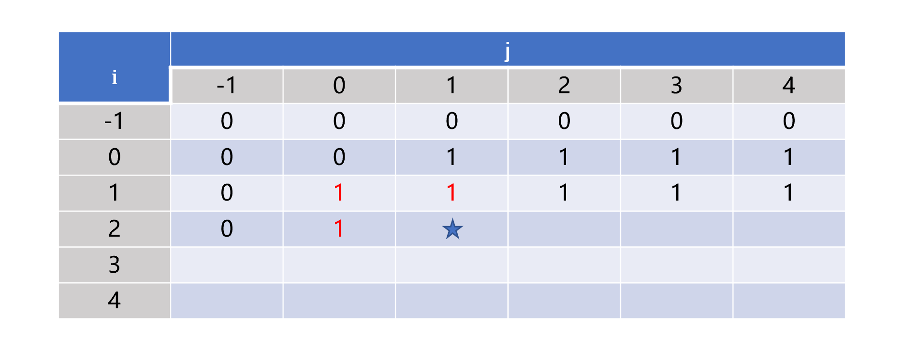

> 原文链接: https://leetcode-cn.com/problems/qJnOS7


## 中文题目
<div><p>给定两个字符串&nbsp;<code>text1</code> 和&nbsp;<code>text2</code>，返回这两个字符串的最长 <strong>公共子序列</strong> 的长度。如果不存在 <strong>公共子序列</strong> ，返回 <code>0</code> 。</p>

<p>一个字符串的&nbsp;<strong>子序列</strong><em>&nbsp;</em>是指这样一个新的字符串：它是由原字符串在不改变字符的相对顺序的情况下删除某些字符（也可以不删除任何字符）后组成的新字符串。</p>

<ul>
	<li>例如，<code>&quot;ace&quot;</code> 是 <code>&quot;abcde&quot;</code> 的子序列，但 <code>&quot;aec&quot;</code> 不是 <code>&quot;abcde&quot;</code> 的子序列。</li>
</ul>

<p>两个字符串的 <strong>公共子序列</strong> 是这两个字符串所共同拥有的子序列。</p>

<p>&nbsp;</p>

<p><strong>示例 1：</strong></p>

<pre>
<strong>输入：</strong>text1 = &quot;abcde&quot;, text2 = &quot;ace&quot; 
<strong>输出：</strong>3  
<strong>解释：</strong>最长公共子序列是 &quot;ace&quot; ，它的长度为 3 。
</pre>

<p><strong>示例 2：</strong></p>

<pre>
<strong>输入：</strong>text1 = &quot;abc&quot;, text2 = &quot;abc&quot;
<strong>输出：</strong>3
<strong>解释：</strong>最长公共子序列是 &quot;abc&quot; ，它的长度为 3 。
</pre>

<p><strong>示例 3：</strong></p>

<pre>
<strong>输入：</strong>text1 = &quot;abc&quot;, text2 = &quot;def&quot;
<strong>输出：</strong>0
<strong>解释：</strong>两个字符串没有公共子序列，返回 0 。
</pre>

<p>&nbsp;</p>

<p><strong>提示：</strong></p>

<ul>
	<li><code>1 &lt;= text1.length, text2.length &lt;= 1000</code></li>
	<li><code>text1</code> 和&nbsp;<code>text2</code> 仅由小写英文字符组成。</li>
</ul>

<p>&nbsp;</p>

<p><meta charset="UTF-8" />注意：本题与主站 1143&nbsp;题相同：&nbsp;<a href="https://leetcode-cn.com/problems/longest-common-subsequence/">https://leetcode-cn.com/problems/longest-common-subsequence/</a></p>
</div>

## 通过代码
<RecoDemo>
</RecoDemo>


## 高赞题解
# **动态规划**
两个字符串可能存在多个公共子序列，题目要求计算最长公共子序列的长度，因此可以考虑使用动态规划来解决。

**二维DP数组**

用函数 f(i, j) 表示字符串 s1 中下标从 0 开始到 i 的子字符串 s1[0...i] 和字符串 s2 中下标从 0 开始到 j 的子字符串 s2[0...j] 的最长公共子序列的长度。对于 f(i, j)，如果 s1[i] == s2[j]，那么相当于在 s1[0...i - 1] 和 s2[0...j - 1] 的最长公共子序列的后面添加一个公共字符，也就是 f(i, j) = f(i - 1, j - 1) + 1。如果 s1[i] != s2[j]，那么这两个字符不可能出现在 s1[0...i] 和 s2[0...j] 的公共子序列中。此时 s1[0...i] 和 s2[0...j] 的最长公共子序列是s1[0...i - 1] 和 s2[0...j] 的最长公共子序列和s1[0...i] 和 s2[0...j - 1] 的最长公共子序列中的较大值，即 f(i, j) = max(f(i - 1, j), f(i, j - 1))。所以转移状态方程为



因为状态方程有两个变量，所以需要使用二维矩阵保存。同时上述方程会出现 i 或者 j 出现 -1 的情况，代表出现 -1 下标的字符串的子串目前是空的，那么就不会有公共子序列，所以 f(i, -1) = f(-1, j) = 0。以  "abcde" 和  "badfe" 为例子，二维状态矩阵如下图

一开始先完成 f(i, -1) = f(-1, j) = 0 初始化，之后二维矩阵按照从左往右逐行向下遍历填充。推荐使用逐行而不是逐列，虽然不影响算法，但是考虑到二维数组本身是按照一维数组存储以及计算机缓存的运行机制，按照逐行遍历的方式效率更高点。完整的代码如下，若 s1 和 s2 的长度分别为 m 和 n，那么时间复杂度为 O(mn)，空间复杂度为 O(mn)。
```
class Solution {
public:
    int longestCommonSubsequence(string text1, string text2) {
        int n1 = text1.size();
        int n2 = text2.size();
        vector<vector<int>> dp(n1 + 1, vector<int>(n2 + 1));
        for (int i = 0; i < n1; ++i) {
            for (int j = 0; j < n2; ++j) {
                if (text1[i] == text2[j]) {
                    dp[i + 1][j + 1] = dp[i][j] + 1;
                } 
                else {
                    dp[i + 1][j + 1] = max(dp[i][j + 1], dp[i + 1][j]);
                }
            }
        } 
        return dp[n1][n2];
    }
};
```

**一维DP数组**
考虑遍历到如图的标星处

可以发现当前的值只与标红处的值有关，所以可以把二维数组优化为只需一行的一维数组，只要把 dp[i] 的旧值以及  dp[i - 1] 的旧值保存下来即可。完整的代码如下，时间复杂度为 O(mn)，空间复杂度为 O(min(m, n))。
```
class Solution {
public:
    int longestCommonSubsequence(string& text1, string& text2) {
        int n1 = text1.size();
        int n2 = text2.size();
        if (n1 < n2) {
            return longestCommonSubsequence(text2, text1);
        }
        vector<int> dp(n2 + 1);
        for (int i = 0; i < n1; ++i) {
            int temp1 = 0;
            int temp2 = 0;
            for (int j = 0; j < n2; ++j) {
                temp2 = dp[j + 1];
                if (text1[i] == text2[j]) {
                    dp[j + 1] = temp1 + 1;
                }
                else {
                    dp[j + 1] = max(dp[j], dp[j + 1]);
                }
                temp1 = temp2;
            }
        } 
        return dp[n2];
    }
};
```


## 统计信息
| 通过次数 | 提交次数 | AC比率 |
| :------: | :------: | :------: |
|    7955    |    12224    |   65.1%   |

## 提交历史
| 提交时间 | 提交结果 | 执行时间 |  内存消耗  | 语言 |
| :------: | :------: | :------: | :--------: | :--------: |
